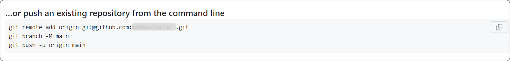

# Задание 1. Знакомство с Git
## Описание документа
Документ является ответом на «Задание 1. Знакомство с Git».
Он содержит в себе следующие темы:
1. [Базовые определения по теме Git](#title_1)
2. [Базовая настройка Git](#title_2)
3. [Базовые команды для работы с Git из консоли](#title_3)

## <a id="title_1">1. Глоссарий</a>
|Термин|Определение|
|------|------|
|**Git**|— это распределенная система контроля версий (VCS). Она позволяет отслеживать изменения в файлах и управлять этими изменениями в одном или нескольких проектах.|
|**GitHub** / **GitLab** / **etc**|— веб-сервисы для хостинга IT-проектов и их совместной разработки.|
|**Клонирование**|— процесс, при котором пользователь создает копию удаленного репозитория локально у себя на компьютере.|


## <a id="title_2">2. Базовая настройка Git</a>

### 2.1. Установка и настройка GIT
#### 2.1.1. Установка 
Команда для установки git на Ubuntu (для другого дистрибутива необходимо найти соответствующую команду):
```
sudo apt install git
```

Проверка корректности установки:
```
git --version 
```
- При корректной установке команда выведет версию git


#### 2.1.2. Настройка ключевых опций (имя + электронная почта) 
Введите в консоль следующие команды:
```
git config --global user.name "имя_пользователя" 
git config --global user.email "email-адрес"
```  
- В первой команде замените `имя_пользователя` на имя, которым хотите подписывать локальные коммиты
- Во второй команде замените `email-адрес` на email, к которому привязан ваш GitHub или аналогичный веб-хостинг 


#### 2.1.3. Настройка связи с GitHub
> При подключении к репозиторию GitHub из Git необходимо пройти проверку подлинности в GitHub с использованием протокола HTTPS или SSH.
> В данном руководстве проверка подлинности подробно не описана. Предлагается официальная инструкция от GitHub:
> [Проверка подлинности с помощью GitHub из Git](https://docs.github.com/ru/get-started/getting-started-with-git/set-up-git#%D0%BF%D1%80%D0%BE%D0%B2%D0%B5%D1%80%D0%BA%D0%B0-%D0%BF%D0%BE%D0%B4%D0%BB%D0%B8%D0%BD%D0%BD%D0%BE%D1%81%D1%82%D0%B8-%D1%81-%D0%BF%D0%BE%D0%BC%D0%BE%D1%89%D1%8C%D1%8E-github-%D0%B8%D0%B7-git)


### 2.2. Создание репозитория
Есть два классических метода создания локального репозитория:
- Клонирование существующего удаленного репозитория. 
- Инициализация нового локального репозитория. Для полноценной работы его также необходимо будет связать с удаленным репозиторием.


#### 2.2.1. Клонирование существующего удаленного репозитория:
1. В консоли перейдите в директорию, которую хотите сделать локальным репозиторием
2. Выполните команду:
    ```
    git clone github.com:username/repository.git 
    ```
     - Замените `username` и `repository` на соответствующие имя пользователя и название репозитория на GitHub.


#### 2.2.2. Инициализация нового локального репозитория:
1. В консоли перейдите в директорию, которую хотите сделать локальным репозиторием
2. Выполните команду:
    ```
    git init
    ```  

3. Для работы с веб-хостингом, создайте пустой репозиторий, например, на GitHub
4. Для связи локального и удаленного репозитория  выполните в консоли команды для публикации репозитория (они будут предложены GitHub), пример:
    
   

## <a id="title_3">3. Базовые команды для работы с Git из консоли</a>  
#### 3.1. Работа с ветками
> Во всех командах ниже замените параметр `имя_ветки` на имя нужной ветки

- Посмотреть список веток и активную (она будет помечена символом `*`)
    ```
    git branch
    ```

- Создать новую ветку              
    ```
    git branch имя_ветки
    ```      

- Переключиться на другую ветку
    ```
    git checkout имя_ветки
    ```

- Cоздать ветку и сразу переключиться на неё (есть 2 варианта)
    - Современный вариант
        ```
        git switch -c  имя_ветки 
        ```
    - Устаревший вариант
        ```
        git checkout -b имя_ветки 
        ```

- Удалить ветку
    ```
    git branch -d имя_ветки
    ```

- Переименовать ветку
    ```
    git branch -M имя_ветки
    ```
    - Замените `имя_ветки` на новое значение


#### 3.2. Работа с репозиториями

- Просмотр состояния локального репозитория:
    ```
    git status
    ```

- Клонирование удаленного репозитория
    ```
    git clone github.com:username/repository.git 
    ```
     - Замените `username` и `repository` на соответствующие имя пользователя и название репозитория на GitHub.

- Инициализация локального репозитория
    ```
    git init
    ```

- Добавление удаленного репозитория к существующему локальному репозиторию:
    ```
    git remote add origin github.com:username/repository.git 
    ```
     - Замените `username` и `repository` на соответствующие имя пользователя и название репозитория на GitHub
  
- Просмотр удаленных репозиториев:
    ```
    git remote -v
    ```
    - Данная команда выполняется из директории локального репозитория.


#### 3.3. Работа с изменениями

- Подготовка изменений — добавление изменений в индекс (стейджинг):
  - Добавление точечных изменений:
    ```
    git add имя_файла
    ```
    - Вместо `имя_файла` укажите название одного или нескольких файлов / директорий (через запятую)


  - Добавление всех изменений сразу:
    ```
    git add . 
    ```

- Создание коммита с описанием изменений:
    ```
    git commit -m "Комментарий"
    ```
    - В кавычках укажите комментарий, который опишет внесенные вами изменения


- Отправка изменений из локального репозитория в удалённый репозиторий:
  - Вариант 1. Автоматическое слияние с текущей веткой.
    Git по умолчанию выберет удалённый репозиторий и ветку на основе настроек в конфигурационных файлах Git (например, ветку, которую вы отслеживаете). 
      ```
      git push
      ```

  - Вариант 2. Явное указание ветки слияния.
    В этом случае мы прописываем, в какую удаленную ветку будем вливать изменения.    
        ```
        git push origin имя_ветки
        ```
      - Вместо `имя_ветки` укажите название ветки

    - Вариант 3. Передача новых коммитов из локальной ветки на удаленный репозиторий и установки отслеживания для этой ветки.
    Часто используется в паре с командой git branck -M имя_ветки для создания новой ветки / изменения структуры существующих веток.
        ```
        git push -u origin имя_ветки
        ```
        - Вместо `имя_ветки` укажите название ветки

- Получение изменений из удаленного репозитория и слияние с текущей веткой:
   - Вариант 1. Автоматическое получение изменений из отслеживаемой ветки.
    Git по умолчанию выберет удалённый репозиторий и ветку на основе настроек в конфигурационных файлах Git (например, ветку, которую вы отслеживаете). 
      ```
      git pull
      ```

  - Вариант 2. Явное указание ветки, из которой будем получать изменения.
    В этом случае мы прописываем, из какой ветки хотим получить изменения.    
        ```
        git pull origin имя_ветки
        ```    
        - Вместо `имя_ветки` укажите название ветки

- Получение изменений с удалённого репозитория без слияния
  ```
  git fetch
  ```

- Слияние веток
  ```
  git merge имя_ветки
  ```
  - Вместо `имя_ветки` укажите название ветки