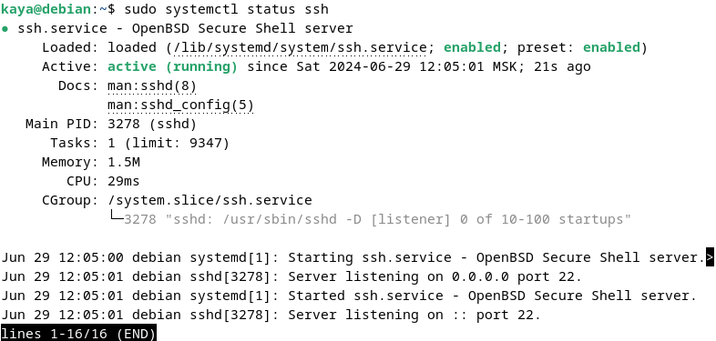

# Задание 2. Знакомство с Linux
## Описание документа
Документ является ответом на «Задание 2. Знакомство с Git».
Он содержит в себе следующие темы:
1. [Базовые определения по теме Git](#title_1)
2. [Базовая настройка Git](#title_2)
3. [Базовые команды для работы с Git из консоли](#title_3)

## Базовая информация о дистрибутивах Linux. Основные отличия CentOS от Debian 
Дистрибутивы Linux есть разные. Несмотря на то, что само ядро с открытым исходным кодом, есть как бесплатные дистрибутивы, так и платные (коммерческие).
Все дистрибутивы можно взять на официальных сайтах компаний-разработчкиов.

Основные отличия CentOS от Debian:
* Debian развивается и поддерживается сообществом волонтеров, а CentOS основан на коммерческом RHEL (с урезанной функциональностью)
* Разные пакетные менеджеры. У CentOS 7 — yum, у Debian 12 — apt
* Разные репозитории. У Debian большая часть программ лежит в официальных репозиториях, а у CentOS в оф. репозиториях лежит лишь часть программ, а все остальное находится в сторонних репозиториях (как nginx, например)
* Разный подход к выпуску обновлений:
  * У CentOS меньше мажорных обновлений, при которых надо переустанавливать всю ОС, в основном только минорные. Минорные ставятся автоматически, с помощью менеджера обновлений в масштабах штатного обновления системы.  В этом плане система удобна, когда нужен подход “поставил, настроил и забыл”.
  * У Debian крупные обновления выходят чаще. В этом случае пользователю нужно переустановить систему или использовать специальный скрипт обновления. В интернете пишут, что в большинстве случаев для сервера это не так важно, но подходит, если для задач важна постоянная актуализация ПО.
* 30 июня CentOS 7 прекращает поддержку

## Как настроить виртуальную машину
Виртуальная машина настраивается во время установки. 
Я взяла для каждой такие настройки:
* 20 ГБ диска у каждой
* 8096 МБ ОЗУ
* 4 vCPU

После настройки виртуальной машины зашла в меню "Настройки" -> "Устройства" -> "Сеть" и для каждой установила тип подключения к сети "Сетевой мост"

## Как устанавливают ПО в Linux 
Есть несколько способов установки ПО в Linux:
1. **Традиционные пакетные менеджеры (свой менеджер на группу дистрибутивов)**
   Пакетные менеджеры — это инструменты, которые управляют установкой, удалением и обновлением программного обеспечения на основе пакетов. Пакеты предоставляют скомпилированные бинарные файлы и метаданные, которые облегчают установку ПО.
   Отличительные черты:
      * Зависят от от репозиториев дистрибутива (которые не всегда могут содержать актуальную версию ПО)
      * Позволяют легко ставить, обновлять и удалять программы, а также легко управлять зависимостями программы
      * Пакеты часто зависят от других библиотек и пакетов, которые должны быть установлены отдельно
   
   Виды:
     * APT (Advanced Package Tool) — в Debian и его производных, таких как Ubuntu.
     * YUM (Yellowdog Updater, Modified) — в CentOS 7 и более ранних версиях + Fedora 22 и более ранних версиях.
     * DNF (Dandified Yum) — наследник YUM, используется в Fedora 23 и выше + CentOS 8 и выше.
     * Zypper — в openSUSE и SUSE Linux Enterprise.
     * Pacman — в Arch Linux и производных.

2. Универсальные пакетные менеджеры:
   Универсальные пакетные менеджеры — это пакетные системы, которые позволяют устанавливать, обновлять и управлять приложениями независимо от конкретного дистрибутива Linux. 
   Отличительные черты:
      * Работает на большом количестве разных дистрибутивов
      * Пакеты содержат все необходимые зависимости, и, соответственно, приложения не зависят от наличия тех или иных системных библиотек
      * В связи с предыдущим пунктом, пакеты могут больше весить
      * Контейнеризация и изоляция — как выяснилось, они часто используют контейнерные технологии для изоляции приложений от системы и друг от друга (для повышения уровеня безопасности и управляемости)
      * Пакеты распространяются через центральные репозитории
   Виды:
      * Snap
      * Flatpak
      * AppImage

   > P.S. Я не так много нашла по ним статей, мне показалось, что универсальные пакетные менеджеры реже используют. Возможно, из-за того, что разным пакетам могут потребоваться одинакомые зависимости, и вместо их настройки диск будет забиваться дублями, ну и на это нужно больше памяти.

3. **Установка из исходного кода (с использованием make install)**
   Установка из исходного кода — это способ при котором нужно скачать архив с исходным кодом с оф. сайта разработчика программы, распаковать его, (иногда настроить сборку с помощью выполнения ./configure), скомпилировать исходный код, затем установить скомпилированные файлы в систему (как раз с помощью make install)
   Краткое описание:
      * Позволяет устанавливать последние версии ПО 
      * Сложнее управлять зависимостями программы и удалять ПО

4. **Ручная установка из пакета**
   Ручная установка из пакета — это способ, при котором пользователь берет с сайта разработчика предварительно скомпилированные бинарные файлы или установщики (иногда разработчики предоставляют такие файлы, а иногда нет), скачивает пакет и устанавливает его. 
   Краткое описание:
      * Легкая установка
      * Как правило, включают все необходимые зависимости.
      * Не управляются пакетным менеджером и не всегда доступны для всей системы.
   
   Виды:
      * DEB-пакеты для Debian и производных.
      * RPM-пакеты для Red Hat, CentOS и производных.
      * AppImages, Flatpaks, Snaps — универсальные форматы упаковки пакетов.

    Примечание: такие пакеты есть не только для программ, но и для некоторых ЯП, например, pip для Python.
    Это позволяет устанавливать пакеты в виртуальные среды. Но такие пакеты могут быть специфичны для одной среды разработки и не интегрироваться с остальной системой.

5. **Установка через менеджер пакетов через графический интерфейс**
   Здесь установка происходит также с помощью пакетного менеджера, просто в формате приложения с приложениями. Это внешне очень похоже на AppStore / Microsoft Store. Думаю, способ преимущетсвенно для обычных пользователей системы. 

   Краткое описание:
      * Удобный интерфейс — у приложений есть описание, отзывы и так далее; установка через GUI также; обновлять или удалять программы можно тоже тут, что удобно (но и через командную строку по-прежнему можно, если нужно)
   
   Виды:
      * Ubuntu Software Center — для Ubuntu
      * GNOME Software — для Fedora и CentOS
      * Discover — для KDE Plasma

## SSH и с чем его едят
Протокол, который позволяет подключиться к машине удаленно и безопасно. Благодаря этому можно как минимум делать следующее:
* Вводить команды для сервера на своей консоли. Особенно удобно, если нужно что-то вставить в команду / конфиг / скрипт (может, еще куда-то).Например, адрес для curl-запроса или блок кода. Касаемо второго — можно написать код в редакторе, проверить на ошибки, и вставить уже в нужный конфиг / скрипт.
* На подключенном компьютере просматривать веб-страницы с сервера (если на сервере нет графического интерфейса, к примеру)
* Передавать файлы с сервера / на сервер 

В CentOS 7 sshd стоит по умолчанию, бери и пользуйся. В Debian 12 сперва нужно установить openssh-server. 
Для использования нужно узнать адрес ВМ с помощью команды `ip a`. Затем открыть консоль хоста, ввести `ssh user@ip_address`
* вместо `user` указать имя пользователя, от имени которого хотим войти в систему
* вместо `ip_address` указать IP адрес виртуальной машины

Далее нужно ввести пароль пользователя, добавить fingerprint в систему и наслаждаться

## Основное задание: настройка nginx и apache
### Шаг 1. Базовая настройка Debian 12
1. Добавим нашего пользователя (kaya) в группу sudo и проверим, что все ок:  
   ```console
   su -    
   usermod -aG sudo kaya
   exit  
   id kaya     
   newgrp sudo
   ```
   

3. Обновим систему:    
   ```console
   sudo apt update && sudo apt upgrade -y
   ```

4. Установим и запустим OpenSSH сервер:    
   ```console
   sudo apt install openssh-server -y 
   ```
    
5. Проверим статус SSH-сервиса:    
   ```console
   sudo systemctl status ssh 
   ```
   

6. Настроим / отключим AppArmor
   > AppArmor может ограничивать доступ к файлам на веб-сервере. В рамках задания мы его отключим, но в реальном продуктивном контуре такой подход не годится, AppArmor необходимо настроить. 

   Проверим, что включен AppArmor (а он включен), и отключим его:
   ```console
   sudo systemctl status apparmor
   sudo systemctl stop apparmor
   sudo systemctl disable apparmor
   ```
   


7. Узнаем IP-адрес машины:
   ```console
   ip addr
   ```
   

## Шаг 2. Настройка серверов в Debian 12
> По желанию подключимся к ВМ по SSH: 
> ssh kaya@ip_address
> * Где ip_address заменим на IP нашей ВМ

1. Подготовим ОС к установке программ — обновим список пакетов (конкретно тут я не буду этого делать, т.к. сделала в предыдущем шаге. Но если бы я не поставила ОС только что, то делала бы так)
   ```console
   sudo apt update
   ```
   
2. Установим nginx
   ```console
   sudo apt install nginx -y
   ```
   
3. Установим apache
   ```console
   sudo apt install apache2 -y
   ```
   
4. Проверим статус nginx
   ```console
   sudo systemctl status nginx
   ```
   
5. Проверим статус apache
   ```console
   sudo systemctl status apache2   
   ```
   
   
6. Изменим порт, на котором Apache будет слушать входящие запросы (на порт 8080)

   6.1.Откроем конфигурацию apache
      ```console
      sudo nano /etc/apache2/ports.conf
      ```
     
   6.2. В строке Listen 80 меняем 80 на 8080.
   
 
7. Изменим порт, на котором будет слушать виртуальный хост apache
   7.1. Откроем конфигурацию виртуальных хостов apache
      ```console
      sudo nano /etc/apache2/sites-available/000-default.conf
      ```

   7.2. Внутри VirtualHost поменяем порт на 8080:
      ```console         
         <VirtualHost *:8080>
         </VirtualHost>  
      ```   
      

8. Перезапустим apache, чтобы применить изменения:     
   ```console
   sudo systemctl restart apache2
   ```
   
9. Проверим статус apache
   ```console
   sudo systemctl status apache2   
   ```
   

10. Отредактируем конфигурацию nginx так, чтобы запросы, поступающие на nginx распределялись между нашими backend-серверами apache
   10.1. Создадим дополнительный конфиг для наших сайтов, чтобы было удобно далее поддерживать и начнем его редактировать:
      ```console
      sudo nano /etc/nginx/sites-available/load_balancer.conf
      ```
      10.2. Внесем такую конфигурацию nginx, чтобы у нас было 2 backend-сервера, на которые будет перераспределяться нагрузка:
      ```console
         upstream apache_servers {
            server 192.168.1.70:8080; 
            server 192.168.1.69:8080; 
         }

         server {
            listen 80;  
            server_name 192.168.1.70;  

            location / {
                  proxy_pass http://apache_servers;  
                  proxy_set_header Host $host;
                  proxy_set_header X-Real-IP $remote_addr;
                  proxy_set_header X-Forwarded-For $proxy_add_x_forwarded_for;
                  proxy_set_header X-Forwarded-Proto $scheme;
            }
         }
      ```
      

11. Проверим конфигурационный файл на ошибки:
   ```console
    sudo nginx -t
   ```

12. Перезапустим nginx:
   ```console
    sudo systemctl restart nginx
   ```

13. Проверим, что оба наших сервера сейчас запущены:
   ```console
   sudo systemctl status nginx 
   sudo systemctl status apache2
   ```
   

14. Заходим на сайты, проверяем, все работает. Единственное, нет лого debian.
   14.1. Проверим логи ошибок nginx (`/var/log/nginx/error.log`) и логи журнала доступа nginx (`/var/log/nginx/access.log`):
      ```console
      sudo tail -f /var/log/nginx/error.log /var/log/nginx/access.log
      ```
      

      Вижу, что не находит лого по адресу `/icons/openlogo-75.png`. 
   14.2. Нахожу, где файл располагается в системе:
      ```console
      sudo find / -name openlogo-75.png 2>/dev/null
      ```   
   
      Вижу, что файл располагается по адресу `/usr/share/apache2/icons/openlogo-75.png`.

      В конфигурации Apache за место, где искать файлы отвечает поле `DocumentRoot`, его значение сейчас — `/var/www/html/icons`. Nginx, работая как обратный прокси, не может найти файл с логотипом, так как его нет в  `DocumentRoot` (`DocumentRoot` = `/var/www/html/icons`, а логотип лежит в `/usr/share/apache2/icons/`)
      Я нашла такое инфо:
      * Директория `/usr/share/apache2/` обычно используется для системных ресурсов и файлов 
      * Директория `/var/www/html/` предназначена для пользовательских данных и ресурсов веб-сервера.
  
      Мне не очень понятно, зачем все для стартовой страницы поместили в `/usr/share/apache2/`, думаю, что для отображения лого достаточно его скопировать в `/var/www/html/icons`, а далее все файлы для веб-ресурсов лучше помещать в `/var/www/html/`, но если не права, подскажите

### Шаг 3. Базовая настройка CentOS 7
1. Обновим систему:    
   ```console
   sudo yum update -y
   ``` 

2. Настроим / Отключим SELinux:  
   > SELinux может ограничивать доступ к файлам на веб-сервере. В рамках задания мы его отключим. В реальном контуре по идее его лучше настроить, чем просто отключать, однако в я читала в книге, что конкретно SELinux рекомендуют отключать, так что допускаю, что где-то выбирают этот путь.

   2.1. Откроем его конфиг:  
   ```console
   sudo nano /etc/selinux/config
   ```
   2.2. Заменим значение SELinux на `disabled` 
   
    
   2.3. Перезагрузим ВМ:
      ```console
      shutdown -r now
      ```

   2.4. Проверим состояние SELinux после перезагрузки:
   ```console
   sestatus
   ```
   
3. Настроим Firewall:
   > Есть два стула: отключить firewall полностью, или настроить его так, чтобы открытыми были нужные нам порты. Я изначально отключила, но интернет говорит, что второй вариант безопаснее, поэтому в итоге пробую настроить порты. Инфу про отключение добавлю как приложение.

   Чтобы настроить firewall на нужные нам порты (80 и 8080), нужно ввести команды для открытия портов и перезагрузки сервиса (чтобы изменения вступили в силу):
   ```console
   sudo firewall-cmd --permanent --add-port=80/tcp
   sudo firewall-cmd --permanent --add-port=8080/tcp
   sudo firewall-cmd --reload
   ```
   

   Проверить, какие порты добавлены можно с помощью команды:
   ```console
   sudo firewall-cmd --list-ports
   ```

   Пример вывода:
   

   > Приложение
   Чтобы отключить firewall, нужно ввести команду: `sudo systemctl stop firewalld`

4. Узнаем IP-адрес машины:
   ```console
   ip addr
   ```

   

### Шаг 4. Настройка серверов в CentOS 7
> По желанию подключимся к ВМ по SSH: 
> ssh kaya@ip_address
> * Где ip_address заменим на IP нашей ВМ

1. Подготовим ОС к установке программ - обновим список пакетов (также как и выше, конкретно сейчас не делаю эту команду)
   ```console
   sudo yum update
   ```

2. Установим репозиторий EPEL, который включает в себя Nginx:
   ```console
   sudo yum install epel-release -y  
   ```

3. Установим Nginx из репозитория EPEL
   ```console
   sudo yum install nginx -y  
   ```

4. Установим Apache
   ```console
   sudo yum install httpd -y 
   ```

5. Проверим статус nginx
   ```console
   sudo systemctl status nginx
   ```

6. Проверим статус apache
   ```console
   sudo systemctl status httpd
   ```
   
   
   
7. Настроим конфигурацию nginx, чтобы он распределял запросы между серверами apache:
   7.1. Создадим дополнительный конфиг для нашей задачи в /etc/nginx/conf.d и начнем его редактировать (как я поняла, такое разделение помогает легче поддерживать актуальную инфу):
      ```console
      sudo nano /etc/nginx/conf.d/load_balancer.conf
      ```

   7.2. Добавим в него следующие строки:
      ```console
      upstream apache_servers {
         server 192.168.1.70:8080;
         server 192.168.1.69:8080;
      }

      server {
         listen 80;
         server_name 192.168.1.69; 

         location / {
            proxy_pass http://apache_servers;
            proxy_set_header Host $host;
            proxy_set_header X-Real-IP $remote_addr;
            proxy_set_header X-Forwarded-For $proxy_add_x_forwarded_for;
            proxy_set_header X-Forwarded-Proto $scheme;
         }
      }
      ```
      

   7.3. Проверим, что у нас нет ошибок в конфигурации nginx:
      ```console
      sudo nginx -t
      ```
      

8. Отредактируем основной конфиг apache, чтобы он слушал порт 8080 конфигурации Apache

   8.1. Откроем основной конфигурационный файл Apache:
      ```console
      sudo nano /etc/httpd/conf/httpd.conf  
      ``` 
      

   8.2. Изменим порт с 80 на 8080 в строке Listen 80 
   8.3. Далее нам надо настроить блок `<VirtualHost *:8080>`. Создадим новый файл конфигурации виртуального хоста:
   ```console
   sudo nano /etc/httpd/conf.d/my_virtualhost.conf
   ``` 

   8.4. Добавим конфигурацию виртуального хоста:
   ```console
   <VirtualHost *:8080>
      DocumentRoot "/var/www/html"
      ServerAdmin root@localhost
      ErrorLog "/var/log/httpd/error_log"
      CustomLog "/var/log/httpd/access_log" common
   </VirtualHost>
   ```
   

9. Перезапускаем nginx и apache для применения конфигурации:
   ```console
   sudo systemctl restart nginx  && sudo systemctl restart httpd 
   ```

10.  Добавляем nginx и apache в автозагрузку:
   ```console
   sudo systemctl enable nginx && sudo systemctl enable httpd 
   ```

11. Проверим, что оба наших сервера сейчас запущены:
   ```console
   sudo systemctl status nginx 
   sudo systemctl status httpd
   ```
   

### Ответы на вопросы по заданию
1. **Вопрос:** Почему в Debian поставились два веб сервера, но заработал только один
   **Ответ:** Потому что пакетный менеджер APT при установке сервиса стартует его и добавляет в автозагрузку. Т.к. nginx и apache по умолчанию слушают порт 80, то какой первый был скачан, тот и успеет запуститься. А второй будет с ошибкой. Првоерить можно с помощью `systemctl status nginx` / `systemctl status apache2`:
   

2. **Вопрос:** Почему в Centos поставились два веб сервера, ни один не заработал
   **Ответ:** Пакетный менеджер YUM в CentOS не стартует сервисы автоматом и не добавляет их в автозагрузку. Проверить можно с помощью `systemctl status nginx` / `systemctl status httpd`:
   
   Сперва сервисы нужно стартануть — `systemctl start nginx` / `systemctl start httpd` (подойдет также команда restart), а потом добавить в автозугрузку: `systemctl enable nginx` / `systemctl enable httpd`
3. **Вопрос:** Почему в Debian дефолтная страница веб сервера открывается, а в Centos нет.
   **Ответ:** потому что в Debian первый установленный сервис успевает стартануть
4. **Вопрос:** Почему про сети нужно что-то знать и понимать
   **Ответ:** Потому что devops-инженер постоянно сталкивается с ними в работе, вот как сейчас — настройка и управление серверами требуют знания сетей. Также devops-инженер должен уметь мониторить запущеные сервисы и диагностировать проблемы, в ошибках также могут быть проблемы в этой области