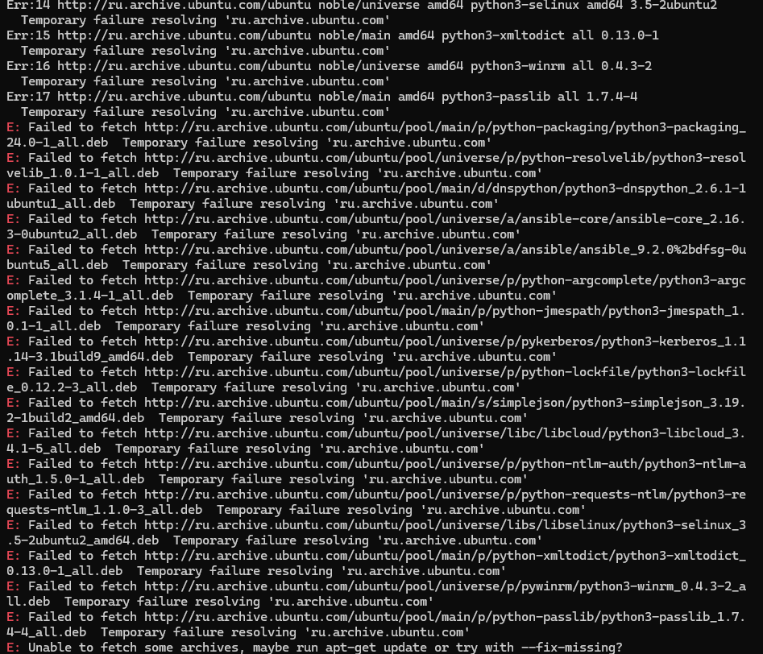
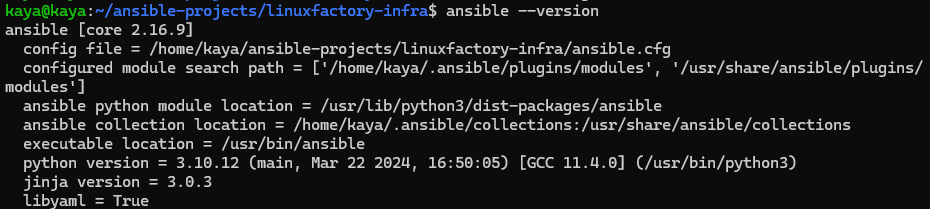

# Задание 3. Знакомство с Ansible
## Описание документа
Документ является ответом на «Задание 3. Знакомство с Ansible».

## Текст задания
Автоматизировать установку Apache и Nginx на Debian 12 и Centos 7 (Задание 2) с помощью Ansible.

Требования:
- по максимуму использовать встроенные возможности ansible, при использования модуля shell (или аналога) задача будет провалена.
- если действие зависит от ОС, то нужно детектировать ОС и выполнять корректные действия

В гит приложить:
- архив с рабочим решением для того, чтобы я выкачал и протестировал (а я буду!)
- содержимое архива для комментариев в гите
- MD-файл с инструкцией (можно особо не упарываться)

## Решение задания
В качестве рабочей машины для задания я выбрала CentOS.

### Шаг 1. Подготовка ВМ
> Небольшой чек-лист того, что у нас должно быть ДО старта работ. 

1. Должны быть 2 ВМ: с CentOS и Debian
2. На машинах должно быть настроено подключение к сети по сетевому мосту
3. На машинах должны быть пакеты sudo и основной пользователь должен быть внесен в группу sudo (относится только к debian, но все же)
4. На машинах должен быть установлен пакет ssh (его можно выбрать при установке системы, но если он не был выбран, то ручками)
5. На машинах должны быть открыты порты 80 и 8080 для серверов и 22 для подключения по SSH
6. На машине, где мы будем устанавливать с Ansible, должно быть настроено подключение к обеим машинам по SSH-ключам (по инструкции из Task_2) 
   > Первую часть задания я проделала несколько раз. И нашла два способа:
   1. Можно поставить Ansible на любой из двух виртуальных машин (я пробовала поставить на CentOS). Это будет работать, главное с CentOS настроить подключение и к Debian, и к CentOS (как бы странно это ни звучало) по SSH-ключам. Я узнала, что со своей машины действительно можно подключиться к себе же. В основном для тестов, но для решения задания также пригодилось.
   2. Создать 3-ю машину. У меня в качестве третьей машины WSL. Я остановилась на этом варианте

### Шаг 2. Установка Ansible на управляющий хост (у меня Ubuntu)
2.1. Перед установкой ПО обновим систему (я так поняла, это всегда хорошая практика)
```
sudo apt update -y
```

2.2. Затем установим добавим нужные пакеты и нужный репо для установки ansible:
```
sudo apt update
sudo apt install software-properties-common
sudo add-apt-repository --yes --update ppa:ansible/ansible
sudo apt install ansible
```
> В родном репо не может достучаться до архивов. 
> Плюс, как я поняла, этот способ в любом случае позволяет установить самую свежую версию напрямую от разработчиков Ansible
> 
 
2.3. Проверим, что все установилось:
 


### Шаг 3. Настройка файлов Ansible
3.1. Создадим рабочий каталог для будущих файлов (чтобы потом их все удобно положить в архив)
```
mkdir -p ~/ansible-projects/rockot-it-tasks/task_3 
cd ~/ansible-projects/rockot-it-tasks/task_3
```

3.2. Создадим и наполненим файл инвентаря. В нем перечислим хосты, на которые мы будем посылать команды.
 
3.2.1. Создаем файл
```
nano inventory.ini
```

3.2.2. Вставляем код в файл
```
[webservers]
centos_server ansible_host=192.168.1.69 ansible_user=kaya
debian_server ansible_host=192.168.1.70 ansible_user=kaya
```

Краткий разбор:
* `[webservers]` - название группы серверов
* `centos_server` и `debian_server` - имена серверов, чтобы было проще их различать 
* `ansible_host=192.168.1.69` и `ansible_host=192.168.1.70` - реальные ip серверов, на которые мы будем посылать команды
* `ansible_user=kaya` - пользователь, от имени которого мы будем подключаться к серверам по SSH (при смене окружения надо заменить `kaya` на другого пользователя, хотя  я бы не меняла..)

3.2.3. Сохраняем изменения, выходим

3.3. Далее я выбрала менять файлы на серверах на заранее подготовленные. Поэтому подготовим эти файлы.
 
3.3.1. Создадим две директории для новых конфигов:
```
mkdir -p files/debian_configs  files/centos_configs 
```

3.3.2. Подготовим конфиги для дебиан. Сперва перейдем в директорию:
```
cd files/debian_configs
```

3.3.2.1. Создаем новый файл конфигурации apache (я конечное название сделала таким же, как название файла по умолчанию в дебиан при установке апач)
```
nano ports.conf
```
3.3.2.2. Вставляем текст (по сути я изменила только порт с 80 на 8080, но в теории, если кто-то на сервер полезет, логичнее, чтобы файл был полноценным, поэтому я скопировала комменты и код из ориг. файла):
```
# If you just change the port or add more ports here, you will likely also
# have to change the VirtualHost statement in
# /etc/apache2/sites-enabled/000-default.conf

Listen 8080

<IfModule ssl_module>
    Listen 443
</IfModule>

<IfModule mod_gnutls.c>
    Listen 443
</IfModule>
```
3.3.2.3. Создаем новый файл конфигурации виртуальных хостов apache:
```
nano 000-default.conf
```
3.3.2.4. Вставляем текст (логикак как выше - скопировала из ориг. файла и изменила порт):
```
<VirtualHost *:8080>
        # The ServerName directive sets the request scheme, hostname and port that
        # the server uses to identify itself. This is used when creating
        # redirection URLs. In the context of virtual hosts, the ServerName
        # specifies what hostname must appear in the request's Host: header to
        # match this virtual host. For the default virtual host (this file) this
        # value is not decisive as it is used as a last resort host regardless.
        # However, you must set it for any further virtual host explicitly.
        #ServerName www.example.com

        ServerAdmin webmaster@localhost
        DocumentRoot /var/www/html

        # Available loglevels: trace8, ..., trace1, debug, info, notice, warn,
        # error, crit, alert, emerg.
        # It is also possible to configure the loglevel for particular
        # modules, e.g.
        #LogLevel info ssl:warn

        ErrorLog ${APACHE_LOG_DIR}/error.log
        CustomLog ${APACHE_LOG_DIR}/access.log combined

        # For most configuration files from conf-available/, which are
        # enabled or disabled at a global level, it is possible to
        # include a line for only one particular virtual host. For example the
        # following line enables the CGI configuration for this host only
        # after it has been globally disabled with "a2disconf".
        #Include conf-available/serve-cgi-bin.conf
</VirtualHost>
```

3.3.2.5. Cоздаем дополнительный конфиг для nginx (его потом сделаем основным):
```
nano load_balancer.conf
```
3.3.2.6. Вставляем конфигурацию Nginx для проксирования запросов на Apache:
```
upstream apache_servers {
  server 192.168.1.70:8080; 
  server 192.168.1.69:8080; 
}

server {
  listen 80;  
  server_name 192.168.1.70;  

  location / {
    proxy_pass http://apache_servers;  
    proxy_set_header Host $host;
    proxy_set_header X-Real-IP $remote_addr;
    proxy_set_header X-Forwarded-For $proxy_add_x_forwarded_for;
    proxy_set_header X-Forwarded-Proto $scheme;
  }
}
```

3.3.3. Подготовим конфиги для centos.
 
Т.к. после предыдущего шага мы находимся в `~/ansible-projects/rockot-it-tasks/task_3/files/debian_configs`, то поднимаемся наверх и переходим в нужную директорию:
```
cd ../centos_configs
```

3.3.3.1. Создаем новый файл конфигурации apache (здесь я конечное название тоже сделала таким же, как название файла по умолчанию в центос при установке апач)
```
nano httpd.conf
```
3.3.2.2. Вставляем текст (все то же - и код и комменты перенесла из ориг. файла, изменила только порт):
```
#
# This is the main Apache HTTP server configuration file.  It contains the
# configuration directives that give the server its instructions.
# See <URL:http://httpd.apache.org/docs/2.4/> for detailed information.
# In particular, see
# <URL:http://httpd.apache.org/docs/2.4/mod/directives.html>
# for a discussion of each configuration directive.
#
# See the httpd.conf(5) man page for more information on this configuration,
# and httpd.service(8) on using and configuring the httpd service.
#
# Do NOT simply read the instructions in here without understanding
# what they do.  They're here only as hints or reminders.  If you are unsure
# consult the online docs. You have been warned.
#
# Configuration and logfile names: If the filenames you specify for many
# of the server's control files begin with "/" (or "drive:/" for Win32), the
# server will use that explicit path.  If the filenames do *not* begin
# with "/", the value of ServerRoot is prepended -- so 'log/access_log'
# with ServerRoot set to '/www' will be interpreted by the
# server as '/www/log/access_log', where as '/log/access_log' will be
# interpreted as '/log/access_log'.

#
# ServerRoot: The top of the directory tree under which the server's
# configuration, error, and log files are kept.
#
# Do not add a slash at the end of the directory path.  If you point
# ServerRoot at a non-local disk, be sure to specify a local disk on the
# Mutex directive, if file-based mutexes are used.  If you wish to share the
# same ServerRoot for multiple httpd daemons, you will need to change at
# least PidFile.
#
ServerRoot "/etc/httpd"

#
# Listen: Allows you to bind Apache to specific IP addresses and/or
# ports, instead of the default. See also the <VirtualHost>
# directive.
#
# Change this to Listen on a specific IP address, but note that if
# httpd.service is enabled to run at boot time, the address may not be
# available when the service starts.  See the httpd.service(8) man
# page for more information.
#
#Listen 12.34.56.78:80
Listen 8080
#
# Dynamic Shared Object (DSO) Support
#
# To be able to use the functionality of a module which was built as a DSO you
# have to place corresponding `LoadModule' lines at this location so the
# directives contained in it are actually available _before_ they are used.
# Statically compiled modules (those listed by `httpd -l') do not need
# to be loaded here.
#
# Example:
# LoadModule foo_module modules/mod_foo.so
#
Include conf.modules.d/*.conf

#
# If you wish httpd to run as a different user or group, you must run
# httpd as root initially and it will switch.
#
# User/Group: The name (or #number) of the user/group to run httpd as.
# It is usually good practice to create a dedicated user and group for
# running httpd, as with most system services.
#
User apache
Group apache

# 'Main' server configuration
#
# The directives in this section set up the values used by the 'main'
# server, which responds to any requests that aren't handled by a
# <VirtualHost> definition.  These values also provide defaults for
# any <VirtualHost> containers you may define later in the file.
#
# All of these directives may appear inside <VirtualHost> containers,
# in which case these default settings will be overridden for the
# virtual host being defined.
#

#
# ServerAdmin: Your address, where problems with the server should be
# e-mailed.  This address appears on some server-generated pages, such
# as error documents.  e.g. admin@your-domain.com
#
ServerAdmin root@localhost

#
# ServerName gives the name and port that the server uses to identify itself.
# This can often be determined automatically, but we recommend you specify
# it explicitly to prevent problems during startup.
#
# If your host doesn't have a registered DNS name, enter its IP address here.
#
#ServerName www.example.com:80

#
# Deny access to the entirety of your server's filesystem. You must
# explicitly permit access to web content directories in other
# <Directory> blocks below.
#
<Directory />
    AllowOverride none
    Require all denied
</Directory>

#
# Note that from this point forward you must specifically allow
# particular features to be enabled - so if something's not working as
# you might expect, make sure that you have specifically enabled it
# below.
#

#
# DocumentRoot: The directory out of which you will serve your
# documents. By default, all requests are taken from this directory, but
# symbolic links and aliases may be used to point to other locations.
#
DocumentRoot "/var/www/html"
#
# Relax access to content within /var/www.
#
<Directory "/var/www">
    AllowOverride None
    # Allow open access:
    Require all granted
</Directory>

# Further relax access to the default document root:
<Directory "/var/www/html">
    #
    # Possible values for the Options directive are "None", "All",
    # or any combination of:
    #   Indexes Includes FollowSymLinks SymLinksifOwnerMatch ExecCGI MultiViews
    #
    # Note that "MultiViews" must be named *explicitly* --- "Options All"
    # doesn't give it to you.
    #
    # The Options directive is both complicated and important.  Please see
    # http://httpd.apache.org/docs/2.4/mod/core.html#options
    # for more information.
    #
    Options Indexes FollowSymLinks

    #
    # AllowOverride controls what directives may be placed in .htaccess files.
    # It can be "All", "None", or any combination of the keywords:
    #   Options FileInfo AuthConfig Limit
    #
    AllowOverride None

    #
    # Controls who can get stuff from this server.
    #
    Require all granted
</Directory>

#
# DirectoryIndex: sets the file that Apache will serve if a directory
# is requested.
#
<IfModule dir_module>
    DirectoryIndex index.html
</IfModule>

#
# The following lines prevent .htaccess and .htpasswd files from being
# viewed by Web clients.
#
<Files ".ht*">
    Require all denied
</Files>

#
# ErrorLog: The location of the error log file.
# If you do not specify an ErrorLog directive within a <VirtualHost>
# container, error messages relating to that virtual host will be
# logged here.  If you *do* define an error logfile for a <VirtualHost>
# container, that host's errors will be logged there and not here.
#
ErrorLog "logs/error_log"

#
# LogLevel: Control the number of messages logged to the error_log.
# Possible values include: debug, info, notice, warn, error, crit,
# alert, emerg.
#
LogLevel warn

<IfModule log_config_module>
    #
    # The following directives define some format nicknames for use with
    # a CustomLog directive (see below).
    #
    LogFormat "%h %l %u %t \"%r\" %>s %b \"%{Referer}i\" \"%{User-Agent}i\"" combined
    LogFormat "%h %l %u %t \"%r\" %>s %b" common

    <IfModule logio_module>
      # You need to enable mod_logio.c to use %I and %O
      LogFormat "%h %l %u %t \"%r\" %>s %b \"%{Referer}i\" \"%{User-Agent}i\" %I %O" combinedio
    </IfModule>

    #
    # The location and format of the access logfile (Common Logfile Format).
    # If you do not define any access logfiles within a <VirtualHost>
    # container, they will be logged here.  Contrariwise, if you *do*
    # define per-<VirtualHost> access logfiles, transactions will be
        # logged therein and *not* in this file.
    #
    #CustomLog "logs/access_log" common

    #
    # If you prefer a logfile with access, agent, and referer information
    # (Combined Logfile Format) you can use the following directive.
    #
    CustomLog "logs/access_log" combined
</IfModule>

<IfModule alias_module>
    #
    # Redirect: Allows you to tell clients about documents that used to
    # exist in your server's namespace, but do not anymore. The client
    # will make a new request for the document at its new location.
    # Example:
    # Redirect permanent /foo http://www.example.com/bar

    #
    # Alias: Maps web paths into filesystem paths and is used to
    # access content that does not live under the DocumentRoot.
    # Example:
    # Alias /webpath /full/filesystem/path
    #
    # If you include a trailing / on /webpath then the server will
    # require it to be present in the URL.  You will also likely
    # need to provide a <Directory> section to allow access to
    # the filesystem path.

    #
    # ScriptAlias: This controls which directories contain server scripts.
    # ScriptAliases are essentially the same as Aliases, except that
    # documents in the target directory are treated as applications and
    # run by the server when requested rather than as documents sent to the
    # client.  The same rules about trailing "/" apply to ScriptAlias
    # directives as to Alias.
    #
    ScriptAlias /cgi-bin/ "/var/www/cgi-bin/"

</IfModule>

#
# "/var/www/cgi-bin" should be changed to whatever your ScriptAliased
# CGI directory exists, if you have that configured.
#
<Directory "/var/www/cgi-bin">
    AllowOverride None
    Options None
    Require all granted
</Directory>

<IfModule mime_module>
    #
    # TypesConfig points to the file containing the list of mappings from
    # filename extension to MIME-type.
    #
    TypesConfig /etc/mime.types

    #
    # AddType allows you to add to or override the MIME configuration
    # file specified in TypesConfig for specific file types.
    #
    #AddType application/x-gzip .tgz
    #
    # AddEncoding allows you to have certain browsers uncompress
    # information on the fly. Note: Not all browsers support this.
    #
    #AddEncoding x-compress .Z
    #AddEncoding x-gzip .gz .tgz
    #
    # If the AddEncoding directives above are commented-out, then you
    # probably should define those extensions to indicate media types:
    #
    AddType application/x-compress .Z
    AddType application/x-gzip .gz .tgz

    #
    # AddHandler allows you to map certain file extensions to "handlers":
    # actions unrelated to filetype. These can be either built into the server
    # or added with the Action directive (see below)
    #
    # To use CGI scripts outside of ScriptAliased directories:
    # (You will also need to add "ExecCGI" to the "Options" directive.)
    #
    #AddHandler cgi-script .cgi
    
    # For type maps (negotiated resources):
    #AddHandler type-map var

    #
    # Filters allow you to process content before it is sent to the client.
    #
    # To parse .shtml files for server-side includes (SSI):
    # (You will also need to add "Includes" to the "Options" directive.)
    #
    AddType text/html .shtml
    AddOutputFilter INCLUDES .shtml
    </IfModule>

#
# Specify a default charset for all content served; this enables
# interpretation of all content as UTF-8 by default.  To use the
# default browser choice (ISO-8859-1), or to allow the META tags
# in HTML content to override this choice, comment out this
# directive:
#
AddDefaultCharset UTF-8

<IfModule mime_magic_module>
    #
    # The mod_mime_magic module allows the server to use various hints from the
    # contents of the file itself to determine its type.  The MIMEMagicFile
    # directive tells the module where the hint definitions are located.
    #
    MIMEMagicFile conf/magic
</IfModule>

#
# Customizable error responses come in three flavors:
# 1) plain text 2) local redirects 3) external redirects
#
# Some examples:
#ErrorDocument 500 "The server made a boo boo."
#ErrorDocument 404 /missing.html
#ErrorDocument 404 "/cgi-bin/missing_handler.pl"
#ErrorDocument 402 http://www.example.com/subscription_info.html
#

#
# EnableMMAP and EnableSendfile: On systems that support it,
# memory-mapping or the sendfile syscall may be used to deliver
# files.  This usually improves server performance, but must
# be turned off when serving from networked-mounted
# filesystems or if support for these functions is otherwise
# broken on your system.
# Defaults if commented: EnableMMAP On, EnableSendfile Off
#
#EnableMMAP off
EnableSendfile on

# Supplemental configuration
#
# Load config files in the "/etc/httpd/conf.d" directory, if any.
IncludeOptional conf.d/*.conf
```
3.3.2.3. Создаем новый файл конфигурации виртуальных хостов apache: 
```
nano my_virtualhost.conf
```
3.3.2.4. Вставляем саму конфигурацию:
```
<VirtualHost *:8080>
   DocumentRoot "/var/www/html"
   ServerAdmin root@localhost
   ErrorLog "/var/log/httpd/error_log"
   CustomLog "/var/log/httpd/access_log" common
</VirtualHost>
```

3.3.2.5. Cоздаем дополнительный конфиг для nginx (его потом сделаем основным)
```
nano load_balancer.conf
```
3.3.2.6. Вставляем конфигурацию Nginx для проксирования запросов на Apache:
```
upstream apache_servers {
   server 192.168.1.69:8080;
   server 192.168.1.70:8080;
}

server {
   listen 80;
   server_name 192.168.1.69; 

   location / {
      proxy_pass http://apache_servers;
      proxy_set_header Host $host;
      proxy_set_header X-Real-IP $remote_addr;
      proxy_set_header X-Forwarded-For $proxy_add_x_forwarded_for;
      proxy_set_header X-Forwarded-Proto $scheme;
   }
}
```

### Шаг 4. Создаем роли 
> Примечание: в первой итерации я сразу создала плейбук, но он вышел большим, поэтому я пришла сюда и дописала про роли + собственно, создала их
 
4.1. Подготовим директории и файлы:
```
mkdir -p ~/ansible-projects/rockot-it-tasks/task_3/roles
cd ~/ansible-projects/rockot-it-tasks/task_3/roles

mkdir -p configure_nginx/tasks configure_apache/tasks

touch ~/ansible-projects/rockot-it-tasks/task_3/roles/configure_nginx/tasks/main.yml \
      ~/ansible-projects/rockot-it-tasks/task_3/roles/configure_apache/tasks/main.yml

```
4.2. Создадим роль для конфигурации nginx:
```
nano ~/ansible-projects/rockot-it-tasks/task_3/roles/configure_nginx/tasks/main.yml
```
4.3. Вставим код:
```
- name: Работа на Debian
  block:

    - name: Создание доп. конфига для Nginx в /etc/nginx/sites-available на Debian
      copy:
        src: "{{ debian_config_dir }}/load_balancer.conf"
        dest: /etc/nginx/sites-available/load_balancer.conf
        owner: root
        group: root
        mode: '0644'
      when: ansible_os_family == "Debian"

    - name: Создание символической ссылки для созданного load_balancer.conf на Debian
      file:
        src: /etc/nginx/sites-available/load_balancer.conf
        dest: /etc/nginx/sites-enabled/load_balancer.conf
        state: link
        force: yes
      when: ansible_os_family == "Debian"

- name: Работа на CentOS
  block:

    - name: Создание доп. конфига для Nginx в /etc/nginx/conf.d на CentOS
      copy:
        src: "{{ centos_config_dir }}/load_balancer.conf"
        dest: /etc/nginx/conf.d/load_balancer.conf
        owner: root
        group: root
        mode: '0644'
      when: ansible_os_family == "RedHat"

- name: Для Debian и CentOS
  block:

    - name: Перезапуск nginx для обновления конфигурации - на debian и centos
      service:
        name: nginx
        state: restarted
```

4.4. Создадим роль для конфигурации apache:
```
nano ~/ansible-projects/rockot-it-tasks/task_3/roles/configure_apache/tasks/main.yml
```
4.5. Вставим код:
```
- name: Работа на Debian
  block:
    - name: Обновление конфигурации apache - изменение порта с 80 на 8080 (полная замена конфига) - Debian
      copy:
        src: "{{ debian_config_dir }}/ports.conf"
        dest: /etc/apache2/ports.conf
        owner: root
        group: root
        mode: '0644'
      when: ansible_os_family == "Debian"

    - name: Обновление конфигурации виртуальных хостов apache - изменение порта с 80 на 8080 (полная замена конфига) - Debian
      copy:
        src: "{{ debian_config_dir }}/000-default.conf"
        dest: /etc/apache2/sites-available/000-default.conf
        owner: root
        group: root
        mode: '0644'
      when: ansible_os_family == "Debian"

    - name: Перезапуск apache на Debian
      service:
        name: apache2
        state: restarted
      when: ansible_os_family == "Debian"

- name: Работа на CentOS
  block:
    - name: Обновление конфигурации виртуальных хостов apache - изменение порта с 80 на 8080 (полная замена конфига) - Centos
      copy:
        src: "{{ centos_config_dir }}/httpd.conf"
        dest: /etc/httpd/conf/httpd.conf
        owner: root
        group: root
        mode: '0644'
      when: ansible_os_family == "RedHat"

    - name: Создание нового файла конфигурации виртуального хоста (с портом 8080) - Centos
      copy:
        src: "{{ centos_config_dir }}/my_virtualhost.conf"
        dest: /etc/httpd/conf.d/my_virtualhost.conf
        owner: root
        group: root
        mode: '0644'
      when: ansible_os_family == "RedHat"

    - name: Перезапуск apache (httpd) на CentOS
      service:
        name: httpd
        state: restarted
      when: ansible_os_family == "RedHat"
```

### Шаг 5. Создаем файл playbook, в котором опишем сценарий работы с удаленными серверами.
 
5.1. Создаем файл
```
cd ..
nano playbook-install-and-configure-apache-and-nginx.yml
```

5.2. Вставляем код в файл:
```
- name: Install Nginx and Apache on webservers
  hosts: webservers
  become: yes
  vars:
    debian_config_dir: "~/ansible-projects/rockot-it-tasks/task_3/files/debian_configs"
    centos_config_dir: "~/ansible-projects/rockot-it-tasks/task_3/files/centos_configs"

  tasks:
    - name: Обновление пакетов на Debian
      apt:
        name: "*"
        state: latest
      when: ansible_os_family == "Debian"

    - name: Установка Nginx на Debian
      apt:
        name: nginx
        state: present
      when: ansible_os_family == "Debian"

    - name: Обновление пакетов на CentOS
      yum:
        name: "*"
        state: latest
      when: ansible_os_family == "RedHat"

    - name: Установка Nginx на CentOS
      yum:
        name: nginx
        state: present
      when: ansible_os_family == "RedHat"

  roles:
    - configure_nginx
    - configure_apache

  tasks:
    - name: Включение Nginx и его добавление в автозагрузку на Debian
      systemd:
        name: nginx
        state: started
        enabled: yes
      when: ansible_os_family == "Debian"

    - name: Включение Apache и его добавление в автозагрузку на Debian
      systemd:
        name: apache2
        state: started
        enabled: yes
      when: ansible_os_family == "Debian"

    - name: Включение Nginx и его добавление в автозагрузку на CentOS
      systemd:
        name: nginx
        state: started
        enabled: yes
      when: ansible_os_family == "RedHat"

    - name: Включение Apache и его добавление в автозагрузку на CentOS
      systemd:
        name: httpd
        state: started
        enabled: yes
      when: ansible_os_family == "RedHat"

```
Краткий разбор:
* Секция 1 - базовые настройки плейбука. Эта секция задает основные параметры для выполнения плейбука и определяет, что будет выполнено на каких хостах, с какими правами и переменными. Она включает в себя:
  * `- name: Install Nginx and Apache on webservers` - имя плейбука (= сценария)
  * `hosts: webservers` - указываем группу хостов, с которой будем работать (она задана в инвентори)
  * `become: yes` - все команды выполняем с правами `sudo`
  * `vars:` - описываем переменные для наших задач и ролей (по логике их лучше выносить в отделньый файл, но их тут всего 2, а файлов итак много, поэтому решила тут прописать)

* Секция 2 - основная секция выполнения плейбука. Включает в себя:
  * `tasks:` - список задач, которые надо выполнить. Тут пишем сами задачи, как есть 
  * `roles:` - список ролей, которые надо выполнить. Тут пишем названия ролей и порядок, в котором хотим их запустить
   
### Шаг 6. Запуск playbook
6.1. Запускаем плейбук с нашим файлом инвентаря, указываем путь к нужному плейбуку + пишем параметр `--ask-become-pass` благодаря которому мы можем ввести пароли от удаленных серверов перед подключением (потом вводим пароли от серверов):
```
ansible-playbook -i inventory.ini  playbook-install-and-configure-apache-and-nginx.yml --ask-become-pass
 ```   

Результат:
 


