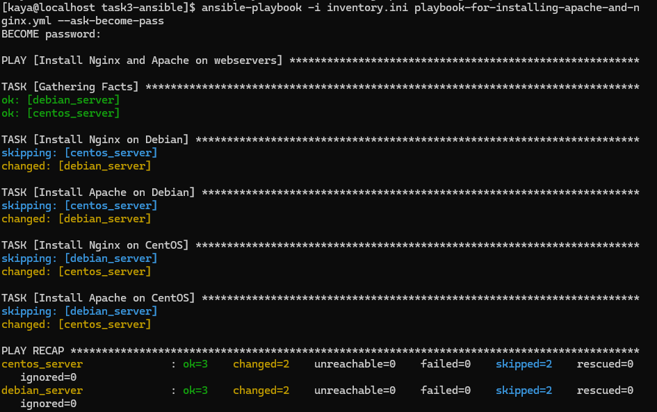

# Задание 3. Знакомство с Ansible
## Описание документа
Документ является ответом на «Задание 3. Знакомство с Ansible».

## Текст задания
Автоматизировать установку Apache и Nginx на Debian 12 и Centos 7 (Задание 2) с помощью Ansible.

Требования:
- по максимуму использовать встроенные возможности ansible, при использования модуля shell (или аналога) задача будет провалена.
- если действие зависит от ОС, то нужно детектировать ОС и выполнять корректные действия

В гит приложить:
- архив с рабочим решением для того, чтобы я выкачал и протестировал (а я буду!)
- содержимое архива для комментариев в гите
- MD-файл с инструкцией (можно особо не упарываться)

## Решение задания
В качестве рабочей машины для задания я выбрала CentOS.

### Шаг 1. Подготовка ВМ
> Т.к. винда была переустановлена, то я проделала все шаги с нуля, и у машин новые IP. Ниже краткая инструкция, что я сделала для подготовки.

1. Должны быть 2 ВМ: с CentOS и Debian
2. На машинах должно быть настроено подключение к сети по сетевому мосту
3. На машинах должны быть пакеты sudo и основной пользователь должен быть внесен в группу sudo (относится только к debian, но все же)
4. На машинах должен быть установлен пакет ssh (в этот раз я на этапе установки debian выбрала установку этого пакета, но пусть пункт будет, мало ли)
5. На машинах должны быть открыты порты 80 и 8080 для серверов и 22 для подключения по SSH
6. На машине с Ansible (в данном случае CentOs) должно быть настроено подключение к обеим машинам по SSH-ключам (по инструкции из Task_2) 
   > Я узнала, что со своей машины тоже можно подключиться к себе же. В основном для тестов, но для решения задания также пригодилось.

### Шаг 2. Установка Ansible на управляющий хост с CentOS
2.1. Перед установкой ПО обновим систему (я так поняла, это всегда хорошая практика)
```
sudo yum update -y
```

2.2. Затем установим нужный репо и ansible:
```
sudo yum install epel-release -y
sudo yum install ansible -y
```

### Шаг 3. Настройка файлов Ansible
3.1. Создадим рабочий каталог для будущих файлов (чтобы потом их все удобно положить в архив)
```
mkdir ~/task3-ansible
cd ~/task3-ansible
```

3.2. Создадим и наполненим файл инвентаря. В нем перечислим хосты, на которые мы будем посылать команды
3.2.1. Создаем файл
```
nano inventory.ini
```

3.2.2. Вставляем код в файл
```
[webservers]
debian_server ansible_host=192.168.1.69 ansible_user=kaya
centos_server ansible_host=192.168.1.79 ansible_user=kaya
```

Краткий разбор:
* `[webservers]` - название группы серверов
* `debian_server` и `centos_server` - имена серверов, чтобы было проще их различать 
* `ansible_host=192.168.1.69` и `ansible_host=192.168.1.79` - реальные ip серверов, на которые мы будем посылать команды
* `ansible_user=kaya` - пользователь, от имени которого мы будем подключаться к серверам по SSH

3.2.3. Сохраняем изменения, выходим

3.3. Создаем файл playbook, в котором опишем сценарий работы с удаленными серверами
3.3.1. Создаем файл
```
nano playbook-for-installing-apache-and-nginx.yml
```

3.3.2. Вставляем код в файл
```
- name: Install Nginx and Apache on webservers
  hosts: webservers
  become: yes
  tasks:
    - block:
        - name: Install Nginx on Debian
          apt:
            name: nginx
            state: present
          when: ansible_os_family == "Debian"

        - name: Install Apache on Debian
          apt:
            name: apache2
            state: present
          when: ansible_os_family == "Debian"

    - block:
        - name: Install Nginx on CentOS
          yum:
            name: nginx
            state: present
          when: ansible_os_family == "RedHat"

        - name: Install Apache on CentOS
          yum:
            name: httpd
            state: present
          when: ansible_os_family == "RedHat"
```
Краткий разбор:
* `- name: Install Nginx and Apache on webservers` - имя сценария
* `hosts: webservers` - указываем группу хостов, с которой будем работать (она задана в инвентори)
* `become: yes` - все команды выполняем с правами sudo
* `tasks:` - описываем задачи (по полю `-block` группируем задачи в зависимости от ОС; в поле `-name` пишем имя задачи; дальше нужный модуль - `apt`; затем интересующий нас пакет - `nginx`; затем необходимое действие - present (установить); и условие при котором задачу нужно выполнить - когда найденная ОС относится к семейству RedHat). Дальше по аналогии

### Шаг 4. Запуск playbook
4.1. Запускаем плейбук с нашим файлом инвентаря, указываем путь к нужному плейбуку + пишем параметр `--ask-become-pass` благодаря которому мы можем ввести пароли от удаленных серверов перед подключением:
```
ansible-playbook -i inventory.ini  playbook-for-installing-apache-and-nginx.yml --ask-become-pass
 ```   

Результат:

