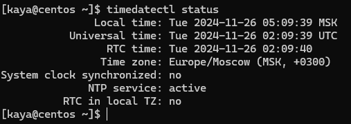
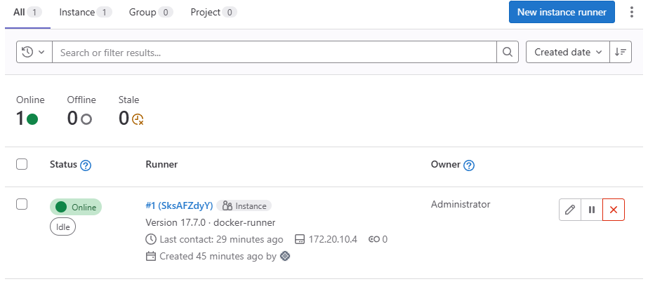
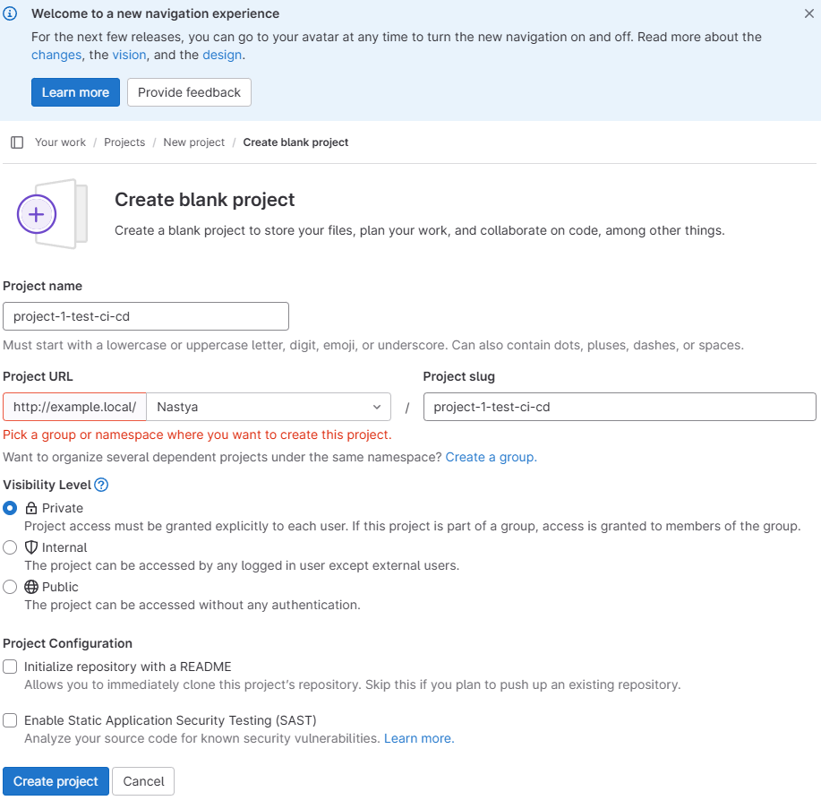

# Задание 5. Разворачивание Gitlab
## Описание документа
Документ является ответом на «Задание 5. Разворачивание Gitlab».

## Текст задания
Во вложении пример шары для своего заказчика. Нужно запустить гитлаб + докер реестр + раннер. И прогнать по всему тестовую джобу для доказательства работы. В ридми есть само ТЗ и рекомендации по запуску. На тот момент всё работало. Плюс заказчик просил объединить всё в один компоуз, что чуть усложняет запуск (т.к. имена внутри и снаружи компоуза могут быть разные).

**Примерный пайплайн планировался следующий:**
1. Сервер 1 - сам сервер гитлаба. Делаются бекапы, нагрузка на память и cpu.
2. Сервер 2 - докер реестр, требователен к объёму дисков.
3. Сервер 3 - Х - раннеры, в зависимости от типа могут хотеть память, процессор и диски.

**Подготовительный этап. Задачи**
1. Запустить проект из директории /primer/all-in-one. Залогиниться в веб гитлаба, настроить под себя.
2. Создать раннер в интерфейсе (получить токен).
3. Зарегистрировать раннер в контейнере.
4. Создать новый проект в интерфейсе.

См. описание с примерами команд в /primer/READ.ME.

**Основной этап. Задача 1**
1. Написать gitlab-ci.yml, прогоняющий код echo ok, отправить его в проект и проверить выполнение.

**Основной этап. Задача 2 **
1. Подготовить докерфайл ubuntu24.04, который будет собирать проект /primer/tz2/hello_world. В докерфайле нужно установить пакеты gcc,g++, make, cmake.
2. Запушить кастомный образ в запущенный реестр
3. Написать gitlab-ci.yml, собирающий проект /primer/tz2/hello_world. Указать использование кастомного образа из реестра для всех задач, выполняемых в этом gitlab-ci.yml (секция `default`).
gitlab-ci.yml должен состоять из 2 частей - build и test (тест - это просто запуск артефакта из build).

Подробное описание см. в /primer/tz2/tz.txt.

Пример готовой реализации есть в архиве /primer/Example_hello-main.zip

**Основной этап. Задача 3**
1. Разделить компоуз из /primer/all-in-one на 3 части -  реестра, гитлаб раннера и сервера.
2. Повторить задачу 1, убедившись, что ничего не сломалось.
3. Сделать новый раннер, который может собирать докер образы.
4. Сделать новый проект, который:
   * а) Собирает образы из задания 4 с первым компоузом (1 nginx + 2 apache).
   * б) Пушит собранные образы в свой реестр.
   * в) Формирует артефакт состоящий из компоуза и вспомогательных файлов для запуска предсобранных (они не должны в нём собираться никоим образом, только качаться из реестра) образов.

**В гит приложить:**
* архив с рабочим решением. в архиве должна быть понятная структура в зависимости от этапа и номера задач
* содержимое архива для комментариев в гите
* MD-файл с инструкцией

## Решение задания

### Подготовительный этап. Задачи

#### 1. Подготовка окружения
1.1. Настройка времени
> В ходе решения задания я выяснила, что у меня на ВМ время некорректное. Поэтому первым этапом записала настроить его (ну или как минимум проверить).

1.1.1. Проверим время в системе:
```
timedatectl status
```
Вывод (сегодня 23 декабря):
 


В выводе `NTP synchronized: no` говорит, что служба синхронизации времени не работает. 

1.1.2. Проверим статус службы синхронизации времени:
```
sudo systemctl status chronyd
```
Вывод:
 


Судя по статусу, chronyd работает, но синхронизации времени все равно нет.
В моем случае я пробовала по-разному, но проблема оказалась в том, что текущие NTP-сервера были недоступны. Поэтому...
 
1.1.3. Открываем конфиг:
```
sudo nano /etc/chrony.conf
```

1.1.4. И добавим туда следующие сервера:
```
server 0.pool.ntp.org iburst
server 1.pool.ntp.org iburst
server 2.pool.ntp.org iburst
server 3.pool.ntp.org iburst
```

1.1.5. Сохраним изменения и перезапустим Chrony:
```
sudo systemctl restart chronyd
```

1.1.6. После настройки серверов принудительно синхронизируем время:
```
sudo chronyc -a makestep
```

1.1.7. Снова проверим состояние времени:
```
timedatectl status
```
 

 
(Ура, все ок, но надо было дать chrond несколько секунд все обновить)

> Я узнала, что Docker-контейнеры используют время хоста только на момент запуска. Если время хоста изменится, это не повлияет на уже работающие контейнеры. Поэтому, если меняем время в момент, когда контейнеры подняты, то, чтобы обновить время в контейнерах, их нужно перезапустить.


1.2. Установка Docker и Docker Compose
> Для установки Docker я использовала официальный репозиторий Docker для CentOS. Установка требует прав администратора, поэтому все команды с sudo.

1.2.1. Установим Docker:
```
sudo dnf update -y && \
sudo dnf install -y yum-utils && \
sudo yum-config-manager --add-repo https://download.docker.com/linux/centos/docker-ce.repo && \
sudo dnf install -y docker-ce docker-ce-cli containerd.io && \
sudo systemctl enable --now docker && \
sudo usermod -aG docker $USER
```

> Команда usermod -aG docker $USER добавляет текущего пользователя в группу docker, чтобы команды Docker можно было выполнять без sudo.

1.2.3. После выполнения команды `usermod` нужно либо перезапустить сессию терминала, либо выполнить:
```
newgrp docker
```

1.2.4. Проверяем установку:
```
docker --version 
```
 


1.3. Установим Docker Compose:
 
1.3.1. Сама установка:
```
sudo curl -L "https://github.com/docker/compose/releases/download/v2.27.0/docker-compose-$(uname -s)-$(uname -m)" -o /usr/local/bin/docker-compose && \
sudo chmod +x /usr/local/bin/docker-compose 
```

1.3.2. Проверяем установку:
```
docker-compose --version
```
 


1.3.3. Изменение visudo
> Т.к. мы установили компоуз в /usr/local/bin, который по умолчанию не находится в PATH, то добавим его туда. Чтобы потом не стоклнуться с тем, что команда docker-compose не найдена:
```
sudo visudo
```

В строку Defaults secure_path добавила `:/usr/local/bin` (да, я и вимом за эти дни научилась пользоваться..):
 


1.4. Перенос архива и запуск проекта

1.4.1. Создадим директорию под проект на ВМ
```
mkdir /home/kaya/task-5-gitlab
```

1.4.2. В терминале винды введем команды для копирования архива с помощью scp:
```
scp C:\Users\virgi\Downloads\primer.zip kaya@172.20.10.4:/home/kaya/task-5-gitlab/primer.zip
```
 


1.4.3. Распакуем архив:
```
cd /home/kaya/task-5-gitlab &&
unzip primer.zip
```

1.4.5. Запуск проекта
 
Запускаем проект, чтобы посмотреть, что там за ошибки нас ждут. Они все-таки ждут. Переходим в директорию all-in-one и поднимаем контейнеры:
```
cd primer/all-in-one &&
docker-compose up -d
```

Естественно, сталкиваемся с ошибками (об этом нас предупредили):
 


1.4.6. Т.к. ошибка связана с портом, то проверим сразу все занятые порты, чтобы потом смотреть, что с ними со всеми делать:
```
sudo netstat -tulnp
```

Результат:
 


Итак, у меня заняты 5000, 80, 22, 8080 и 323 порты.

1.4.7. Идем в `.env` смотреть, как настроен проброс портов для нашего проекта:
```
nano .env
```

Видим, что используем порт 5000, 8080, 80, 443, 22 для проброса:
 


> Сперва я поменяла все порты. Потом столкнулась с тем, что гитлаб использует внутренние ссылки в своем интерфейсе, которые зависят от `external_url`. Поэтому, если поменять зачение `GITLAB_HTTP_PORT`, то нужно еще поменять и `external_url`. Но почему-то у меня все равно внутренние сылки были кривыми. И т.к. мне не нужен сервис, который сейчас занимает порт `80`, то я решила уступить его гитлабу.

1.4.8. Поэтому сейчас меняем порты так и сохраняем изменения в `.env`:
```
DOCKER_PORT=5000 (без изменений)
DOCKER_HTTP_PORT=8090 (был 8080)
GITLAB_HTTP_PORT=80 (без изменений)
GITLAB_HTTPS_PORT=8443 (был 443)
GITLAB_SSH_PORT=2222 (был 22)
```

Порт для `GITLAB_HTTP_PORT` оставила без изменений (`80`), чтобы избежать внутренних проблем в GitLab.

1.4.9. И идем выключать сервис, занимающий порт 80 + отменим его автозагрузку:
```
sudo systemctl stop nginx
sudo systemctl disable nginx
```

Еще раз проверим занятость порта:
```
sudo netstat -tuln | grep :80
```

1.4.10. И после того как мы нормально зашли и вышли, пробуем поднять контейнеры еще раз:
```
docker-compose down
docker-compose up -d
```

Ура, стоит!
 


1.4.11. Настройка файла hosts
 
Пробуем открыть интерфейс гитлаба:
 


Безуспешно, что и логично - глобально такого хостинга нет, и локально мой ноутбук на винде о нем не слышал. Исправляем ситуацию.
* Открываю файл hosts с правами администратора: Нажала Win -> ввела "Блокнот" -> ПКМ -> "Запуск от имени администратора"
* В блокноте открыла файл C:\Windows\System32\drivers\etc\hosts
* Добавила строку, указав IP моей ВМ:
    ```
    172.20.10.4 example.local
    ```
* Сохранила файл. 

Ура, поднялся!
 


#### 2. Настройка GitLab
2.1. Вход в гитлаб
После настройки портов и файла hosts, я открыла GitLab в браузере по адресу:
http://example.local

* Логин: `root` (стандартный)
* Пароль: `ochen_very_strong$` (взяла из .env файла)

Вообще для задания мне хватило просто входа. Но предположим, что это не просто задание. Тогда я бы настроила так:
 
1.5.1. Настройки профиля root:
* Т.к. пароль для рута у нас прописан в `.env`, то по-хорошему его надо заменить.
  Заходим в `Edit Profile`, у нас откроются `User Settings`, переходим в `Password`, пишем новый пароль, я указала `really_ochen_very_strong$`:
  

* Думаю, еще двухфакторную аутентификацию надо, но не для нашего задания..
  
* Возвращаемся в `Edit Profile`. Учитывая возьню со временем на ВМ, тут тоже на всякий проставлю:
   
  

* И почта, но пока предположим, что `example.com`, это моя почта:
   
  

* `Update pfofile settings`


2.3. Создание нового админа:
> Т.к. рут есть рут, то под ним мы работать на постоянке не должны, чтобы не сделать себе подлянку из-за его неограниченных возможностей. 

* Поэтому создаем админа:
  Admin Area -> New User -> Имя, ник, роль меняем с regular на administrator -> Create user
   
  

  > Здесь я, кстати, не поняла. Ожидала письмо на почту, но не было. Поэтому я под рутом зашла в `Edit profile` для нового админа, выставила пароль, который меня потом при входе в созданный аккаунт админа попросили сменить:
  >  
  >  

* Заходим под новым админом

2.4. Создание и регистрация раннера

2.4.1. Создадим токен для раннера (теги не ставила):

Admin Area -> CI/CD -> New Instance Runner. Здесь заполняем поля для раннера и жмем Create
 


2.4.2. Подключаемся к контейнеру:
```
docker exec -it all-in-one-gitlab-runner-1 bash
```
* При необходимости заменить `all-in-one-gitlab-runner-1` на нужное 

2.4.3. Выполняем команду регистрации раннера.
```
gitlab-runner register \
  --non-interactive \
  --url "http://example.local/" \
  --token "glrt-PyCs_qkz1fxas2y72sbs" \
  --executor "docker" \
  --docker-image "alpine:latest" \
  --description "docker-runner"
```
* При необходимости заменить `glrt-e1suxyZMpLDqBzLJAF75` на нужное 

> Это просто оставлю как памятку, пусть будет:
> * `--url:` адрес GitLab.
> * `--token:` токен, который мы скопировали на предыдущем шаге.
> * `--executor:` указывает, какой тип раннера будет использоваться (в данном случае Docker).
> * `--docker-image:` указывает базовый образ для выполнения задач (например, alpine:latest).
> * `--description:` описание раннера для удобства.

И... встречаемся с ошибкой:
 


> Значит, контейнер с раннером не может резолвить экзампл.локал в айпи адрес. И так же, как с виндой, нам надо добавить 
> опцию `extra_hosts` в `docker-compose.yml` (о чем было написано самым первым в РИДМИ)

2.4.4. Выходим из контейнера:
```
exit
```

2.4.5. Затем идем к файлу компоуза (если мы не там, но мы по идее там):
```
cd /home/kaya/task-5-gitlab/primer/all-in-one
```

2.4.6. Открываем файл и расскомментируем строки # debugging on localhost, заменив на правильный IP.
```
nano docker-compose.yml
```

Сохраняем
2.4.7. Я еще решила, что надо почистить `/srv/gitlab-runner/config/` от попытки создания раннера, во избежание конфликтов. Чистим:
```
rm -rf /srv/gitlab-runner/config/*
```

2.4.8. После чего опускаем все контейнеры и поднимаем с пересборкой (все, чтобы не было проблем с сетями потом)
```
docker-compose down
docker-compose up --build -d
```

2.5. Пробуем повторно зарегать раннер.

2.5.1. Подключаемся к контейнеру:
```
docker exec -it all-in-one-gitlab-runner-1 bash
```
* При необходимости заменить `all-in-one-gitlab-runner-1` на нужное 

2.4.3. Выполняем команду регистрации раннера.
```
gitlab-runner register \
  --non-interactive \
  --url "http://example.local/" \
  --token "glrt-PyCs_qkz1fxas2y72sbs" \
  --executor "docker" \
  --docker-image "alpine:latest" \
  --description "docker-runner"
```
 
Раннер зареган:
 

 
Не забываем выйти:
```
exit
```

И в интерфейсе раннер тоже зареган:
 


2.6. Создание нового проекта в интерфейсе GitLab
Комментарий: Создадим проект в интерфейсе GitLab, чтобы настроить CI/CD.

2.6.1. Заходим в интерфейсс GitLab:
http://example.local

2.6.2. Уходим из Admin Area и переходим в Your work -> Projects -> Create a project -> Create blenk project

2.6.3. Даем имя проекту: `project-1-test-ci-cd`

2.6.4. Указываем пользователя / группу для будущего урла проекта
   
2.6.5. Убраем галочку `Initialize repository with a README` (чтобы проще было работать с проектом через терминал).

2.6.6. Создаем проект: Create Project
 
Пример:
 

---

#### 3. Настройка локального проекта на ВМ
После создания проекта в интерфейсе GitLab, настроим его локально на ВМ.

3.1. На ВМ перейдем в директорию, где будем хранить проекты, и создаем директорию под проект: 
```
cd ~/task-5-gitlab/primer/
mkdir project-1-test-ci-cd
cd project-1-test-ci-cd
```

3.2. Делаем инит для репозитория:
```
git init
```

3.3. Так как я не помню, зарегана ли я в гите на этой машине, то проверим настройки Git:
```
git config --list
```

Вывод:
 


Увы, нет настроек `user.name` и `user.email`, добавим:
```
git config --global user.name "Nastya"
git config --global user.email "ade.nastasia@gmail.com"
```

3.4. Свяжем локальный репозиторий с удаленным в GitLab:
```
git remote add origin git@example.local:Nastya/project-1-test-ci-cd.git
```

3.5. И еще сразу настроим SSH-ключи, они у меня уже есть, так что ctrl+c:
```
cat ~/.ssh/id_rsa.pub
```

И в гитлабе открываем Preferences, оттуда переходим в SSH Keys, жмем ctrl+v, даем имя ключу:
 


3.6. Также помним, что в `.env` файле мы меняли `GITLAB_SSH_PORT` с `22` на `2222` (Если сейчас не вспомним, вспомним позже).
Поэтому настроим гит для работы с нестандартным портом

Откроем (или создадим) `~/.ssh/config:`
```
nano ~/.ssh/config
```

Добавим код:
```
Host example.local
    Hostname example.local
    Port 2222
    User git
```

Сохраним

3.7. Еще помним, что мы не настроили резолв `example.local` с самой ВМ (тоже, если сейчас не вспомним, вспомним чуть позже).
Поэтому настроим

Проверим, что SSH может подключиться к GitLab:
```
sudo nano /etc/hosts
```

Добавим наш IP и наш экзампл локал:
 


Ну и проверим, что мы можем подключиться по SSH:
```
ssh -T git@example.local
```

Видим, что все хорошо, и успокаиваемся (= идем дальше):
 


### 4. Основной этап. Задача 1
#### 4.1. Создание файла .gitlab-ci.yml, прогоняющий код echo ok, его отправка в проект и проверка выполнения
4.1.1. Создадим .gitlab-ci.yml:
```
cd /home/kaya/task-5-gitlab/primer/project-1-test-ci-cd
nano .gitlab-ci.yml
```

4.1.2. Вставим код:
```
stages:
  - test

echo_ok_job:
  stage: test
  script:
    - echo "ok"
```

4.1.3. Сохраним изменения и пушим их в репо:
```
git add .
git commit -m "add .gitlab-ci.yml"
git push -u origin master
```

> (мастер, потому что он у меня автоматом, и я не меняла:
> 
> )


4.1.4. Перебираемся в интерфейс гитлаба и проверяем, что пайплайн запустился после пуша + запустился без ошибок (а это, кстати, не так, ошибки есть):
Project -> Build -> Pipelines:
 


Лезем в логи:
 


Вспоминаем, что в РИДМИ проекта есть строчка "И всё равно не работает в едином компоуз, добавляем костылей. Строка    `network_mode = "host"`"

Следуем указаниям строчки.

Редактируем файл с хоста:
```
sudo nano /srv/gitlab-runner/config/config.toml
```

Добавляем строчки из РИДМИ:
```
    network_mode = "host" # чтоб резолвилось на локалхосте.
    pull_policy = ["if-not-present"] # чтоб не выкачивать образ по новой
```
 


Сохраняем, выходим.

Перезапускаем раннер:
```
docker restart all-in-one-gitlab-runner-1
```

Возвращаемся в интерфейс гитлаба, нажимаем на перезапуск пайплайна.
И ура, оно работает!
 


### 5. Основной этап. Задача 2
#### 5.1. Подготовка докерфайла ubuntu24.04, который будет собирать проект /primer/tz2/hello_world. В докерфайле нужно установить пакеты gcc,g++, make, cmake.
5.1.1. Переходим в директорию проекта:
```
cd /home/kaya/task-5-gitlab/primer/tz2/hello_world
```

5.1.2. Создадим докекрфайл:
```
nano Dockerfile
```

5.1.3. Вставим код
```
FROM ubuntu:24.04

RUN apt-get update && \
    apt-get install -y gcc g++ make cmake

COPY . /app
WORKDIR /app

RUN cmake

CMD ["./hello_world"]
```

#### 5.2. Пуш кастомного образа в запущенный реестр

5.2.1. Собираем образ:
```
docker build -t example.local:5000/hello-world:latest .
```

5.2.2. Залогонимся в реестре:
```
docker login example.local:5000
```

Просит логин и пароль, как я понимаю, вводим любые данные.

> **Памятка**
> Docker CLI всегда отправляет аутентификационные данные.
> Даже если аутентификация отключена, Docker CLI может отправить "пустой" запрос с пустым логином и паролем. Если сервер Docker Registry ожидает аутентификацию (даже если она не настроена), он может отклонить пустые данные.
> Поэтому, видимо, не прокатило, когда я ввела просто Enter, но прокатило, когда я ввела набор букв для входа.

Итак, мы попытались войти, но встретились с ошибкой:
> **Памятка**
> * Docker Registry по умолчанию использует HTTP — если мы разворачиваем Docker Registry вручную или через docker-compose без дополнительной конфигурации, он работает через HTTP. 
> * Docker CLI по умолчанию ожидает, что все реестры работают через HTTPS. Это связано с тем, что HTTPS обеспечивает безопасность передаваемых данных (например, образов контейнеров или аутентификационных данных).
>   * Docker CLI автоматически использует HTTP только для локального Docker Registry (адреса localhost или 127.0.0.1).
Для всех остальных адресов (например, example.local или 172.20.10.4) CLI ожидает HTTPS, если реестр явно не указан как "insecure registry".

Поэтому нам надо с этим что-то делать. Мы разрешим Docker CLI использовать HTTP.
 
5.2.3. Создадим файл /etc/docker/daemon.json:
```
sudo nano /etc/docker/daemon.json
```

5.2.4. Добавим конфигурацию для небезопасных реестров:
```
{
  "insecure-registries": ["example.local:5000"]
}
```

5.2.5. Перезапустим Docker-демон:
```
sudo systemctl restart docker
```

5.2.6. Прообуем залогиниться заново:
```
docker login example.local:5000
```
___

5.2.7. Пушим образ:
```
docker push example.local:5000/hello-world:latest
```

#### 5.3. Создание gitlab-ci.yml, собирающий проект /primer/tz2/hello_world. 
5.3.1. Открываем в директории проекта `hello world` существующий файл `.gitlab-ci.yml`:
```
nano .gitlab-ci.yml
```

5.3.2. Все, что там было, удалим и создадим новое в новом формате:
```
# Используем кастомный образ из локального Docker Registry
image: example.local:5000/hello-world:latest

# Указываем стадии пайплайна
stages:
  - build
  - test

# Сборка проекта
build:
  stage: build
  script:
    - echo "Starting build..."
    - mkdir build
    - mkdir install
    - cd build
    - cmake ../
    - make -j 10
    - cmake --install ./ --prefix ../install
    - echo "Contents of install directory:"
    - ls -l ../install # Проверка содержимого install/ для отладки
  artifacts:
    paths:
      - install/ # Сохраняем артефакты для использования на этапе тестирования

# Тестирование проекта
test:
  stage: test
  script:
    - echo "Starting tests..."
    - ./install/bin/test_app # Убедись, что "test_app" действительно создается
```


5.3.3. Сохраняем.

5.3.4. Подготовим удаленный репозиторий:
 
5.3.4.1. Переходим в интерфейс гитлаба, создаем пустой репо `project-2-hello-world` (даже без РИДМИ).

5.3.4.2. Возвращаемся в консоль

5.3.4.3. В директории проекта инициализируем репозиторий, связываем с удаленным и отправляем файлы:
```
git init
git remote add origin git@example.local:Nastya/project-2-hello-world.git
git add .
git commit -m "create Dockerfile + .gitlab-ci.yml"
git push -u origin master
```

5.3.4.4. Переходим в интерфейс GitLab, открываем вкладку CI/CD -> Pipelines, проверяем:
 


### 6. Основной этап. Задача 3
#### 6.1. Разделить компоуз из /primer/all-in-one на 3 части -  реестра, гитлаб раннера и сервера.

6.1.1. В проекте подготовим три директории для сервисов:
```
cd /home/kaya/task-5-gitlab/primer
mkdir not-all-in-one
cd not-all-in-one
mkdir docker-registry gitlab-runner gitlab-server
```
6.1.2. Заходим в каждую директорию и наполняем файлами `docker-compose.yml` и `.env`:
 
6.1.2.1. **docker-registry:**
```
cd docker-registry && nano docker-compose.yml
```

Вставляем код:
```
version: '3'
services:

#-----------Docker registry-----------

  registry-ui:
    image: '${DOCKER_UI_VERSION}'
    restart: unless-stopped
    hostname: registry-ui
    environment:
      - SINGLE_REGISTRY=true
      - REGISTRY_TITLE=Docker Registry UI
      - DELETE_IMAGES=true
      - SHOW_CONTENT_DIGEST=true
      - NGINX_PROXY_PASS_URL=http://registry-server:5000
      - SHOW_CATALOG_NB_TAGS=true
      - CATALOG_MIN_BRANCHES=1
      - CATALOG_MAX_BRANCHES=1
      - TAGLIST_PAGE_SIZE=100
      - REGISTRY_SECURED=false
      - CATALOG_ELEMENTS_LIMIT=1000
    ports:
      - '${DOCKER_HTTP_PORT}:80'

  registry-server:
    image: '${DOCKER_REGISTGY_VERSION}'
    restart: unless-stopped
    hostname: registry-server
    environment:
      REGISTRY_HTTP_HEADERS_Access-Control-Origin: '[http://registry.example.com]'
      REGISTRY_HTTP_HEADERS_Access-Control-Allow-Methods: '[HEAD,GET,OPTIONS,DELETE]'
      REGISTRY_HTTP_HEADERS_Access-Control-Credentials: '[true]'
      REGISTRY_HTTP_HEADERS_Access-Control-Allow-Headers: '[Authorization,Accept,Cache-Control]'
      REGISTRY_HTTP_HEADERS_Access-Control-Expose-Headers: '[Docker-Content-Digest]'
      REGISTRY_STORAGE_DELETE_ENABLED: 'true'
    ports:
      - '${DOCKER_PORT}:5000'
    volumes:
      - '${DOCKER_DATA_DIR}/data:/var/lib/registry'

# Подключаем к сети для наших сервисов
networks:
  default:
    external:
      name: ci-cd-network
```

Создаем .env:
```
nano .env
```

ЗАполняем:
```
#-------------------------------------
#-----------Docker registry-----------

DOCKER_REGISTGY_VERSION=registry:2
DOCKER_UI_VERSION=joxit/docker-registry-ui:main

DOCKER_PORT=5000
DOCKER_HTTP_PORT=8090

DOCKER_HOME_DIR=/srv/docker-registry
DOCKER_DATA_DIR=/srv/docker-registry/data
```

 
6.1.2.2. **gitlab-runner:**
```
cd ../gitlab-runner  && nano docker-compose.yml
```

Вставляем код:
```
version: '3'
services:
#-----------Gitlab Runners-----------

  gitlab-runner:
    image: 'gitlab/${GITLAB_RUNNER_VERSION}'
    restart: unless-stopped
    # network_mode: host # заккоментировали, потому что при разносе в три разных докер-компоуз мы настроим для них единую сеть
    hostname: gitlab-runner
    # debugging on localhost
    # extra_hosts: # закомментировали, потому что сейчас будем использовать сеть docker compose (ci-cd-network), 
    # поэтому все контейнеры будут в одной сети и смогут обращаться друг к другу просто по именам сервисов
    #  example.local: 172.20.10.4 
    volumes:
      - /var/run/docker.sock:/var/run/docker.sock
      - '${GITLAB_RUNNER_CONF_DIR}:/etc/gitlab-runner'
      #- '${GITLAB_RUNNER_DATA_DIR}:/home/gitlab-runner'

# Подключаем к сети для наших сервисов
networks:
  default:
    external:
      name: ci-cd-network
```

Создаем .env:
```
nano .env
```

Заполняем:
```
#------------------------------------
#-----------Gitlab Runners-----------

GITLAB_RUNNER_VERSION=gitlab-runner:alpine
GITLAB_RUNNER_HOSTNAME=rg-alpine

GITLAB_RUNNER_CONF_DIR=/srv/gitlab-runner/config
# # source .env && sudo chown -R gitlab-runner:gitlab-runner $GITLAB_RUNNER_DATA_DIR
# GITLAB_RUNNER_DATA_DIR=/srv/gitlab-runner/data
```
 
6.1.2.3. **gitlab-server:**
```
cd ../gitlab-server  && nano docker-compose.yml
```

Вставляем код:
```
version: '3'
services:
#-----------Gitlab Server-----------

  gitlab-server:
    image: 'gitlab/${GITLAB_VERSION}'
    restart: unless-stopped
    hostname: example.local
    environment:
      GITLAB_ROOT_PASSWORD: '${GITLAB_ROOT_PASSWORD}'
      GITLAB_OMNIBUS_CONFIG: |
        external_url '${GITLAB_EXT_URL}'
        # Add any other gitlab.rb configuration here, each on its own line
    ports:
      - '${GITLAB_HTTP_PORT}:80'
      - '${GITLAB_HTTPS_PORT}:443'
      - '${GITLAB_SSH_PORT}:22'
    volumes:
      - '${GITLAB_CONF_DIR}:/etc/gitlab'
      - '${GITLAB_LOGS_DIR}/logs:/var/log/gitlab'
      - '${GITLAB_DATA_DIR}/data:/var/opt/gitlab'

# Подключаем к сети для наших сервисов
networks:
  default:
    external:
      name: ci-cd-network
```

Создаем .env:
```
nano .env
```

Заполняем:
```
#-----------------------------------
#-----------Gitlab Server-----------

GITLAB_VERSION=gitlab-ce:16.1.2-ce.0
GITLAB_HOSTNAME=example.local

GITLAB_EXT_URL="http://example.local/"
GITLAB_ROOT_PASSWORD="ochen_very_strong$"

GITLAB_HTTP_PORT=80
GITLAB_HTTPS_PORT=443
GITLAB_SSH_PORT=2222

GITLAB_HOME_DIR=/srv/gitlab-server
GITLAB_CONF_DIR=/srv/gitlab-server/config
GITLAB_LOGS_DIR=/srv/gitlab-server/logs
GITLAB_DATA_DIR=/srv/gitlab-server/data
```

6.1.3. Для удобства создаем простенький скрипт запуска и добавим ему права на выполнение:
```
cd .. && touch ./start_not-all-in-one_containers && chmod +x ./start_not-all-in-one_containers
```

6.1.3.1. Редактируем:
```
nano ./start_not-all-in-one_containers
```

6.1.3.2. Вставляем код:
```
#!/bin/bash

docker network inspect ci-cd-network >/dev/null 2>&1 || docker network create ci-cd-network

cd docker-registry || exit 1
docker-compose up -d || exit 1

cd ../gitlab-server || exit 1
docker-compose up -d || exit 1

cd ../gitlab-runner || exit 1
docker-compose up -d || exit 1

sleep 10

docker ps
```


#### 7. Повторить задачу 1, убедившись, что ничего не сломалось.
7.1. Останавливаем предыдущие контейнеры:
```
cd ../all-in-one && docker-compose down 
```

7.2. И запускаем новые:
```
cd ../not-all-in-one && ./start_not-all-in-one_containers
```

Встало:


#### 8. Сделать новый раннер, который может собирать докер образы.
 
8.1. В интерфейсе гитлаба, в Админ Ареа создаем новый токен (+добавим тег для понимания, что раннер возьмет задачи докер-компоуз):
 


8.2. И зарегаем раннер в поднятом контейнере:
```
docker exec -it gitlab-runner-gitlab-runner-1 gitlab-runner register \
  --non-interactive \
  --url "http://example.local/" \
  --registration-token "glrt-dik5xzNUBGjCy9AVGyBm" \
  --executor "docker" \
  --description "docker-compose-runner" \
  --docker-image "docker:latest" \
  --docker-privileged \
  --docker-volumes "/cache" \
  --docker-network-mode "ci-cd-network" \
  --tag-list "docker-compose"
```
> * Значение токена `glrt-dik5xzNUBGjCy9AVGyBm` меняем на свое
> * Обязательно добавляем опцию `docker-privileged`, чтобы раннер мог работать с докер компоуз
> * Обязательно подключаем раннер к той же сети, что и наши контейнеры, строчкой `--docker-network-mode "ci-cd-network"`
> * По желанию добавляем теги строчкоц `--tag-list "docker-compose"` 

#### 9. Сделать новый проект, который: а) Собирает образы из задания 4 с первым компоузом (1 nginx + 2 apache). б) Пушит собранные образы в свой реестр. в) Формирует артефакт состоящий из компоуза и вспомогательных файлов для запуска предсобранных (они не должны в нём собираться никоим образом, только качаться из реестра) образов.
9.1. Создадим новый проект в GitLab:
  * Открываем http://example.local переходим в Your work -> Projects -> Create a project -> Create blenk project
* Даем имя проекту: `project-3-task4-nginx-and-2apache`
* Указываем пользователя / группу для будущего урла проекта
* Убираем галочку `Initialize repository with a README` (чтобы проще было работать с проектом через терминал).
* Создаем проект: Create Project
*  
  

9.2. Также сразу подготовим локальный репо:
```
mkdir -p /home/kaya/task-5-gitlab/primer/project-3-task4-nginx-and-2apache && cd /home/kaya/task-5-gitlab/primer/project-3-task4-nginx-and-2apache

git init
git remote add origin git@example.local:Nastya/project-3-task4-nginx-and-2apache.git
```
> Естественно вместо `git@example.local:Nastya/project-3-task4-nginx-and-2apache.git` ставим свое

9.2. Настройка локального проекта на ВМ
 
9.2.1. Клонируем файлы 4 задания из гитхаба. т.к. гит не позволяет клонировать только одну директорию, то склонируем все и перенесем нужное в отделньую

9.2.2. Перейдем в общую директорию с проектом, куда склонируем репозиторий с гитхаба:
```
cd /home/kaya/task-5-gitlab/primer
```

9.2.3. Клонируем туда репозиторий:
 

```
git clone git@github.com:AdeNastasia/rockot-it-tasks.git
```

> (если не получилось, настраиваем связь между репо и ВМ по SSH, у меня просто было настроено)

9.2.4. Перейдем в сам склонированный репозиторий, проверим доступные ветки и переключимся на нужную:
```
cd rockot-it-tasks/
git branch -r
git checkout origin/develop/task_4
```
 

 


9.2.5. Перенесем файлы из задания 4 в директорию с новым репозиторием:
```
cp -r Task_4_Знакомство_с_Docker_and_CO /home/kaya/task-5-gitlab/primer/project-3-task4-nginx-and-2apache
```

9.2.6. Перейдем в локальный репо и закоммитим изменения:
```
cd ../project-3-task4-nginx-and-2apache/
git add .
git commit -m "add files from task-4"
git push -u origin master
```

9.2.7. Создадим .gitlab-ci.yml:
```
nano .gitlab-ci.yml
```

9.2.8. Вставим код:
```
image: docker:latest

services:
  - name: docker:dind
    alias: docker
    command:
      - "--insecure-registry=registry-server:5000"

variables:
  DOCKER_HOST: "tcp://docker:2375"
  DOCKER_TLS_CERTDIR: ""
  REGISTRY: registry-server:5000
  DIRECTORY_WITH_DOCKER_COMPOSE_YAML: "Task_4_Знакомство_с_Docker_and_CO/it"
  PREBUILT_COMPOSE: "Task_4_Знакомство_с_Docker_and_CO/it/prebuilt-docker-compose.yml"

stages:
  - build_tag_push
  - artifact

build_tag_push_images:
  tags:
    - docker-compose
  stage: build_tag_push
  script:
    - docker-compose -f $DIRECTORY_WITH_DOCKER_COMPOSE_YAML/docker-compose.yml build
    - docker tag front-nginx $REGISTRY/front-nginx
    - docker tag upstream-debian $REGISTRY/upstream-debian
    - docker tag upstream-almalinux $REGISTRY/upstream-almalinux
    - docker push $REGISTRY/front-nginx
    - docker push $REGISTRY/upstream-debian
    - docker push $REGISTRY/upstream-almalinux

create_artifact:
  tags:
    - docker-compose
  stage: artifact
  script:
    - >
      cp -f $DIRECTORY_WITH_DOCKER_COMPOSE_YAML/docker-compose.yml $PREBUILT_COMPOSE &&
      sed -i "s|build:\s*context:.*nginx|image: $REGISTRY/front-nginx|" $PREBUILT_COMPOSE &&
      sed -i "s|build:\s*context:.*debian|image: $REGISTRY/upstream-debian|" $PREBUILT_COMPOSE &&
      sed -i "s|build:\s*context:.*almalinux|image: $REGISTRY/upstream-almalinux|" $PREBUILT_COMPOSE &&
      echo "prebuilt-compose.yml создан и обновлён"
  artifacts:
    paths:
      - Task_4_Знакомство_с_Docker_and_CO/it/prebuilt-docker-compose.yml
```

9.2.9. Отправим изменения в репо:
```
git add .
git commit -m "add .gitlab-ci.yml"
git push
```

9.2.10. После этого пайплайн автоматически запустится, а пока он работает, мы приберемся, где намусорили:
```
cd /home/kaya/task-5-gitlab/primer
rm -rf /home/kaya/task-5-gitlab/primer/rockot-it-tasks/*
```

9.2.11. Смотрим на пайплайн, ждем, когда обе джобы успешно выполнятся:
