# Задание:
Долгая инфрастуктурная задача. Нужно развернуть, обслуживать, бекапить и восстанавливать наш любимый гитлаб сервер + раннер + докер реестр. Отчёт после каждого этапа. Желательно не заглядывать вперёд. 

Дано:
3 VM, железный кофниг - 2 ядра, 4 Гб, 50 Гб жесткий диск. Эмулируют физические машины, бекап/восстановление средствами средствами гипервизора запрещён. Ресурсов мало, чтоб быстрее заметить их нехватку.
ОС - Alma + Debian, какую ОСь ставить на какую машину - выбираешь самостоятельно, главное, чтоб были обе.
Версия гитлаба на 1 меньше актуальной.

При решение задачи нужно записывать все ходы - что планировалось, что получилось, какие ошибки появились.

# Решение

## Этап 1. Планирование и настройка виртуальных машин
Выбираю ОС для серверов:
* GitLab сервер — AlmaLinux.
* Docker-регистри — AlmaLinux.
* GitLab Runner — Debian.

   Причина выбора: AlmaLinux стабилен для сложных долгосрочных сервисов. Debian подходит для CI/CD-агентов из-за его лёгкости.

Железо под каждую единое.
### 1.1. Настройка GitLab сервер (almalinux)
**Имя сервера:** `gitlab-server.lan`
> Изначально я все сервера назвала с `.local`, потом при настройке локального DNS столкнулась с проблемой, так как `.local` зарезервирован для Multicast DNS (mDNS), который используется для автоматического обнаружения устройств в локальной сети (например, Avahi в Linux). И т.к. использование `.local` для кастомных доменов может привести к конфликтам и проблемам с разрешением имен, то как альтернативу взяла `.lan`

**Разметка диска** (проверить после установки ОС можно с помощью lsblk):
Основной диск: `/dev/sda`, 50 ГБ
- `/dev/sda1`: 48.5 ГБ, LVM:
  - `almalinux-root`: 18.6 ГБ, `/`
  - `almalinux-swap`: 1.9 ГБ, SWAP
  - `almalinux-var`: 28 ГБ, `/var`
- `/dev/sda2`: 524 МБ, `/boot`
 
**Тип подключения к сети:** Bridge

**После установки создаю пользователя, чтобы не сидеть под рутом:**
```bash
sudo adduser kaya
sudo passwd kaya
(дважды ввожу пароль)
sudo usermod -aG wheel kaya # так как в Альме, как и в ОС базе RHEL права sudo предоставляются пользователям, принадлежащим группе wheel
su - kaya # переключаюсь на созданного пользователя
sudo whoami # проверяю, что все ок (должно вывестись root)
```
**Проверяю, что SSH стоит (на Альме, как и на Центос должен стоять по умолчанию):**
```bash
sudo systemctl status sshd
```
Стоит:
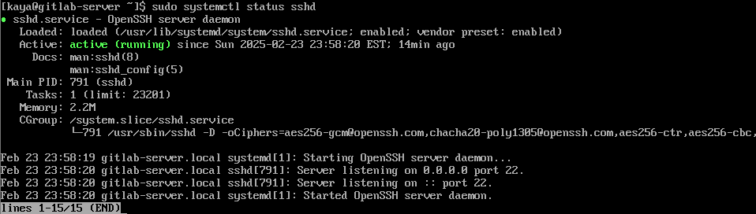

**Узнаю адрес машины для подключения по SSH**
```bash
ip addr
```
(дальше все с подключение по SSH)


**Настраиваю статический IP-адрес**
 
Проверяю, какой используется сетевой менеджер. 
Должен быть один из этих:
* NetworkManager
* systemd-networkd
* networking
 
Проверяю первый:
```bash
systemctl is-active NetworkManager
```

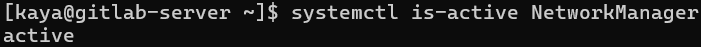
Отлично, иду дальше

Узнаю текущие настройки сети, в основном меня интересует имя сетевого интерфейса:
```bash
nmcli connection show
```

Узнаю, какой шлюз (gateway) у моей сети:
```bash
ip route show
```
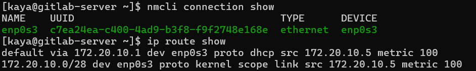
 
Задаю статический IP (беру уже выданный IP, чтобы подключение не сбросилось, просто делаю его статическим):
```bash
sudo nmcli con modify enp0s3 ipv4.method manual ipv4.addresses 172.20.10.5/28 ipv4.gateway 172.20.10.1 ipv4.dns 8.8.8.8
```

Применяю изменения:
```bash
sudo nmcli con up enp0s3
```

Проверяю, что все ок (теперь ip route show выдает static, а не dhcp):
```bash
ip route show
```
 
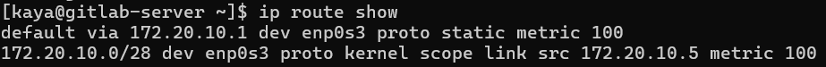
 
И выполняю три команды, чтобы проверить:
* связь с шлюзом / `ping -c 4 172.20.10.1`
* доступность интернета /  `ping -c 4 8.8.8.8`
* работает ли DNS / `ping -c 4 google.com`
 
Все ок:
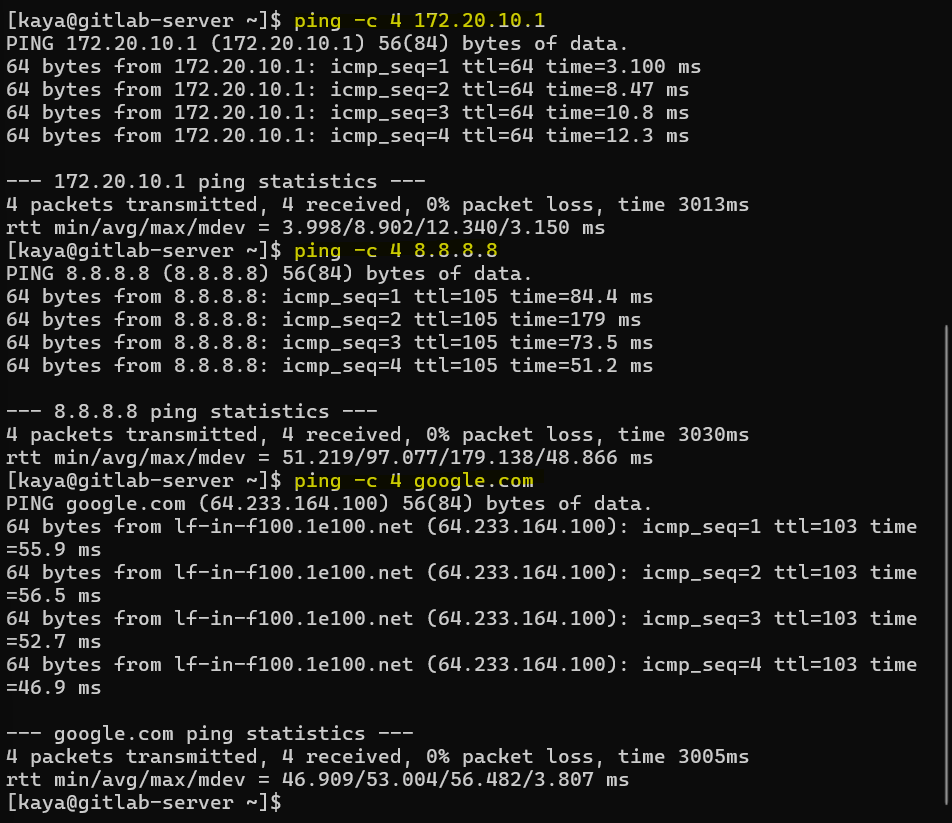
 

**Настройка хостнейма** 
> На альме почему-то не задалось нормально имя на обоих серверах. при установке ОС я указывала имена, но все равно прописан localhost.
> На Дебиан все задалось ок.
> Итак, чтобы сменить имя сервера я сделаю две действия:
> 1. Изменить системное имя хоста через `hostnamectl` (изменит статическое имя хоста, что хранится в файле `/etc/hostname`)
> 2. Настроить `/etc/hosts` для локального разрешения имен
 
Было:
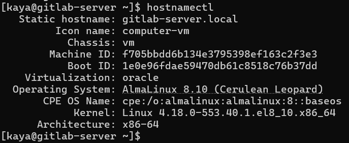

Меняю системное имя хоста:
```bash
sudo hostnamectl set-hostname gitlab-server.lan
```
Результат:
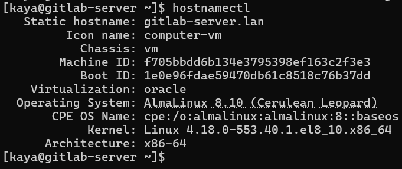
> Кстати, эта команда без судо на альмалинукс предложит выбрать пользователя, а на дебиан откажется выполняться:
> 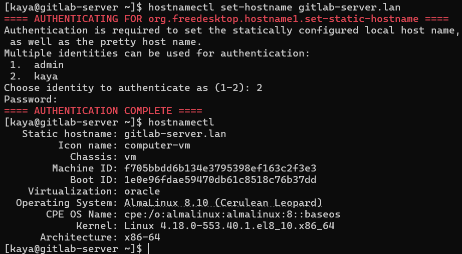
> 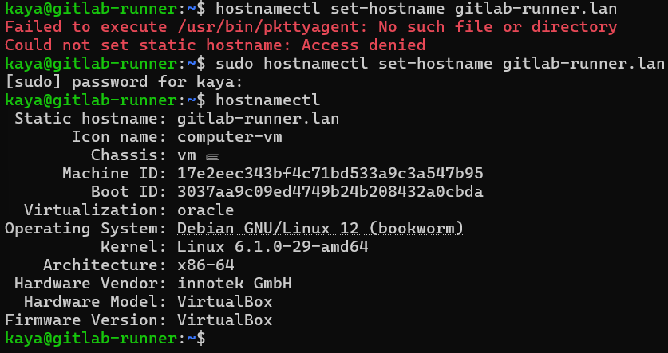

Настраиваю `/etc/hosts`.
> В ходе решения задания я узнала, что в альмалинукс установщик обычно не добавляет имя хоста в /etc/hosts автоматически, даже если я указываю для него имя при установке.
> Поэтому в RHEL-системах при задании имени хоста потом в любом случае необходимо будет редактировать `/etc/hosts`. А вот дебиан сам добавляет запись в `/etc/hosts`.
 
Смотрю, как сейчас заполнен файл:
```bash
cat /etc/hosts
```
 
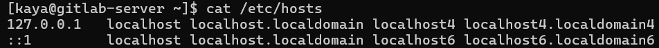

И добавляю строчку:
```bash
echo "172.20.10.5 gitlab-server gitlab-server.lan" | sudo tee -a /etc/hosts
```
> Узнала, что просто заменить запись с `localhost` нельзя, т.к. `localhost` нужен для работы сервисов. И его удаление может привести к проблемам с сетью и производительностью. 
> Например, MySQL/MariaDB, Postfix, systemd-юнитам нужно обращаться к `localhost`.
> Ну и собственно, мы же настраиваем сетевое взаимодействие. И если просто оставить `127.0.0.1` и прописать другое имя хоста, то другие компьютеры не смогут найти `gitlab-server.lan`, потому что у них `127.0.0.1` — это их собственный `localhost`. И здесь хорошо, что я настроила статический IP, иначе бы была путаница.


### 1.2. Настройка Docker-регистри (almalinux)
**Имя сервера:** `docker-registry.lan`
 
**Разметка диска:**
Основной диск: `/dev/sda`, 50 ГБ
- `/dev/sda1`: 524 МБ, `/boot`
- `/dev/sda2`: 49.5 ГБ, LVM:
  - `almalinux_vbox-root`: 16.7 ГБ, `/`
  - `almalinux_vbox-swap`: 2.8 ГБ, SWAP
  - `almalinux_vbox-var`: 30 ГБ, `/var`
  
**Тип подключения к сети:** Bridge
 
**После установки создаю пользователя, чтобы не сидеть под рутом:**
```bash
sudo adduser kaya
sudo passwd kaya
(дважды ввожу пароль)
sudo usermod -aG wheel kaya 
su - kaya 
sudo whoami 
```

**Проверяю, что SSH стоит (на Альме, как и на Центос должен стоять по умолчанию):**
```bash
sudo systemctl status sshd
```
Стоит:


**Узнаю адрес машины для подключения по SSH**
```bash
ip addr
```
(дальше все по SSH)

**Настраиваю статический IP-адрес**
 
 Также сперва проверяю, какой стоит сетевой менеджер (тот же, конечно же):
 ```bash
systemctl is-active NetworkManager
```
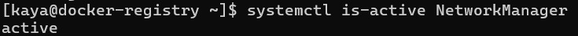

Узнаю текущие настройки сети:
```bash
nmcli connection show
```

Я думала, что шлюз могу не узнавать, т.к. я в той же сети. Но с другой стороны, мало ли что пошло не так (в дебиан вот воказалось важным проверить шлюз, так как там была ненужная запись)
Проверка шлюза: 
```bash
ip route show
```

Задаю статический IP:
```bash
sudo nmcli con modify enp0s3 ipv4.method manual ipv4.addresses 172.20.10.2/28 ipv4.gateway 172.20.10.1 ipv4.dns 8.8.8.8
```

Применяю изменения:
```bash
sudo nmcli con up enp0s3
```

Также проверяю, что все ок:
```bash
ip route show
ping -c 4 172.20.10.1
ping -c 4 8.8.8.8
ping -c 4 google.com
```
 
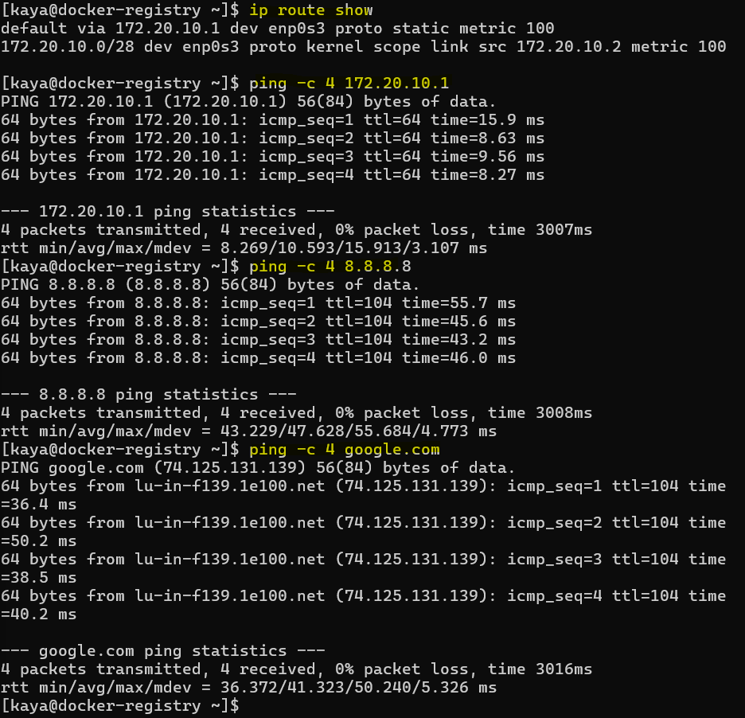
 

**Настройка хостнейма:**
 
Было:
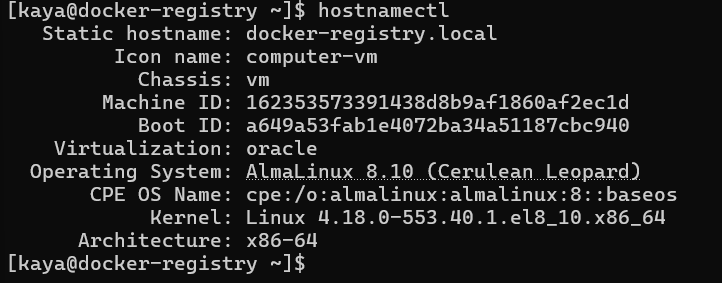

Меняю системное имя хоста:
```bash
sudo hostnamectl set-hostname docker-registry.lan
```
Результат:
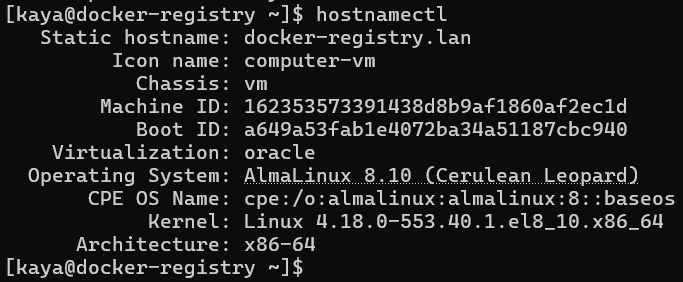
 
Настраиваю `/etc/hosts`:
 
Смотрю, как сейчас заполнен файл:
```bash
cat /etc/hosts
```
 
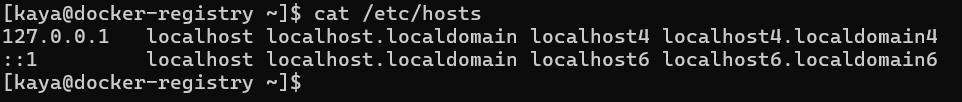

И добавляю строчку:
```bash
echo "172.20.10.2 docker-registry docker-registry.lan" | sudo tee -a /etc/hosts
```
 
Результат:
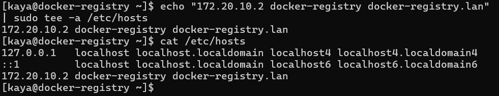

 
### 1.3. Настройка GitLab Runner (debian)
**Имя сервера:** gitlab-runner.lan
 
**Разметка диска:**
Основной диск: `/dev/sda`, 50 ГБ
- `/dev/sda1`: 524 МБ, `/boot`
- `/dev/sda2`: 49.5 ГБ, LVM:
  - `vgdebian-vgswap`: 2.8 ГБ, SWAP
  - `vgdebian-lvroot`: 46.7 ГБ, `/`

**Тип подключения к сети:** Bridge

**При установке ОС уже создала пользователя, добавляю его в sudo:**
```bash
su -    
usermod -aG sudo kaya
exit  
id kaya     
newgrp sudo
```
**Проверяю, что SSH не установлен (на дебиан SSH по умолчанию не стоит):**
```bash
sudo systemctl status ssh
```

**Обновляю систему и устанавливаю OpenSSH Server:**
```bash
sudo apt update && sudo apt upgrade -y
sudo apt install openssh-server -y
sudo systemctl status ssh
```

**Узнаю IP для дальнейшего подключения**
```bash
ip addr
```
(дальше все тоже по SSH)

**Настраиваю статический IP:**
 
Также, узнаю, какой менеджер сети используется:
```bash
systemctl is-active NetworkManager
```
Нет:
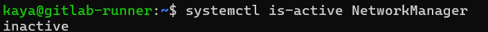

```bash
systemctl is-active systemd-networkd
```
Тоже нет:
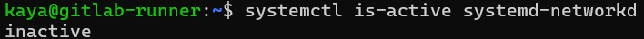
 
```bash
systemctl is-active networking
```
Моя остановочка:
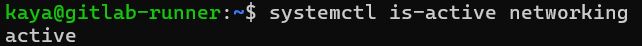
 
Проверяю настройки сети. Здесь вместо nmcli использую команды из iproute2:
```bash
ip a
```
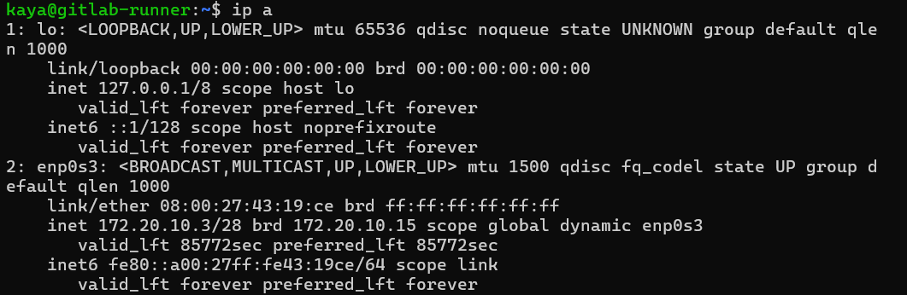
 
Узнаю адрес шлюза:
```bash
ip route show
```
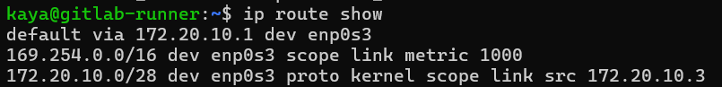
 
Здесь у меня появился вопрос к строчке `169.254.0.0/16 dev enp0s3 scope link metric 1000`. И вот, что я узнала.
> Этот маршрут связан с APIPA (Automatic Private IP Addressing), которое ядро Linux автоматически добавляет, если интерфейс не получает IP-адрес от DHCP-сервера.
> Как добавляется APIPA:
> * Если dhclient работал и не смог получить IP от DHCP-сервера, он может назначить 169.254.x.x.
> * Но даже без dhclient ядро Linux само добавляет этот маршрут, когда интерфейс активен, но не имеет IP.
> Т.е. в большинстве случаев 169.254.0.0/16 добавляется ядром автоматически. И еще я узнала, что 169.254.0.0/16 не мешает настройке статического IP, т.к. эта запись не используется в обычной сетевой работе, если настроен статический IP и правильный шлюз (default via 172.20.10.1).

 
Продолжаю настройку статического IP. Итак, у меня используется networking.service, который читает конфигурацию из `/etc/network/interfaces`. Поэтому открываю конфиг сети:
```bash
sudo nano /etc/network/interfaces
``` 

Вижу:
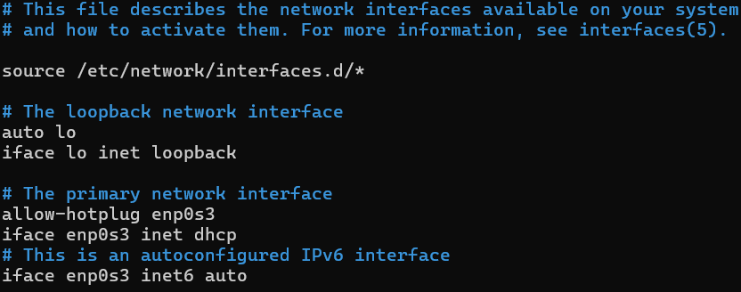
 
Особо интересны две строчки:
* `allow-hotplug enp0s3` - отвечает за то, что сетевой интерфейс активируется только при физическом подключении сети. Т.е. когда система загружается, то интерфейс не поднимается сразу. Для сервера не подходит
* `iface enp0s3 inet dhcp` - предлашает системе получать IP-адрес автоматически через DHCP, что нам нужно убрать при настройке статического IP

Обе строчки комментирую и добавляю:
```bash
auto enp0s3
iface enp0s3 inet static
    address 172.20.10.3
    netmask 255.255.255.240
    gateway 172.20.10.1
    dns-nameservers 8.8.8.8 1.1.1.1
```
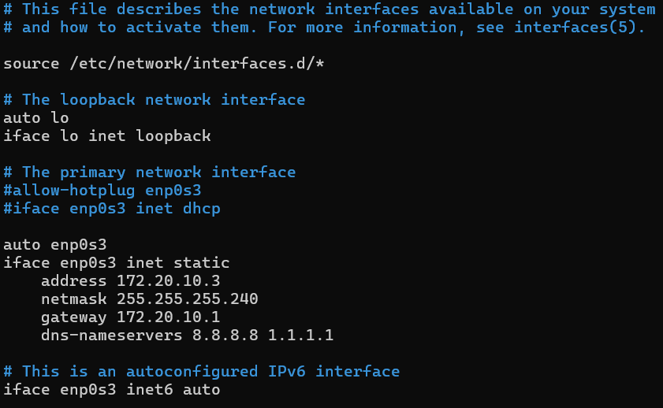
 
Перезапускаю сеть:
```bash
sudo systemctl restart networking
```

> И вот, что интересно, пока я разбиралась со строчкой `169.254.0.0/16 dev enp0s3 scope link metric 1000`, я увидела, что после изменения конфига сети и ее перезапуска
dhclient остается активным. По идее он уже не нужен, потому что он занимается получением IP через DHCP. И чтобы он случайно не запрашивал IP-адрес и не мешал статической конфигурации, его лучше отключить.

Проверяю, работает ли DHCP-клиент:
```bash
ps aux | grep dhclient
```
Он включен:
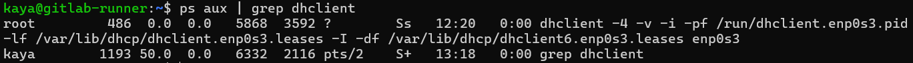

С его отключением повозилась. dhclient постоянно появлялся после рестарта сети. Как я поняла, скорее всего, он был запущен раньше и не завершился. И даже не смотря на попытки его отключить, он мог остаться из-за файла аренды DHCP (lease file).
 
> P.S. Комменты от Юры:
> 1) Это, скорее всего, лишняя работа. Перепроверю при повторном прохождении шага.
> 2) После всех настроек можно отправить сервер в ребут (дважды, по старым тардициям). Если после этого всё корректно работате - настройка закончена.
 
 
Как я его отключила:
* Принудительно останавливаю dhclient:
  ```bash
  sudo dhclient -r enp0s3
  sudo kill $(pidof dhclient)
  ```
 
* Удаляю файлы аренды (lease files), которые могут автоматически перезапускать dhclient:
  ```bash
  sudo rm -f /var/lib/dhcp/dhclient*.leases
  sudo rm -f /run/dhclient*.pid
  ```
 
* Проверяю, что dhclient не поднимается после перезапуска:
  ```bash
  sudo systemctl restart networking
  ps aux | grep dhclient
  ```
  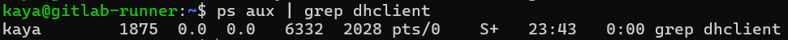

Также проверяю, что все ок:
```bash
ip route
ping -c 4 172.20.10.1
ping -c 4 8.8.8.8
ping -c 4 google.com
```
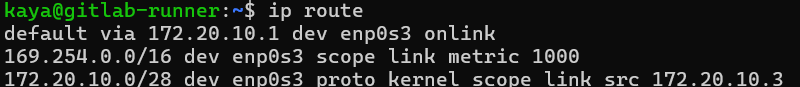

 
Еще раз проверяю, все ли ок (не работает ли dhclient, и работает ли сеть):
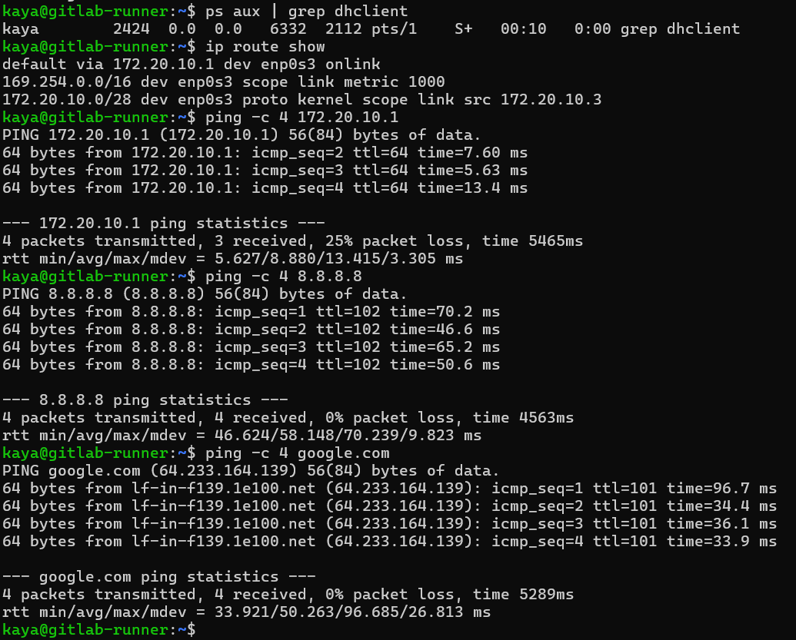
 
**Настройка хостнейма:**
> Примечание: В дебиан имя изначально правильно задалось, но так как я сперва использовала `.local`, вместо `.lan`, то здесь тоже обновляю хостнейм.

```bash
sudo hostnamectl set-hostname gitlab-runner.lan
```
И также обновляю запись в `/etc/hosts` (в отличие от Альмы, здесь я не добавляю новую запись, а меняю уже созданную).

Выполнила
```bash
sudo 
```
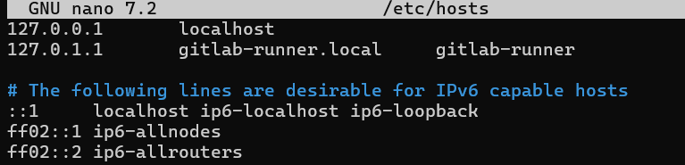
И заменила
```bash
127.0.1.1    gitlab-runner.local gitlab-runner
 ```
  
на 
```bash
172.20.10.5    gitlab-runner.lan gitlab-runner
```
 
> Тут у меня возник вопрос к 127.0.1.1. Как я поняла, В Debian и его производных используется IP-адрес 127.0.1.1 для привязки локального доменного имени к IP 127.0.1.1. Обычно, если gitlab-runner только локальное имя, это нормально. Однако, если это сервер в сети с другим IP, надо заменить IP-адрес на актуальный 
 

### 1.4. Настройка статического адреса на windows
> Этот пункт внесла не сразу. Все работало хорошо, потом не могла подключиться к гитлаб-серверу по SSH - ошибка "connection refused". Крутила, вертела, поняла, что на windows выдался тот же ip. И решила, что чем постоянно менять адрес на виртуалке (который итак уже задан), сделаю статику и на винде.

Открываю Панель управления -> Сеть и Интернет -> Центр управления сетями и общим доступом -> Изменение параметров адаптера (в меню слева).
Нахожу активный адаптер -> ПКМ -> Свойства:
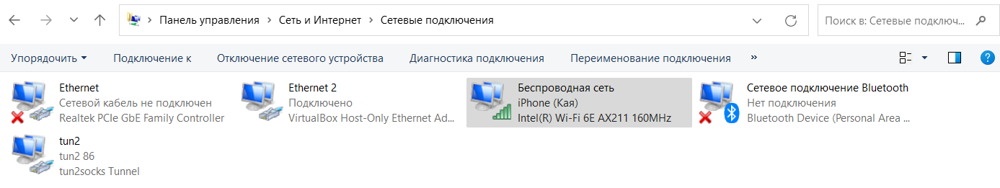

Выбираю IP версии 4 -> Свойства
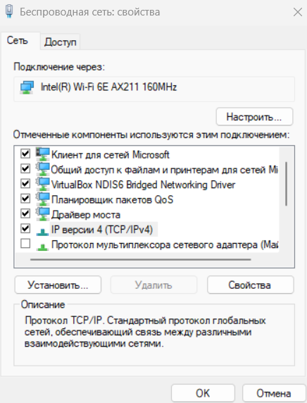

Заполняю:
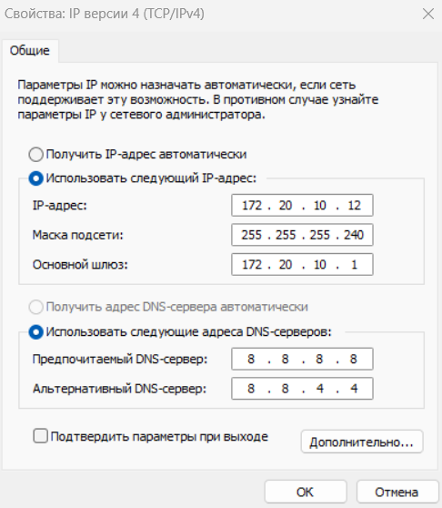

* Открываю повершел и ввожу команду `ipconfig /all`, там нахожу заголовок "Адаптер беспроводной локальной сети Беспроводная сеть:", оттуда узнаю, как заполнить **маску подсети**, **основной шлюз** и **DNS-серверы**
* Чтобы узнать, какой мне доступен диапазон адресов, смотрю на маску подсети, т.к она определяет диапазон ip адресов входящих в подсеть. Если раньше я брала выданный адрес и просто его делала статическим, то сейчас надо сменить адрес на другой. Моя маска - **255.255.255.240**, поискала, как с этим работать. В поисках нашла прикольный калькулятор, на котором можно себя проверить: https://infocisco.ru/ip_calculator.php. 
* В общем из 14 доступных адресов (чуть меньше, т.к. уже 3 под ВМ отдала, выбрала свободный)
* Перезапускаю сетевой адаптер и делаю `ipconfig /all` в повершелл, чтобы убедиться, что все ок
* Да, потом для выхода "в свет" скидываю на автоматическую выдачу ip


### 1.5. Настройка времени на серверах с АльмаЛинукс
 
Раньше сталкивалась с этим на центос, сейчас на альме: после установки время в системе некорректное, хотя я указываю часовой пояс.
 
Проверим время в системе:
```bash
timedatectl status
```
 
В выводе снова `NTP synchronized: no` говорит, что служба синхронизации времени не работает.
 
Проверим статус службы синхронизации времени:
```bash
sudo systemctl status chronyd
```
 
Судя по статусу, chronyd работает, но синхронизации времени все равно нет. У меня снова дело в том, что NTP-сервера недоступны. 
 
Открываем конфиг:
```bash
sudo nano /etc/chrony.conf
```
 
Добавим туда следующие сервера:
```bash
server 0.pool.ntp.org iburst
server 1.pool.ntp.org iburst
server 2.pool.ntp.org iburst
server 3.pool.ntp.org iburst
```
 
Сохраним изменения и перезапустим Chrony:
```bash
sudo systemctl restart chronyd
```
 
После настройки серверов принудительно синхронизируем время:
```bash
sudo chronyc -a makestep
```
 
1.1.7. Снова проверим состояние времени:
```bash
timedatectl status
```
 
Ура, все ок. В отличие от центос на альме сразу все обновляется (центос было нужно немного времени)
 
## Этап 2. Сеть: планирую локальную сеть, где все хосты общаются друг с другом по именам.
Теперь нужно настроить сеть так, чтобы все машины могли обращаться друг к другу по именам. Для этого можно использовать:
* Вариант 1: Статическую настройку DNS через `/etc/hosts`:
* Вариант 2: Локальный DNS-сервер (например, `dnsmasq`), который будет разрешать имена в локальной сети.

> Я так понимаю, что в проде важно найти наиболее гармоничное решение - не усложнять там, где не надо, и не использовать слишком простые инструменты там, где неумеснто. 
> Для учебы хватило бы настроить `/etc/hosts`, но чтобы попрактиковаться побольше решила попробовать настроить `dnsmasq`.
> Также для истории оставлю инфо, как  настроить через `/etc/hosts`.
>  
> Все просто. Надо добавить необходимые IP-адреса и имена серверов в `/etc/hosts`:
>  ```bash
>  echo -e "172.20.10.5 gitlab-server.local gitlab-server\n172.20.10.3 docker-registry.local docker-registry\n172.20.10.2 gitlab-runner.local gitlab-runner" | sudo tee -a /etc/hosts
>  ```
> Где:
> * `echo` - выводит строку в консоль (эту строку через пайп передадим дальше)
> * `-e` включает интерпретацию \n как символа новой строки
> * `"172.20.10.5 gitlab-server.local gitlab-server\n172.20.10.3 docker-registry.local docker-registry\n172.20.10.2 gitlab-runner.local gitlab-runner"` - строки, которые мы добавляем в `/etc/hosts`, разделенные `/n`
>   * разбор на примере "172.20.10.5 gitlab-server.local gitlab-server":
>     * `172.20.10.5` - ip-адрес сервера
>     * `gitlab-server.local` - fqdn, полное доменное имя сервера
>     * `gitlab-server` - алиас, чтобы обращаться к серверу не используя полное имя
> * `|` (пайп) передаёт вывод echo в следующую команду
> *  `sudo tee -a /etc/hosts` - записывает входные данные в файл, аргумент `-a` отвечает за то, что текст добавляется в конец файла, без перезаписи +  по умолчанию `tee` также выводит нам саму строку в консоль


# 2.1. Настройка DNS-сервера 
Я решила для настройки взять наименее загруженный сервер и поэтому установила dnsmasq на сервере с гитлаб-раннером. Хотя в проде полагаю под это дело нужен отдельный сервер-обслуга, где будут такие штуки.

## 2.1.1. Установка и проверка dnsmasq
Устанавливаю dnsmasq
```bash
sudo apt update && sudo apt install -y dnsmasq
```

Перезапускаю, добавляю в автозагрузку и проверяю статус и включаю сервис
```bash
sudo systemctl restart dnsmasq
sudo systemctl enable dnsmasq
sudo systemctl status dnsmasq
```
> Просто для памятки. Стало интересно, зачем после установки перезапускать.
> Узнала, что после установки dnsmasq по умолчанию не активен, а перезапуск запускает службу.

## 2.1.2. Настройка конфигурации dnsmasq
Открываю конфиг:
```bash
sudo nano /etc/dnsmasq.conf
```

Добавляю запись:
```
# Определяю локальные имена
address=/gitlab-server.lan/172.20.10.5
address=/docker-registry.lan/172.20.10.2
address=/gitlab-runner.lan/172.20.10.3

# Определяю локальный домен
local=/lan/
domain=lan

# Указываю публичные DNS-сервера. Это разрешит dnsmasq пересылать запросы, которые он не может разрешить локально, на указанные внешние DNS-серверы.
# Т.е. без server=8.8.8.8 и server=8.8.4.4 у нас локально все будет работать, но связи с внешней сетью на gitlab-runner не будет (проверено)
server=8.8.8.8
server=8.8.4.4
```

Сохраняю, перезапускаю:
```bash
sudo systemctl restart dnsmasq
```

## 2.1.3. Настройка DNS-клиента
> Указываю dnsmasq как основной DNS-сервер

 
На всех(!!!) серверах (в т.ч. на wsl) открываю файл `/etc/resolv.conf`, который используется для настройки параметров DNS:
 
```bash
sudo nano /etc/resolv.conf
```
 
Комментирую текущие строки (они созданы системными службами, пусть останутся на случай, если потом понадобится вернуться к прежним настройкам) и добавляю:
 
```bash
# Settings for dnsmasq

# Добавляет суффикс .lan при поиске хостов без полного доменного имени
search lan            

# Локальный днс - адрес сервера с dnsmasq
nameserver 172.20.10.3   

# Google DNS на случай отказа локального и дополнительный резервный DNS
nameserver 8.8.8.8       
nameserver 8.8.4.4       
```

 
~~Блокирую файл от перезаписи. На всех серверах выполняю команду ниже, это нужно, потому что некоторые сетевые менеджеры (NetworkManager, systemd-resolved) могут перезаписывать `/etc/resolv.conf `при перезагрузке.~~
~~`sudo chattr +i /etc/resolv.conf`~~
~~P.S. Если надо будет потом вернуть возможность изменений, выполняем `sudo chattr -i /etc/resolv.conf`~~
 
> Коммент от Юры:
> Костыль. Если твои настройки кто-то переписывает (приложение X), то корректно менять параметры в этом приложение, а не запрещать ему запись. 
> В части файлов конфигураций это явно указано.
>  
> Проверю при повторном прохождении шага, будет ли перезапись.
  
 
## 2.1.4. Проверка работы
Дальше на всех трех серверах делаю проверку с помощью следующих двух команд.

### 2.1.4.1. Проверка резолвинга с помощью nslookup
```bash
nslookup gitlab-server.lan 172.20.10.3
```
> Памятка: nslookup —  утилита для запроса DNS-записей.
> Здесь два аргумента:
> * gitlab-server.lan – имя, которое я хочу проверить.
> * 172.20.10.3 – IP-адрес сервера, где работает dnsmasq.
Ожидаю, что сервер ответит, привязав gitlab-server.lan к 172.20.10.5. Если ответ приходит, значит dnsmasq правильно обрабатывает запросы.

### 2.1.4.2. Проверка с помощью dig
```bash
dig gitlab-server.lan
```
> **Памятка:**
> **dig** – это мощная утилита для проверки DNS-запросов. В отличие от nslookup, она даёт детальный вывод, включая:
> * QUESTION SECTION – что именно запрашивается.
> * ANSWER SECTION – IP-адреса, полученные в ответ.
> * AUTHORITY SECTION (если есть) – информация о сервере, который дал ответ.
> 
> **Разбор аргументов:**
> * gitlab-server.lan – доменное имя, которое мы проверяем.
> Без явного указания DNS-сервера dig использует тот, что прописан в /etc/resolv.conf.
> Это позволяет проверить, действительно ли система использует dnsmasq по умолчанию.

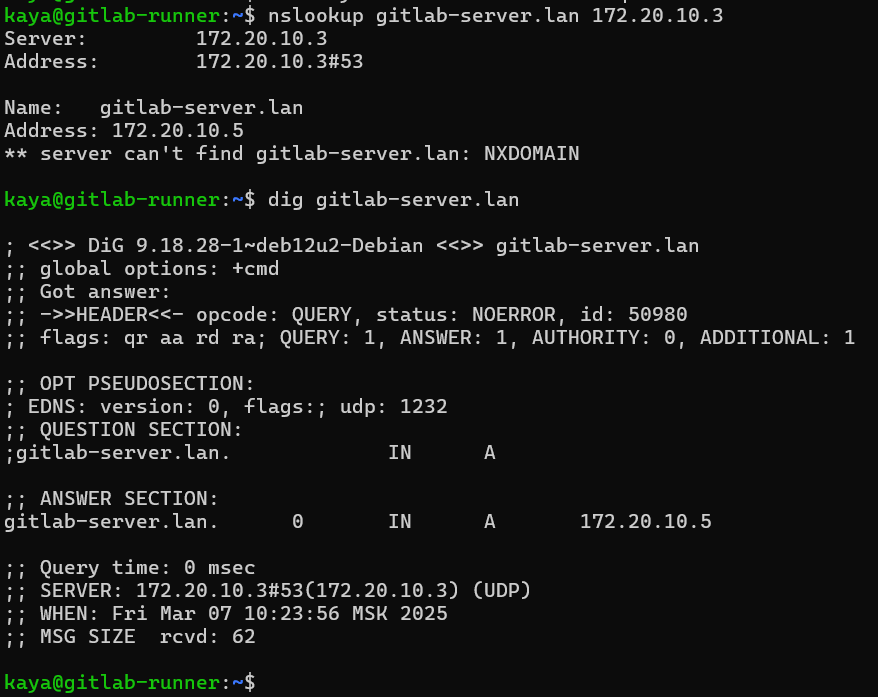
В `ANSWER SECTION` вижу:
...
`gitlab-server.lan.  0  IN  A  172.20.10.5`
Значит, всё работает – DNS настроен правильно и разрешает локальные имена.


## Этап 3. Настроить все вручную
### 3.1. Настройка gitlab-server
#### 3.1.1. Установка докер:
 
```bash
sudo dnf -y install dnf-plugins-core
sudo dnf config-manager --add-repo https://download.docker.com/linux/centos/docker-ce.repo
sudo dnf install docker-ce docker-ce-cli containerd.io docker-buildx-plugin docker-compose-plugin -y
sudo systemctl enable --now docker
sudo docker run hello-world
```

Все ок:
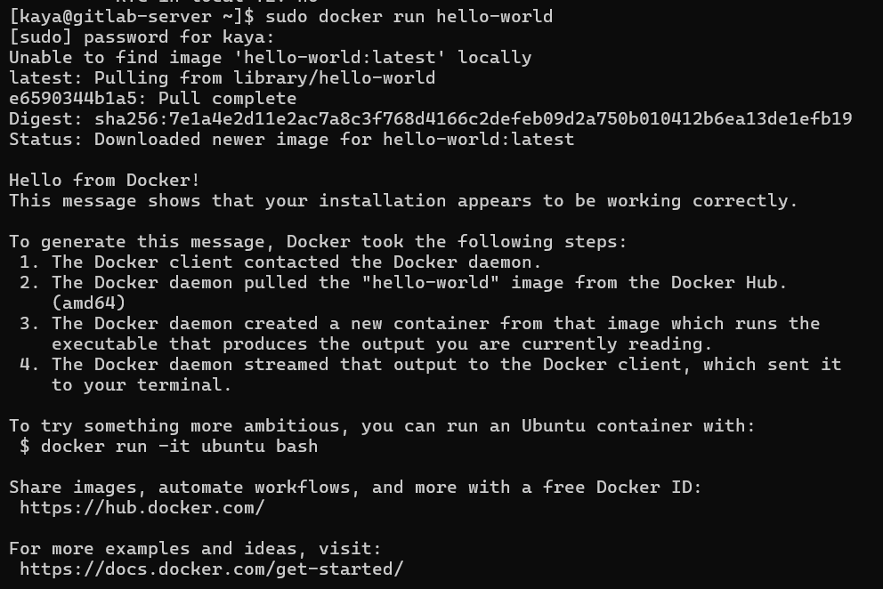
 

#### 3.1.2. Установка MTA
 
MTA (Mail Transfer Agent) — это программное обеспечение, которое занимается отправкой, пересылкой и получением электронной почты через Интернет. Это основной компонент системы передачи электронной почты.

В оф. инструкции пишут, что нужен MTA (Postfix), т.к. GitLab нужно уметь отправлять почтовые уведомления. Локально можно без него, но по идее в продакшене MTA обязателен.

Установка
```bash
sudo dnf install -y postfix
```
 
Настройка
```bash
sudo nano /etc/postfix/main.cf
```
 
Найти и заполнить/раскомментировать значения:
```bash
myhostname = gitlab-server.lan
inet_interfaces = all
mydestination = gitlab-server.lan, localhost.localdomain, localhost
```
 
> **Пояснение строк:**
> * myhostname = gitlab-server.lan - устанавливает имя сервера, которое Postfix использует для идентификации себя, чтобы сервер знал своё имя и мог принимать почту, адресованную ему. Здесь задаю конкретное имя (gitlab-server.lan), потому что именно так ты обращаюсь к серверу через DNS (dnsmasq). Устанавливаю явно, чтобы не полагаться на автоматическое определение, которое может сработать неправильно.
> * inet_interfaces = all - указывает, на каких интерфейсах сервер принимает почту. all — означает, что Postfix будет слушать все сетевые интерфейсы (локальные и внешние).
> * mydestination = gitlab-server.lan, localhost.localdomain, localhost - определяет, какие домены считаются локальными для Postfix. Если сообщение адресовано к одному из доменов в этом списке, Postfix не пересылает его дальше, а обрабатывает локально.

Запускаю и добавляю Postfix в автозагрузку:
```bash
sudo systemctl enable postfix
sudo systemctl start postfix
```
  
#### 3.1.3. Проверка Postfix (тестовое письмо)
 
Тестирую работу Postfix с помощью отправки письма.
```bash
echo "Тестовое письмо от Postfix" | sendmail -v kaya@localhost
```
 
Это отправит письмо на пользователя kaya на том же сервере.

Чтобы посмотреть письмо, сперва установлю почтовый клиент:
```bash
sudo dnf install -y mailx
```
Затем ввожу команду для просмотра письма:
```bash
mail
```
 
Чтобы просмотреть само письмо, ввожу его порядковый номер, в данном случае:
```bash
1
```
 
Все работает:
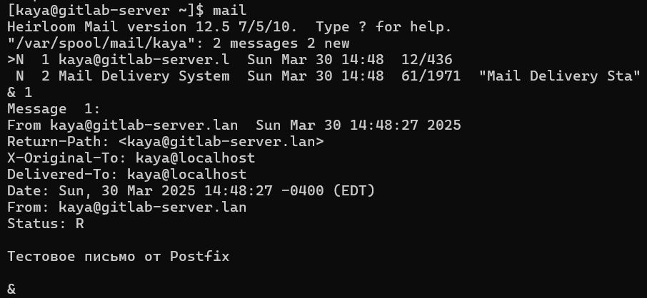

Чтобы выйти из режима mail, нажимаю
```bash
q
``` 
 
#### 3.1.4. Установка gitlab server в докер контейнере
 
> Памятка:
> В оф. инструкции предлагают настроить порт 22 для SSH, если GitLab устанавливается на сервер напрямую.
> В моём случае это не требуется, так как GitLab запускается в Docker-контейнере.
> Чтобы избежать конфликта с обычным SSH-доступом к серверу (который тоже использует порт 22), я пробрасываю порт:
внутри контейнера остаётся 22, а снаружи используется, например, 2222 (--publish 2222:22).
> 
> Это значит, что при клонировании проектов по SSH будет использоваться порт 2222:
> git clone ssh://git@gitlab-server.lan:2222/user/project.git
 

Далее нам нужно создать каталог для файлов конфигурации, журналов и файлов данных. В оф. инструкции пишут, что каталог может находиться в домашнем каталоге пользователя (например ~/gitlab-docker, ), или в каталоге типа /srv/gitlab.

Создаем каталог:
```bash
sudo mkdir -p /srv/gitlab
```
 
Еще пишут"Если вы запускаете Docker от имени пользователя, отличного от root, предоставьте пользователю соответствующие разрешения для нового каталога.". Я запускаю от sudo, так что иду дальше.

Настроим новую переменную среды $GITLAB_HOME, которая задает путь к созданному каталогу:
```bash
export GITLAB_HOME=/srv/gitlab
```
 
> Так переменная будет работать в текущем терминале, но потеряется в новой терминальной сессии
 
Чтобы не задавать `GITLAB_HOME` каждый раз вручную, добавим переменную в профиль оболочки — так она будет доступна во всех будущих сессиях терминала:
```bash
echo 'export GITLAB_HOME=/srv/gitlab' >> ~/.bashrc
source ~/.bashrc
```
 
Создаём три директории, которые будут монтироваться в контейнер GitLab:
```bash
sudo mkdir -p $GITLAB_HOME/config $GITLAB_HOME/logs $GITLAB_HOME/data
```
 
Все берем из оф. инструкции, где описано, какие тома на хосте нужны для того, чтобы GitLab хранил постоянные данные (конфиги, данные и логи):
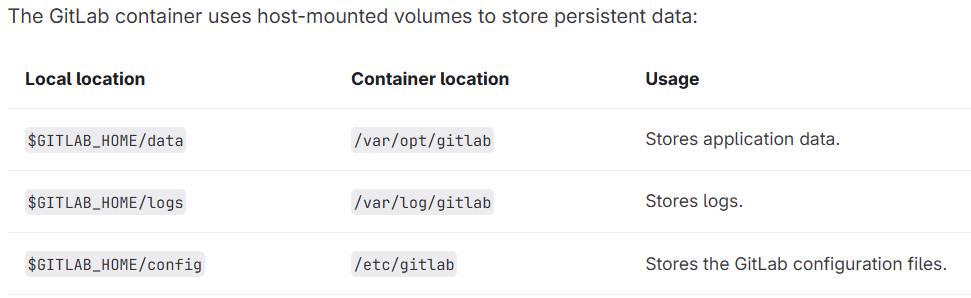
 
Выбираю редакцию и версию GitLab
> Памятка: 
> Официальная инструкция рекомендует не использовать тег latest, а указывать конкретную стабильную версию GitLab, особенно в продакшене.
> 
> В GitLab есть две редакции:
> * gitlab/gitlab-ce — Community Edition (CE), бесплатная (я использую её)
> gitlab/gitlab-ee — Enterprise Edition (EE), нужна лицензия, но можно протестировать.
> 
> По условиям задачи я использую версию GitLab на одну меньше актуальной. Я нашла https://about.gitlab.com/releases/, где указано, что сейчас стабильная версяи - `17.10`:
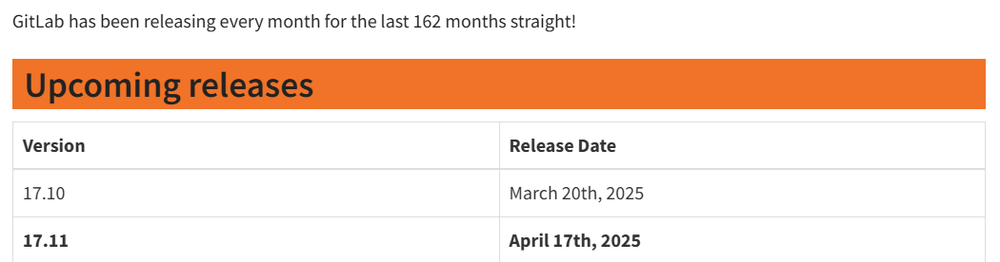
Поэтому я беру `17.9`. На странице с тегами (https://hub.docker.com/r/gitlab/gitlab-ce/tags/) нахожу, что мне нужно `17.9.3-ce.0` и при установке пропишу `gitlab/gitlab-ce:17.9.3-ce.0`

 
Далее выбираем способ запуска. Я выбираю через docker-compose, так как с ним можно управлять конфигурацией GitLab через YAML-файл и в будущем масштабировать, если потребуется. Также это более близко к продакшену, как я понимаю. 
 
Создаю директорию для `docker-compose.yml` и перехожу в нее:
```bash
mkdir /home/kaya/gitlab-docker
cd /home/kaya/gitlab-docker
```
 
Там создаю `docker-compose.yml` и наполняю:
```bash
nano docker-compose.yml
```

Вставляю:
```yaml
version: '3.6'

services:
  gitlab:
    image: gitlab/gitlab-ce:17.9.3-ce.0
    container_name: gitlab
    restart: always
    hostname: 'gitlab-server.lan'
    environment:
      GITLAB_OMNIBUS_CONFIG: |
        external_url 'http://gitlab-server.lan'
        gitlab_rails['gitlab_shell_ssh_port'] = 2222
    ports:
      - '80:80'
      - '443:443'
      - '2222:22'
    volumes:
      - '$GITLAB_HOME/config:/etc/gitlab'
      - '$GITLAB_HOME/logs:/var/log/gitlab'
      - '$GITLAB_HOME/data:/var/opt/gitlab'
    shm_size: '256m'
```
> Пояснение:
> * image - образ на 1 меньше актуального
> * hostname - имя сервера внутри контейнера (соответствует DNS-настройке)
> * external_url - по какому адресу будет открыт GitLab
> * gitlab_shell_ssh_port	- SSH-порт для клонирования репозиториев (будет 2222, т.к. 22 используется для подключения по SSH)
> * ports - проброс портов (веб-интерфейс и SSH), взяла из ппервого примера в документации. В оф. инструкции так же есть второй пример, где используются нестандартные порты (8929 и 2424) и примерный домен (gitlab.example.com). 
Я использую порты 80 и 2222, потому что:
> * volumes - связываю директории на сервере с директориями контейнера
> * $GITLAB_HOME - уже задан ранее как /srv/gitlab
УЛУЧШИТЬ ТЕКСТ

Создаю `.env` в каталоге рядом с `docker-compose.yml`.
> Сначала я этого не сделала, потому что ранее задала переменную GITLAB_HOME через export и добавила её в ~/.bashrc.
Она работала в интерактивной оболочке, но при запуске docker compose с sudo я увидела предупреждение:
 

В общем, sudo не наследует переменные окружения по умолчанию, и docker compose не увидел мою переменную из пользовательской среды.
Ну и как следствие, контейнер поднялся с некорректным монтированием.
Чтобы исправить, создаю `.env`. И вообще это корректно для прода  
 
 ```bash
echo 'GITLAB_HOME=/srv/gitlab' > .env
```
 
Проверяю, что файл создан:
```bash 
cat .env
```
 
В том же каталоге запускаю:
```bash
sudo docker compose up -d
```
 
Готово:

> Памятка: 
> После запуска контейнера Docker Compose автоматически создаёт сеть gitlab-docker_default, внутри которой работает контейнер GitLab. Так как дальше каждый сервис (GitLab, GitLab Runner, Docker Registry будут работать каждый на своей виртуальной машине (аля "сервер"), и контейнеры общаются через внешнюю сеть (по IP или через `dnsmasq`), то сейчас мне никакая доп. настройка Docker-сетей не нужна. 
> Достаточно проброса нужных портов (`80`, `443`, `2222`) и корректной работы DNS. 
>
> А вот если бы контейнеры запускались на одной машине и должны были общаться между собой  внутри Docker — тогда нужно было бы использовать блок `networks:` в `docker-compose.yml`.
> Ну а пока иду дальше.
 
#### 3.1.5. Проверка GitLab-сервера
 
Проверяю статус контейнера:
```bash
sudo docker ps
```
 
Вижу:
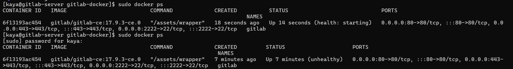
 
Посмотрела логи, увидела, что ошибок нет, еще идет инициализация. Прочитала в интернете, что инициализация может занимать 5-10 минут. Переключилась на другие задачи. Спустя время еще раз чекнула.
Вижу списке контейнер gitlab, и в колонке PORTS — нужные порты (80, 443, 2222), статус healthy:
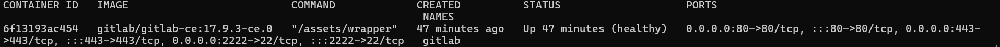
 
Супер иду дальше

Проверяю, открывается ли GitLab в браузере. Открываю GitLab в браузере:
```bash
http://gitlab-server.lan
```
 
Сперва, конечно, ничего не открывается:
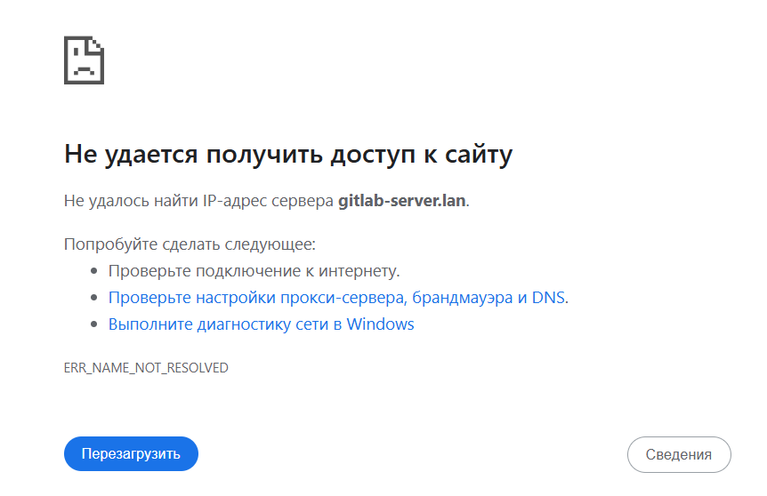
Неудивительно.
 
##### 3.1.5.1. Настройка файла hosts для разрешения имен на хосте с Windows
 
На ноуте не стала настраивать DNS, чтобы не менять системные параметры.  
Вместо этого добавляю имена вручную в файл `hosts`.
1. Пуск → Поиск → Блокнот → ПКМ → Запуск от имени администратора
2. В блокноте открываю путь `C:\Windows\System32\drivers\etc\`
3. Выбираю тип файла "Все файлы"
4. Из появившегося списка выбираю `hosts`
5. Вставляю строки:
172.20.10.3    gitlab-runner.lan
172.20.10.5    gitlab-server.lan
172.20.10.2    docker-registry.lan
6. Сохраняю

Дальше снова пробую, но не могу из-за впн:
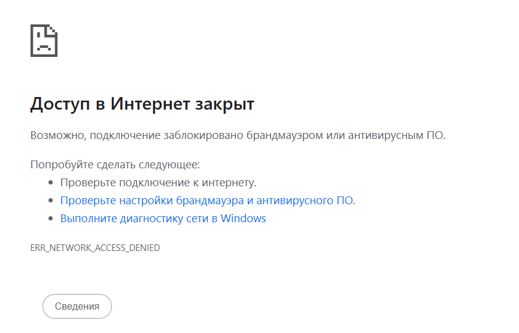

Отключаю впн. Вижу экран приветствия, всё работает: 
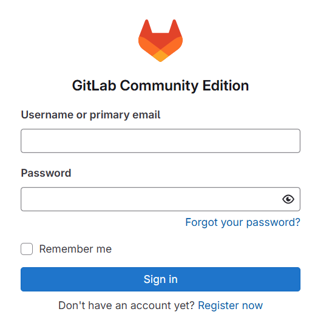
 
Получаю пароль администратора:
```bash
sudo cat /srv/gitlab/config/initial_root_password
```
> Памятка: Пароль действует 24 часа после запуска, о чем нас заботливо предупредили:

 
Захожу в GitLab под пользователем root, ввожу пароль.
Сперва меняю пароль на `strong_very_password`

Далее вижу предупреждение:
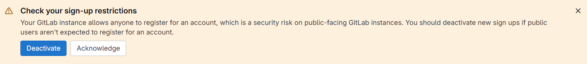
Это значит, что любой пользователь может зарегистрироваться самостоятельно. Так как мой GitLab — локальный и приватный, открытая регистрация не нужна. Жмакаю `Deactivate`, чтобы отключить создание аккаунтов для всех, кроме администратора.
 
Создаю первый проект. Всё работает:
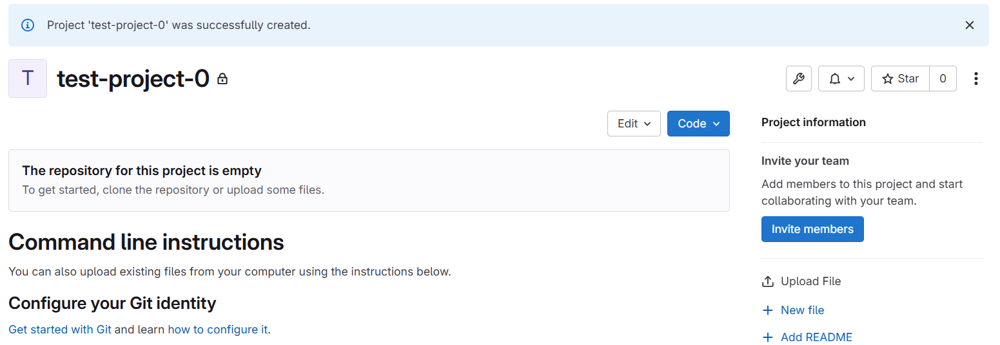
 
Также проверяю, что SSH-URL проекта с портом 2222, а не 22:
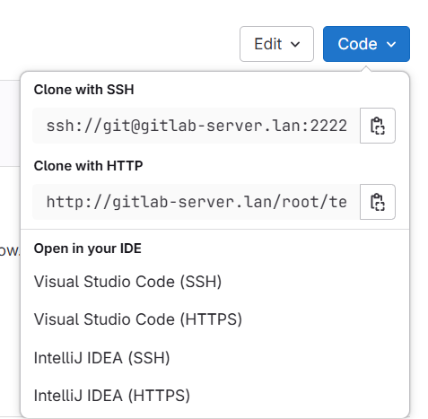
 
> Вижу уведомелние:
> 
> Пока пропущу этот шаг, так как настраиваю инфраструктуру. Вернусь когда буду настраивать раннер

Переходим к серверу с gitlab-runner


 
=======
### 3.2. Настройка gitlab-runner
#### 3.2.1. Установка докер
 
```bash
# Add Docker's official GPG key:
sudo apt-get update
sudo apt-get install ca-certificates curl -y
sudo install -m 0755 -d /etc/apt/keyrings
sudo curl -fsSL https://download.docker.com/linux/debian/gpg -o /etc/apt/keyrings/docker.asc
sudo chmod a+r /etc/apt/keyrings/docker.asc

# Add the repository to Apt sources:
echo \
  "deb [arch=$(dpkg --print-architecture) signed-by=/etc/apt/keyrings/docker.asc] https://download.docker.com/linux/debian \
  $(. /etc/os-release && echo "$VERSION_CODENAME") stable" | \
  sudo tee /etc/apt/sources.list.d/docker.list > /dev/null
sudo apt-get update
```
 
```bash
sudo apt-get install docker-ce docker-ce-cli containerd.io docker-buildx-plugin docker-compose-plugin -y
```
 
```bash
sudo docker run hello-world
```
 
Готово:
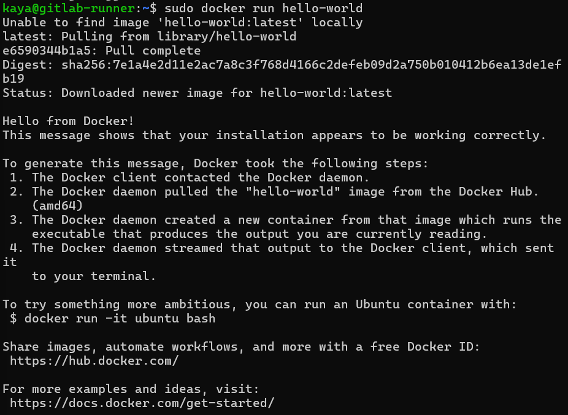

 
#### 3.2.2. Разворачиваем GitLab Runner в Docker 
 
Создаю volume для хранения данных раннера (по желанию, но желательно):
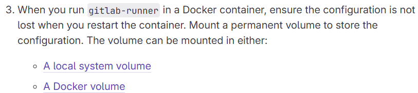
> Я так поняла, на наш выбор: локальный вольюм или докер вольюм. Но вроде как докер вольюм предпочтительнее: управляется докером, изолированный, и всегда можно получить доступ к файлам с помощью команды `docker volume inspect gitlab-runner-config`.
 
Создаю: 
```bash
sudo docker volume create gitlab-runner-config
```
Теперь конфиг раннера сохранится после перезапуска или удаления контейнера.
 
 Запускаю контейнер GitLab Runner:
```bash
sudo docker run -d --name gitlab-runner --restart always \
  -v /var/run/docker.sock:/var/run/docker.sock \
  -v gitlab-runner-config:/etc/gitlab-runner \
  --add-host gitlab-server.lan:172.20.10.5 \
  gitlab/gitlab-runner:latest
```
> Разбор:
> * `--restart always` - чтобы контейнер запускался при перезагрузке
> * `-v /var/run/docker.sock` - монтирую докеровский сокет хоста внутрь контейнера, чтобы раннер мог работать с `executor = docker`.
  > Т.к. раннер использует докер для запуска джоб, то из-за того, что раннер сам работает внутри контейнера, то ему нужен способ общаться с докером на хосте. Вот для этого монтирую. И тогда раннер сможет:
  >  - создавать новые контейнеры (`image: ...`)
  > - запускать `docker build`, `docker run`, `docker push` и т.д.
> * `-v gitlab-runner-config` - сохраняет конфиг раннера
> * `--add-host gitlab-server.lan:172.20.10.5`  - как я поняла, необязательно, но желательно. эта строчка добавляет запись в `/etc/hosts` внутри контейнера раннера и нужна, чтобы раннер мог зарегистрироваться в гитлабе по его урлу вне заивисимости от работы днс
> * `gitlab/gitlab-runner:latest` - оф. образ раннера

Теперь раннер как сервис готов работать, но ещё не знает, с каким гитлаб-сервером. Поэтому пора его зарегать. 

Регистрирую раннер.
 
> Выбираю **Instance Runner**, чтобы он был доступен для всех проектов в GitLab и не был привязан к какому-то конкретному репозиторию.
 
1. Перехожу в интерфейс гитлаба: http://gitlab-server.lan/admin/runners
2. Жму `New Instance Runner`
Захожу в проект → Settings → CI/CD → Runners 
Заполняю:
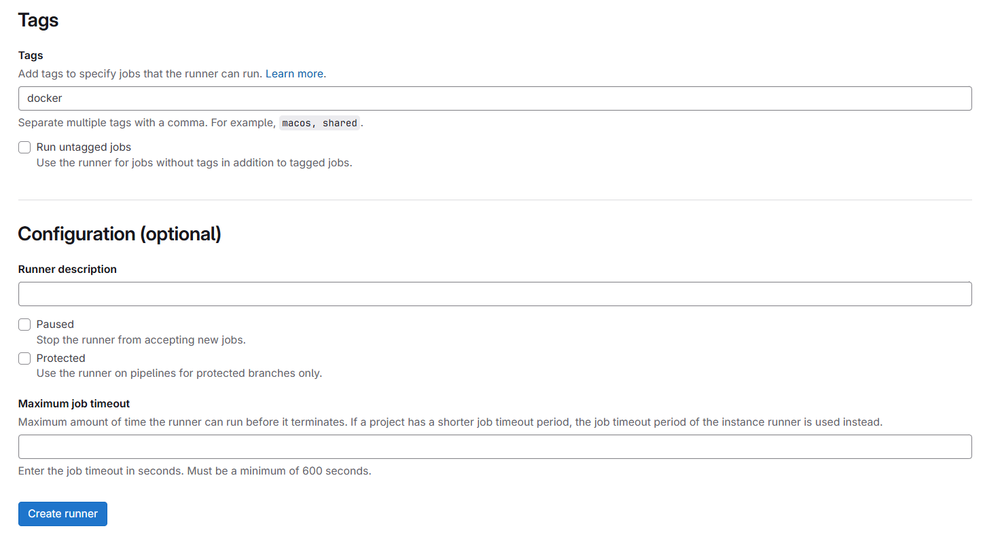 
Затем
```bash
sudo docker exec -it gitlab-runner gitlab-runner register \
  --non-interactive \
  --url "http://gitlab-server.lan" \
  --registration-token "glrt-t1_VWnV13e3YxKokyKY9N4K" \
  --executor "docker" \
  --description "docker-runner" \
  --tag-list "docker" \
  --run-untagged="true" \
  --locked="false" \
  --docker-image "alpine:latest"
```
 
> Снова пояснения, пусть будут:
> * `--url` - урл гитлаб-сервера, к которому подключается раннер
> * `--registration-token` - токен для аутентификации при подключении к гитлаб-серверу
> * `--description` - описание раннера
> * `--tag-list` - теги раннера
> * `--locked` - определяет, будет ли раннер заблокирован для использования только одним проектом (false — доступен всем проектам). не обязателен для регистрации инстанс раннера, т.к. по умолчанию раннеры не заблокированы и доступны для всех проектов. но, наверное, может быть удобным при большом количестве раннеров, чтобы в конфиге было проще идентифицировать раннеры
> * `--run-untagged` - если включено, раннер может выполнять задания без тегов
> * `--executor` - определяет тип окружения для выполнения задач (shell, docker)

Готово:
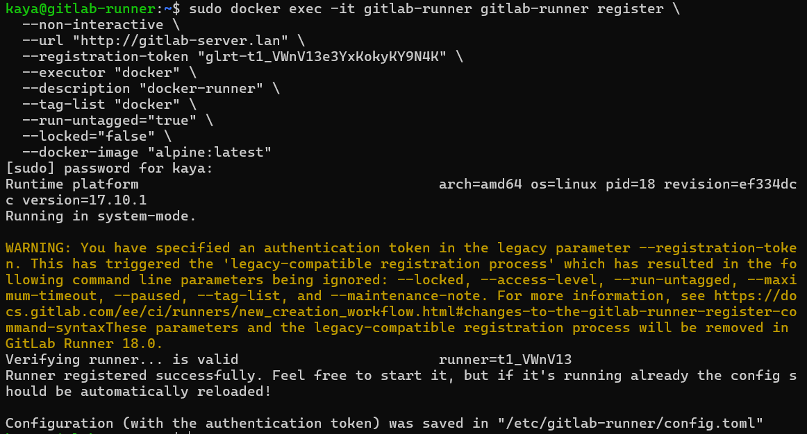

Т.к. я создала раннер с `--executor "docker"`, так что для каждой CI job запускается отдельный докер-контейнер. У таких контейнеров своя сеть по умочанию, и чтобы команды могли обращаться к гитлаб-серверу по имени, то нужно прописать резолвинг в конфиге раннера. Поэтому сразу после регистрации раннера открываю его конфиг и добавляю `extra hosts`.  
 
Смотрю, где именно лежит конфиг:
```bash
docker volume inspect gitlab-runner-config
```
 
Открываю его:
```bash
sudo nano /var/lib/docker/volumes/gitlab-runner-config/_data/config.toml
```
 
После `[runners.docker]` добавляю строку:
```bash
extra_hosts = ["gitlab-server.lan:172.20.10.5"]
```
 
Сохраняю файл и перезапускаю контейнер с раннером:
```bash
docker restart gitlab-runner
```
 
В интерфейсе гитлаба нас поздравляют:
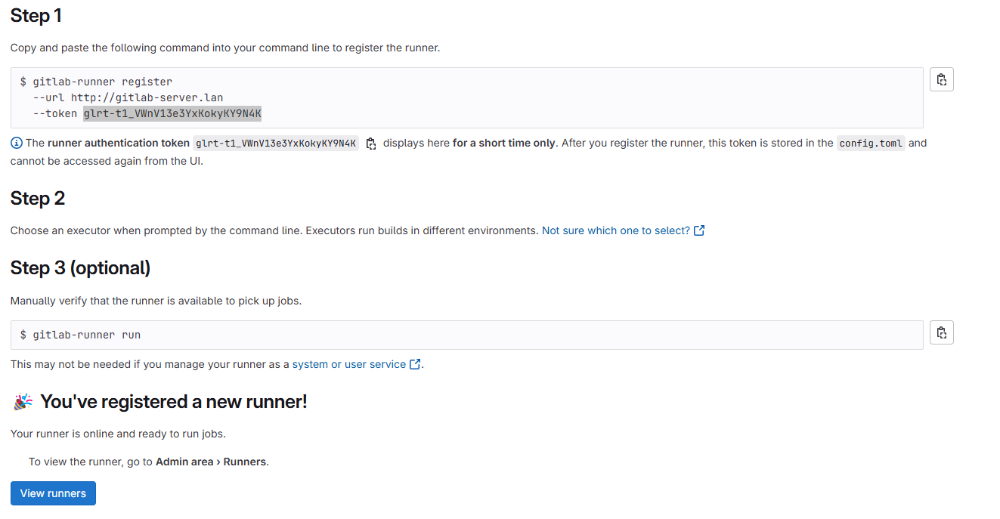

В списке раннеров наш готов:
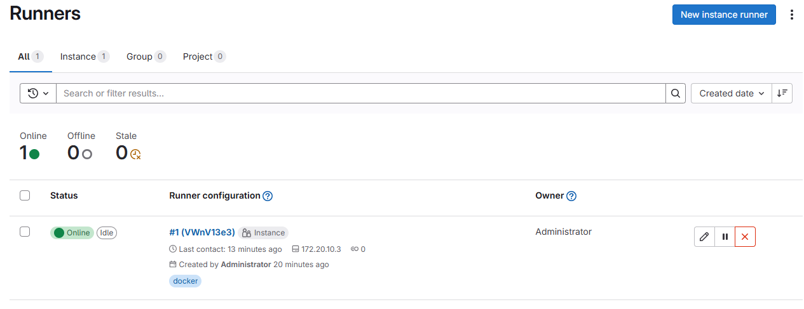
 
И в самом проекте проверяю, что в настройках разрешены инстанс раннеры:
`Project → Settings → CI/CD → блок Runners → Стоит галочка Enable shared runners`
 
#### 3.2.3. Проверка работы GitLab Runner через .gitlab-ci.yml
##### 3.2.3.1. Настройка SSH-доступа к GitLab
Настраиваю SSH-соединение, чтобы работать с репозиториями без пароля.  

На сервере с WSL (хост) проверяю наличие ssh-ключей
```bash
ls ~/.ssh
```
 
Есть:
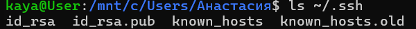
 
Вывожу и копирую публичный ключ
```bash
cat ~/.ssh/id_rsa.pub
```
 
Добавляю ключ в GitLab
Перехожу в http://gitlab-server.lan/-/user_settings/ssh_keys →
 
Создаю ключ:
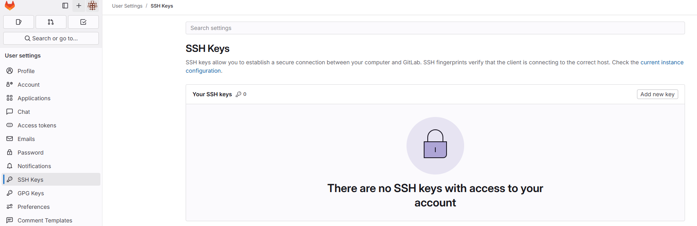
 
Проверяю подключение с wsl:
```bash
 ssh -T -p 2222 git@gitlab-server.lan
```
> * -p 2222 - потому что ранее пробрасывали его вместо 22
 
Как обычно, если не просят пароль, значит все хорошо:
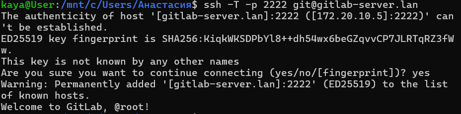
  
##### 3.2.3.2. Создаю и отправляю в проект тестовый пайплайн
Клонирую проект по SSH
```bash
cd /home/kaya/repos/from_local_gitlab
git clone git@gitlab-server.lan:root/project-1-test-ci-cd.git
```
 
Проверяю, что у меня нужные настройки гита:
```bash
git config --list
```
  
Создаю тестовый ci-cd:
```bash
cd test-project-0/
```
  
```bash
nano .gitlab-ci.yml
```
 
Вставляю (обязательно с тегом докер, т.к. раннер создавала с тегом):
```bash
stages:
  - test

echo_ok_job:
  stage: test
  tags:
    - docker
  script:
    - echo "ok"
```
 
Проверяю название ветки, сохраняю и делаю пуш:
```bash
git branch
git add .
git commit -m "add test .gitlab-ci.yml"
git push -u origin main
```
 
Проверяю в UI гитлаба, что все в порядке:
Project → Build → Pipelines:
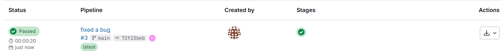
### 3.3. Настройка docker-registry
Теперь остается развернуть и подключить локальный приватный докер-реестр, чтобы хранить образы, собранные в пайплайнах, и использовать его в своих CI/CD.
#### 3.3.1. Установка докер:
```bash
sudo dnf -y install dnf-plugins-core

sudo dnf config-manager --add-repo https://download.docker.com/linux/centos/docker-ce.repo

sudo dnf install docker-ce docker-ce-cli containerd.io docker-buildx-plugin docker-compose-plugin -y

sudo systemctl enable --now docker

sudo docker run hello-world
```

Все ок:
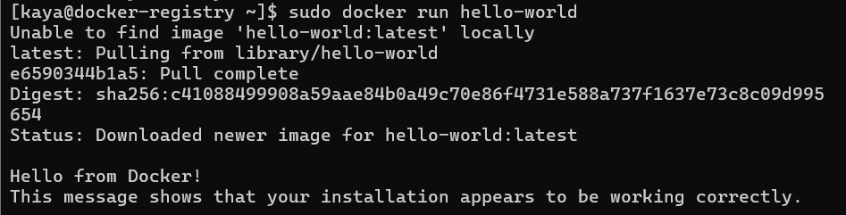
 
#### 3.3.2 Запуск контейнера регистри
Запускаю командой 
```bash
sudo docker run -d --name registry \
  --restart always \
  -p 5000:5000 \
  -v /srv/registry/data:/var/lib/registry \
  registry:2
```
аргументы:
> * --name registry	- даем контейнеру понятное имя вместо случайного 
> * --restart always - автоматический перезапуск
> * -p 5000:5000 - пробрасываем порт, т.к. регистри слушает на порту 5000
> * -v /srv/registry/data:/var/lib/registry	- монтируем директории, чтобы при рестарте контейнера не потерять данные 
> * registry:2 - нужный образ (он прописан в https://hub.docker.com/_/registry)
 
С другой машины, например, с гитлаб-раннером, проверяю, что к регистри есть доступ:
```bash
curl http://docker-registry.lan:5000/v2/
```

Вижу пустой ответ, все работает:

 
И тестово пуляю образ, тоже с любой из машин в сети, с того же гитлаб-раннера:
```bash
sudo docker pull alpine

sudo docker tag alpine docker-registry.lan:5000/alpine

sudo docker push docker-registry.lan:5000/alpine
```
 
Пуш не прошел, так как докер пытался обратиться по https, а регистри работает по http:
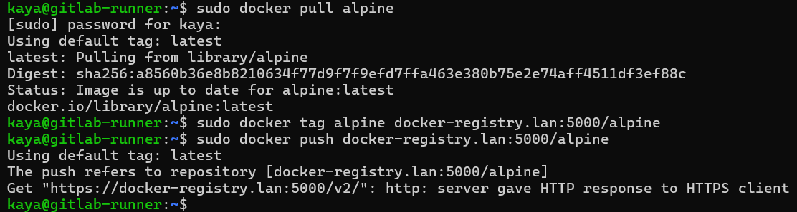

Разрешаю докеру использовать HTTP:
В файл:
```bash
sudo nano /etc/docker/daemon.json
```
 
Добавляю: 
```bash
{
  "insecure-registries": ["docker-registry.lan:5000"]
}
```
 
Перезапускаю докер:
```bash
sudo systemctl restart docker
```
 
Пробую еще раз пушнуть: 
```bash
sudo docker push docker-registry.lan:5000/alpine
```
 
Все ок:
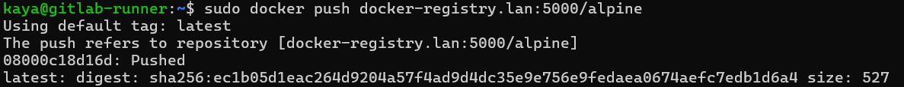
 
Проверяю:
```bash
curl http://docker-registry.lan:5000/v2/_catalog
```
 
Образ подгрузился, все работает:
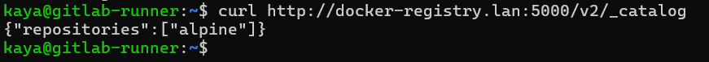
 
## Этап 4. Автоматизация
Штош, после ручной настройки и проверки того, что все ок (а не до нее...) можно приступать к автоматизации. Я считаю так: все, что можно установить, настроить и проверить, - автоматизируем с помощью ансибл. 

### 4.1. Думаю
Пока я писала все пошагово, пришла к такому выводу:
Все, что относится к базовой установке и настройке ОС, лучше автоматизировать в специальных инструментах, по типу Vagrant, PXE. 
 
И после базовой инициализации сервера уже стоит переходить к работе с ансибл

**1. Установка ОС и разметка дисков** - не автоматизирую
 
Причина:
Как я поняла, это можно автоматизировать через специальные инструменты, например, PXE или MAAS, и это делается там, где нужно развернуть очень много машин. Сейчас я потрачу больше времени на автоматизацию, которая не будет востребована
 
**2. Проверка SSH после установки** - не автоматизирую
 
Причина: 
В целом, он почти всегда есть после установки ОС, и раз установку не автоматизириуем, тут будто тоже можно 
 
**3. Настройка статического IP** - не автоматизирую
 
Причина: 
Ансибл сам подключается по SSH. В целом, в данном задании я брала ip-адрес машины и его же делала статическим. Это спокойно можно сделать и по SSH. А вот если есть задача сменить ip на другой, то тут у нас связь оборвется после применения настроек. И как будто, во время настройки, если подключение слетит, то будет больше мороки (но мб и ошибаюсь), и это проще отнести к этапу базовой настройки ОС
 
**4. Создание пользователя** - не автоматизирую
 
Причина:
Как будто, можно и автоматизировать. Но я хочу подключаться с ансибла уже с нужного пользователя. К тому же, на Альме пользователя можно создать прямо в момент установки, а роль только для создания пользователя на Дебиан сейчас избыточна.
 
**5. Настройка hostname** - не автоматизирую
 
Причина:
Отношу это к этапу базовой настройки сервера, которую либо руками, либо через подходящий инструмент. А через ансибл будто избыточно
 
**6. Проверка /etc/hosts и добавление туда записей** - не автоматизирую
 
Причина:
Отношу это к этапу базовой настройки сервера, которую либо руками, либо через подходящий инструмент. А через ансибл будто избыточно
 
**7. Настройка времени** - автоматизирую
 
Причина:
Оно почему-то постоянно слетает, и из-за этого все установки падают с ошибкой.
 
**8. Настройка DNS-сервера (dnsmasq)** - не автоматизирую
 
Причина:
Отношу это к этапу базовой настройки сервера, которую либо руками, либо через подходящий инструмент. А через ансибл будто избыточно
 
**9. Установка ПО** - автоматизирую
 
Причина:
Ну если и это не автоматизировать, то...
 
Подытоживая: все, что касается настройки сервера не автоматизирую (я бы сюда еще добавила проверку наличия и установку `python3`, дальше будет).
  
Вкратце, на этому этапе хочу так:
- установка ансибл
- настройка и проверка связи к серверам
- создаю шаблон проекта: структуру ролей, плейбук - то есть сразу прикидываю, как лучше все распределить
- создаю роль и сразу тестирую ее = запускаю плейбук, ловлю и правлю ошибки. т.к. ансибл пропускает задачи, если они уже выполнены, то лишнего ничего не должно быть

### 4.2. Делаю

### 4.2.1. Установка Ansible на WSL (Ubuntu)
Открываю WSL и обновляю пакеты:
```bash
sudo apt update && sudo apt upgrade -y
```
 
Устанавливаю Ansible:
```bash
sudo apt install ansible -y
```
 
Проверяю, что Ansible установлен и работает:
```bash
ansible --version
```
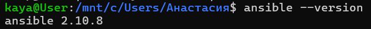
 

### 4.2.2. Настройка на серверах SSH-доступа без пароля
> На серверах настроим вход по SSH без пароля - через ключи. Так удобнее и безопаснее + чтобы при масштабировании проекта ансибл мог подключаться ко всем серверам автоматически, без запроса пароля вручную при каждом подключении.
> Для этого на клиенте (в моем случае - WSL) должна быть пара ключей (приватный + публичный). Публичный добавляю на сервера, к которым буду подключаться.

Проверяю, что на серверах установлен OpenSSH Server (ну выше я ставила, но это так, для общей инструкции больше)
```bash
sudo systemctl status sshd
```
 
Проверяю, есть ли ключи на WSL:
```bash
ls ~/.ssh
```
 
У меня ключи есть (если бы не было, надо создать с помощью команды `ssh-keygen -t rsa -b 4096 -C "коммент, напр. почта"`)

 
Копирую публичный ключ на серверы. На каждой машине, к которой мы будем подключаться по SSH без пароля, надо разместить публичный ключ в `~/.ssh/authorized_keys`.
Можно вручную скопировать и вставить, можно на WSL с помощью команд:
```bash
ssh-copy-id kaya@gitlab-server
ssh-copy-id kaya@gitlab-runner
ssh-copy-id kaya@docker-registry
```
 
* Использую `ssh-copy-id`, т.к. сейчас на серверах включён парольный доступ по SSH. Если на целевой сервер по паролю не подключиться, то добавлять ключи надо, конечно же, не так, например, руками
 
### 4.2.3. Настройка инвентаря ансибл
Создаю каталог:
```bash
mkdir ~/ansible && cd ~/ansible
```
 
В инвентаре указываю три группы серверов:
```bash
nano ~/ansible/inventory.ini
```
 
Вставляю:
```bash
[gitlab_servers]
gitlab-server ansible_user=kaya

[gitlab_runners]
gitlab-runner ansible_user=kaya

[docker_registries] 
docker-registry ansible_user=kaya

[all:vars]
ansible_ssh_private_key_file=/home/kaya/.ssh/id_rsa
```
 
> Я прописала три сервера и единую переменную для всех хостов, чтобы для всех серверов будет использовался приватный ключ `~/.ssh/id_rsa` для аутентификации по SSH.
> 
> Из любопытного, наткнулась, что не всегда `~` в ансибл корректно распознается, и поэтому лучше писать абсолютный путь, поэтому прописала `/home/kaya/`.
  
Проверяю, что Ansible может подключиться к серверам (в будущем, перед проверкой ролей будет не лишним еще раз это проверить):
```bash
ansible all -i inventory.ini -m ping
```
 
> * ansible all - выполняет команду для всех хостов, указанных в инвентаре
> * -i inventory.ini - указываем, какой инвентарь используем для проверки 
> * -m ping - это модуль ансибл, который проверяет подключение через SSH
 
Вывод:
 
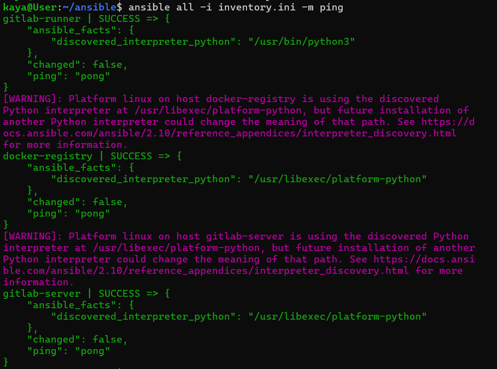
 
 Все ок. 
 > На серверах с Альмой есть уведомления, что для питон-интерпретатора используется нестандартный путь. Как я поняла, если позже установить python3, то можем ожидать непредсказуемое поведение в плане того, какой из интерпретаторов будет работать.
 > 
 > Нагуглила инфо: `/usr/libexec/platform-python` - это системный питон, который зарезервирован для самой ОС (т.е. он нужен самой ОС для работы, а не для пользователя). Для работы ансибл понадобится обычный (пользовательский) питон. По умолчанию ансибл будет использовать первый найденный питон. А он нам сейчас не подходит. 
 >  
 > Считаю, что правильнее зайти на сервера и поставить `python3` руками. Это больше к настройке сервера относится. 
 >    
 > В теории можно прописать это в роли, потом вернуться в инвентарь и там прописать путь (именно после установки, если прописать до - ансибл не найдет ни один питон, и пинг сервера будет неудачным). Но это выглядит как лишние движения, которые могут привести к путанице.
 > 
 > Поэтому тут я подключилась на сервера и поставила `python3`:
```bash
sudo dnf update -y
 
sudo dnf install python3 -y
 
python3 --version
```

Дальше возвращаюсь в WSL и в инвентаре в секцию `[all:vars]`:
```bash
nano ~/ansible/inventory.ini
```
 
Прописываю явно `ansible_python_interpreter` для серверов на альме, т.к. теперь на серверах с альмалинукс два питона (системный и пользовательский) - чтобы не было путаницы:
```bash
[gitlab_servers]
gitlab-server ansible_user=kaya ansible_python_interpreter=/usr/bin/python3

[gitlab_runners]
gitlab-runner ansible_user=kaya

[docker_registries] 
docker-registry ansible_user=kaya ansible_python_interpreter=/usr/bin/python3

[all:vars]
ansible_ssh_private_key_file=/home/kaya/.ssh/id_rsa
```
> Глобально путь к питоне не задаю, чтобы ансибл не сломался на серверах с другой ОС 
 
И снова пингую:
```bash
ansible all -i inventory.ini -m ping
```
 
Все выглядит здраво:
 
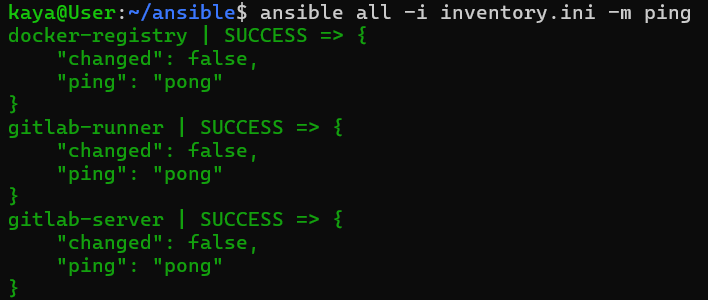

### 4.2.4. Создаю структуру ролей
 
Создаю структуру ролей:
```bash
cd ~/ansible
ansible-galaxy init roles/common
ansible-galaxy init roles/docker
ansible-galaxy init roles/gitlab_server
ansible-galaxy init roles/gitlab_runner
ansible-galaxy init roles/docker_registry
ansible-galaxy init roles/postfix
```
> Роль common создала не сразу. Опять слетело время. Так как это иногда случается, то пусть будет отдельная роль на такие случаи, ну и мб потом пригодятся настройки какие.
 
> Для памятки: после команд у нас создались соответствующие директории с единой структурой. Посмотреть можно с помощью `tree roles`:
>  

Пока роли пустые, буду наполнять по одной: наполнила, протестировала, пошла дальше. Чтобы потом не было всего в куче. 
 
### 4.2.5. Создаю плейбук 

Создаю плей:
```bash
nano playbook.yml
```
 
Наполняю
```yml
---
- name: Базовая настройка серверов (время, в будущем, может, что-то еще)
  hosts: all
  become: true
  roles:
    - common
  tags: common

- name: Установка докера на все серверы
  hosts: all
  become: true
  roles:
    - docker
  tags: docker

- name: Поднимаем гитлаб-сервер в докер-контейнере - установка MTA (postfix) + сам гитлаб-сервер 
  hosts: gitlab-server
  become: true
  roles:
    - role: postfix
      tags: postfix
    - role: gitlab_server
      tags: gitlab_server

- name: Поднимаем гитлаб-раннер в докер-контейнере
  hosts: gitlab-runner
  become: true
  roles:
    - gitlab_runner
  tags: gitlab_runner

- name: Поднимаем докер-регистри в докер-контейнере
  hosts: docker-registry
  become: true
  roles:
    - docker_registry
  tags: docker_registry
```
 
> Для каждой роли прописала тег, чтобы можно было запускать каждую роль по отдельности для отладки. Можно было бы прописать несколько тегов в квадратных скобках, но пока не придумала уместную для задачи ситуацию.
> 
> Кстати, я попутно узнала, что для ролей все пишут вместо пробелов нижнее подчеркивание, а для имен серверов в инвентори пишут дефис.

### 4.2.6. Роль common
#### 4.2.6.1. Создаю роль для базовой настройки системы
 
```bash
nano ~/ansible/roles/common/tasks/main.yml
```
 
После
```yml
---
# tasks file for roles/common
```

Вставляю
```yml
# Настройка времени для ОС на базе RedHat
- name: Настройка времени для ОС на базе RedHat
  when: ansible_os_family == "RedHat"
  block:
    - name: Проверка наличия chrony
      yum:
        name: chrony
        state: present
        update_cache: yes

    - name: Настройка NTP-серверов в конфиге /etc/chrony.conf
      blockinfile:
        path: /etc/chrony.conf
        marker: "# {mark} ANSIBLE MANAGED NTP BLOCK"
        block: |
          server 0.pool.ntp.org iburst
          server 1.pool.ntp.org iburst
          server 2.pool.ntp.org iburst
          server 3.pool.ntp.org iburst

    - name: Перезапуск chronyd после изменения конфигурации
      service:
        name: chronyd
        enabled: true
        state: restarted

    - name: Принудительная синхронизация времени
      command: chronyc -a makestep
      register: chronyc_result
      changed_when: "'step' in chronyc_result.stdout"

    - name: Ждём, пока chronyd догонит (максимум 5 попыток)
      command: chronyc tracking
      register: chrony_tracking_status
      changed_when: false
      until: chrony_tracking_status.stdout is search('Leap status\s*:\s*Normal')
      retries: 5
      delay: 5

    - name: Дебаг - вывод ошибки, если время не синхронизировано (Leap status)
      fail:
        msg: "Время не синхронизировано: в выводе chronyc tracking — Leap status: НЕ Normal"
      when: chrony_tracking_status.stdout is not search('Leap status\s*:\s*Normal')

    - name: Дебаг - вывод сообщения, что все ок, если время синхронизировано (Leap status)
      debug:
        msg: "Время синхронизировано: в выводе chronyc tracking — Leap status: Normal"
      when: chrony_tracking_status.stdout is search('Leap status\s*:\s*Normal')

# Настройка времени для ОС на базе Debian
- name: Настройка времени для ОС на базе Debian
  when: ansible_os_family == "Debian"
  block:
    - name: Отключаем синхронизацию времени
      command: timedatectl set-ntp false

    - name: Ждём 1 секунду
      pause:
        seconds: 1

    - name: Включаем синхронизацию времени
      command: timedatectl set-ntp true

    - name: Проверка, есть ли синхронизация времени (NTPSynchronized)
      command: timedatectl show -p NTPSynchronized --value
      register: ntp_synchronized_status
      changed_when: false

    - name: Дебаг - вывод ошибки, если время не синхронизировано (NTPSynchronized)
      fail:
        msg: "timedatectl: Время НЕ синхронизировано — NTPSynchronized: no"
      when:
        - ntp_synchronized_status.stdout != "yes"

    - name: Дебаг - вывод сообщения, что все ок, если время синхронизировано (NTPSynchronized)
      debug:
        msg: "timedatectl: Время синхронизировано — NTPSynchronized: yes"
      when:
        - ntp_synchronized_status.stdout == "yes"
```
> По порядку про интересности:
> 1. Узнала про маркеры в blockinfile. Выглядит удобно - при повторном запуске плейбука ансибл не будет дублировать блок в рамках маркера, а еще можно вносить изменения именно в него и удалить, тоже только его. Решила добавить, чтобы захламлять конфиг при повторных прогонах.
> 
> 2. Здесь для Альмы использую command, потому что иначе не работает. 
> Я узнала, что:
> * По умолчанию chronyd не делает резкую синхронизацию (jump), если время отличается сильно — чтобы не сломать работу системных сервисов, которые чувствительны к скачкам времени. А на моих ВМ расхождение во времени более чем на месяц. 
> * По умолчанию, если chronyd обнаруживает большое расхождение (обычно больше 3 секунд), он переходит в режим "slew" — медленно «подтягивает» время, добавляя или убавляя доли секунд. Это безопасно, но может занять часы или дни, если расхождение большое (вроде месяца).
При этом chronyd всё равно считает, что он работает корректно — просто потихоньку выравнивает.
> 
> У меня сервер с нуля, так что сейчас резкий скачок времени ничего не сломает. В реальной среде, я пока не понимаю, как поступить. Думаю, что нужно оценить, насколько большое расхождение во времени; насколько критично сменить его прямо сейчас (или можно подождать); если критично - посмотреть, какие сервисы могут полететь и оценить риски
> 
> В рамках именно этой задачи я принудительно поставить правильное время сразу. Такая роль-костыль (потому что по идее время надо выравнивать также на этапе настойки ОС, без ансибл).
> 
> 3. Еще получается, что `makestep` будет выполняться в любом случае (т.к. это не модуль, а команда). По идее можно сделать проверку "выполнять только в таких-то случаях). Возможно, это будет уместно в проде (если вообще в проде уместно добавлять такую настройку времени через роль). И тогда можно оценить, при каких условиях принудительно синхронизировать время. Но сейчас так не делаю - в моем случае выполнять обязательно надо, иначе дальше ничего не поставится
> 
> 4. Для проверки, что все ок до,бавила мини-отладку - падение, если не синхронизировано и сообщения в случае успеха и провала
> 
> 5. Изначально роль была для альмалинукс, потом выяснилось, что на дебиан у меня тоже время отлетело, добавила

 
#### 4.2.6.2. Тест роли common
 
Запускаю плейбук:
```bash
ansible-playbook -i inventory.ini playbook.yml --ask-become-pass -v --tags common
```
 
Сработало!
 
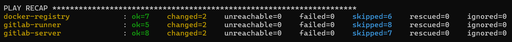
 
### 4.2.7. Роль для установки докера
#### 4.2.7.1. Создаю роль для докера
```bash
nano ~/ansible/roles/docker/tasks/main.yml
```
 
После
```yml
---
# tasks file for roles/docker
```
 
Вставляю
```yml
# Установка Docker на ОС на базе RedHat
- name: Установка Docker на ОС на базе RedHat
  when: ansible_os_family == "RedHat"
  block:
    - name: Установка dnf-плагина
      yum:
        name: dnf-plugins-core
        state: present

    - name: Добавление репозитория docker
      command:
        cmd: dnf config-manager --add-repo https://download.docker.com/linux/centos/docker-ce.repo
        creates: /etc/yum.repos.d/docker-ce.repo

    - name: Установка docker-пакетов
      yum:
        name:
          - docker-ce
          - docker-ce-cli
          - containerd.io
          - docker-buildx-plugin
          - docker-compose-plugin
        state: present

# Установка Docker на ОС на базе Debian 
- name: Установка Docker на ОС на базе Debian
  when: ansible_os_family == "Debian"
  block:
    - name: Установка зависимостей
      apt:
        name:
          - ca-certificates
          - curl
        state: present
        update_cache: true

    - name: Создание директории для ключей
      file:
        path: /etc/apt/keyrings
        state: directory
        mode: '0755'

    - name: Скачивание GPG ключа docker
      get_url:
        url: https://download.docker.com/linux/debian/gpg
        dest: /etc/apt/keyrings/docker.asc
        mode: '0644'

    - name: Добавление репозитория docker вручную
      block:
        - name: Формируем строку репозитория docker
          set_fact:
            docker_repo_entry: >-
              deb [arch=amd64 signed-by=/etc/apt/keyrings/docker.asc]
              https://download.docker.com/linux/debian
              {{ ansible_lsb.codename }} stable

        - name: Вставка репозитория в docker.list
          lineinfile:
            path: /etc/apt/sources.list.d/docker.list
            line: "{{ docker_repo_entry }}"
            create: yes

    - name: Обновление кэша репозиториев
      apt:
        update_cache: yes

    - name: Установка docker-пакетов
      apt:
        name:
          - docker-ce
          - docker-ce-cli
          - containerd.io
          - docker-buildx-plugin
          - docker-compose-plugin
        state: present

# Запуск docker и добавление в автозагрузку
- name: Запуск docker и добавление в автозагрузку
  service:
    name: docker
    enabled: true
    state: started

# Добавление пользователя в группу docker
- name: Создание группы docker
  group:
    name: docker
    state: present

- name: Добавление пользователя в группу docker
  user:
    name: "{{ ansible_user }}"
    groups: [docker]
    append: yes

# Переподключение для обновления SSH-сессии (замена newgrp docker)
- name: Перезагрузка машины
  reboot:
    reboot_timeout: 300

# Проверка docker через hello-world
- name: Проверка docker через hello-world
  command: docker run --rm hello-world
  register: docker_hello_output
  changed_when: false
  ignore_errors: true

- name: Вывод результата STDOUT hello-world
  debug:
    var: docker_hello_output.stdout_lines

- name: Вывод результата STDERR hello-world
  debug:
    var: docker_hello_output.stderr_lines
  when: docker_hello_output.rc != 0

- name: Остановка плейбука, если docker не работает
  fail:
    msg: "Падаем, докер не работает. Выше логи."
  when: docker_hello_output.rc != 0
```
 
> Что было интересного тут:
> * Обновление групп пользователя. И вот почему:
>    * `newgrp docker` не подходит, т.к. в ансибл команда сработает только в рамках одной задачи: запускается новая шелл-сессия, применяется группа и сразу все завершается, т.е. на следующие задачи это не повлияет
>    * Узнала про `meta: reset_connection`. Думала, что поможет, т.к. она закрывает и устанавливает новое SSH-соединение. Но оказалось, что не поможет. Т.к. это не полноценный разлогин/логин: пользователь тот же, логин-сессия не пересоздаётся. Т.е. полезно, если нужно обновить окружение, но для обновления групп пользователя не подходит.
>    * Узнала, что в ансибл есть полноценный аналог "выйти и зайти нормально". `reboot` перезагружает сервер, ждёт, пока тот поднимется, и переподключается сам. Я думала, что запросит пароль для судо, но оказалось, что все ок: ансиблу достаточно того, что он уже получил пароль один раз, а дальше он просто использует его. 
> 
>         Думаю, что при настройке сервера с нуля, как сейчас в задаче - так можно делать спокойно. А если это уже работающий сервер с другими сервисами, то так не надо. В целом, можно продолжать работать с докером через `sudo` - ничего от этого не случится плохого. Если по какой-то причине нужно работать от определнного пользователя и без судо, то:
>        * лучше перезагрузить сервер руками
>        * там, где я добавляю в группу `ansible_user` есть смысл прописать свою переменную с именем нужного пользователя, если это не тот же, от лица которого мы подключаемся
> 
>         ps. хотя все равно думаю, что это избыточно, и можно работать из под текущего юзера с судо.
> 
> * Попыталась добавить отладку для проверки работоспособности докера. Как я поняла, `hello word` дает наибольшее представление о его статусе, поэтому оставила ее, как предлагают в доке, и ориентировалась на ее вывод
> * В задаче по проверке докера через `hello-world` поставила `ignore_errors: true` не чтобы игнорировать ошибки, а как раз для отладки, чтобы можно было понять, что пошло не так с полноценным выводом
 
 
#### 4.2.7.2. Тестирую роль для докера
 
Запускаю плейбук:
```bash
ansible-playbook -i inventory.ini playbook.yml --ask-become-pass -v --tags docker
```
 
Тесты пройдены:
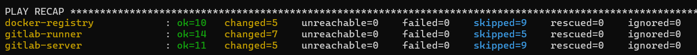
 
