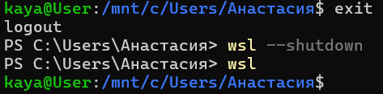
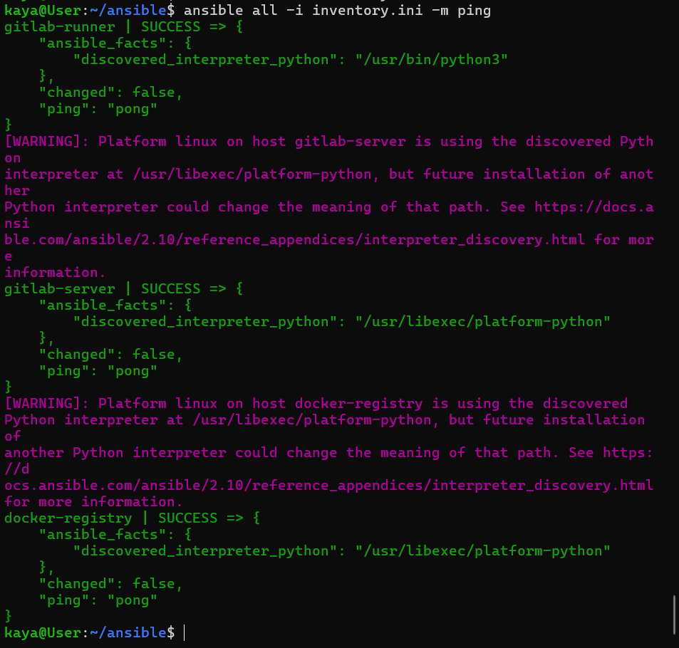
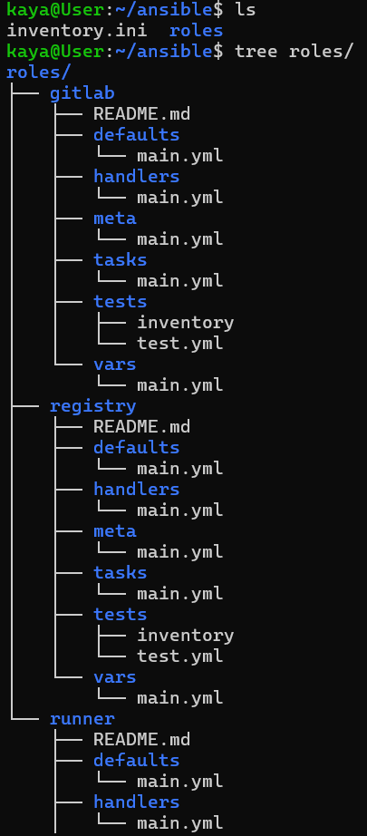
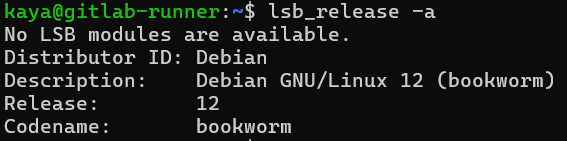
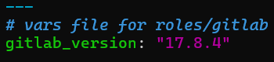

# Задание:
Долгая инфрастуктурная задача. Нужно развернуть, обслуживать, бекапить и восстанавливать наш любимый гитлаб сервер + раннер + докер реестр. Отчёт после каждого этапа. Желательно не заглядывать вперёд. 

Дано:
3 VM, железный кофниг - 2 ядра, 4 Гб, 50 Гб жесткий диск. Эмулируют физические машины, бекап/восстановление средствами средствами гипервизора запрещён. Ресурсов мало, чтоб быстрее заметить их нехватку.
ОС - Alma + Debian, какую ОСь ставить на какую машину - выбираешь самостоятельно, главное, чтоб были обе.
Версия гитлаба на 1 меньше актуальной.

При решение задачи нужно записывать все ходы - что планировалось, что получилось, какие ошибки появились.

# Решение

## Этап 1. Планирование и настройка виртуальных машин
Выбираю ОС для серверов:
* GitLab сервер — AlmaLinux.
* Docker-регистри — AlmaLinux.
* GitLab Runner — Debian.

   Причина выбора: AlmaLinux стабилен для сложных долгосрочных сервисов. Debian подходит для CI/CD-агентов из-за его лёгкости.

Железо под каждую единое.
### 1.1. Настройка GitLab сервер (almalinux)
**Имя сервера:** `gitlab-server.lan`
> Изначально я все сервера назвала с `.local`, потом при настройке локального DNS столкнулась с проблемой, так как `.local` зарезервирован для Multicast DNS (mDNS), который используется для автоматического обнаружения устройств в локальной сети (например, Avahi в Linux). И т.к. использование `.local` для кастомных доменов может привести к конфликтам и проблемам с разрешением имен, то как альтернативу взяла `.lan`

**Разметка диска** (проверить после установки ОС можно с помощью lsblk):
Основной диск: `/dev/sda`, 50 ГБ
- `/dev/sda1`: 48.5 ГБ, LVM:
  - `almalinux-root`: 18.6 ГБ, `/`
  - `almalinux-swap`: 1.9 ГБ, SWAP
  - `almalinux-var`: 28 ГБ, `/var`
- `/dev/sda2`: 524 МБ, `/boot`
 
**Тип подключения к сети:** Bridge

**После установки создаю пользователя, чтобы не сидеть под рутом:**
```bash
sudo adduser kaya
sudo passwd kaya
(дважды ввожу пароль)
sudo usermod -aG wheel kaya # так как в Альме, как и в ОС базе RHEL права sudo предоставляются пользователям, принадлежащим группе wheel
su - kaya # переключаюсь на созданного пользователя
sudo whoami # проверяю, что все ок (должно вывестись root)
```
**Проверяю, что SSH стоит (на Альме, как и на Центос должен стоять по умолчанию):**
```bash
sudo systemctl status sshd
```
Стоит:


**Узнаю адрес машины для подключения по SSH**
```bash
ip addr
```
(дальше все с подключение по SSH)


**Настраиваю статический IP-адрес**
 
Проверяю, какой используется сетевой менеджер. 
Должен быть один из этих:
* NetworkManager
* systemd-networkd
* networking
 
Проверяю первый:
```bash
systemctl is-active NetworkManager
```


Отлично, иду дальше

Узнаю текущие настройки сети, в основном меня интересует имя сетевого интерфейса:
```bash
nmcli connection show
```

Узнаю, какой шлюз (gateway) у моей сети:
```bash
ip route show
```

 
Задаю статический IP (беру уже выданный IP, чтобы подключение не сбросилось, просто делаю его статическим):
```bash
sudo nmcli con modify enp0s3 ipv4.method manual ipv4.addresses 172.20.10.5/28 ipv4.gateway 172.20.10.1 ipv4.dns 8.8.8.8
```

Применяю изменения:
```bash
sudo nmcli con up enp0s3
```

Проверяю, что все ок (теперь ip route show выдает static, а не dhcp):
```bash
ip route show
```
 

 
И выполняю три команды, чтобы проверить:
* связь с шлюзом / `ping -c 4 172.20.10.1`
* доступность интернета /  `ping -c 4 8.8.8.8`
* работает ли DNS / `ping -c 4 google.com`
 
Все ок:

 

**Настройка хостнейма** 
> На альме почему-то не задалось нормально имя на обоих серверах. при установке ОС я указывала имена, но все равно прописан localhost.
> На Дебиан все задалось ок.
> Итак, чтобы сменить имя сервера я сделаю две действия:
> 1. Изменить системное имя хоста через `hostnamectl` (изменит статическое имя хоста, что хранится в файле `/etc/hostname`)
> 2. Настроить `/etc/hosts` для локального разрешения имен
 
Было:


Меняю системное имя хоста:
```bash
sudo hostnamectl set-hostname gitlab-server.lan
```
Результат:

> Кстати, эта команда без судо на альмалинукс предложит выбрать пользователя, а на дебиан откажется выполняться:
> 
> 

Настраиваю `/etc/hosts`.
> В ходе решения задания я узнала, что в альмалинукс установщик обычно не добавляет имя хоста в /etc/hosts автоматически, даже если я указываю для него имя при установке.
> Поэтому в RHEL-системах при задании имени хоста потом в любом случае необходимо будет редактировать `/etc/hosts`. А вот дебиан сам добавляет запись в `/etc/hosts`.
 
Смотрю, как сейчас заполнен файл:
```bash
cat /etc/hosts
```
 


И добавляю строчку:
```bash
echo "172.20.10.5 gitlab-server gitlab-server.lan" | sudo tee -a /etc/hosts
```
> Узнала, что просто заменить запись с `localhost` нельзя, т.к. `localhost` нужен для работы сервисов. И его удаление может привести к проблемам с сетью и производительностью. 
> Например, MySQL/MariaDB, Postfix, systemd-юнитам нужно обращаться к `localhost`.
> Ну и собственно, мы же настраиваем сетевое взаимодействие. И если просто оставить `127.0.0.1` и прописать другое имя хоста, то другие компьютеры не смогут найти `gitlab-server.lan`, потому что у них `127.0.0.1` — это их собственный `localhost`. И здесь хорошо, что я настроила статический IP, иначе бы была путаница.


### 1.2. Настройка Docker-регистри (almalinux)
**Имя сервера:** `docker-registry.lan`
 
**Разметка диска:**
Основной диск: `/dev/sda`, 50 ГБ
- `/dev/sda1`: 524 МБ, `/boot`
- `/dev/sda2`: 49.5 ГБ, LVM:
  - `almalinux_vbox-root`: 16.7 ГБ, `/`
  - `almalinux_vbox-swap`: 2.8 ГБ, SWAP
  - `almalinux_vbox-var`: 30 ГБ, `/var`
  
**Тип подключения к сети:** Bridge
 
**После установки создаю пользователя, чтобы не сидеть под рутом:**
```bash
sudo adduser kaya
sudo passwd kaya
(дважды ввожу пароль)
sudo usermod -aG wheel kaya 
su - kaya 
sudo whoami 
```

**Проверяю, что SSH стоит (на Альме, как и на Центос должен стоять по умолчанию):**
```bash
sudo systemctl status sshd
```
Стоит:


**Узнаю адрес машины для подключения по SSH**
```bash
ip addr
```
(дальше все по SSH)

**Настраиваю статический IP-адрес**
 
 Также сперва проверяю, какой стоит сетевой менеджер (тот же, конечно же):
 ```bash
systemctl is-active NetworkManager
```


Узнаю текущие настройки сети:
```bash
nmcli connection show
```

Я думала, что шлюз могу не узнавать, т.к. я в той же сети. Но с другой стороны, мало ли что пошло не так (в дебиан вот воказалось важным проверить шлюз, так как там была ненужная запись)
Проверка шлюза: 
```bash
ip route show
```

Задаю статический IP:
```bash
sudo nmcli con modify enp0s3 ipv4.method manual ipv4.addresses 172.20.10.2/28 ipv4.gateway 172.20.10.1 ipv4.dns 8.8.8.8
```

Применяю изменения:
```bash
sudo nmcli con up enp0s3
```

Также проверяю, что все ок:
```bash
ip route show
ping -c 4 172.20.10.1
ping -c 4 8.8.8.8
ping -c 4 google.com
```
 

 

**Настройка хостнейма:**
 
Было:


Меняю системное имя хоста:
```bash
sudo hostnamectl set-hostname docker-registry.lan
```
Результат:

 
Настраиваю `/etc/hosts`:
 
Смотрю, как сейчас заполнен файл:
```bash
cat /etc/hosts
```
 


И добавляю строчку:
```bash
echo "172.20.10.2 docker-registry docker-registry.lan" | sudo tee -a /etc/hosts
```
 
Результат:


 
### 1.3. Настройка GitLab Runner (debian)
**Имя сервера:** gitlab-runner.lan
 
**Разметка диска:**
Основной диск: `/dev/sda`, 50 ГБ
- `/dev/sda1`: 524 МБ, `/boot`
- `/dev/sda2`: 49.5 ГБ, LVM:
  - `vgdebian-vgswap`: 2.8 ГБ, SWAP
  - `vgdebian-lvroot`: 46.7 ГБ, `/`

**Тип подключения к сети:** Bridge

**При установке ОС уже создала пользователя, добавляю его в sudo:**
```bash
su -    
usermod -aG sudo kaya
exit  
id kaya     
newgrp sudo
```
**Проверяю, что SSH не установлен (на дебиан SSH по умолчанию не стоит):**
```bash
sudo systemctl status ssh
```

**Обновляю систему и устанавливаю OpenSSH Server:**
```bash
sudo apt update && sudo apt upgrade -y
sudo apt install openssh-server -y
sudo systemctl status ssh
```

**Узнаю IP для дальнейшего подключения**
```bash
ip addr
```
(дальше все тоже по SSH)

**Настраиваю статический IP:**
 
Также, узнаю, какой менеджер сети используется:
```bash
systemctl is-active NetworkManager
```
Нет:


```bash
systemctl is-active systemd-networkd
```
Тоже нет:

 
```bash
systemctl is-active networking
```
Моя остановочка:

 
Проверяю настройки сети. Здесь вместо nmcli использую команды из iproute2:
```bash
ip a
```

 
Узнаю адрес шлюза:
```bash
ip route show
```

 
Здесь у меня появился вопрос к строчке `169.254.0.0/16 dev enp0s3 scope link metric 1000`. И вот, что я узнала.
> Этот маршрут связан с APIPA (Automatic Private IP Addressing), которое ядро Linux автоматически добавляет, если интерфейс не получает IP-адрес от DHCP-сервера.
> Как добавляется APIPA:
> * Если dhclient работал и не смог получить IP от DHCP-сервера, он может назначить 169.254.x.x.
> * Но даже без dhclient ядро Linux само добавляет этот маршрут, когда интерфейс активен, но не имеет IP.
> Т.е. в большинстве случаев 169.254.0.0/16 добавляется ядром автоматически. И еще я узнала, что 169.254.0.0/16 не мешает настройке статического IP, т.к. эта запись не используется в обычной сетевой работе, если настроен статический IP и правильный шлюз (default via 172.20.10.1).

 
Продолжаю настройку статического IP. Итак, у меня используется networking.service, который читает конфигурацию из `/etc/network/interfaces`. Поэтому открываю конфиг сети:
```bash
sudo nano /etc/network/interfaces
``` 

Вижу:

 
Особо интересны две строчки:
* `allow-hotplug enp0s3` - отвечает за то, что сетевой интерфейс активируется только при физическом подключении сети. Т.е. когда система загружается, то интерфейс не поднимается сразу. Для сервера не подходит
* `iface enp0s3 inet dhcp` - предлашает системе получать IP-адрес автоматически через DHCP, что нам нужно убрать при настройке статического IP

Обе строчки комментирую и добавляю:
```bash
auto enp0s3
iface enp0s3 inet static
    address 172.20.10.3
    netmask 255.255.255.240
    gateway 172.20.10.1
    dns-nameservers 8.8.8.8 1.1.1.1
```

 
Перезапускаю сеть:
```bash
sudo systemctl restart networking
```

> И вот, что интересно, пока я разбиралась со строчкой `169.254.0.0/16 dev enp0s3 scope link metric 1000`, я увидела, что после изменения конфига сети и ее перезапуска
dhclient остается активным. По идее он уже не нужен, потому что он занимается получением IP через DHCP. И чтобы он случайно не запрашивал IP-адрес и не мешал статической конфигурации, его лучше отключить.

Проверяю, работает ли DHCP-клиент:
```bash
ps aux | grep dhclient
```
Он включен:


С его отключением повозилась. dhclient постоянно появлялся после рестарта сети. Как я поняла, скорее всего, он был запущен раньше и не завершился. И даже не смотря на попытки его отключить, он мог остаться из-за файла аренды DHCP (lease file).
 
Как я его отключила:
* Принудительно останавливаю dhclient:
  ```bash
  sudo dhclient -r enp0s3
  sudo kill $(pidof dhclient)
  ```
 
* Удаляю файлы аренды (lease files), которые могут автоматически перезапускать dhclient:
  ```bash
  sudo rm -f /var/lib/dhcp/dhclient*.leases
  sudo rm -f /run/dhclient*.pid
  ```
 
* Проверяю, что dhclient не поднимается после перезапуска:
  ```bash
  sudo systemctl restart networking
  ps aux | grep dhclient
  ```
  

Также проверяю, что все ок:
```bash
ip route
ping -c 4 172.20.10.1
ping -c 4 8.8.8.8
ping -c 4 google.com
```


 
Еще раз проверяю, все ли ок (не работает ли dhclient, и работает ли сеть):

 
**Настройка хостнейма:**
> Примечание: В дебиан имя изначально правильно задалось, но так как я сперва использовала `.local`, вместо `.lan`, то здесь тоже обновляю хостнейм.

```bash
sudo hostnamectl set-hostname gitlab-runner.lan
```
И также обновляю запись в `/etc/hosts` (в отличие от Альмы, здесь я не добавляю новую запись, а меняю уже созданную).

Выполнила
```bash
sudo 
```

И заменила
```bash
127.0.1.1    gitlab-runner.local gitlab-runner
 ```
  
на 
```bash
172.20.10.5    gitlab-runner.lan gitlab-runner
```
 
> Тут у меня возник вопрос к 127.0.1.1. Как я поняла, В Debian и его производных используется IP-адрес 127.0.1.1 для привязки локального доменного имени к IP 127.0.1.1. Обычно, если gitlab-runner только локальное имя, это нормально. Однако, если это сервер в сети с другим IP, надо заменить IP-адрес на актуальный 
 
### 1.4. Настройка времени на серверах с АльмаЛинукс
Раньше сталкивалась с этим на центос, сейчас на альме: после установки время в системе некорректное, хотя я указываю часовой пояс.
 
Проверим время в системе:
```bash
timedatectl status
```
 
В выводе снова `NTP synchronized: no` говорит, что служба синхронизации времени не работает.
 
Проверим статус службы синхронизации времени:
```bash
sudo systemctl status chronyd
```
 
Судя по статусу, chronyd работает, но синхронизации времени все равно нет. У меня снова дело в том, что NTP-сервера недоступны. 
 
Открываем конфиг:
```bash
sudo nano /etc/chrony.conf
```
 
Добавим туда следующие сервера:
```bash
server 0.pool.ntp.org iburst
server 1.pool.ntp.org iburst
server 2.pool.ntp.org iburst
server 3.pool.ntp.org iburst
```
 
Сохраним изменения и перезапустим Chrony:
```bash
sudo systemctl restart chronyd
```
 
После настройки серверов принудительно синхронизируем время:
```bash
sudo chronyc -a makestep
```
 
1.1.7. Снова проверим состояние времени:
```bash
timedatectl status
```
 
Ура, все ок. В отличие от центос на альме сразу все обновляется (центос было нужно немного времени)
 
## Этап 2. Сеть: планирую локальную сеть, где все хосты общаются друг с другом по именам.
Теперь нужно настроить сеть так, чтобы все машины могли обращаться друг к другу по именам. Для этого можно использовать:
* Вариант 1: Статическую настройку DNS через `/etc/hosts`:
* Вариант 2: Локальный DNS-сервер (например, `dnsmasq`), который будет разрешать имена в локальной сети.

> Я так понимаю, что в проде важно найти наиболее гармоничное решение - не усложнять там, где не надо, и не использовать слишком простые инструменты там, где неумеснто. 
> Для учебы хватило бы настроить `/etc/hosts`, но чтобы попрактиковаться побольше решила попробовать настроить `dnsmasq`.
> Также для истории оставлю инфо, как  настроить через `/etc/hosts`.
>  
> Все просто. Надо добавить необходимые IP-адреса и имена серверов в `/etc/hosts`:
>  ```bash
>  echo -e "172.20.10.5 gitlab-server.local gitlab-server\n172.20.10.3 docker-registry.local docker-registry\n172.20.10.2 gitlab-runner.local gitlab-runner" | sudo tee -a /etc/hosts
>  ```
> Где:
> * `echo` - выводит строку в консоль (эту строку через пайп передадим дальше)
> * `-e` включает интерпретацию \n как символа новой строки
> * `"172.20.10.5 gitlab-server.local gitlab-server\n172.20.10.3 docker-registry.local docker-registry\n172.20.10.2 gitlab-runner.local gitlab-runner"` - строки, которые мы добавляем в `/etc/hosts`, разделенные `/n`
>   * разбор на примере "172.20.10.5 gitlab-server.local gitlab-server":
>     * `172.20.10.5` - ip-адрес сервера
>     * `gitlab-server.local` - fqdn, полное доменное имя сервера
>     * `gitlab-server` - алиас, чтобы обращаться к серверу не используя полное имя
> * `|` (пайп) передаёт вывод echo в следующую команду
> *  `sudo tee -a /etc/hosts` - записывает входные данные в файл, аргумент `-a` отвечает за то, что текст добавляется в конец файла, без перезаписи +  по умолчанию `tee` также выводит нам саму строку в консоль


# 2.1. Настройка DNS-сервера 
Я решила для настройки взять наименее загруженный сервер и поэтому установила dnsmasq на сервере с гитлаб-раннером. Хотя в проде полагаю под это дело нужен отдельный сервер-обслуга, где будут такие штуки.

## 2.1.1. Установка и проверка dnsmasq
Устанавливаю dnsmasq
```bash
sudo apt update && sudo apt install -y dnsmasq
```

Перезапускаю, добавляю в автозагрузку и проверяю статус и включаю сервис
```bash
sudo systemctl restart dnsmasq
sudo systemctl enable dnsmasq
sudo systemctl status dnsmasq
```
> Просто для памятки. Стало интересно, зачем после установки перезапускать.
> Узнала, что после установки dnsmasq по умолчанию не активен, а перезапуск запускает службу.

## 2.1.2. Настройка конфигурации dnsmasq
Открываю конфиг:
```bash
sudo nano /etc/dnsmasq.conf
```

Добавляю запись:
```
# Определяю локальные имена
address=/gitlab-server.lan/172.20.10.5
address=/docker-registry.lan/172.20.10.2
address=/gitlab-runner.lan/172.20.10.3

# Определяю локальный домен
local=/lan/
domain=lan

# Указываю публичные DNS-сервера. Это разрешит dnsmasq пересылать запросы, которые он не может разрешить локально, на указанные внешние DNS-серверы.
# Т.е. без server=8.8.8.8 и server=8.8.4.4 у нас локально все будет работать, но связи с внешней сетью на gitlab-runner не будет (проверено)
server=8.8.8.8
server=8.8.4.4
```

Сохраняю, перезапускаю:
```bash
sudo systemctl restart dnsmasq
```

## 2.1.3. Настройка DNS-клиента
> Указываю dnsmasq как основной DNS-сервер

На всех(!!!) серверах открываю файл `/etc/resolv.conf`, который используется для настройки параметров DNS:
```bash
sudo nano /etc/resolv.conf
```

Комментирую текущие строки (они созданы системными службами, пусть останутся на случай, если потом понадобиться вернуться к прежним настрйокам) и добавляю:
```bash
# Settings for dnsmasq

# Добавляет суффикс .lan при поиске хостов без полного доменного имени
search lan            

# Локальный днс - адрес сервера с dnsmasq
nameserver 172.20.10.3   

# Google DNS на случай отказа локального и дополнительный резервный DNS
nameserver 8.8.8.8       
nameserver 8.8.4.4       
```

Блокирую файл от перезаписи.
На всех серверах выполняю команду ниже, это нужно, потому что некоторые сетевые менеджеры (NetworkManager, systemd-resolved) могут перезаписывать `/etc/resolv.conf `при перезагрузке. 
```bash
sudo chattr +i /etc/resolv.conf
```
P.S. Если надо будет потом вернуть возможность изменений, выполняем `sudo chattr -i /etc/resolv.conf`

## 2.1.4. Проверка работы
Дальше на всех трех серверах делаю проверку с помощью следующих двух команд.

### 2.1.4.1. Проверка резолвинга с помощью nslookup
```bash
nslookup gitlab-server.lan 172.20.10.3
```
> Памятка: nslookup —  утилита для запроса DNS-записей.
> Здесь два аргумента:
> * gitlab-server.lan – имя, которое я хочу проверить.
> * 172.20.10.3 – IP-адрес сервера, где работает dnsmasq.
Ожидаю, что сервер ответит, привязав gitlab-server.lan к 172.20.10.5. Если ответ приходит, значит dnsmasq правильно обрабатывает запросы.

### 2.1.4.2. Проверка с помощью dig
```bash
dig gitlab-server.lan
```
> **Памятка:**
> **dig** – это мощная утилита для проверки DNS-запросов. В отличие от nslookup, она даёт детальный вывод, включая:
> * QUESTION SECTION – что именно запрашивается.
> * ANSWER SECTION – IP-адреса, полученные в ответ.
> * AUTHORITY SECTION (если есть) – информация о сервере, который дал ответ.
> 
> **Разбор аргументов:**
> * gitlab-server.lan – доменное имя, которое мы проверяем.
> Без явного указания DNS-сервера dig использует тот, что прописан в /etc/resolv.conf.
> Это позволяет проверить, действительно ли система использует dnsmasq по умолчанию.


В `ANSWER SECTION` вижу:
...
`gitlab-server.lan.  0  IN  A  172.20.10.5`
Значит, всё работает – DNS настроен правильно и разрешает локальные имена.


## Этап 3. Настроить все вручную
### Настройка gitlab-server
#### Установка докер:
```bash
sudo dnf -y install dnf-plugins-core
sudo dnf config-manager --add-repo https://download.docker.com/linux/centos/docker-ce.repo
sudo dnf install docker-ce docker-ce-cli containerd.io docker-buildx-plugin docker-compose-plugin -y
sudo systemctl enable --now docker
sudo docker run hello-world
```

Все ок:

 
#### Установка MTA
MTA (Mail Transfer Agent) — это программное обеспечение, которое занимается отправкой, пересылкой и получением электронной почты через Интернет. Это основной компонент системы передачи электронной почты.

В оф. инструкции пишут, что нужен MTA (Postfix), т.к. GitLab нужно уметь отправлять почтовые уведомления. Локально можно без него, но по идее в продакшене MTA обязателен.

Установка
```bash
sudo dnf install -y postfix
```
 
Настройка
```bash
sudo nano /etc/postfix/main.cf
```
 
Найти и заполнить/раскомментировать значения:
```bash
myhostname = gitlab-server.lan
inet_interfaces = all
mydestination = gitlab-server.lan, localhost.localdomain, localhost
```
 
> **Пояснение строк:**
> * myhostname = gitlab-server.lan - устанавливает имя сервера, которое Postfix использует для идентификации себя, чтобы сервер знал своё имя и мог принимать почту, адресованную ему. Здесь задаю конкретное имя (gitlab-server.lan), потому что именно так ты обращаюсь к серверу через DNS (dnsmasq). Устанавливаю явно, чтобы не полагаться на автоматическое определение, которое может сработать неправильно.
> * inet_interfaces = all - указывает, на каких интерфейсах сервер принимает почту. all — означает, что Postfix будет слушать все сетевые интерфейсы (локальные и внешние).
> * mydestination = gitlab-server.lan, localhost.localdomain, localhost - определяет, какие домены считаются локальными для Postfix. Если сообщение адресовано к одному из доменов в этом списке, Postfix не пересылает его дальше, а обрабатывает локально.

Запускаю и добавляю Postfix в автозагрузку:
```bash
sudo systemctl enable postfix
sudo systemctl start postfix
```
 
#### Проверка Postfix (тестовое письмо)
Тестирую работу Postfix с помощью отправки письма.
```bash
echo "Тестовое письмо от Postfix" | sendmail -v kaya@localhost
```
 
Это отправит письмо на пользователя kaya на том же сервере.

Чтобы посмотреть письмо, сперва установлю почтовый клиент:
```bash
sudo dnf install -y mailx
```
Затем ввожу команду для просмотра письма:
```bash
mail
```
 
Чтобы просмотреть само письмо, ввожу его порядковый номер, в данном случае:
```bash
1
```
 
Все работает:


Чтобы выйти из режима mail, нажимаю
```bash
q
``` 
 
#### Установка gitlab server в докер контейнере
> Памятка:
> В оф. инструкции предлагают настроить порт 22 для SSH, если GitLab устанавливается на сервер напрямую.
> В моём случае это не требуется, так как GitLab запускается в Docker-контейнере.
> Чтобы избежать конфликта с обычным SSH-доступом к серверу (который тоже использует порт 22), я пробрасываю порт:
внутри контейнера остаётся 22, а снаружи используется, например, 2222 (--publish 2222:22).
> 
> Это значит, что при клонировании проектов по SSH будет использоваться порт 2222:
> git clone ssh://git@gitlab-server.lan:2222/user/project.git
 

Далее нам нужно создать каталог для файлов конфигурации, журналов и файлов данных. В оф. инструкции пишут, что каталог может находиться в домашнем каталоге пользователя (например ~/gitlab-docker, ), или в каталоге типа /srv/gitlab.

Создаем каталог:
```bash
sudo mkdir -p /srv/gitlab
```
 
Еще пишут"Если вы запускаете Docker от имени пользователя, отличного от root, предоставьте пользователю соответствующие разрешения для нового каталога.". Я запускаю от sudo, так что иду дальше.

Настроим новую переменную среды $GITLAB_HOME, которая задает путь к созданному каталогу:
```bash
export GITLAB_HOME=/srv/gitlab
```
 
> Так переменная будет работать в текущем терминале, но потеряется в новой терминальной сессии
 
Чтобы не задавать `GITLAB_HOME` каждый раз вручную, добавим переменную в профиль оболочки — так она будет доступна во всех будущих сессиях терминала:
```bash
echo 'export GITLAB_HOME=/srv/gitlab' >> ~/.bashrc
source ~/.bashrc
```
 
Создаём три директории, которые будут монтироваться в контейнер GitLab:
```bash
sudo mkdir -p $GITLAB_HOME/config $GITLAB_HOME/logs $GITLAB_HOME/data
```
 
Все берем из оф. инструкции, где описано, какие тома на хосте нужны для того, чтобы GitLab хранил постоянные данные (конфиги, данные и логи):

 
Выбираю редакцию и версию GitLab
> Памятка: 
> Официальная инструкция рекомендует не использовать тег latest, а указывать конкретную стабильную версию GitLab, особенно в продакшене.
> 
> В GitLab есть две редакции:
> * gitlab/gitlab-ce — Community Edition (CE), бесплатная (я использую её)
> gitlab/gitlab-ee — Enterprise Edition (EE), нужна лицензия, но можно протестировать.
> 
> По условиям задачи я использую версию GitLab на одну меньше актуальной. Я нашла https://about.gitlab.com/releases/, где указано, что сейчас стабильная версяи - `17.10`:

Поэтому я беру `17.9`. На странице с тегами (https://hub.docker.com/r/gitlab/gitlab-ce/tags/) нахожу, что мне нужно `17.9.3-ce.0` и при установке пропишу `gitlab/gitlab-ce:17.9.3-ce.0`

 
Далее выбираем способ запуска. Я выбираю через docker-compose, так как с ним можно управлять конфигурацией GitLab через YAML-файл и в будущем масштабировать, если потребуется. Также это более близко к продакшену, как я понимаю. 
 
Создаю директорию для `docker-compose.yml` и перехожу в нее:
```bash
mkdir /home/kaya/gitlab-docker
cd /home/kaya/gitlab-docker
```
 
Там создаю `docker-compose.yml` и наполняю:
```bash
nano docker-compose.yml
```

Вставляю:
```yaml
version: '3.6'

services:
  gitlab:
    image: gitlab/gitlab-ce:17.9.3-ce.0
    container_name: gitlab
    restart: always
    hostname: 'gitlab-server.lan'
    environment:
      GITLAB_OMNIBUS_CONFIG: |
        external_url 'http://gitlab-server.lan'
        gitlab_rails['gitlab_shell_ssh_port'] = 2222
    ports:
      - '80:80'
      - '443:443'
      - '2222:22'
    volumes:
      - '$GITLAB_HOME/config:/etc/gitlab'
      - '$GITLAB_HOME/logs:/var/log/gitlab'
      - '$GITLAB_HOME/data:/var/opt/gitlab'
    shm_size: '256m'
```
> Пояснение:
> * image - образ на 1 меньше актуального
> * hostname - имя сервера внутри контейнера (соответствует DNS-настройке)
> * external_url - по какому адресу будет открыт GitLab
> * gitlab_shell_ssh_port	- SSH-порт для клонирования репозиториев (будет 2222, т.к. 22 используется для подключения по SSH)
> * ports - проброс портов (веб-интерфейс и SSH), взяла из ппервого примера в документации. В оф. инструкции так же есть второй пример, где используются нестандартные порты (8929 и 2424) и примерный домен (gitlab.example.com). 
Я использую порты 80 и 2222, потому что:
> * volumes - связываю директории на сервере с директориями контейнера
> * $GITLAB_HOME - уже задан ранее как /srv/gitlab
УЛУЧШИТЬ ТЕКСТ

Создаю `.env` в каталоге рядом с `docker-compose.yml`.
> Сначала я этого не сделала, потому что ранее задала переменную GITLAB_HOME через export и добавила её в ~/.bashrc.
Она работала в интерактивной оболочке, но при запуске docker compose с sudo я увидела предупреждение:
 

В общем, sudo не наследует переменные окружения по умолчанию, и docker compose не увидел мою переменную из пользовательской среды.
Ну и как следствие, контейнер поднялся с некорректным монтированием.
Чтобы исправить, создаю `.env`. И вообще это корректно для прода  
 
 ```bash
echo 'GITLAB_HOME=/srv/gitlab' > .env
```
 
Проверяю, что файл создан:
```bash 
cat .env
```
 
В том же каталоге запускаю:
```bash
sudo docker compose up -d
```
 
Готово:

> Памятка: 
> После запуска контейнера Docker Compose автоматически создаёт сеть gitlab-docker_default, внутри которой работает контейнер GitLab. Так как дальше каждый сервис (GitLab, GitLab Runner, Docker Registry будут работать каждый на своей виртуальной машине (аля "сервер"), и контейнеры общаются через внешнюю сеть (по IP или через `dnsmasq`), то сейчас мне никакая доп. настройка Docker-сетей не нужна. 
> Достаточно проброса нужных портов (`80`, `443`, `2222`) и корректной работы DNS. 
>
> А вот если бы контейнеры запускались на одной машине и должны были общаться между собой  внутри Docker — тогда нужно было бы использовать блок `networks:` в `docker-compose.yml`.
> Ну а пока иду дальше.
 
#### Проверка GitLab-сервера
Проверяю статус контейнера:
```bash
sudo docker ps
```
 
Вижу:

 
Посмотрела логи, увидела, что ошибок нет, еще идет инициализация. Прочитала в интернете, что инициализация может занимать 5-10 минут. Переключилась на другие задачи. Спустя время еще раз чекнула.
Вижу списке контейнер gitlab, и в колонке PORTS — нужные порты (80, 443, 2222), статус healthy:

 
Супер иду дальше

Проверяю, открывается ли GitLab в браузере. Открываю GitLab в браузере:
```bash
http://gitlab-server.lan
```
 
Сперва, конечно, ничего не открывается:

Неудивительно.
##### Настройка файла hosts для разрешения имен на хосте с Windows
На ноуте не стала настраивать DNS, чтобы не менять системные параметры.  
Вместо этого добавляю имена вручную в файл `hosts`.
1. Пуск → Поиск → Блокнот → ПКМ → Запуск от имени администратора
2. В блокноте открываю путь `C:\Windows\System32\drivers\etc\`
3. Выбираю тип файла "Все файлы"
4. Из появившегося списка выбираю `hosts`
5. Вставляю строки:
172.20.10.3    gitlab-runner.lan
172.20.10.5    gitlab-server.lan
172.20.10.2    docker-registry.lan
6. Сохраняю

Дальше снова пробую, но не могу из-за впн:


Отключаю впн. Вижу экран приветствия, всё работает: 

 
Получаю пароль администратора:
```bash
sudo cat /srv/gitlab/config/initial_root_password
```
> Памятка: Пароль действует 24 часа после запуска, о чем нас заботливо предупредили:

 
Захожу в GitLab под пользователем root, ввожу пароль.
Сперва меняю пароль на `strong_very_password`

Далее вижу предупреждение:

Это значит, что любой пользователь может зарегистрироваться самостоятельно. Так как мой GitLab — локальный и приватный, открытая регистрация не нужна. Жмакаю `Deactivate`, чтобы отключить создание аккаунтов для всех, кроме администратора.
 
Создаю первый проект. Всё работает:

 
Также проверяю, что SSH-URL проекта с портом 2222, а не 22:

 
> Вижу уведомелние:
> 
> Пока пропущу этот шаг, так как настраиваю инфраструктуру. Вернусь когда буду настраивать раннер

Переходим к серверу с gitlab-runner


### gitlab-runner
#### Установка докер:
```bash
# Add Docker's official GPG key:
sudo apt-get update
sudo apt-get install ca-certificates curl -y
sudo install -m 0755 -d /etc/apt/keyrings
sudo curl -fsSL https://download.docker.com/linux/debian/gpg -o /etc/apt/keyrings/docker.asc
sudo chmod a+r /etc/apt/keyrings/docker.asc

# Add the repository to Apt sources:
echo \
  "deb [arch=$(dpkg --print-architecture) signed-by=/etc/apt/keyrings/docker.asc] https://download.docker.com/linux/debian \
  $(. /etc/os-release && echo "$VERSION_CODENAME") stable" | \
  sudo tee /etc/apt/sources.list.d/docker.list > /dev/null
sudo apt-get update
```
 
```bash
sudo apt-get install docker-ce docker-ce-cli containerd.io docker-buildx-plugin docker-compose-plugin -y
```
 
```bash
sudo docker run hello-world
```
 
Готово:


 
#### Разворачиваем GitLab Runner в Docker 
Создаю volume для хранения данных раннера (по желанию, но желательно):

> Я так поняла, на наш выбор: локальный вольюм или докер вольюм. Но вроде как докер вольюм предпочтительнее: управляется докером, изолированный, и всегда можно получить доступ к файлам с помощью команды `docker volume inspect gitlab-runner-config`.
 
Создаю: 
```bash
sudo docker volume create gitlab-runner-config
```
Теперь конфиг раннера сохранится после перезапуска или удаления контейнера.
 
 Запускаю контейнер GitLab Runner:
```bash
sudo docker run -d --name gitlab-runner --restart always \
  -v /var/run/docker.sock:/var/run/docker.sock \
  -v gitlab-runner-config:/etc/gitlab-runner \
  gitlab/gitlab-runner:latest
```
> Разбор:
> * `--restart always` - чтобы контейнер запускался при перезагрузке
> * `-v /var/run/docker.sock` - монтирую докеровский сокет хоста внутрь контейнера, чтобы раннер мог работать с `executor = docker`.
  > Т.к. раннер использует докер для запуска джоб, то из-за того, что раннер сам работает внутри контейнера, то ему нужен способ общаться с докером на хосте. Вот для этого монтирую. И тогда раннер сможет:
  >  - создавать новые контейнеры (`image: ...`)
  > - запускать `docker build`, `docker run`, `docker push` и т.д.
> * `-v gitlab-runner-config` - сохраняет конфиг раннера
> * `gitlab/gitlab-runner:latest` - оф. образ раннера

Теперь раннер как сервис готов работать, но ещё не знает, с каким гитлаб-сервером. Поэтому пора его зарегать. 

Регистрирую раннер.
URL GitLab (в твоём случае: http://gitlab-server.lan)

Token проекта или группы (его можно взять в GitLab → Project → Settings → CI/CD → Runners)
####
####


____________
```bash
sudo dnf -y install dnf-plugins-core
sudo dnf config-manager --add-repo https://download.docker.com/linux/centos/docker-ce.repo
sudo dnf install docker-ce docker-ce-cli containerd.io docker-buildx-plugin docker-compose-plugin -y
sudo systemctl enable --now docker
sudo docker run hello-world
```


#### На сервера с дебиан:
Настройте aptрепозиторий Docker.


# Add Docker's official GPG key:
sudo apt-get update
sudo apt-get install ca-certificates curl
sudo install -m 0755 -d /etc/apt/keyrings
sudo curl -fsSL https://download.docker.com/linux/debian/gpg -o /etc/apt/keyrings/docker.asc
sudo chmod a+r /etc/apt/keyrings/docker.asc

# Add the repository to Apt sources:
echo \
  "deb [arch=$(dpkg --print-architecture) signed-by=/etc/apt/keyrings/docker.asc] https://download.docker.com/linux/debian \
  $(. /etc/os-release && echo "$VERSION_CODENAME") stable" | \
  sudo tee /etc/apt/sources.list.d/docker.list > /dev/null
sudo apt-get update

sudo apt-get install docker-ce docker-ce-cli containerd.io docker-buildx-plugin docker-compose-plugin

sudo docker run hello-world


## Этап 4. Упростить развертывание
Как я поняла, дальше мне нужно упростить процесс развертывания, чтобы не настраивать всё вручную при каждом развертывании (раньше этот этап был третьим)))

### 3.1. Дружу WSL и dnsmasq
Во-первых, здесь тоже нужно заявить о dnsmasq. Поэтому на WSL также открываю файл `/etc/resolv.conf` для настройки параметров DNS:
```bash
sudo nano /etc/resolv.conf
```

Комментирую прежние настройки и добавляю новые:
```bash
# Settings for dnsmasq

# Добавляет суффикс .lan при поиске хостов без полного доменного имени
search lan            

# Локальный днс - адрес сервера с dnsmasq
nameserver 172.20.10.3   

# Google DNS на случай отказа локального и дополнительный резервный DNS
nameserver 8.8.8.8       
nameserver 8.8.4.4   
```
И перезагружаюсь
```bash
exit
wsl --shutdown
wsl
```


### 3.2. Установка Ansible на WSL (Ubuntu)
Открываю WSL и обновляю пакеты:
```bash
sudo apt update && sudo apt upgrade -y
```

Устанавливаю Ansible:
```bash
sudo apt install ansible -y
```

Проверяю, что Ansible установлен и работает:
```bash
ansible --version
```


### 3.2. Настройка на серверах SSH-доступа без пароля
> На серверах настроим вход по SSH без пароля, чтобы было удобнее и безопаснее + дальше буду использовать ансибл, чтобы при масштабировании не было такого, что Ansible входит по SSH на кучу серверов по паролю, и мы вручную каждый раз вводим пароль.
> Для этого на клиенте (в моем случае - WSL) должна быть пара ключей (приватный + публичный) и публичный добавляю на сервера, к которым буду подключаться.

Проверяю, что на серверах установлен OpenSSH Server (ну выше я ставила, но это так, для общей инструкции больше)
```bash
sudo systemctl status sshd
```

Проверяю, есть ли ключи на WSL:
```bash
ls ~/.ssh
```

У меня ключи есть (если бы не было, надо создать с помощью команды `ssh-keygen -t rsa -b 4096 -C "коммент, напр. почта"`)


Копирую публичный ключ на серверы. На каждой машине, к которой мы будем подключаться по SSH без пароля, надо разместить публичный ключ в `~/.ssh/authorized_keys`.
Можно вручную скопировать и вставить, можно на WSL с помощью команд:
```bash
ssh-copy-id kaya@gitlab-server
ssh-copy-id kaya@gitlab-runner
ssh-copy-id kaya@docker-registry
```

### 3.3. Настройка Ansible
Создаю каталог:
```bash
mkdir ~/ansible && cd ~/ansible
```

В инвентаре указываю три группы серверов:
```bash
nano ~/ansible/inventory.ini
```

Вставляю:
```bash
[gitlab_servers]
gitlab-server ansible_user=kaya

[gitlab_runners]
gitlab-runner ansible_user=kaya

[docker_registries] 
docker-registry ansible_user=kaya

[all:vars]
ansible_ssh_private_key_file=~/.ssh/id_rsa
```

> Я прописала три сервера и единую переменную для всех хостов,
> чтобы для всех серверов будет использовался приватный ключ `~/.ssh/id_rsa` для аутентификации по SSH.


> Проверяю, что Ansible может подключиться к серверам:
```bash
ansible all -i inventory.ini -m ping
```
> * ansible all - выполняет команду для всех хостов, указанных в инвентаре
> * -i inventory.ini - указываем, какой инвентарь используем для проверки 
> * -m ping - это модуль ансибл, который проверяет подключение через SSH

Вывод:


 
 Все ок.

### 3.4. Пишем роли 
Итак, чтобы не писать портянку в плейбуке, пишу роли для установки всех сервисов (гитлаб сервер, раннер и докер регистри), а потом вызову роли.

Создаю структуру ролей:
```bash
cd ~/ansible
ansible-galaxy init roles/gitlab_server_alma
ansible-galaxy init roles/gitlab_runner_alma
ansible-galaxy init roles/docker_registry_deb
```

> Для памятки: после команд у нас создались соответствующие директории с единой структурой.
>  
> На примере:  
> 


Дальше наполняю роли

### 3.4.1. Роль для установки гитлаб-сервера
```bash
nano ~/ansible/roles/gitlab_server_alma/tasks/main.yml
```
 
После
```yml---
# tasks file for roles/gitlab_server_alma
```

Вставляю
```yml
- name: Обновление кеша репозиториев
  yum:
    update_cache: yes
  when: ansible_os_family == "RedHat"

- name: Установка зависимостей
  yum:
    name:
      - curl
      - policycoreutils-python-utils
      - openssh-server
      - postfix
      - firewalld
    state: present
  when: ansible_os_family == "RedHat"

- name: Запуск и включение Postfix
  systemd:
    name: postfix
    state: started
    enabled: true
  when: ansible_os_family == "RedHat"

- name: Добавление репозитория GitLab
  get_url:
    url: https://packages.gitlab.com/install/repositories/gitlab/gitlab-ee/script.rpm.sh
    dest: /tmp/gitlab_install.sh
    mode: '0755'
  when: ansible_os_family == "RedHat"

- name: Установка репозитория GitLab
  command: /tmp/gitlab_install.sh
  args:
    creates: /etc/yum.repos.d/gitlab_gitlab-ee.repo
  when: ansible_os_family == "RedHat"

- name: Установка GitLab
  yum:
    name: "gitlab-ee-{{ gitlab_version }}"
    state: present
  when: ansible_os_family == "RedHat"

- name: Открытие портов 80 и 443 в firewall
  firewalld:
    service: "{{ item }}"
    permanent: true
    state: enabled
  loop:
    - http
    - https
  when: ansible_os_family == "RedHat"

- name: Перезапуск firewalld
  systemd:
    name: firewalld
    state: restarted
    enabled: true
  when: ansible_os_family == "RedHat"

- name: Запуск и включение GitLab
  systemd:
    name: gitlab-runsvdir
    state: started
    enabled: true
  when: ansible_os_family == "RedHat"

- name: Конфигурирование GitLab
  command: gitlab-ctl reconfigure
  args:
    creates: /var/opt/gitlab/bootstrapped
  when: ansible_os_family == "RedHat"
```
 
Определяем переменные для роли:
```bash
nano ~/ansible/roles/gitlab_server_alma/vars/main.yml
```
 
Так как версия гитлаба нужна на 1 меньше актуальной, после:
```yml
---
# vars file for roles/gitlab_server_alma
```
 
Вставляю:
```yml
gitlab_version: "17.8.4"
```

### 3.4.2. Роль для установки гитлаб-раннера
Для раннера предварительно узнала версию дебиан
```bash
lsb_release -a
```


Открываю:
```bash
nano ~/ansible/roles/gitlab_runner_alma/tasks/main.yml
```

После
```yml---
# tasks file for roles/gitlab_runner_alma
```
Вставляю:
```yml
- name: Обновление кеша репозиториев
  ansible.builtin.apt:
    update_cache: yes
  when: ansible_os_family == "Debian"

- name: Download GitLab Runner installation script
  ansible.builtin.get_url:
    url: "https://packages.gitlab.com/install/repositories/runner/gitlab-runner/script.deb.sh"    
    dest: "/tmp/script.deb.sh"
    mode: '0755'

- name: Run GitLab Runner installation script
  ansible.builtin.command:
    cmd: "bash /tmp/script.deb.sh"
  args:
    creates: "/etc/apt/sources.list.d/gitlab_runner_gitlab-runner.list"

- name: Install GitLab Runner
  ansible.builtin.apt:
    name: gitlab-runner
    state: present
    update_cache: yes
```


 
### 3.4.3. Роль для установки докер регистри
Открываю:
```bash
nano ~/ansible/roles/docker_registry_deb/tasks/main.yml
```
После
```yml---
# tasks file for roles/docker_registry_deb
```
Вставляю:
```yml
- name: Установка Docker
  ansible.builtin.yum:
    name: docker
    state: present
  when: ansible_os_family == "RedHat"

- name: Запуск и включение Docker
  ansible.builtin.service:
    name: docker
    state: started
    enabled: true
  when: ansible_os_family == "RedHat"

- name: Запуск Docker Registry с помощью Ansible-модуля
  community.docker.docker_container:
    name: registry
    image: registry:2
    state: started
    restart_policy: always
    published_ports:
      - "5000:5000"
  when: ansible_os_family == "RedHat"
```

### 3.5. Пишу плейбук
Создаю плейбук:
```bash
nano ~/ansible/playbook.yml
```

Вставляю:
```yml
---
- name: Deploy GitLab Server
  hosts: gitlab_servers
  become: yes
  roles:
    - gitlab_server_alma

- name: Deploy GitLab Runner
  hosts: gitlab_runners
  become: yes
  roles:
    - gitlab_runner_alma/

- name: Deploy Docker Registry
  hosts: docker_registries
  become: yes
  roles:
    - docker_registry_deb
```

Запускаю плейбук:
```bash
ansible-playbook -i inventory.ini playbook.yml --ask-become-pass -v
```
  


