# Задание:
Долгая инфрастуктурная задача. Нужно развернуть, обслуживать, бекапить и восстанавливать наш любимый гитлаб сервер + раннер + докер реестр. Отчёт после каждого этапа. Желательно не заглядывать вперёд. 

Дано:
3 VM, железный кофниг - 2 ядра, 4 Гб, 50 Гб жесткий диск. Эмулируют физические машины, бекап/восстановление средствами средствами гипервизора запрещён. Ресурсов мало, чтоб быстрее заметить их нехватку.
ОС - Alma + Debian, какую ОСь ставить на какую машину - выбираешь самостоятельно, главное, чтоб были обе.
Версия гитлаба на 1 меньше актуальной.

При решение задачи нужно записывать все ходы - что планировалось, что получилось, какие ошибки появились.

# Решение 2. Автоматизированное

## Этап 1. Планирование и настройка виртуальных машин
> **Описание**
> 
> Планирование будущей сети. Какую ОС куда ставить, какие имена назначать. В дальнейшем возможно появление дополнительных серверов в этой сети. Больше подробностей не даю, чтоб дать совершить больше ошибок самостоятельно (и получить больше опыта).
 
Выбираю ОС для серверов:
* GitLab сервер — AlmaLinux.
* Docker-регистри — AlmaLinux.
* GitLab Runner — Debian.

   Причина выбора: AlmaLinux стабилен для сложных долгосрочных сервисов. Debian подходит для CI/CD-агентов из-за его лёгкости.

Железо под каждую единое.
### 1.1. Настройка GitLab сервер (almalinux)
#### 1.1.1. Установка ОС
##### 1.1.1.1. Разметка диска
(проверить после установки ОС можно с помощью lsblk):
 
UPD:
При первом выполнении задания не расписала про разметку. Изначально задала чуть больше места под разделы, чем стандартно, т.к. увидела, что часть места "съедается", как я поняла под системные нужды.
Например, ext4 по умолчанию резервирует 5% под служебные нужды (журнал, inode-таблицы и пр.).

Но как я поняла, то в целом, если я задаю 512мб под /boot, реально доступно будет чуть меньше - и это нормально.

Сделала вывод, что для задач просто важно учитывать, какой реально нужен размер, и если есть четкое требование, чтобы было свободно 4 гб под swap, то размечать так, чтобы было свободно 4 гб под swap (т.е. с запасом).

При втором прохождении сделала так:
* `/boot` -	512мб, ext4	(как я поняла, для /boot всегда лучше ext4 - т.к. grub стабильнее с ним работает, лучше чем с xfs)
* `swap` - 2гб, swap - обычно выделяют 2-4гб	
* `/` - 20гб, ext4 (подходит и ext4, и xfs. как я поняла, ext4 проще в поддержке, а xfs позволяет хранить большие данные, но разница между ними не прямо огромная для обычных разделов) - под системные файлы
* `/var` - все оставшееся место, ext4 - логи bnl. как я поняла, лучше сюда побольше места, т.к. сюда будет много писаться
 
 

##### 1.1.1.2. Настраиваю сеть
Здесь ставлю переключатель на вкл + задаю имя сервера
 
**Имя сервера:** `gitlab-server.lan`
> Изначально я все сервера назвала с `.local`, потом при настройке локального DNS столкнулась с проблемой, так как `.local` зарезервирован для Multicast DNS (mDNS), который используется для автоматического обнаружения устройств в локальной сети (например, Avahi в Linux). И т.к. использование `.local` для кастомных доменов может привести к конфликтам и проблемам с разрешением имен, то как альтернативу взяла `.lan`
 

 
##### 1.1.1.3. Выбираю минимальный вариант установки ОС
 


##### 1.1.1.4. Ставлю время
UPD: оно у меня на альме слетает от случая к случаю. Во второе прохождение не слетало.
  


##### 1.1.1.5. Задаю пароль руту и создаю админа
UPD: В первое прохождение админа создавала после установки ОС, сейчас решила сразу на этапе установки ОС
 


#### 1.1.2. После установки ОС настраиваю машинку.
 
**1.1.2.1. Тип подключения к сети:** Bridge
 
**1.1.2.3. Проверяю, что SSH стоит (на Альме, как и на Центос должен стоять по умолчанию):**
```bash
sudo systemctl status sshd
```
Стоит:

 
**1.1.2.3. Узнаю адрес машины для подключения по SSH**
```bash
ip addr
```
(дальше все с подключение по SSH)


**1.1.2.4. Узнаю хостнейм**
UPD: При первом прохождении он некорректно настроился. При втором прохождении проверяю, все ли ок, надо ли менять:
```bash
hostname
```

Все корректно:
 


При этом помним, что в `/etc/hosts` оно не добавляется автоматически, надо позже добавить, когда буду настраивать локальный днс. В целом, нестрашно, что не добавляется, т.к. в проде предполагается, что днс настроен централизованно. Так что это важно только в рамках задания
 
**1.1.2.5. Проверяю, какой используется сетевой менеджер**
Должен быть один из этих:
* NetworkManager
* systemd-networkd
* networking
 
 Проверяю первый:
```bash
systemctl is-active NetworkManager
```
 

Отлично, иду дальше
 
**OLD 1.1.2.6 - Настройка статического IP-адреса. Уношу в автоматизацию**
UPD: Делала при первом прохождении (вручную), сейчас уношу в автоматизацию
  
**OLD 1.1.2.7 - Настройка хостнейма. Уношу в автоматизацию**
UPD: Делала при первом прохождении (вручную), сейчас уношу в автоматизацию
 
### 1.2. Настройка Docker-регистри (almalinux)
По сути все то же, что и при настройке гитлаб-сервера. При втором прохождении тоже пошла чуть по другому пути. Описала, но отличия только в имени хоста
##### 1.2.1.2. Настраиваю сеть
Здесь ставлю переключатель на вкл + задаю имя сервера
 
**Имя сервера:** `docker-registry.lan`
**Проверяю, что SSH стоит (на Альме, как и на Центос должен стоять по умолчанию):**
```bash
sudo systemctl status sshd
```
Стоит:

 
**Узнаю адрес машины для подключения по SSH**
```bash
ip addr
```
(дальше все по SSH)


**Узнаю хостнейм**
UPD: При первом прохождении он некорректно настроился. При втором прохождении проверяю, все ли ок, надо ли менять:
```bash
hostname
```

Все корректно:
 


При этом помним, что в `/etc/hosts` оно не добавляется автоматически, надо позже добавить, когда буду настраивать локальный днс. В целом, нестрашно, что не добавляется, т.к. в проде предполагается, что днс настроен централизованно. Так что это важно только в рамках задания
 
**Проверяю, какой используется сетевой менеджер**
Должен быть один из этих:
* NetworkManager
* systemd-networkd
* networking
 
 Проверяю первый:
```bash
systemctl is-active NetworkManager
```

 
**OLD 1.1.2.6 - Настройка статического IP-адреса. Уношу в автоматизацию**
UPD: Делала при первом прохождении (вручную), сейчас уношу в автоматизацию
  
**OLD 1.1.2.7 - Настройка хостнейма. Уношу в автоматизацию**
UPD: Делала при первом прохождении (вручную), сейчас уношу в автоматизацию
 
### 1.3. Настройка GitLab Runner (debian)
#### 1.3.1. Установка ОС
UPD: Обновила решение. Добавила просто картинками по моментам, которые посчитала основными. В качестве локации выбрала РФ, для клавиатуры оставила англ.
 

 
Задаю хостнейм - gitlab-runner.lan:
 

 
Создаю пользователя второго:
 

 
Тоже задаю время (которое потом не слетает, кстати):
 


Ручная разметка диска:
 


Выбираю диск для разметки (выбираю, громко сказано, т.к. он один)
 


Создаю новую таблицу разделов:
 


Два раза жамкаю в свободное место:
 


Выбираю создание нового раздела (начну с /boot):
 

 
Выделяю место:
 


Выбираю тип раздела (как я поняла, для /boot всегда лучше primary)
 


Выбираю, что раздел стоит разместить в начале диска (как я поняла, на современных системах без разницы, но по канону пусть будет в начале):
 


Выбрала точку монтирования /boot + поставила флаг загрузки на on (для биос), остальное не трогала:
 


Подтверждаю выбор:
 


Дальше перехожу к настройке LVM. Выбираю оставшееся свободное место:
 


Выбираю создать новый раздел:
 


Выделяю все оставшееся место:
 


Так же выбираю primary
 


В разделе use as выбираю как том под lvm
 


И подтверждаю
 


Попадаю в +- общее меню и выбираю настройку lvm
 


Подтверждаю запись текущей схемы разделов на диск:
 

 
Создаю volume group:
 


Задаю имя. Можно любое, пусть vg-debian:
 


Далее выбираю устройства, которые будут использованы для новой volume group. Отмечаю только /dev/sda2, потому что /dev/sda1 уже используется под /boot и не должен попадать в volume group.
Итого, сейчас создаю volume group, которая может объединить несколько физических дисков в единое пространство. А потом уже поверх этого единого пространства буду строить логические тома для lvm:
 


Теперь, собсвтенно, создаю логический том внутри vg:

 
Дальше выбираю volume group, в которой будут создаваться логические тома. У меня доступна только одна vg — vg-debian, поэтому выбираю ее. 
 

 
Начну со свап. Задаю имя:
 


Размер для свап:


То же самое под корневой раздел:
 


И то же самое под /var:
 


Все lvm подготовила, выхожу:
 


Настраиваю каждый lvm.

Сперва корень (ext4, точка монтирования - /):
 


Затем свап (в use as указываю swap):
 


Затем /var (ext4, точка монтирования - /var):
 


Все настроила, выхожу:
 


Подтверждаю изменения:
 

 
В блоке software убрала gui, добавила ssh:
 


На этапе выбора места для загрузчика выбираю /dev/sda (по умолчанию предлагал вручуню указать):
 


Все остальное по умолчанию

#### 1.3.2. После установки ОС настраиваю машинку.

**1.3.2.1.Тип подключения к сети:** Bridge

**1.3.2.2. При установке ОС уже создала пользователя, добавляю его в sudo:**
Т.к. сейчас я под рутом, то делаю просто:
```bash 
usermod -aG sudo kaya
```
 
При первом прохождении авторизовалась под юзером и делала так:
```bash
su -    
usermod -aG sudo kaya
exit  
id kaya     
newgrp sudo
```
 
**1.3.2.3. Проверяю, наличие SSH**
```bash
sudo systemctl status ssh
```
Стоит: 

 
P.S. При первом прохождении не было, т.к. не отметила галочку при установке, выбрала все по минимуму, а на дебиан SSH по умолчанию не стоит.
 
**OLD 1.3.2.4. Обновляю систему и устанавливаю OpenSSH Server:**
 <details>
  <summary>Посмотреть</summary>
```bash
sudo apt update && sudo apt upgrade -y
sudo apt install openssh-server -y
sudo systemctl status ssh
```
</details>

**1.3.2.5. Узнаю IP для дальнейшего подключения**
```bash
ip addr
```
(дальше все тоже по SSH)

 
**1.3.2.6. Также, узнаю, какой менеджер сети используется**
```bash
systemctl is-active NetworkManager
```
Нет:


```bash
systemctl is-active systemd-networkd
```
Тоже нет:

 
```bash
systemctl is-active networking
```
Моя остановочка:


**OLD 1.3.2.7. - Настраиваю статический IP**
UPD: Делала при первом прохождении (вручную), сейчас уношу в автоматизацию
 
**1.3.2.9. Проверка hostname**
```bash
hostname
```


**1.3.2.10. - Настройка хостнейма:**
> UPD: Делала при первом прохождении. И делаю при втором. При первом прохождении выполнила, т.к. я сперва использовала `.local`, вместо `.lan`. Сейчас делаю, т.к. при просмотре имени хоста (команда выше) нет `.lan`.
Узнала, что у альмы и дебиан разное поведение системы при задании хостнейма:
* В альме при установке хостнейм с доменом (например, `gitlab-server.lan`), он сохраняется полностью в `/etc/hostname` и `hostnamectl`.
* в дебиан по умолчанию сохраняется только короткое имя хоста (например, `gitlab-runner`), а домен `.lan` предполагается прописывать отдельно в /etc/hosts. 
Поэтому на дебиан привожу всё к единому виду: задаю хостнейм с доменом (gitlab-runner.lan). Чтобы в будущем не было проблем при настройке сети, разрешении имён и подключении по ssh.
 
```bash
sudo hostnamectl set-hostname gitlab-runner.lan
```
 
<details><summary>Старое и неправильное</summary>
Раньше меняла запись а `/etc/hosts`, но зря. Пояснение от Юры:
> Коммент от Юры:
> Вся сеть 127...* локальная.
> Файл hosts используется для резолва статичных имён.
> В итоге при запросе имени с самого себя попадёт на локальную петлю, без необходимости ходить на какой-то интерфейс. 

Делала так. Выполнила
```bash
sudo nano /etc/hosts
```

И заменила
```bash
127.0.1.1    gitlab-runner.local gitlab-runner
 ```
  
на 
```bash
172.20.10.5    gitlab-runner.lan gitlab-runner
```
 
> Тут у меня возник вопрос к 127.0.1.1. Как я поняла, В Debian и его производных используется IP-адрес 127.0.1.1 для привязки локального доменного имени к IP 127.0.1.1. Обычно, если gitlab-runner только локальное имя, это нормально. Однако, если это сервер в сети с другим IP, надо заменить IP-адрес на актуальный 
 </details>
 
**1.3.2.11. - Установка sudo (optional)**
При втором прохождении sudo не было.
Добавила. Зашла на сервер под root и выполнила:
 
apt install sudo
usermod -aG sudo kaya
 

###  Optional: 1.4. Настройка статического адреса на windows
UPD: Во время второго прохождения не делала.
 
>  Optional - т.к. неудобно с локальным адресом на ноуте. Особенно, если с него подключаться к разным сетям. Костыль, который иногда нужен, иногда нет
 
> Этот пункт внесла не сразу. Все работало хорошо, потом не могла подключиться к гитлаб-серверу по SSH - ошибка "connection refused". Крутила, вертела, поняла, что на windows выдался тот же ip. И решила, что чем постоянно менять адрес на виртуалке (который итак уже задан), сделаю статику и на винде.

Открываю Панель управления -> Сеть и Интернет -> Центр управления сетями и общим доступом -> Изменение параметров адаптера (в меню слева).
Нахожу активный адаптер -> ПКМ -> Свойства:


Выбираю IP версии 4 -> Свойства


Заполняю:


* Открываю повершел и ввожу команду `ipconfig /all`, там нахожу заголовок "Адаптер беспроводной локальной сети Беспроводная сеть:", оттуда узнаю, как заполнить **маску подсети**, **основной шлюз** и **DNS-серверы**
* Чтобы узнать, какой мне доступен диапазон адресов, смотрю на маску подсети, т.к она определяет диапазон ip адресов входящих в подсеть. Если раньше я брала выданный адрес и просто его делала статическим, то сейчас надо сменить адрес на другой. Моя маска - **255.255.255.240**, поискала, как с этим работать. В поисках нашла прикольный калькулятор, на котором можно себя проверить: https://infocisco.ru/ip_calculator.php. 
* В общем из 14 доступных адресов (чуть меньше, т.к. уже 3 под ВМ отдала, выбрала свободный)
* Перезапускаю сетевой адаптер и делаю `ipconfig /all` в повершелл, чтобы убедиться, что все ок
* Да, потом для выхода "в свет" скидываю на автоматическую выдачу ip


### Optional: 1.5. Настройка времени на серверах с АльмаЛинукс
>  Optional - т.к. работает по разному. При втором прохождении у меня все ок со временем, не понадобилось. Встречала на центос и на альме.
При установке могут быть проблемы с временем из-за недоступности NTP-серверов. Решается добавлением серверов в /etc/chrony.conf и перезапуском службы. На дебиан таких проблем не встретила.
 
Проверим время в системе:
```bash
timedatectl status
```
 
В выводе снова `NTP synchronized: no` говорит, что служба синхронизации времени не работает.
 
Проверим статус службы синхронизации времени:
```bash
sudo systemctl status chronyd
```
 
Судя по статусу, chronyd работает, но синхронизации времени все равно нет. У меня снова дело в том, что NTP-сервера недоступны. 
 
Открываем конфиг:
```bash
sudo nano /etc/chrony.conf
```
 
Добавим туда следующие сервера:
```bash
server 0.pool.ntp.org iburst
server 1.pool.ntp.org iburst
server 2.pool.ntp.org iburst
server 3.pool.ntp.org iburst
```
 
Сохраним изменения и перезапустим Chrony:
```bash
sudo systemctl restart chronyd
```
 
После настройки серверов принудительно синхронизируем время:
```bash
sudo chronyc -a makestep
```
 
1.1.7. Снова проверим состояние времени:
```bash
timedatectl status
```
 
Ура, все ок. В отличие от центос на альме сразу все обновляется (центос было нужно немного времени)
 
### Optional: 1.6. Оставить в загрзочных устройствах на ВМ только жесткий диск
UPD: при втором прохождении добавила перезагрузку ВМ в плейбуки. Иногда срабатывало нормально, иногда зависало на том, что ВМ хотела загрузиться с CD, а там было пусто.
Поэтому оставила только жесткий диск, чтобы большого такого не было:


### 1.7. Настройка файла hosts для разрешения имен на хосте с Windows
 
На ноуте не стала настраивать DNS, чтобы не менять системные параметры.  
Вместо этого добавляю имена вручную в файл `hosts`.
1. Пуск → Поиск → Блокнот → ПКМ → Запуск от имени администратора
2. В блокноте открываю путь `C:\Windows\System32\drivers\etc\`
3. Выбираю тип файла "Все файлы"
4. Из появившегося списка выбираю `hosts`
5. Вставляю строки:
```bash
172.20.10.2    gitlab-runner.lan
172.20.10.3    gitlab-server.lan
172.20.10.4    docker-registry.lan
```
6. Сохраняю
 
## Этап 2. Автоматизация первого решения
> **Описание**
> 
> Полуавтоматическое развёртывание компонент. Что проще и быстрее сделать руками, что лучше автоматизировать и почему? Прогон тестовой (echo "OK") задачи. На выходе должен быть оптимальный по времени способ настройки компонент (гитлаб сервер, гитлаб раннер и докер реестр). Важно описание, почему был выбран корректный способ решения.
 
Как вижу решение:
1) Bootstrap-плейбук (автоматизация всего того, что в первом решении делала вручную - т.е. базовая настройка всех серверов):
* Синхронизация времени
* Настройка статического IP
* Установка и настройка dns на сервере gitlab-runner (можно как dnsmasq, так и /etc/hosts. при первом прохождении настраивала dnsmasq, сейчас выбрала /etc/hosts)
 
2) Второй плейбук — основное решение задания

### optional 2.2.0. Создание реверс прокси
> P.S. В ходе решения появился еще один сервер с убунту для nginx, его пока не автоматизирую, чтобы совсем не растягивать сдачу задания. Пропишу создание на этом этапе. В целом, на этом же сервере можно поднять dnsmasq, который делала в первом задании. Но опять же, чтобы совсем не растягивать, пока оставляю как есть
 
> Делаю для удобства, чтобы при переезде на новый сервер имя у локального гитлаба не менялось в конфигах. 
 
У меня была ВМ с убунту свободная. Беру ее, настраиваю новый статический ip, т.к. старый совпадает с одной из других ВМ
 
#### Настройка сети
Проверяю, какой используется сетевой менеджер. Должен быть один из этих:
* NetworkManager
* systemd-networkd
* networking
 
В этот раз моя остановочка - systemd-networkd. И здесь узнала новое.
> На серверах (в частности на моей убунту) может стоять Netplan, который создаёт настройки для NetworkManager или systemd-networkd (смотря, что в статусе is-active).
И если он есть, то простое изменение настроек, например, через systemd-networkd никакого результата не даст. 
 
Проверить, есть ли нетплан на сервере можно, проверив, есть ли у него какие-то конфиги:
```bash
cd /etc/netplan/ && ll
```
 
У меня есть файл `50-cloud-init.yaml`. Там прописан `dhcp: true`,  а в начале есть такие коментарии:
```bash
# This file is generated from information provided by the datasource.  Changes
# to it will not persist across an instance reboot.  To disable cloud-init's
# network configuration capabilities, write a file
# /etc/cloud/cloud.cfg.d/99-disable-network-config.cfg with the following:
# network: {config: disabled}
```
 
Как я поняла, у меня на ВМ с убунту стоит `cloud-init` (инструмент инициализации облачных ВМ при первом старте), который может генерировать netplan-конфигурации для настройки сети. Хотя моя убунту не облачная, но я ее давно поднимала для практики и брала образ, который давали в задании, может, в нем была такая настройка.
 
По идее, для полноценной конфигурации сети надо отключить управление `cloud-init` сетью, чтобы настройки не слетали при следующем первом старте (т.е. при инициализации нового экземпляра, например, при клонировании). 
И чтобы это сделать, надо:
```bash
cd /etc/cloud/cloud.cfg.d/
```
и
```bash
sudo nano 99-disable-network-config.cfg
```
 
и туда вставить `network: {config: disabled}`.
 
Я пока ВМ клонировать не собираюсь, поэтому здесь прописала настройки для статики:
```bash
network:
    ethernets:
        enp0s3:
            addresses:
              - 172.20.10.8/24
            gateway4: 172.20.10.1
            nameservers:
              addresses:
                - 8.8.8.8
    version: 2
```
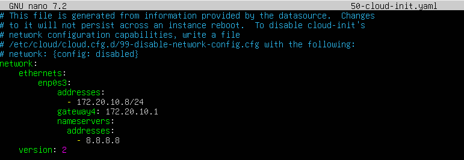

Т.к. перезапуск не считается первой иницализацией, то у меня все без проблем работает.
 
Применяю новые настройки:
```bash
sudo netplan apply
```
 
Проверяю:
```bash
ip a
```
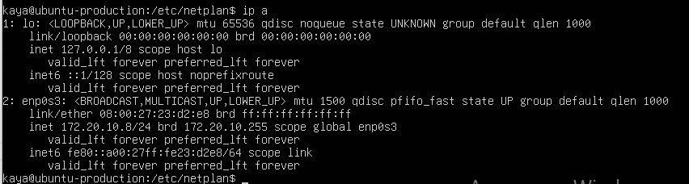
 
В `etc/hosts` в виндовс пропишу, как будем обращаться к машине (уважительно):
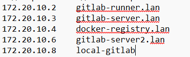
 
Дальше ставлю сам nginx:
```bash
sudo apt update
sudo apt install nginx-full -y
```
> * Сперва поставила простой nginx, но в нем не было модуля `stream`, который я использовала для 2222 порта, поэтому теперь сразу ставлю `nginx-full` 
 
Проверяю статус на `active`:
```bash
sudo systemctl status nginx
```
 
Добавлю конфигурацию для гитлаба:
```bash
sudo nano /etc/nginx/sites-available/gitlab-proxy.conf
```
 
#### Настройка реверса
Настраиваю nginx как реверс прокси, чтобы к гитлабу обращаться по `local-gitlab`, неважно, где он на самом деле:
 
```
upstream gitlab-backend {
    server 172.20.10.3:80;  
    # server 172.20.10.6:80;  
}

server {
    listen 80;
    server_name local-gitlab.lan;

    location / {
        proxy_pass http://gitlab-backend;
        proxy_set_header Host $host;
        proxy_set_header X-Real-IP $remote_addr;
        proxy_set_header X-Forwarded-For $proxy_add_x_forwarded_for;
        proxy_set_header X-Forwarded-Proto $scheme;
    }
}
```
 
* В блоке `upstream` пока сразу прописала два адреса, чтобы потом просто поменять
* Пишу `local-gitlab.lan`, потому что все остальные сервера делала в похожем стиле
 
Создаю символическую ссылку, чтобы активировать новый конфиг:
```bash
sudo ln -s /etc/nginx/sites-available/gitlab-proxy.conf /etc/nginx/sites-enabled/gitlab-proxy.conf
```
 
Проверяю конфиг на ошибки:
```bash
sudo nginx -t
```
 
Дальше делаю редирект с 2222 на 22, потому что дальше по заданию буду пробрасывать этот порт на гитлаб сервере в контейнер.
 
Объявляю блок `stream` на верхнем уровне. Вроде как лучше подключить конфигурацию, поэтому открываю конфиг:
```bash
sudo nano /etc/nginx/nginx.conf 
```

И подключаю:
```bash
include /etc/nginx/gitlab-stream.conf;
```
 
Затем создаю файл с таким названием:
```bash
sudo nano /etc/nginx/gitlab-stream.conf
```

И в нем прописываю сам редирект:
```
stream {
    upstream gitlab-ssh {
        server 172.20.10.3:2222;  
        # server 172.20.10.6:2222;
    }

    server {
        listen 2222;
        proxy_pass gitlab-ssh;
    }
}
```
 
Еще раз проверяю, что все ок:
```bash
sudo nginx -t
```

Перезапускаю nginx:
```bash
sudo systemctl restart nginx
```
 
Проверяю, что работает:
```bash
sudo systemctl status nginx 
```
 
Добавляю запись c `local-gitlab.lan` в `/etc/hosts` на виндовс и еще раз проверяю, что все работает (но уже из браузера - http://local-gitlab.lan):

 
### 2.2.1. Установка Ansible на WSL (Ubuntu)
Открываю WSL и обновляю пакеты:
```bash
sudo apt update && sudo apt upgrade -y
```
 
Устанавливаю Ansible:
```bash
sudo apt install ansible -y
```
 
Проверяю, что Ansible установлен и работает:
```bash
ansible --version
```


 <details>
  <summary>Ремарка про версию ансибл</summary>
Я до этого смотрела разные версии ansible и к моменту второго прохождения задания у меня стояла ansible [core 2.17.12]
 
При запуске роли common столкнулась с ошибкой, что при использовании модуля yum на серверах с альмалинукс выскакивало:
```bash
SyntaxError: future feature annotations is not defined
```
 
Я думала, что проблема в устарешем питоне на серверах, но на них стоял свежий питон (версия 3.11) и зависимости. 

Как я поняла, истинная причина была такой:
 
Дело в Ansible 2.17, он ломается, пытаясь использовать свой же модуль на Python 3.11 в zip-виде:
- эта версия отправляет модули в zip-архивах на удалённые машины
- внутри zip-архивов есть файлы с конструкцией `from __future__ import annotations`
- такая конструкция не работает при выполнении zip-архива через stdin в Python 3.11 
 
Я решила его поставить через pip:
 
1. Удалила текущий ансибл 
```bash
sudo apt remove --purge ansible -y
sudo apt autoremove -y
```
 
2. Установила pip, venv
```bash
sudo apt update
sudo apt install python3-pip python3-venv -y
```
 
Создала виртуальное окружение, чтобы изолировать ансибл и его зависимости:
```bash
python3 -m venv ~/ansible-venv
source ~/ansible-venv/bin/activate
```
 
Установила:
```bash
pip install ansible-core==2.14.18
pip install ansible==7.5.0
```

Вроде как:
- ansible-core 2.14.18 — последняя версия без проблем с future annotations в zip-модулях
- ansible==7.5.0 — включает нужные коллекции, совместим с этим ядром
 
Проверка, что все ок:
```bash
ansible --version
```
 
Как я поняла,  нужно удалить кэш старых zip-модулей, которые могли остаться после ансибл 2.17.
```bash
rm -rf ~/.ansible/tmp/*
rm -rf ~/.ansible/facts/cache/*
```
 
Создала симлинк, чтобы активировать окружение без указания полного пути - `source ./start_ansible_venv` 
```bash
ln -s ~/ansible-venv/bin/activate ./start_ansible_venv
```
</details>
 

### 2.2.2. Настройка на серверах SSH-доступа без пароля
> На серверах настроим вход по SSH без пароля - через ключи. Так удобнее и безопаснее + чтобы при масштабировании проекта ансибл мог подключаться ко всем серверам автоматически, без запроса пароля вручную при каждом подключении.
> Для этого на клиенте (в моем случае - WSL) должна быть пара ключей (приватный + публичный). Публичный добавляю на сервера, к которым буду подключаться.

Проверяю, что на серверах установлен OpenSSH Server (ну выше я ставила, но это так, для общей инструкции больше)
```bash
sudo systemctl status sshd
```
 
Проверяю, есть ли ключи на WSL:
```bash
ls ~/.ssh
```
 
У меня ключи есть (если бы не было, надо создать с помощью команды `ssh-keygen -t rsa -b 4096 -C "коммент, напр. почта"`)

 
Копирую публичный ключ на серверы. На каждой машине, к которой мы будем подключаться по SSH без пароля, надо разместить публичный ключ в `~/.ssh/authorized_keys`.
Можно вручную скопировать и вставить, можно на WSL с помощью команд:
```bash
ssh-copy-id kaya@172.20.10.2
ssh-copy-id kaya@172.20.10.3
ssh-copy-id kaya@172.20.10.4
```
 
* Использую `ssh-copy-id`, т.к. сейчас на серверах включён парольный доступ по SSH. Если на целевой сервер по паролю не подключиться, то добавлять ключи надо, конечно же, не так, например, руками
* При втором прохождении обращалась к серверам по адресам, т.к. еще не настроила статические + dnsmasq
 
### 2.2.3. Настройка инвентаря ансибл
Создаю каталог под проект:
```bash
mkdir -p /home/kaya/ansible-projects/rockot-it-tasks/task_6 && cd /home/kaya/ansible-projects/rockot-it-tasks/task_6
```
 
### 2.2.3.1. Бутстрап этап
Создаю инвентарь:
```bash
nano inventory.ini
```
> Инвентарь делаю единым для двух этапов: для бутстрап и для основного. Поэтому создаю в корне.
 
В инвентаре указываю две группы серверов по ip адресам. IP заполняю на основе команды ip addr на самих серверах, имена оставляю себе для ориентации:
```bash
[servers_on_almalinux]
gitlab-server ansible_host=172.20.10.3
docker-registry ansible_host=172.20.10.4

[servers_on_debian]
gitlab-runner ansible_host=172.20.10.2

[all:vars]
ansible_user=kaya
ansible_ssh_private_key_file=/home/kaya/.ssh/id_rsa
```
 
> Я прописала три сервера и единые переменные для всех хостов - имя пользователя и приватный ключ `~/.ssh/id_rsa` для аутентификации по SSH.
> 
> Из любопытного, наткнулась, что не всегда `~` в ансибл корректно распознается, и поэтому лучше писать абсолютный путь, поэтому прописала `/home/kaya/`.
  
Проверяю, что Ansible может подключиться к серверам:
```bash
ansible all -i inventory.ini -m ping
```
 
Вывод:
 


Главное, что нет серверов в статусе unreacheble. 
 
> Получаю ошибку: питона нет. Узнала, на моей Альме по умолчанию установлен только platform-python для работы системных утилит (для проверки сделала `ls -l /usr/libexec/platform-python`), но отсутствует CLI-интерпретатор (`which python3` ничего не выводит), необходимый Ансибл.
Поэтому в бутстрап плейбуке прописываю установку python3, чтобы ансибл мог его использовать для выполнения своих модулей.
 
Для бутстрап этапа я нашла raw-модуль, который работает без питона — это фактически "голый" SSH: отправь команду и получи вывод.
 
Сейчас сразу пропишу в инвентаре, на какой питон стоит ориентироваться в будущем. И т.к. на первых задачах в бутстрап плейбуке я отключила сборку фактов, то ансибл не будет ругаться, что путь к питону прописан, а самого питона нет.
> Спойлер, если установить питон из стандартного репозитория, он поставит версию 3.6, и позже будет ругаться, что для работы модулей ансибл нужна версия постарше. Поэтому ниже в бутстрап-плейбуке я ставлю конкретную версию 3.11 и прописываю ее в инвентаре.
 
```bash
[all:vars]
ansible_python_interpreter=/usr/bin/python3.11
```
 


Дальше. Настройка плейбука
 
### 2.2.3.2. Создаю бутстрап-плейбук 
Как я поняла, в бутстрап-плейбуке роли не нужны, т.к.:
* он выполняется один раз при инициализации системы
* он во многом зависит от конкретной архитектуры
 
Создаю плей:
```bash
nano bootstrap-playbook.yml
```
 
Наполняю
```yml
---
- name: Настройка серверов (bootstrap)
  hosts: all
  become: true
  gather_facts: false

  tasks:

    - name: Проверить наличие Python на сервере
      raw: |
        which python3.11 || python3.11 --version
      register: python_check
      changed_when: false
      failed_when: false

    - name: Вывести результат проверки Python
      debug:
        msg: >-
          
          На сервере {{ inventory_hostname }} уже установлен Python 3.11
          
          На сервере {{ inventory_hostname }} Python 3.11 не найден — будет установлен
          

    - name: Установить Python 3.11 и нужные pip-зависимости
      raw: |
        if [ -f /etc/redhat-release ]; then
          yum install -y epel-release
          yum install -y python3.11 python3.11-pip
          python3.11 -m pip install --upgrade pip
# при последующем прохождении добавить в строчку ниже установку еще двух библиотек - docker requests
          python3.11 -m pip install selinux cryptography PyYAML distro six 

        elif [ -f /etc/debian_version ]; then
          apt-get update
          apt-get install -y python3.11 python3.11-distutils python3.11-venv python3.11-pip
          python3.11 -m pip install --upgrade pip
# при последующем прохождении добавить в строчку ниже установку еще двух библиотек - docker requests
          python3.11 -m pip install selinux cryptography PyYAML distro six
        fi
      when: python_check.rc != 0

    - name: Получить версию Питон после установки
      raw: python3 --version || python --version
      register: python_version
      changed_when: false

    - name: Дебаг - Вывод версии установленного Питон
      debug:
        msg: "Версия Python на сервере {{ inventory_hostname }}: {{ python_version.stdout | replace('\r', '') | replace('\n', '') | trim }}"

    - name: Собрать факты после установки Python
      setup:

    - name: Настройка статического IP на Альмалинукс
      community.general.nmcli:
        conn_name: enp0s3
        ifname: enp0s3
        type: ethernet
        ip4: "{{ static_ip_map[inventory_hostname].address }}/{{ default_cidr }}"
        gw4: "{{ default_gateway }}"
        dns4: "{{ default_dns }}"
        state: present
      when: ansible_os_family == 'RedHat'

    - name: Активировать соединение enp0s3 после настройки
      command: nmcli con up enp0s3
      when: ansible_os_family == 'RedHat'

    - name:  Настройка статического IP на Дебиан (перезапись /etc/network/interfaces)
      ansible.builtin.copy:
        dest: /etc/network/interfaces
        content: |
          source /etc/network/interfaces.d/*

          auto lo
          iface lo inet loopback

          auto enp0s3
          iface enp0s3 inet static
              address {{ static_ip_map[inventory_hostname].address }}/{{ default_cidr }}
              netmask {{ default_netmask }}
              gateway {{ default_gateway }}
              dns-nameservers {{ default_dns }}
        mode: '0644'
      when: ansible_os_family == 'Debian'

    - name: Перезагрузка сервера Дебиан для применения изменений
      ansible.builtin.reboot:
        reboot_timeout: 300
      when:
        - ansible_os_family == 'Debian'
      tags: reboot

    - name: Проверка IP-адреса интерфейса enp0s3
      command: ip addr show enp0s3
      register: ip_check
      changed_when: false

    - name: Дебаг - IP интерфейса enp0s3
      debug:
        var: ip_check.stdout

    - name: Вывод — динамический или статический IP на серверах
      debug:
        msg: >-
          
          На интерфейсе enp0s3 используется динамический IP (DHCP)
          
          На интерфейсе enp0s3 используется статический IP
          

    - name: Обновление /etc/hosts на всех серверах
      blockinfile:
        path: /etc/hosts
        marker: "# {mark} ANSIBLE MANAGED BLOCK - LAN HOSTS"
        block: |
          
          {{ params.address }} {{ params.fqdn }} {{ params.hostname }}
          

    - name: Перезагрузка всех серверов для применения изменений
      ansible.builtin.reboot:
        reboot_timeout: 300
      when:
      tags: reboot

    - name: Проверка доступности gitlab-server.lan
      ansible.builtin.command: getent hosts gitlab-server.lan
      register: dns_check_gitlab
      changed_when: false

    - name: Проверка доступности docker-registry.lan
      ansible.builtin.command: getent hosts docker-registry.lan
      register: dns_check_registry
      changed_when: false

    - name: Проверка доступности gitlab-runner.lan
      ansible.builtin.command: getent hosts gitlab-runner.lan
      register: dns_check_runner
      changed_when: false

    - name: Проверка доступности local-gitlab.lan
      ansible.builtin.command: getent hosts local-gitlab.lan
      register: dns_check_local_gitlab
      changed_when: false

    - name: Дебаг - Проверка резолвинга имён
      debug:
        msg: |
          gitlab-server: {{ dns_check_gitlab.stdout }}
          docker-registry: {{ dns_check_registry.stdout }}
          gitlab-runner: {{ dns_check_runner.stdout }}
          gitlab-proxy: {{ dns_check_local_gitlab.stdout }}
```
> Примечание:
> * Изначально ставила питон на альмалинукс из оф. репозиториев командой `yum install -y python3`, но ставился питон 3.6 и ансибл ругался, что версия питона слишком старая, модули не могут выполниться, поэтому ставила из epel-release
> * Задача "- name: Проверка доступности local-gitlab.lan" появилась при выполнении 3 этапа, там подробности
> * Для роли docker registry потребовались билблиотеки docker requests, пока оставила комментариями на будущее
> 
 
Создаю директорию и файл для переменных:
```bash
mkdir group_vars && nano group_vars/all.yml
```
 
Наполняю:
```yml
default_gateway: 172.20.10.1
default_netmask: 255.255.255.240
default_dns: "8.8.8.8 1.1.1.1"
default_cidr: 28

static_ip_map:
  gitlab-server:
    fqdn: gitlab-server.lan
    hostname: gitlab-server
    address: 172.20.10.3

  docker-registry:
    fqdn: docker-registry.lan
    hostname: docker-registry
    address: 172.20.10.4

  gitlab-runner:
    fqdn: gitlab-runner.lan
    hostname: gitlab-runner
    address: 172.20.10.2

  gitlab-proxy:
    fqdn: local-gitlab.lan
    hostname: local-gitlab
    address: 172.20.10.8
```
 
### 2.2.3.3. Тестирую бутстрап-плейбук
Запускаю бутстрап-плейбук:
```bash
ansible-playbook -i inventory.ini bootstrap-playbook.yml --ask-become-pass
```
Примечание: пока тестировала бутстрап-плейбук, в один из разов не смогла запустить его так. Помогла команда
```bash
ANSIBLE_SSH_PIPELINING=false ansible-playbook -i inventory.ini bootstrap-playbook.yml --ask-become-pass 
```
 
Вывод:
 

 
### 2.2.4. Создаю структуру ролей
 
Создаю структуру ролей:
```bash
cd /home/kaya/ansible-projects/rockot-it-tasks/task_6
ansible-galaxy init roles/common
ansible-galaxy init roles/docker
ansible-galaxy init roles/gitlab_server
ansible-galaxy init roles/gitlab_runner
ansible-galaxy init roles/docker_registry
```
> Роль common создала не сразу. Опять слетело время. Так как это иногда случается, то пусть будет отдельная роль на такие случаи, ну и мб потом пригодятся настройки какие.
 
> Для памятки: после команд у нас создались соответствующие директории с единой структурой. Посмотреть можно с помощью `tree roles`:
 
>  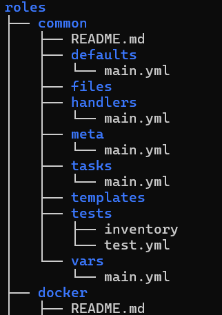
 
Пока роли пустые, буду наполнять по одной: наполнила, протестировала, пошла дальше. Чтобы потом не было всего в куче. 
 
### 2.2.5. Создаю основной плейбук 

Создаю плей:
```bash
nano playbook.yml
```
 
Наполняю
```yml
---
- name: Базовая настройка серверов (время, в будущем, может, что-то еще)
  hosts: all
  become: true
  roles:
    - common
  tags: common

- name: Установка докера на все серверы
  hosts: all
  become: true
  roles:
    - docker
  tags: docker

- name: Поднимаем гитлаб-сервер в докер-контейнере
  hosts: gitlab-server
  become: true
  roles:
    - role: gitlab_server
      tags: gitlab_server

- name: Поднимаем гитлаб-раннер в докер-контейнере
  hosts: gitlab-runner
  become: true
  roles:
    - gitlab_runner
  tags: gitlab_runner

- name: Поднимаем докер-регистри в докер-контейнере
  hosts: all
  become: true
  roles:
    - docker_registry
  tags: docker_registry
```
 
> Для каждой роли прописала тег, чтобы можно было запускать каждую роль по отдельности для отладки. Можно было бы прописать несколько тегов в квадратных скобках, но пока не придумала уместную для задачи ситуацию.
> 
> Кстати, я попутно узнала, что для ролей все пишут вместо пробелов нижнее подчеркивание, а для имен серверов в инвентори пишут дефис.
> Для гитлаб сервера сперва прописывала установку postfix, т.к. делала так в первом решении. Но в первом решении это архаизм, т.к. сперва я ставила гитлаб без докер контейнера. При установке в докер-контейнере все необходимое уже внутри есть, так что убрала

### 2.2.6. Роль common
#### 2.2.6.1. Создаю роль для базовой настройки системы
 
```bash
nano roles/common/tasks/main.yml
```
 
После
```yml
---
# tasks file for roles/common
```
 
Вставляю
```yml
# Настройка времени для ОС на базе RedHat
- name: Настройка времени для ОС на базе RedHat
  when: ansible_os_family == "RedHat"
  block:
    - name: Проверка наличия chrony
      yum:
        name: chrony
        state: present
        update_cache: yes

    - name: Настройка NTP-серверов в конфиге /etc/chrony.conf
      blockinfile:
        path: /etc/chrony.conf
        marker: "# {mark} ANSIBLE MANAGED NTP BLOCK"
        block: |
          server 0.pool.ntp.org iburst
          server 1.pool.ntp.org iburst
          server 2.pool.ntp.org iburst
          server 3.pool.ntp.org iburst

    - name: Перезапуск chronyd после изменения конфигурации
      service:
        name: chronyd
        enabled: true
        state: restarted

    - name: Принудительная синхронизация времени
      command: chronyc -a makestep
      register: chronyc_result
      changed_when: "'step' in chronyc_result.stdout"

    - name: Ждём, пока chronyd догонит (максимум 5 попыток)
      command: chronyc tracking
      register: chrony_tracking_status
      changed_when: false
      until: chrony_tracking_status.stdout is search('Leap status\s*:\s*Normal')
      retries: 5
      delay: 5

    - name: Дебаг - вывод ошибки, если время не синхронизировано (Leap status)
      fail:
        msg: "Время не синхронизировано: в выводе chronyc tracking — Leap status: НЕ Normal"
      when: chrony_tracking_status.stdout is not search('Leap status\s*:\s*Normal')

    - name: Дебаг - вывод сообщения, что все ок, если время синхронизировано (Leap status)
      debug:
        msg: "Время синхронизировано: в выводе chronyc tracking — Leap status: Normal"
      when: chrony_tracking_status.stdout is search('Leap status\s*:\s*Normal')

# Настройка времени для ОС на базе Debian
- name: Настройка времени для ОС на базе Debian
  when: ansible_os_family == "Debian"
  block:
    - name: Отключаем синхронизацию времени
      command: timedatectl set-ntp false

    - name: Ждём 1 секунду
      pause:
        seconds: 1

    - name: Включаем синхронизацию времени
      command: timedatectl set-ntp true

    - name: Проверка, есть ли синхронизация времени (NTPSynchronized)
      command: timedatectl show -p NTPSynchronized --value
      register: ntp_synchronized_status
      changed_when: false

    - name: Дебаг - вывод ошибки, если время не синхронизировано (NTPSynchronized)
      fail:
        msg: "timedatectl: Время НЕ синхронизировано — NTPSynchronized: no"
      when:
        - ntp_synchronized_status.stdout != "yes"

    - name: Дебаг - вывод сообщения, что все ок, если время синхронизировано (NTPSynchronized)
      debug:
        msg: "timedatectl: Время синхронизировано — NTPSynchronized: yes"
      when:
        - ntp_synchronized_status.stdout == "yes"
```
> По порядку про интересности:
> 1. Узнала про маркеры в blockinfile. Выглядит удобно - при повторном запуске плейбука ансибл не будет дублировать блок в рамках маркера, а еще можно вносить изменения именно в него и удалить, тоже только его. Решила добавить, чтобы захламлять конфиг при повторных прогонах.
> 
> 2. Здесь для Альмы использую `command`, потому что иначе не работает. 
> Я узнала, что:
> * По умолчанию chronyd не делает резкую синхронизацию (jump), если время отличается сильно — чтобы не сломать работу системных сервисов, которые чувствительны к скачкам времени. А на моих ВМ расхождение во времени более чем на месяц. 
> * По умолчанию, если `chronyd` обнаруживает большое расхождение (обычно больше 3 секунд), он переходит в режим "slew" — медленно «подтягивает» время, добавляя или убавляя доли секунд. Это безопасно, но может занять часы или дни, если расхождение большое (вроде месяца).
При этом `chronyd` всё равно считает, что он работает корректно — просто потихоньку выравнивает.
> 
> У меня сервер с нуля, так что сейчас резкий скачок времени ничего не сломает. В реальной среде, я пока не понимаю, как поступить. Думаю, что нужно оценить, насколько большое расхождение во времени; насколько критично сменить его прямо сейчас (или можно подождать); если критично - посмотреть, какие сервисы могут полететь и оценить риски
> 
> В рамках именно этой задачи я принудительно поставить правильное время сразу. Такая роль-костыль (потому что по идее время надо выравнивать также на этапе настойки ОС, без ансибл).
> 
> 3. Еще получается, что `makestep` будет выполняться в любом случае (т.к. это не модуль, а команда). По идее можно сделать проверку "выполнять только в таких-то случаях). Возможно, это будет уместно в проде (если вообще в проде уместно добавлять такую настройку времени через роль). И тогда можно оценить, при каких условиях принудительно синхронизировать время. Но сейчас так не делаю - в моем случае выполнять обязательно надо, иначе дальше ничего не поставится
> 
> 4. Для проверки, что все ок до,бавила мини-отладку - падение, если не синхронизировано и сообщения в случае успеха и провала
> 
> 5. Изначально роль была для альмалинукс, потом выяснилось, что на дебиан у меня тоже время отлетело, добавила

 
#### 2.2.6.2. Тест роли common
 
Запускаю плейбук:
```bash
ansible-playbook -i inventory.ini playbook.yml --ask-become-pass -v --tags common
```
 
Сработало!
 

 
### 2.2.7. Роль для установки докера
#### 2.2.7.1. Создаю роль для докера
```bash
nano roles/docker/tasks/main.yml
```
 
После
```yml
---
# tasks file for roles/docker
```
 
Вставляю:
```yml
# Установка Docker и КО на ОС на базе RedHat
- name: Установка Docker на ОС на базе RedHat
  when: ansible_os_family == "RedHat"
  block:
    - name: Добавление репозитория Docker CE (через yum_repository)
      yum_repository:
        name: docker-ce
        description: Docker CE Stable - $basearch
        baseurl: https://download.docker.com/linux/centos/8/$basearch/stable
        gpgcheck: yes
        enabled: yes
        gpgkey: https://download.docker.com/linux/centos/gpg

    - name: Установка docker-пакетов
      dnf:
        name:
          - docker-ce
          - docker-ce-cli
          - containerd.io
          - docker-buildx-plugin
          - docker-compose-plugin
        state: present

# Установка Docker на ОС на базе Debian 
- name: Установка Docker на Debian через apt
  apt:
    name: docker.io
    state: present
    update_cache: true
  when: ansible_os_family == "Debian"

# Запуск docker и добавление в автозагрузку
- name: Запуск docker и добавление в автозагрузку
  service:
    name: docker
    enabled: true
    state: started

# Добавление пользователя в группу docker
- name: Создание группы docker
  group:
    name: docker
    state: present

- name: Добавление пользователя в группу docker
  user:
    name: "{{ ansible_user }}"
    groups: [docker]
    append: yes

# Переподключение для обновления SSH-сессии (замена newgrp docker)
- name: Перезагрузка машины
  reboot:
    reboot_timeout: 300

# Проверка docker через hello-world
- name: Проверка docker через hello-world
  command: docker run --rm hello-world
  register: docker_hello_output
  changed_when: false
  ignore_errors: true

- name: Вывод результата STDOUT hello-world
  debug:
    var: docker_hello_output.stdout_lines

- name: Вывод результата STDERR hello-world
  debug:
    var: docker_hello_output.stderr_lines
  when: docker_hello_output.rc != 0

- name: Остановка плейбука, если docker не работает
  fail:
    msg: "Падаем, докер не работает. Выше логи."
  when: docker_hello_output.rc != 0

- name: Настройка использования локального регистри по http
  when: inventory_hostname == "gitlab-runner"
  template:
    src: daemon.json.j2
    dest: /etc/docker/daemon.json
    owner: root
    group: root
    mode: '0644'

- name: Перезапуск docker
  when: inventory_hostname == "gitlab-runner"
  service:
    name: docker
    state: restarted
```
 
Создаю шаблон:
```bash
nano roles/docker/templates/daemon.json.j2
```
 
Вставляю:
```json
{
  "insecure-registries": ["{{ docker-registry.lan:5000"]
}
```
 
> Что было интересного тут:
> * Обновление групп пользователя. И вот почему:
>    * `newgrp docker` не подходит, т.к. в ансибл команда сработает только в рамках одной задачи: запускается новая шелл-сессия, применяется группа и сразу все завершается, т.е. на следующие задачи это не повлияет
>    * Узнала про `meta: reset_connection`. Думала, что поможет, т.к. она закрывает и устанавливает новое SSH-соединение. Но оказалось, что не поможет. Т.к. это не полноценный разлогин/логин: пользователь тот же, логин-сессия не пересоздаётся. Т.е. полезно, если нужно обновить окружение, но для обновления групп пользователя не подходит.
>    * Узнала, что в ансибл есть полноценный аналог "выйти и зайти нормально". `reboot` перезагружает сервер, ждёт, пока тот поднимется, и переподключается сам. Я думала, что запросит пароль для судо, но оказалось, что все ок: ансиблу достаточно того, что он уже получил пароль один раз, а дальше он просто использует его. 
> 
>         Думаю, что при настройке сервера с нуля, как сейчас в задаче - так можно делать спокойно. А если это уже работающий сервер с другими сервисами, то так не надо. В целом, можно продолжать работать с докером через `sudo` - ничего от этого не случится плохого. Если по какой-то причине нужно работать от определнного пользователя и без судо, то:
>        * лучше перезагрузить сервер руками
>        * там, где я добавляю в группу `ansible_user` есть смысл прописать свою переменную с именем нужного пользователя, если это не тот же, от лица которого мы подключаемся
> 
>         ps. хотя все равно думаю, что это избыточно, и можно работать из под текущего юзера с судо.
> 
> * Попыталась добавить отладку для проверки работоспособности докера. Как я поняла, `hello word` дает наибольшее представление о его статусе, поэтому оставила ее, как предлагают в доке, и ориентировалась на ее вывод
> * В задаче по проверке докера через `hello-world` поставила `ignore_errors: true` не чтобы игнорировать ошибки, а как раз для отладки, чтобы можно было понять, что пошло не так с полноценным выводом
> * Изначально роль была другая (первая версия роли ниже, в приложении):
>     * Для Альмы использовала добавляла репозиторий докера через command. Увидела предупрждение от докера - `[WARNING]: Consider using the dnf module rather than running 'dnf'.  If you need to use command because dnf is insufficient you can add 'warn: false' to this command task or set 'command_warnings=False' in ansible.cfg to get rid of this message.` -, изменила на добавление репозитория с помощью `yum_repository`
>     * Для Дебиан сперва устанавливала докер аналогично его оф. инструкции. После комментария Юры сменила на установку из apt, чтобы уменьшить количество шагов. На Альмалинукс не стала ставить через yum/dnf, так как команда установки докера ставит подман
> * Добавила разрешение раннеру обращаться к докер регистри по http
> 
 
 <details>
<summary><strong>Приложение: установка докер по оф. инструкции (сложнее)</strong></summary>
Сама роль: 

```yml
# Установка Docker на ОС на базе RedHat
- name: Установка Docker на ОС на базе RedHat
  when: ansible_os_family == "RedHat"
  block:
    - name: Установка dnf-плагина
      yum:
        name: dnf-plugins-core
        state: present

    - name: Добавление репозитория docker
      command:
        cmd: dnf config-manager --add-repo https://download.docker.com/linux/centos/docker-ce.repo
        creates: /etc/yum.repos.d/docker-ce.repo

    - name: Установка docker-пакетов
      yum:
        name:
          - docker-ce
          - docker-ce-cli
          - containerd.io
          - docker-buildx-plugin
          - docker-compose-plugin
        state: present

# Установка Docker на ОС на базе Debian 
- name: Установка Docker на ОС на базе Debian
  when: ansible_os_family == "Debian"
  block:
    - name: Установка зависимостей
      apt:
        name:
          - ca-certificates
          - curl
        state: present
        update_cache: true

    - name: Создание директории для ключей
      file:
        path: /etc/apt/keyrings
        state: directory
        mode: '0755'

    - name: Скачивание GPG ключа docker
      get_url:
        url: https://download.docker.com/linux/debian/gpg
        dest: /etc/apt/keyrings/docker.asc
        mode: '0644'

    - name: Добавление репозитория docker вручную
      block:
        - name: Формируем строку репозитория docker
          set_fact:
            docker_repo_entry: >-
              deb [arch=amd64 signed-by=/etc/apt/keyrings/docker.asc]
              https://download.docker.com/linux/debian
              {{ ansible_lsb.codename }} stable

        - name: Вставка репозитория в docker.list
          lineinfile:
            path: /etc/apt/sources.list.d/docker.list
            line: "{{ docker_repo_entry }}"
            create: yes

    - name: Обновление кэша репозиториев
      apt:
        update_cache: yes

    - name: Установка docker-пакетов
      apt:
        name:
          - docker-ce
          - docker-ce-cli
          - containerd.io
          - docker-buildx-plugin
          - docker-compose-plugin
        state: present

# Запуск docker и добавление в автозагрузку
- name: Запуск docker и добавление в автозагрузку
  service:
    name: docker
    enabled: true
    state: started

# Добавление пользователя в группу docker
- name: Создание группы docker
  group:
    name: docker
    state: present

- name: Добавление пользователя в группу docker
  user:
    name: "{{ ansible_user }}"
    groups: [docker]
    append: yes

# Переподключение для обновления SSH-сессии (замена newgrp docker)
- name: Перезагрузка машины
  reboot:
    reboot_timeout: 300

# Проверка docker через hello-world
- name: Проверка docker через hello-world
  command: docker run --rm hello-world
  register: docker_hello_output
  changed_when: false
  ignore_errors: true

- name: Вывод результата STDOUT hello-world
  debug:
    var: docker_hello_output.stdout_lines

- name: Вывод результата STDERR hello-world
  debug:
    var: docker_hello_output.stderr_lines
  when: docker_hello_output.rc != 0

- name: Остановка плейбука, если docker не работает
  fail:
    msg: "Падаем, докер не работает. Выше логи."
  when: docker_hello_output.rc != 0
```
</details>
 
 
#### 2.2.7.2. Тестирую роль для докера
 
Запускаю плейбук:
```bash
ansible-playbook -i inventory.ini playbook.yml --ask-become-pass -v --tags docker
```
 
Тесты пройдены:
 


### 2.2.8. Роль для установки гитлаб-сервера
#### 2.2.8.1. Установка модуля докер для ансибл
Нашла такой, устанавливаю:
```bash
ansible-galaxy collection install community.docker
```
 
#### 2.2.8.2. Создаю роль для gitlab_server
```bash
nano roles/gitlab_server/tasks/main.yml
```
 
После
```yml
---
# tasks file for roles/gitlab_server
```

Вставляю
```yml
- name: Создание директории для данных gitlab server
  file:
    path: "{{ item }}"
    state: directory
    mode: '0755'
  loop:
    - "{{ gitlab_base_dir }}"
    - "{{ gitlab_config_dir }}"
    - "{{ gitlab_logs_dir }}"
    - "{{ gitlab_data_dir }}"
    - "{{ gitlab_backups_dir }}"

- name: Копирование docker-compose.yml 
  template:
    src: docker-compose.yml.j2
    dest: "{{ gitlab_base_dir }}/docker-compose.yml"
    mode: '0644'

- name: Запуск gitlab server через docker compose
  community.docker.docker_compose_v2:
    project_src: "{{ gitlab_base_dir }}"
    state: present
  register: compose_result

- name: Дебаг - вывод результата запуска gitlab server
  debug:
    msg: >-
      
      Были изменения: контейнер gitlab server запустился.
      
      Без изменений: контейнер gitlab server уже был.
      

- name: Проверка доступности gitlab server по HTTP
  uri:
    url: "{{ gitlab_external_url }}"
    status_code: 200
  register: gitlab_check
  retries: 20
  delay: 30
  until: gitlab_check.status == 200

- name: Дебаг - вывод результата проверки gitlab server по HTTP
  debug:
    msg: >-
      
      Gitlab server доступен по адресу {{ gitlab_external_url }}.
      
      Gitlab server недоступен по адресу {{ gitlab_external_url }}: {{ gitlab_check.status }}
      
```
* Изначально давала меньше времени для задачи проверки по http, но на моих ВМ долго стартует
 
Определяю переменные для роли:
```bash
nano roles/gitlab_server/defaults/main.yml
```
 
После:
```yml
---
# defaults file for roles/gitlab_server
```
 
Вставляю:
```yml
gitlab_version: "17.9.3-ce.0"

gitlab_hostname: "local-gitlab.lan"
gitlab_external_url: "http://local-gitlab.lan"

gitlab_ssh_port: 2222
gitlab_http_port: 80
gitlab_https_port: 443

gitlab_root_password: "verYstr0nGOcheNNN"

gitlab_base_dir: "/srv/gitlab"
gitlab_config_dir: "{{ gitlab_base_dir }}/config"
gitlab_logs_dir: "{{ gitlab_base_dir }}/logs"
gitlab_data_dir: "{{ gitlab_base_dir }}/data"
gitlab_backups_dir: "{{ gitlab_data_dir }}/backups"
```
 
Создаю шаблон
```bash
nano roles/gitlab_server/templates/docker-compose.yml.j2
```
 
Вставляю:
```yml
version: '3.6'

services:
  gitlab:
    image: gitlab/gitlab-ce:{{ gitlab_version }}
    container_name: gitlab
    restart: always
    hostname: '{{ gitlab_hostname }}'
    environment:
      GITLAB_ROOT_PASSWORD: "{{ gitlab_root_password }}"
      GITLAB_OMNIBUS_CONFIG: |
        external_url '{{ gitlab_external_url }}'
        gitlab_rails['gitlab_shell_ssh_port'] = {{ gitlab_ssh_port }}
    ports:
      - '{{ gitlab_http_port }}:80'
      - '{{ gitlab_https_port }}:443'
      - '{{ gitlab_ssh_port }}:22'
    volumes:
      - '{{ gitlab_config_dir }}:/etc/gitlab'
      - '{{ gitlab_logs_dir }}:/var/log/gitlab'
      - '{{ gitlab_data_dir }}:/var/opt/gitlab'
      - '{{ gitlab_backups_dir }}:/var/opt/gitlab/backups'
    shm_size: '256m'
```

#### 2.2.8.3. Тестирую роль для gitlab_server
 
Запускаю плейбук:
```bash
ansible-playbook -i inventory.ini playbook.yml --ask-become-pass -v --tags gitlab_server
```
 
Тесты пройдены:

 
### 2.2.9. Захожу в гитлаб-сервер, получаю токен для будущего раннера
> Выглядит пока так, что это нужно будет делать вручную.
 
В ручном способе я получала пароль администратора вручную. Сейчас задала его при поднятии.
 
Захожу в GitLab под пользователем root, ввожу пароль.

Я в здании:
 
Снова уведомлялка, что любой пользователь может зарегистрироваться самостоятельно. Так как мой GitLab — локальный и приватный, открытая регистрация не нужна. Жмакаю `Deactivate`, чтобы отключить создание аккаунтов для всех, кроме администратора.
 
Как и при ручной установке:
- Создаю первый проект:

 
- Проверяю, что SSH-URL проекта с портом 2222, а не 22:

 
> Вижу уведомелние:
> 
> Сразу с ним разберемся. Допустим, пушать буду с всл. Кликаю по синей кнопке и вставляю вывод `cat ~/.ssh/id_rsa.pub` с всл 
 
Получаю токен для **Instance Runner** (чтобы он был доступен для всех проектов в GitLab и не был привязан к какому-то конкретному репозиторию).
 
1. Перехожу в интерфейс гитлаба: http://local-gitlab.lan/admin/runners
2. Settings → CI/CD → Runners
3. Жму `New Instance Runner`
4. Заполняю:

5. Жму кнопку Create Runner, которая раньше меня смущала своим названием
> Как я понимаю, мы в интерфейсе гитлаба создаем описание раннера, гитлаб под него создает "пустой слот",  выдает нам данные для регистрации раннера, мы раннер регистрируем с помощью gitlab-runner register, зареганный раннер подключается с нужным токеном, и после подключения раннер активируется и привязывается к этому слоту
6. Беру токен и несу в переменные - `glrt-t1_1txE2igLA_mE452T_EnJ`

 
### 2.2.10. Роль для установки гитлаб-раннера
#### 2.2.10.1. Создаю роль
```bash
nano roles/gitlab_runner/tasks/main.yml
```
 
После
```yml
---
# tasks file for roles/gitlab_runner
```
 
Вставляю
```yml
- name: Создание каталога под докер вольюм для хранения конфигов
  file:
    path: "{{ gitlab_runner_config_path }}"
    state: directory
    owner: root
    group: root
    mode: "0755"
    recurse: yes

- name: Запуск контейнера gitlab-runner
  community.docker.docker_container:
    name: gitlab-runner
    image: gitlab/gitlab-runner:latest
    restart_policy: always
    state: started
    volumes:
      - /var/run/docker.sock:/var/run/docker.sock
      - "{{ gitlab_runner_config_path }}:/etc/gitlab-runner"
    etc_hosts:
      local-gitlab.lan: "{{ gitlab_ip }}"

- name: Регистрация gitlab-runner
  community.docker.docker_container_exec:
    container: gitlab-runner
    command: >
      gitlab-runner register
      --non-interactive
      --url "{{ gitlab_runner_url }}"
      --registration-token "{{ gitlab_runner_token }}"
      --executor "{{ gitlab_runner_executor }}"
      --description "{{ gitlab_runner_description }}"
      --tag-list "{{ gitlab_runner_tags }}"
      --run-untagged="true"
      --locked="false"
      --docker-image "{{ gitlab_runner_image }}"

- name: Ожидание появления config.toml
  ansible.builtin.wait_for:
    path: "{{ gitlab_runner_config_path }}/config.toml"
    state: present
  timeout: 10

- name: Добавление extra_hosts в config.toml
  ansible.builtin.lineinfile:
    path: "{{ gitlab_runner_config_path }}/config.toml"
    insertafter: '\[runners.docker\]'
    line: '  extra_hosts = {{ gitlab_runner_add_host | to_json }}'
```
> * `etc_hosts` - аналог `--add-host` и добавляет строчку в `/etc/hosts` контейнера раннера, чтобы сам раннер мог зарегистрироваться на гитлаб сервере.
> * `extra_hosts` - добавляет строчку в `/etc/hosts` каждого джоб-контейнера, который запускаеи раннер. Чтобы джобы могли достучаться до гитлаб сервера по имени.
  
Определяю переменные для роли:
```bash
nano roles/gitlab_runner/defaults/main.yml
```
 
После:
```yml
---
# defaults file for roles/gitlab_runner
```
 
Вставляю:
```yml
gitlab_host: "local-gitlab.lan"
gitlab_ip: "172.20.10.8"

gitlab_runner_config_path: "/srv/gitlab-runner/config"
gitlab_runner_token: "glrt-t1_1txE2igLA_mE452T_EnJ"  # надо менять
gitlab_runner_url: "http://{{ gitlab_host }}"
gitlab_runner_description: "docker-runner"
gitlab_runner_tags: "docker"
gitlab_runner_executor: "docker"
gitlab_runner_image: "alpine:latest"
gitlab_runner_add_host:
  - "{{ gitlab_host }}:{{ gitlab_ip }}"
```
> * При первом прохождении делала докер вольюм (`sudo docker volume create gitlab-runner-config`). Юра писал, что с каталогами проще, а /srv/gitlab-runner/config было в примерах в доке, поэтому взяла такую директорию
> * Про `{{ hostvars['gitlab-server']['ansible_host'] }}` - вроде удобно, если только 3 контейнера развернуть. Но если масштабировать, наверное, удобнее прописать вручную адрес. Пока так оставила
 
#### 2.2.10.2. Тестирую роль для gitlab_runner
 
Запускаю плейбук:
```bash
ansible-playbook -i inventory.ini playbook.yml --ask-become-pass -v --tags gitlab_runner
```
 
По тестам все ок:

 
#### 2.2.10.3. Вручную проверяю работу на тестовом пайплайне
 
Работаю с всл, с нее же проверяю подключение:
```bash
ssh -T -p 2222 git@local-gitlab.lan
```
> * -p 2222 - потому что ранее пробрасывали его вместо 22
 
Как обычно, если не просят пароль, значит все хорошо:
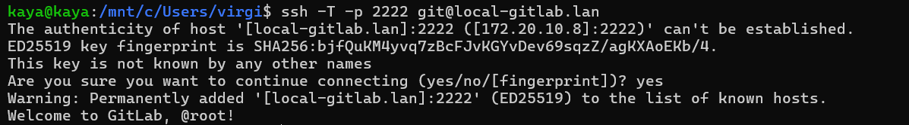
  
Клонирую проект по SSH
```bash
cd /home/kaya/repos/from_local_gitlab
git clone ssh://git@local-gitlab.lan:2222/root/test-project-1.git
```
> Тут погуглила, что SSH-ссылки бывают в короткой и длинной форме.
> По умолчанию - короткая.
> Длинная используется, когда у нас нестандартный порт или нужен URI-формат.
  
Проверяю, что у меня нужные настройки гита:
```bash
git config --list
```
  
Создаю тестовый ci-cd:
```bash
cd test-project-1
```
  
```bash
nano .gitlab-ci.yml
```
 
Вставляю (обязательно с тегом докер, т.к. раннер создавала с тегом):
```bash
stages:
  - test

echo_ok_job:
  stage: test
  tags:
    - docker
  script:
    - echo "ok"
```
 
Проверяю название ветки:
```bash
git branch --show-current
```
Никакое, потому что при создании репозитория я сняла галочку с создания ридми, и репозиторий оказался пустой:
 

 
Создаю ветку, сохраняю изменения и делаю пуш:
```bash
git checkout -b main
git add .
git commit -m "add test .gitlab-ci.yml"
git push -u origin main
```
 
Проверяю в UI гитлаба, что все в порядке:
Project → Build → Pipelines:

> Первый не появлялся минуту-две, и я запустила второй (без указания тега докер). Когда зашла проверить, поняла, что все просто тормозит, но работает


> Во второй раз (когда добавила nginx) с новым url тоже все ок:
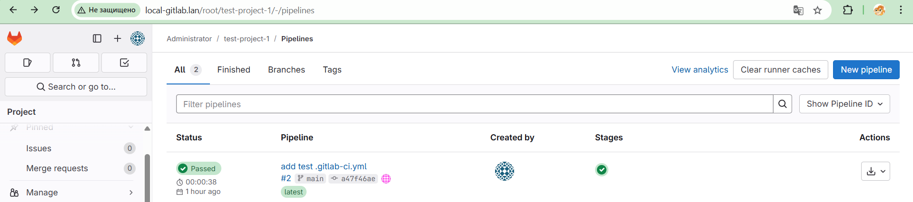
 
### 2.2.11. Роль для установки docker_registry
#### 2.2.11.1. Создаю роль
```bash
nano roles/docker_registry/tasks/main.yml
```
 
После
```yml
---
# tasks file for roles/docker_registry
```
 
Вставляю
 
```yml
# роль под установку на альмалинукс
- name: Установка docker registry
  when: inventory_hostname == "docker-registry"
  block:
# при последующем прохождении проверить, что это ставится в бутстрап плейбуке, и убрать отсюда
  - name: Установка библиотек docker и requests
    ansible.builtin.pip:
     name:
       - docker
       - requests

  - name: Создание каталога под докер вольюм
    ansible.builtin.file:
      path: "{{ registry_data_dir }}"
      state: directory
      owner: root
      group: root
      mode: "0755"
      recurse: yes

  - name: Запуск контейнера registry
    community.docker.docker_container:
      name: registry
      image: registry:2
      restart_policy: always
      state: started
      volumes:
        - "{{ registry_data_dir }}:/var/lib/registry"
      ports:
        - 5000:5000

  - name: Открываю порт 5000
    ansible.builtin.command: firewall-cmd --permanent --add-port=5000/tcp
    become: true
    register: firewalld_open_port
    changed_when: "'success' in firewalld_open_port.stdout or 'already' in firewalld_open_port.stdout"

  - name: Применяю изменения firewalld 
    ansible.builtin.command: firewall-cmd --reload
    become: true

- name: Проверка доступности docker registry
  when: inventory_hostname == "gitlab-runner"
  block:
    - name: Проверка сервера с гитлаб-раннер
      ansible.builtin.uri:
        url: "http://{{ hostvars['docker-registry']['ansible_host'] }}:5000/v2/_catalog"
        status_code: 200
        return_content: yes
      register: registry_check
      retries: 5
      delay: 3
      until: registry_check.status == 200

    - name: Вывод ответа
      ansible.builtin.debug:
        var: registry_check.content
```
> * После этой роли сменила в основном плейбуке `hosts` с `docker-registry` на `all`, чтобы была внешняя проверка подключения с гитлаб раннера
> * Подписала, что роль под редхат на случай, если потом под регистри будет выделен сервер с дебиан, чтобы сразу дописать развилку на выбор ОС
> * Библиотеку `docker` и `requests` ставлю, потому что требуется в задаче "Запуск контейнера registry". Т.к. сейчас установка модулей питона у меня идет через `raw`, то просто дописать в bootstrap плейбук эти модули и прогнать его заново я не могу, т.к. проверка выполнения задач там ручная. Поэтому прописала комментариями, что при последующем прогоне, если такой будет, там добавить модули, а здесь задачку убрать. Она, конечно, повторно не выполнится, но для чистоты.
> * Про открытие порта 5000. Нашла модуль `ansible.posix.firewalld`, но он работает только, если на целевом хосте стоит библиотека `firewall`. Эта библиотека, как я узнала, - питон-биндинг для работы с сервисом firewalld через D-Bus в Linux. Т.к. firewalld — это системный сервис, а библиотека firewall в том числе зависит от зависит от системных C-библиотек и D-Bus API, то она поставляется как rpm-пакет. Сами rpm-пакеты собираются именно под системные версии питона. Для Альмы - это 3.6 или 3.9. У меня изначально питон не стоял на сервере, а при установке 3.6 возникли проблемы с использованием части модулей ансибл, поэтому я в бутстрап-плейбуке ставила питон 3.11. Соответственно, сейчас мне либо параллельно поставить питон 3.6, и прописать в задаче явное его использование, либо выполнить открытие порта через command. Я пошла по второму пути
 
Определяю переменные для роли:
```bash
nano roles/docker_registry/defaults/main.yml
```
 
После:
```yml
---
# defaults file for roles/docker_registry
```
 
Вставляю:
```yml
registry_data_dir: "/srv/registry/data"
docker_data_dir: "/etc/docker"
```
 
#### 2.2.10.2. Тестирую роль для docker_registry
 
Запускаю плейбук:
```bash
ansible-playbook -i inventory.ini playbook.yml --ask-become-pass -v --tags docker_registry
```
 
По тестам все ок:
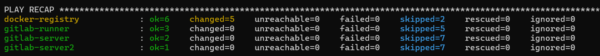
 
## Этап 3. Бекап/восстановление гитлаб сервера
> **Описание**
> 
> Вводится дополнительный сервер с такой же конфигурацией. Производится перенос гитлаба с первого сервера на новый. После отключение (без удаления!!!) первого сервера. После всех работ стенд должен остаться рабочим.
> 
> На выходе описание действий и возникшие проблемы.
 
### Возникшие проблемы
Друзья, я не знала, что такое бэкап и рестор и чем они отличаются от миграции, поэтому перед вами решение, как мигрировать на другой сервер

 
В общем да, мне не хватило контекста. Я думала, что создать сервер с такой же конфигурацией не относится к части `ip` и `hostname`, поэтому создала похожую ВМ с отличающимися данными. И при чтении доки часть про то, что конфиги не сохраняются при бэкапе навела меня на мысль о том, что раз сервер новый, надо и конфиги менять:
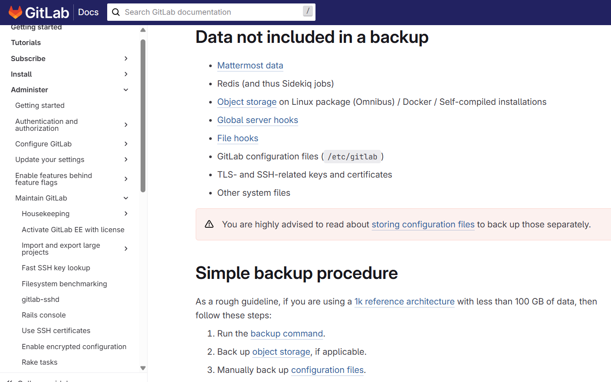
 
И в общем туда-сюда, я начала делать миграцию. Сейчас я поняла, что если только бэкап-рестор, значит мы по заданию не меняем `ip` и `hostname`, чтобы ничего не сломалось. 
 
Про миграцию: нашла узкое место в том, что в конфигах у меня везде было прописано `gitlab-server.lan`. Поэтому проще было бы правда создать сервер точь в точь. В общем, я еще сделала на отдельной ВМ nginx под гитлаб, чтобы везде в конфигах прописать один адрес для обоих серверов. По ходу решения сделала я это на этом этапе, а потом все прогнала заново. Но саму часть с описанием того, что именно делала, вставила повыше, чтобы было понятнее, если открою когда-нибудь совсем потом. 


### 3.1. Подготовка нового сервера
#### Создание ВМ
Шаги такие же, как в "1.1. Настройка GitLab сервер (almalinux)", только при установке ОС пара моментов:
1. `hostname` - `gitlab-server2.lan`
2. IP-адрес сразу пишу нужный, т.к. в ансибл роли по настройке сервера статическим делается уже выданный машине адрес:
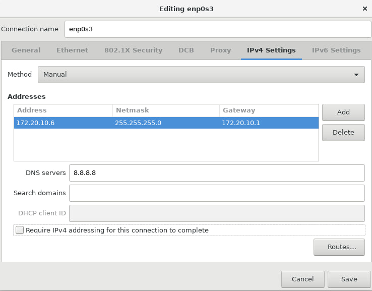

После установки также проверяю, что SSH стоит:
```bash
sudo systemctl status sshd
```
 
Проверяю адрес машины
```bash
ip addr
```
 
Проверяю хостнейм:
```bash
hostname
```
  
Запись в `/etc/hosts` пока не делаю.
 
На хосте с Windows настраиваю hosts:
1. Пуск → Поиск → Блокнот → ПКМ → Запуск от имени администратора
2. В блокноте открываю путь `C:\Windows\System32\drivers\etc\`
3. Выбираю тип файла "Все файлы"
4. Из появившегося списка выбираю `hosts`
5. Вставляю:
```bash
172.20.10.6    gitlab-server2.lan
```
6. Сохраняю
 
#### Изменение ансибл плейбуков/ролей, чтобы настроить сервер и рассказать другим ВМ о нем
На машине с ансибл копирую публичный ключ на новый сервер:
```bash
ssh-copy-id kaya@172.20.10.6
```
 
Затем редактирую инвентарь
```bash
nano inventory.ini
```
 
Дальше подготовка к прогону бутстрап роли, что настроить новую ВМ + прописать на другие строчку с ней в `/etc/hosts`.
 
Добавляю новый сервер в инвентарь:
```bash
[servers_on_almalinux]
gitlab-server ansible_host=172.20.10.3
gitlab-server2 ansible_host=172.20.10.6
docker-registry ansible_host=172.20.10.4

[servers_on_debian]
gitlab-runner ansible_host=172.20.10.2

[all:vars]
ansible_user=kaya
ansible_ssh_private_key_file=/home/kaya/.ssh/id_rsa
ansible_python_interpreter=/usr/bin/python3.11
```
 
Редактирую переменные для бутстрап плейбука:
```bash
nano group_vars/all.yml
```
 
Добавляю данные для нового сервера:
```bash
  gitlab-server2:
    fqdn: gitlab-server2.lan
    hostname: gitlab-server
    address: 172.20.10.6
```
 
В сам бутстрап-плейбук:
```bash
nano bootstrap-playbook.yml
```

Добавляю проверку доступности нового имени:
```bash
    - name: Проверка доступности gitlab-server2.lan
      ansible.builtin.command: getent hosts gitlab-server2.lan
      register: dns_check_gitlab_server2
      changed_when: false
```

И чек:
```bash
    - name: Дебаг - Проверка резолвинга имён
      debug:
        msg: |
          gitlab-server: {{ dns_check_gitlab.stdout }}
          docker-registry: {{ dns_check_registry.stdout }}
          gitlab-runner: {{ dns_check_runner.stdout }}
          gitlab-proxy: {{ dns_check_local_gitlab.stdout }}
          gitlab-server2: {{ dns_check_gitlab_server2.stdout }}
```
 
Запускаю:
```bash
ansible-playbook -i inventory.ini bootstrap-playbook.yml --ask-become-pass
```
 
Все ок:
 
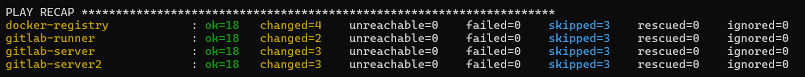
 
Запускаю `common` роль для настройки нового сервера и ставлю докер:
```bash
ansible-playbook -i inventory.ini playbook.yml --ask-become-pass -v --tags common,docker --limit gitlab-server2
```
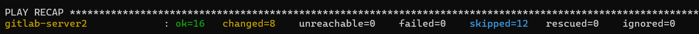
 
### 3.3. Миграция
Как я поняла, при миграции план такой:
1. Поднять новый гитлаб-сервер на новом сервере, чтобы он корректно создал все, что ему нужно 
2. Остановить поднятый гитлаб (чтобы безопасно подложить новые конфиги) 
3. Уже тут можно предупредить пользователей текущего гитлаба, и сделать так, чтобы они не вносили изменения
4. Создать бэкап средствами гитлаба + проверить, что все ок, мы его видим
5. Остановить старый гитлаб (без удаления)
6. Перенести бэкап на новый сервер
7. Перенести текущие конфиги на новый сервер
8. На новом сервере запустить гитлаб + сделать `reconfigure`
9. Остановить сервисы, которыe могут работать с БД - `puma`, `sidekiq` и еще `cron`
10. Убедиться через статус сервисов, что они точно остановлены
11. Запустить рестор
12. Рестартануть контейнер гитлаба, дождаться статуса `Up (Healthy)`
13. Убедиться, что все ок с помощью `docker exec -it gitlab gitlab-rake gitlab:check SANITIZE=true`
14. Проверить ручками, что все ок. Я проверила проект, пайплайн, возможность запустить еще один пайплайн с гитлаб-раннера но думаю, надо проверить еще
15. Если используем прокси - перенастроить

> Возникшие проблемы: не сразу поняла, какой должен быть корректный порядок действий. 

#### Разворачиваю гитлаб на новом сервере
В плейбуке меняю роль для установки гитлаб сервера (добавляю хост, по идее лучше группу в инвентори создать под гитлаб-сервера, но пока сервера всего два, это избыточно)
```yml
- name: Поднимаем гитлаб-сервер в докер-контейнере 
  hosts: gitlab-server, gitlab-server2
  become: true
  roles:
    - role: gitlab_server
      tags: gitlab_server
```
 
Запускаю плейбук только для установки гитлаб-сервера на новом узле:
```bash
ansible-playbook -i inventory.ini playbook.yml --ask-become-pass -v --tags gitlab_server --limit gitlab-server2
```
 
В браузере смотрю, что гитлаб поднялся:
http://gitlab-server2.lan
 
И в консоли:
```bash
ssh -T -p 2222 git@gitlab-server2.lan
```
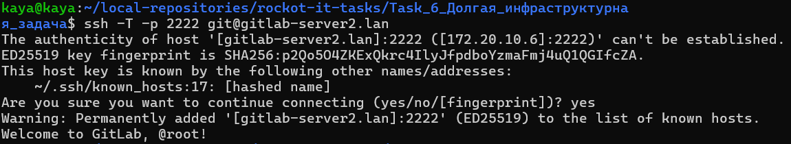
 
#### Сама миграция (бэкап+рестор+конфиги)

##### Шаги на обоих серверах
 
Ставлю `rsync`, потому что у меня его нет:
```bash
sudo dnf install rsync -y
```

##### Шаги на новом сервере
 
Останавливаю поднятый гитлаб-сервер, чтобы без проблем подсунуть новые данные (конфиги и бэкап):
```bash
cd /srv/gitlab
docker compose down
```

##### Шаги на старом сервере по подготовке к миграции
 
По идее, если бы были пользователи, то сообщить о миграции и
* либо убрать сервер из nginx, чтобы он временно был недоступен (чтобы не появилось новых изменений, не вошедших в бэкап)
* либо вроде есть специальная опция на платном гитлабе (Maintenance mode)
 
Дальше делаю сам бэкап:
```bash
docker exec -t gitlab gitlab-backup create
```
 
Проверяю, что есть:
```bash
cd /srv/gitlab/data/backups/ && ll
```
 
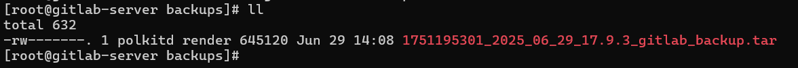
 
Останавливаю гитлаб-сервер:
```bash
cd /srv/gitlab
docker compose down
```
 
Переношу бэкап на новый сервер
```bash
rsync -avz /srv/gitlab/data/backups/ root@172.20.10.6:/srv/gitlab/data/backups/
```
 
Переношу конфиги на новый сервер
```bash
rsync -avz /srv/gitlab/config/ root@172.20.10.6:/srv/gitlab/config/
# rsync -avz /srv/gitlab/logs/ root@172.20.10.6:/srv/gitlab/logs/
```
> Вроде логи не нужны при миграции. Но мало ли понадобятся. Поэтому оставила как опциональную команду
 
##### Шаги на новом сервере - сама миграция
 
Запускаю гитлаб-сервер:
```bash
cd /srv/gitlab
docker compose up -d
```
 
Применяю новую конфигурацию для гитлаба (у меня заняло около 5 минут)
```bash
docker exec -it gitlab gitlab-ctl reconfigure
```
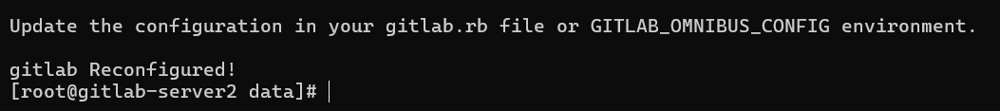
 
Останавливаю процессы, подключенные к БД: 
```bash
docker exec -it gitlab gitlab-ctl stop puma
docker exec -it gitlab gitlab-ctl stop sidekiq
docker exec -it gitlab gitlab-ctl stop cron
```

Проверяю, что процессы остановились, перед тем, как продолжить:
```bash
docker exec -it gitlab gitlab-ctl status
```
 
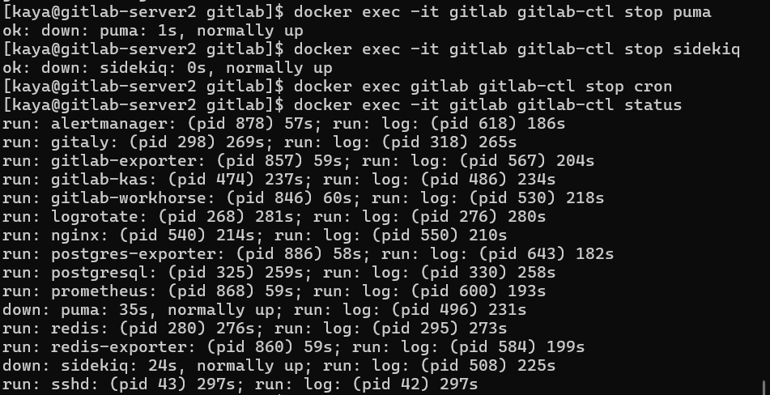

Запускаю рестор, убрав из имени бэкапа "_gitlab_backup.tar":
```bash
docker exec -it gitlab gitlab-backup restore BACKUP=1751195301_2025_06_29_17.9.3
```
 
При ресторе были такие уведомления:
```bash
ERROR:  must be owner of extension pg_trgm
ERROR:  must be owner of extension btree_gist
ERROR:  must be owner of extension btree_gist
ERROR:  must be owner of extension pg_trgm
```
> Как я поняла эти ошибки некритичны, если они были только при попытке повторно создать уже существующие extensions, а сам restore продолжится.
> Наверняка узнать можно командой `docker exec -it gitlab gitlab-rake gitlab:check SANITIZE=true`. Если с БД все хорошо, то команда отработает без ошибок
 
Рестартую контейнер (в оф. инструкции `docker restart`, но я запускала через компоуз):
```bash
docker compose restart gitlab
```
 
Дожидаюсь, что он в статусе `up healthy`
```bash
docker ps -a
```
> * Кстати, сперва у меня был в статусе `up (unhealthy)`, я выполнила команду ниже в поисках ошибок, она отработала без ошибок, я проверила статус контейнера, он был в порядке - `up (healthy)`
 
Проверяю гитлаб:
```bash
docker exec -it gitlab gitlab-rake gitlab:check SANITIZE=true
```
 
Вывод:
 
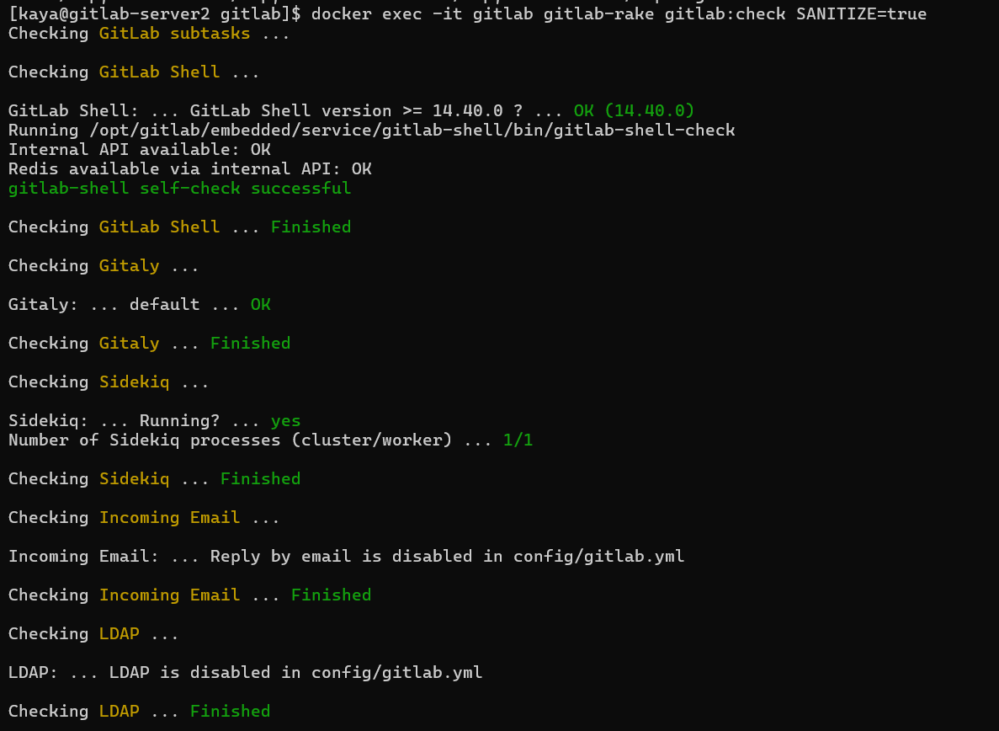
 
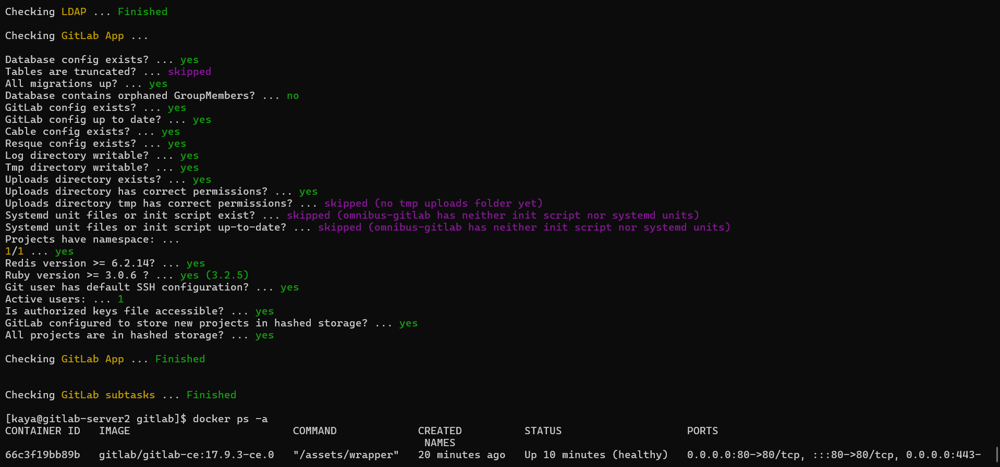
 
Проверяю в браузере, что работает (сперва попросил представиться, а потом показал, что все перенеслось 🥹)
 
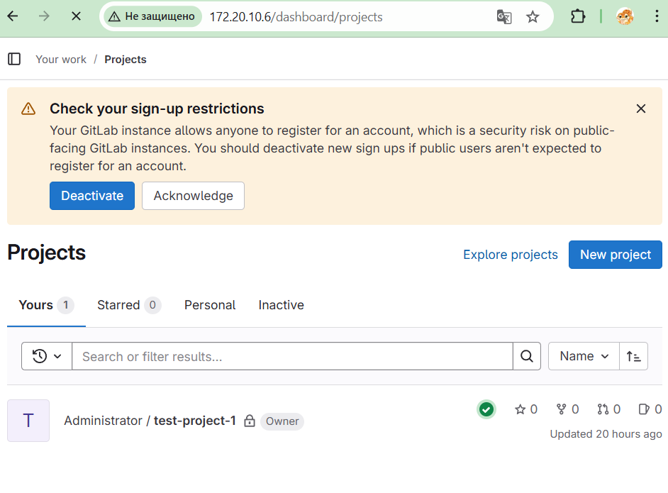
 
#### Обновление прокси
 
Подключаюсь к серверу с прокси:
```bash
ssh kaya@172.20.10.8
sudo su -
```

В конфиге nginx меняю адрес гитлаба для http:
```bash
sudo nano /etc/nginx/sites-available/gitlab-proxy.conf
```
 
(Строчку 1 комментирую / строчку 2 расскоментирую)
```
upstream gitlab-backend {
    #server 172.20.10.3:80;  
    server 172.20.10.6:80;  
}
...
```
  
И также меняю адрес для ssh:
```bash
sudo nano /etc/nginx/gitlab-stream.conf
```
 
(Комментирую / расскоментирую)
```
stream {
    upstream gitlab-ssh {
        # server 172.20.10.3:2222;  
         server 172.20.10.6:2222;
    }

    server {
        listen 2222;
        proxy_pass gitlab-ssh;
    }
}
```

Проверяю конфиги на ошибки:
```bash
sudo nginx -t
```

Перезапускаю nginx:
```bash
sudo systemctl restart nginx
```
 
Проверяю, что работает:
```bash
sudo systemctl status nginx 
```

В браузере есть проект:
 
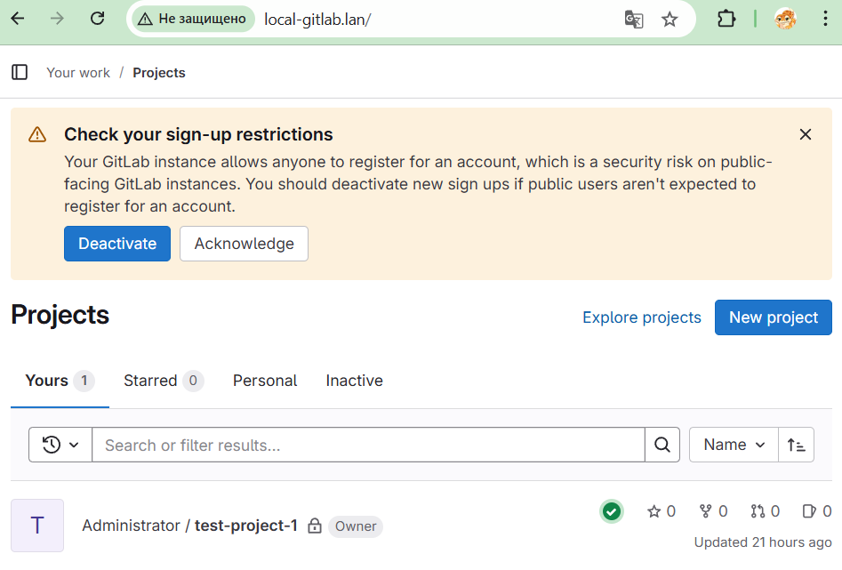

В браузере есть пайплайн:
 
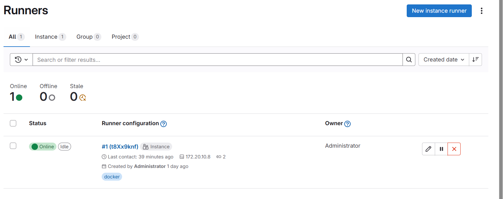

И еще проверила подключением с машины, где стоит гитлаб раннер. 
 
Сперва поругался на новый ключ. Я обновила у себя данные. Подгрузила тестовый пайплайн. Все заработало (но тоже несколько минут интерфейс гитлаба не показывал, что пайплайн появился):
 
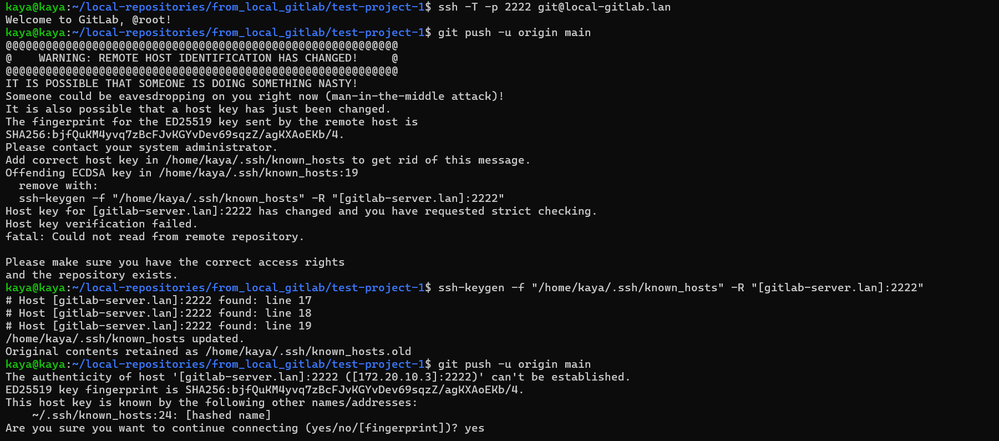

Запустила тестовый пайплайн. По идее с ним все ок после миграции. Только я столкнулась с парой ошибок, но они были связаны не с миграцией:
1. При повторном прохождении при регистрации раннера я указала старый `ip` вместо `ip nginx`, поэтому редирект не работал
2. Я делала пуш из старого локального репо (остался после первого прохождения), не обновив ссылки на новый общий адрес local gitlab, указанный в nginx. 
 
Обновила раннер и ссылки репозитория, запустила тестовый пайплайн, все ок:
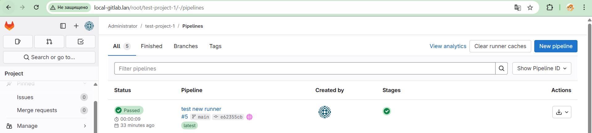
 
 
## Этап 4. Мониторинг серверов и сервисов
> Описание:
> Мониторинг серверов и сервисов, чем отличается одно от другого. Знакомство с Заббиксом и Прометеем. Ввод нового сервера - мониторинг. Установка заббикса на систему, прометея в докер. В заббикс заводим сервера, в прометей - сервисы. Отслеживание загрузку серверов и времени выполнения тестовых задач.
 
С работой серверов и сервисов сталкиваюсь в работе, поэтому здесь по отличиям понять просто:
* Мониторинг серверов	— следить за состоянием ресурсов самой машины, железо и ОС, - загрузка CPU, использование памяти, свободное место на диске, состояние сети итд.
* Мониторинг сервисов — следить за состоянием самого приложения — статус, логи, доступность в сети итд.
(я сталкивалась только с приложениями в контейнерах) работы приложения или контейнера (доступность порта, статус HTTP, время отклика)
 
Может быть, что с сервером все ок, но приложение недоступно. Или, что с приложением все ок, но ему не хватает ресурсов, и скоро все забьется. 
 
Наткнулась на статью, в которой делились опытом и узнала, что ...
 
> Zabbix-agent интересно реагирует на перезапуск Docker-контейнеров. При перезапуске контейнеры создают виртуальные сетевые интерфейсы. Заббикс каждый раз их распознает как новый объект мониторинга, собирает метрики и отдавает серверу. На каждую метрику Zabbix-agent создает по соединению. Т.к. у сервера есть свой лимит нагрузки: одновременно сервер выдерживает какое-то количество подключений к сети, например, 50 000. То такие созданные Заббиксом соединения создают лишнюю нагрузку на сервер, т.к. могут создавать несколько тысяч соединений. 
 
> В статье предложили разделить мониторинг между Zabbix и Prometheus. Сам Прометеус — это база данных. Для полноценной работы его дополняют агентами для сбора метрик и инструментами визуализации. Прометеус получает и отдает все метрики в одном соединении. Он создает меньше нагрузки, чем Заббикс. Поэтому у них пропали лишние соединения Заббикс, когда контейнеры отдали Прометеусу.  
  
### Подготовка сервера под мониторинг
Чтобы не плодить ВМ просто так, мониторинг буду ставить на машину Ubuntu, на которой сейчас nginx.
Посмотрела, какие порты нужны для Заббикса и Прометея - для Заббикса понадобится порт 80, который у нас сейчас перенаправляется на гитлаб-сервер.

Здесь изначально настроила реверс-прокси для Заббикса, чтобы на одном сервере доступ был к одному порту, но по разным именам (local-gitlab.lan и local-zabbix.lan). При установке Заббикса я увидела, что он уже ставится с собственным nginx-конфигом и слушает порт 80. И моя настройка реверс прокси была избыточна, поэтому я ее удалила.
 
И в этапе подготовки сервера оставила только пополнение списка хостов на windows.
 
На хосте с windows открываю `/etc/hosts` и после `172.20.10.8    local-gitlab.lan` прописываю:
```bash
172.20.10.8    local-zabbix.lan
```
 
### Установка Zabbix server
По заданию Заббикс ставим на систему.
 
На сайте есть такой конструктор:
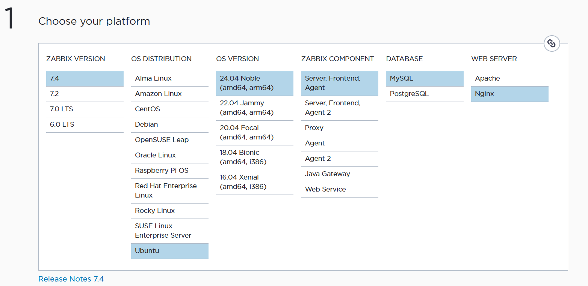
 
Nginx у меня уже стоит, попробую с ним.
 
Как я понимаю, перед установкой Заббикса нужно поставить БД + веб-сервер. Веб-сервер уже есть, остается БД. В доке советуют ставить MariaDB.
 
Ставлю MariaDB:
```bash
sudo apt update
sudo apt install mariadb-server mariadb-client
```
 
Добавляю в автозагрузку и проверяю статус:
```bash
sudo systemctl enable --now mariadb
sudo systemctl status mariadb
```
 
Запускаю скрипт безопасности (чтобы установить пароль root, удалить анонимных пользователей и отключить удаленный вход в систему под учетной записью root):
```bash
sudo mariadb-secure-installation
```
 
* Пароль root root
* Анонимного пользователя удалила для безопасности, чтобы никто из пользователей на сервере не смог подключиться к БД от имени этого анонимного пользователя, без полноценной аутентификации
* Оставила root доступ только с localhost
* Тестовую БД удадила
* Перезагрузила таблицы привилегий для применения настроек
 
Проверяю установку, подключившись как root:
```bash
mariadb -u root -p
```
 
* Не получилось войти по паролю. Как я поняла, сейчас в mariadb для пользователя root по умолчанию стоит аутентификация через unix_socket. Т.е. вместо пароля проверяются права пользователя в системе. Поэтому захожу с командой `sudo mariadb`
 
* Как я поняла, mariadb - это форк mysql. И после установки mariadb в системе будет два алиаса, которые равнозначны: mysql и mariadb.
 

Теперь установка и настройка Заббикса.
 
Переключаемся на рут:
```bash
sudo -s
```
 
Ставлю репозиторий Zabbix
```bash
wget https://repo.zabbix.com/zabbix/7.4/release/ubuntu/pool/main/z/zabbix-release/zabbix-release_latest_7.4+ubuntu24.04_all.deb

dpkg -i zabbix-release_latest_7.4+ubuntu24.04_all.deb

apt update
```
 
Устанавливаю Zabbix сервер, интерфейс, агент
```bash
apt install zabbix-server-mysql zabbix-frontend-php zabbix-nginx-conf zabbix-sql-scripts zabbix-agent
```
 
Подключаюсь к серверу БД:
```bash
mysql -uroot -p
```
 
И создаю начальную базу данных
```mysql
create database zabbix character set utf8mb4 collate utf8mb4_bin;

create user zabbix@localhost identified by 'password';

grant all privileges on zabbix.* to zabbix@localhost;

set global log_bin_trust_function_creators = 1;

quit;
```
* Пароль оставила `password`
 
На сервере Zabbix импортирую начальную схему и данные
```bash
zcat /usr/share/zabbix/sql-scripts/mysql/server.sql.gz | mysql --default-character-set=utf8mb4 -uzabbix -p zabbix
``` 
 
Подключаюсь к БД
```bash
mysql -uroot -p
```
 
И отключаю опцию `log_bin_trust_function_creators` после импорта схемы базы данных
```mysql
set global log_bin_trust_function_creators = 0;

quit;
``` 
 
Настройка БД для Zabbix сервера. Открываю конфиг:
 
```bash
vim /etc/zabbix/zabbix_server.conf
```
 
И указываю новый пароль
```bash
DBPassword=password
```
 
Дальше, как я поняла, настройка PHP для интерфейса Zabbix
 
Открываю конфиг
```bash
nano /etc/zabbix/nginx.conf
```
 
Убираю комменты с listen и server_name:
```bash
listen 80;
server_name local-zabbix.lan;
``` 
* Порт поставила 80 вместо 8080
* server name сменила с example local на local-zabbix.lan
 
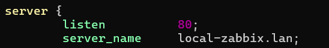
 
Запускаю процессы сервера и агента Zabbix и добавляю в автозагрузку:
```bash
systemctl restart zabbix-server zabbix-agent nginx php8.3-fpm

systemctl enable zabbix-server zabbix-agent nginx php8.3-fpm
``` 
 
Открываю веб-страницу Zabbix UI:
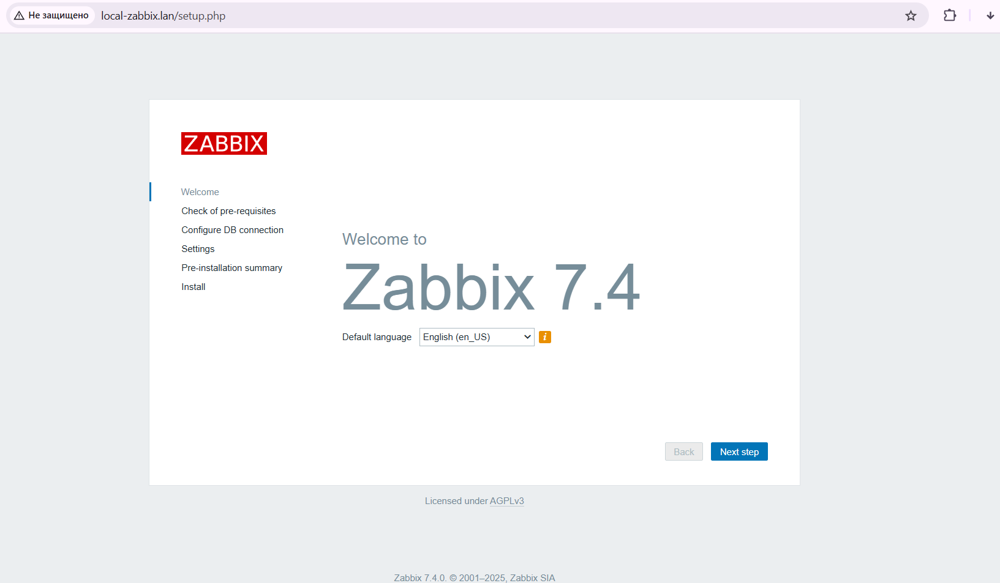
 
Проследовала по шагам установщика:
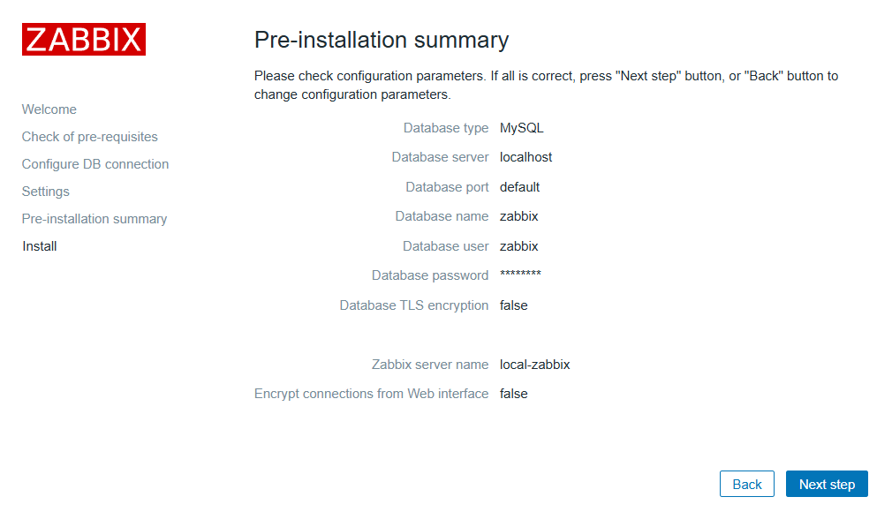 
 
Готово:
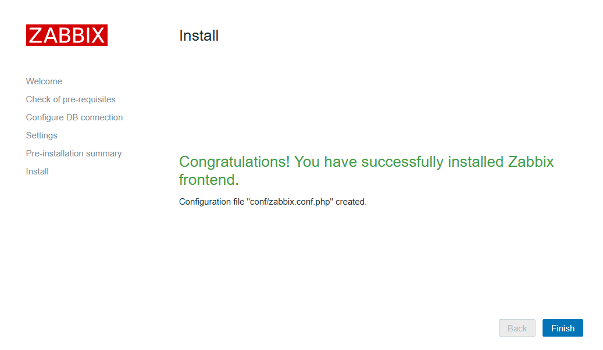
 
Дальше авторизуюсь с дефолтными данными:
* Логин - Admin
* Пароль - zabbix
 
И вот:
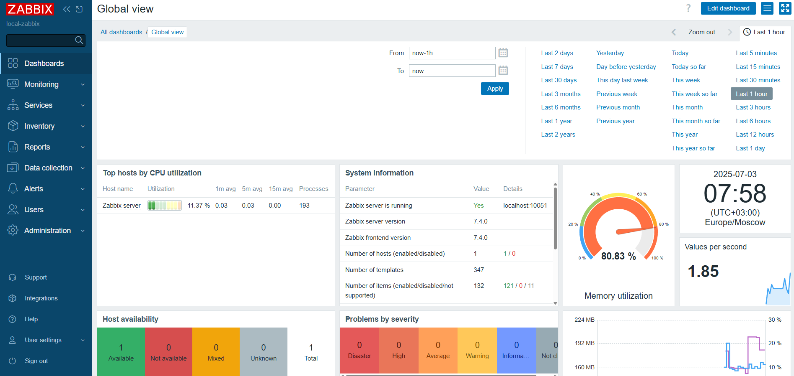

И еще кое-что.
1. В интерфейсе заббикса: Users -> Users -> Admin меняю пароль для администратора
  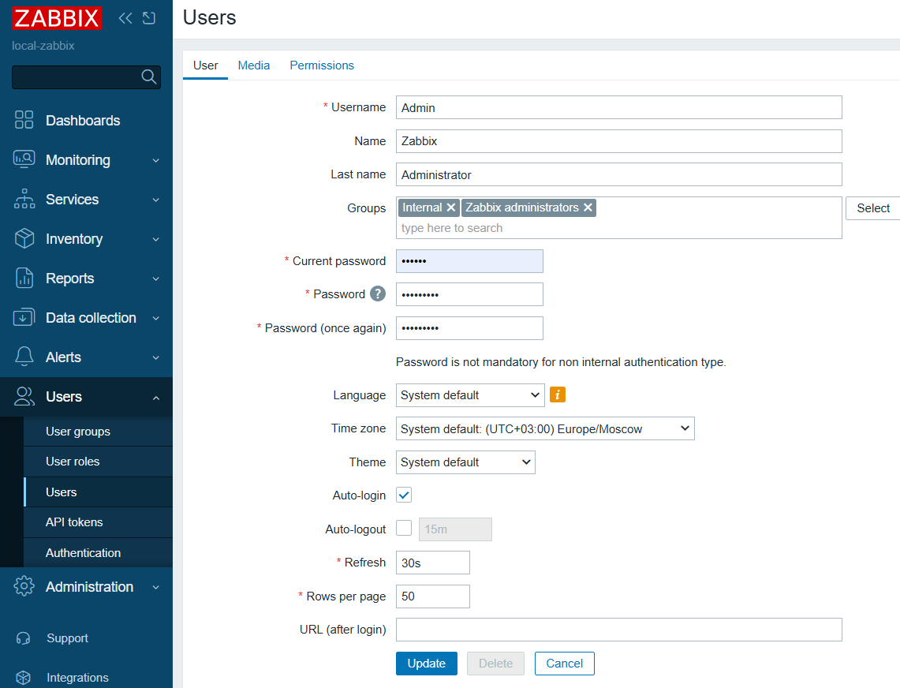
2. В интерфейсе заббикса: Administartion -> General -> GUI меняю время на актуальное (+3 UTC)
3. Там же указываю рабочее время сервера заббикс как круглосуточное (по умолчанию он в графике 5/2):
  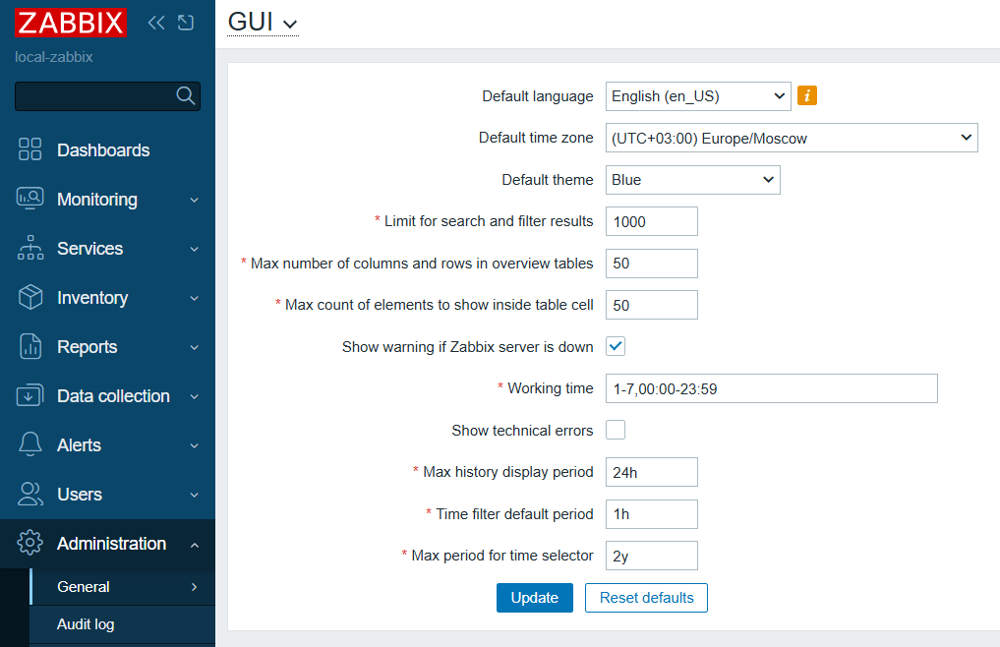
 
### Установка Zabbix agent
На ВМ с Альмалинукс (2 гитлаб-сервера + докер регистри) ставлю по инструкции - https://www.zabbix.com/download?zabbix=7.4&os_distribution=alma_linux&os_version=8&components=agent&db=&ws=
 
Логинусь под рутом:
```bash
sudo su -
```
 
Устанавливаю репозиторий Zabbix
```bash
rpm -Uvh https://repo.zabbix.com/zabbix/7.4/release/alma/8/noarch/zabbix-release-latest-7.4.el8.noarch.rpm
```
 
Обновляю кэш dnf:
```bash
dnf clean all
``` 
 
Устанавливаю Zabbix агент
```bash
dnf install zabbix-agent -y
``` 
 
Запускаю процесс Zabbix-агента, добавляю в автозагрузку, проверяю, что статус active:
 
```bash
systemctl restart zabbix-agent

systemctl enable zabbix-agent

systemctl status zabbix-agent
``` 
 
На ВМ с Дебиан (гитлаб-раннер) ставлю по инструкции - https://www.zabbix.com/download?zabbix=7.4&os_distribution=debian&os_version=12&components=agent&db=&ws=
 
Логинусь под рутом:
```bash
sudo su -
```
 
Ставлю репозиторий Zabbix
```bash
wget https://repo.zabbix.com/zabbix/7.4/release/debian/pool/main/z/zabbix-release/zabbix-release_latest_7.4+debian12_all.deb

dpkg -i zabbix-release_latest_7.4+debian12_all.deb

apt update
```
 
Устанавливаю Zabbix агент
```bash
apt install zabbix-agent -y
```

Запускаю процесс Zabbix-агента, добавляю в автозагрузку, проверяю, что статус active:
 
```bash
systemctl restart zabbix-agent

systemctl enable zabbix-agent

systemctl status zabbix-agent
``` 
 
> Здесь по логике меняю конфиг заббикса + открываю порт в ОС (а по факту сделала это дальше)

### Работа с Zabbix
Завожу хосты в мониторинг:
Data Collection -> Create Host

Гитлаб сервер:
 
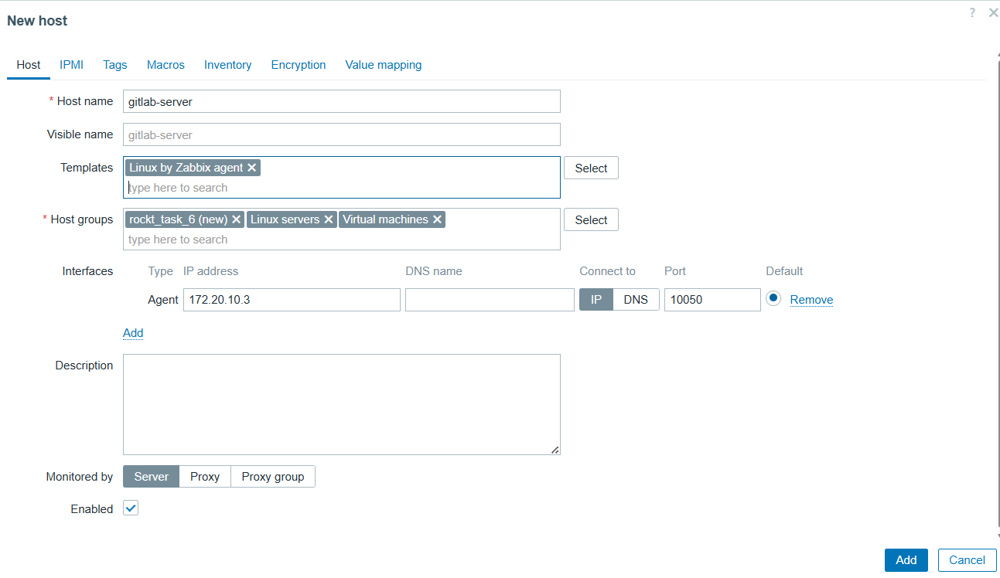
 
Гитлаб раннер:
 
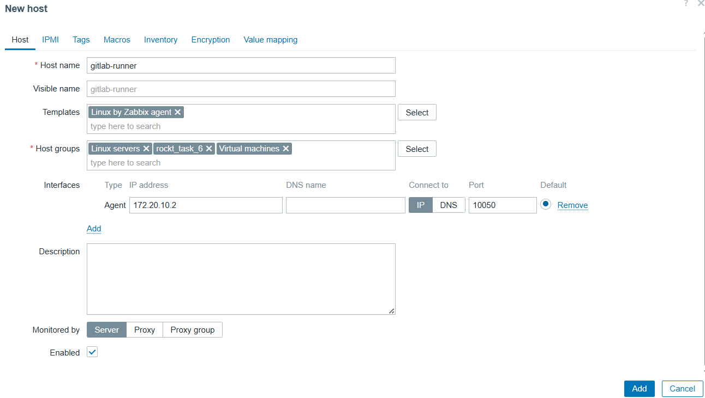
 
Докер регистри:
 
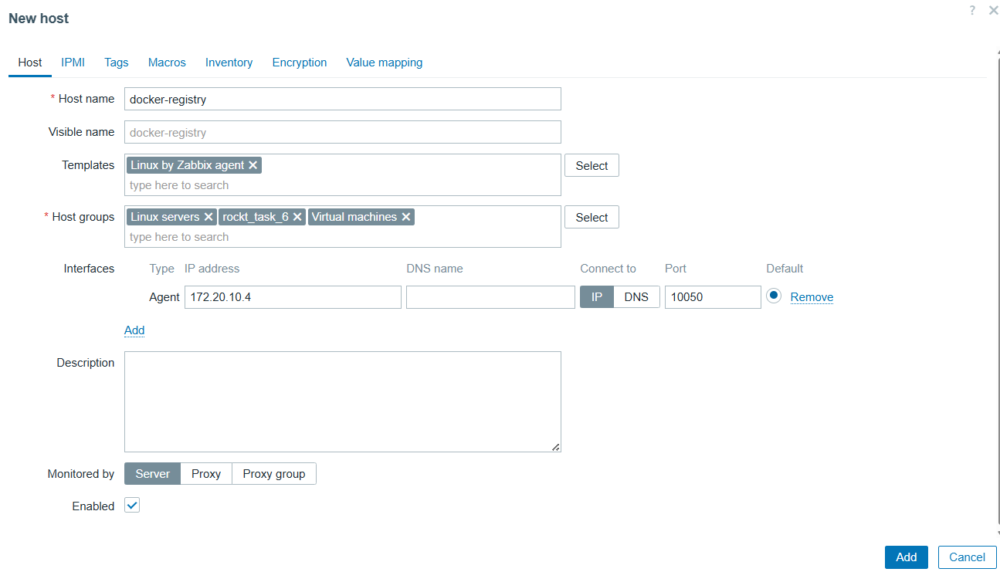

Второй гитлаб-сервер:
 
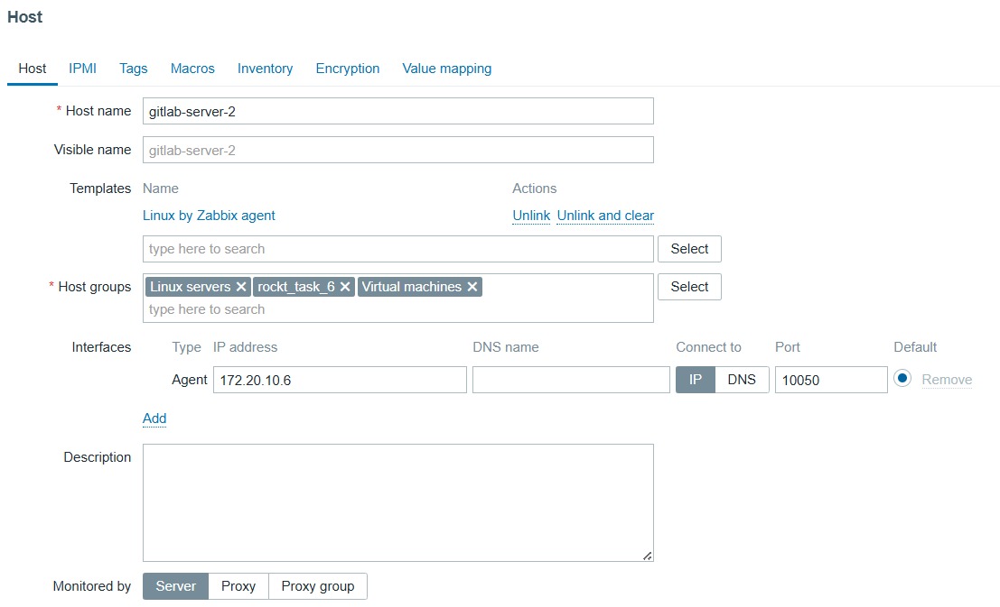
 
В статусе вижу, что ВМ недоступны
 
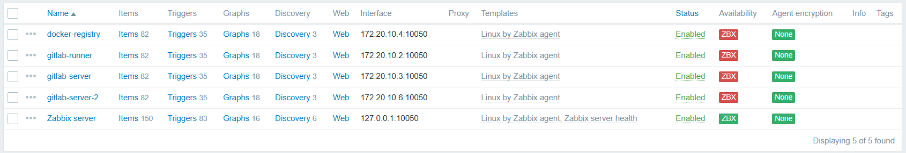
 
Чтобы были доступны:
* В конфиге Заббикс-агентов прописываю адрес для сервера - параметр `Server` (в моем сценарии достаточно, но если бы был шаблон agent-active, нужно было бы еще прописать параметр `ServerActive`)
* Открываю порт 10050 на серверах с Заббикс Агентом
 
На каждом сервере захожу в конфиг Заббикса
```bash
sudo nano /etc/zabbix/zabbix_agentd.conf
```
 
Пишу адрес, где стоит Заббикс-сервер:
```bash 
Server=172.20.10.8
``` 
 
Перезапускаю:
```bash
sudo systemctl restart zabbix-agent
```
 
Дальше порты.
 
На серверах с АльмаЛинукс настраиваю через firewalldd (проверяю, что порт правда не открыт и открываю)
```bash
sudo firewall-cmd --list-all

sudo firewall-cmd --add-port=10050/tcp --permanent

sudo firewall-cmd --reload
```
 
На сервере с Дебиан чуть иначе. Смотрю, что используется для настройки портов (должно быть ufw или iptables).
 
Проверяю ufw:
```bash
sudo ufw status
```
 
Не стоит.

Тогда лезу в iptables (нужный нам порт не открыт):
```bash
sudo iptables -L -n -v
```
 
По умолчанию все новые правила iptables не сохраняются при перезагрузке. Смотрю, стоит ли `iptables-persistent` для этих целей:
```bash
dpkg -l | grep iptables-persistent
```
 
Не стоит.
 
Ставлю пакет, чтобы сохранять правила:
```bash
sudo apt install iptables-persistent -y
```

Соглашаюсь с текущими правилами для IPv4 + IPv6:
 
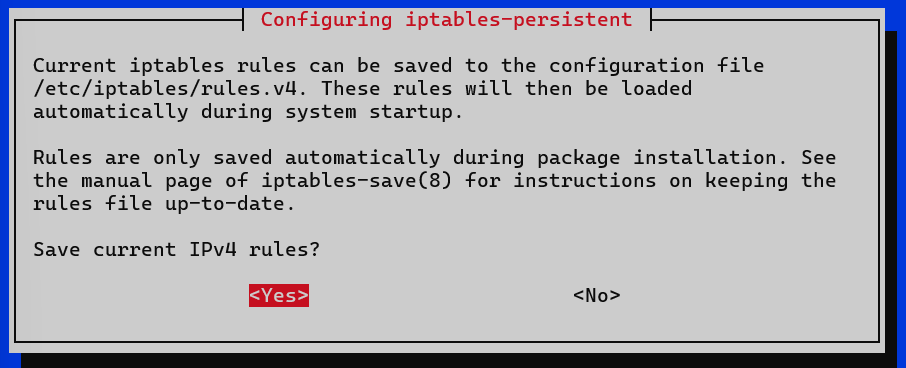
 
Создаю новое правило:
```bash
sudo iptables -A INPUT -p tcp --dport 10050 -j ACCEPT
``` 
 
Сохраняю правило:
```bash
sudo netfilter-persistent save
``` 
 
Захожу в UI Заббикса, готово, все хосты доступны (спустя минутку):
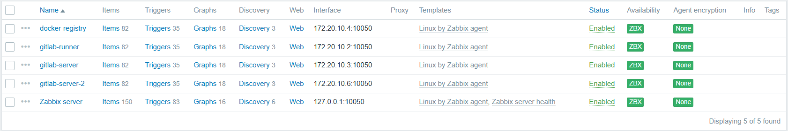
 
Смотрю, что мониторим:
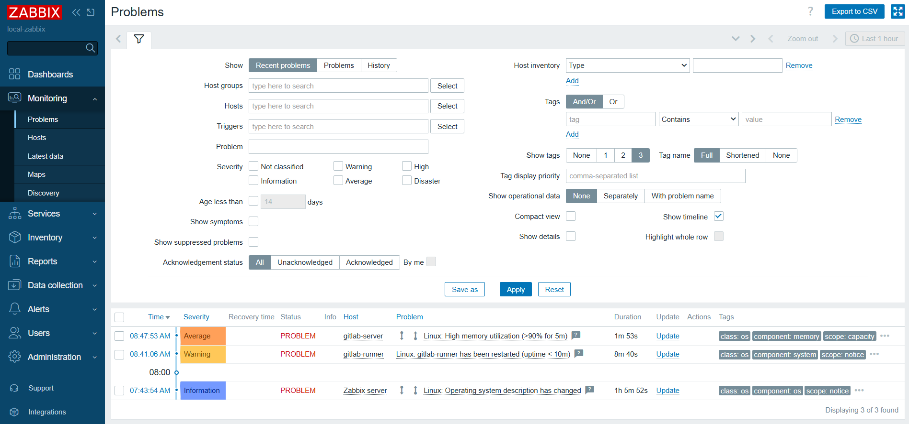
* Раннер я недавно перезапускала, там все ок
* Гитлаб-сервер отключила (это первый, контейнеры по заданию пока опускаем, так как сидим на втором)
 
### Установка Prometheus
Ставлю докер на ВМ с Убунту.
 
Настраиваю репозиторий, сперва добавляю ключи:
```bash
# Add Docker's official GPG key:
sudo apt-get update
sudo apt-get install ca-certificates curl
sudo install -m 0755 -d /etc/apt/keyrings
sudo curl -fsSL https://download.docker.com/linux/ubuntu/gpg -o /etc/apt/keyrings/docker.asc
sudo chmod a+r /etc/apt/keyrings/docker.asc
```
 
Затем сам репозиторий:
```bash
echo \
  "deb [arch=$(dpkg --print-architecture) signed-by=/etc/apt/keyrings/docker.asc] https://download.docker.com/linux/ubuntu \
  $(. /etc/os-release && echo "${UBUNTU_CODENAME:-$VERSION_CODENAME}") stable" | \
  sudo tee /etc/apt/sources.list.d/docker.list > /dev/null
```

Кэш:
```bash
sudo apt-get update
```
 
Ставлю пакеты Docker, последняя версия:
```bash
 sudo apt-get install docker-ce docker-ce-cli containerd.io docker-buildx-plugin docker-compose-plugin
```
 
Проверяю, что все работает:
```bash
sudo docker run hello-world
```
 
Создаю директорию под проект:
```bash
mkdir -p ~/prometheus-docker

cd ~/prometheus-docker
```
 
Создаю конфиг prometheus.yml
```bash
nano prometheus.yml
```
 
> В файле ниже нужно написать таргеты - что мониторим:
> * Если мы используем Прометей для мониторинга серверов, то на целевые хосты нужно поставить Node Exporter сбора метрик
> * Если мы мониторим приложения, то Прометей подключается к endpoint приложений, которые отдают метрики в формате `/metrics`.
> 
> Поэтому по логике решения на этом месте я переключилась на целевые хосты и включила там сбор метрик (описала ниже), а потом вернулась сюда и заполнила.

 
В конфиге prometheus.yml пишу настройки (временно или не временно без докер регистри):
```yaml
global:
  scrape_interval: 15s
  evaluation_interval: 15s

rule_files:
  # - "first.rules"
  # - "second.rules"

scrape_configs:
  - job_name: prometheus
    static_configs:
      - targets: ['localhost:9090']

  - job_name: gitlab-server
    metrics_path: '/metrics'
    static_configs:
      - targets: ['local-gitlab.lan:80']

  - job_name: gitlab-runner
    static_configs:
      - targets: ['gitlab-runner.lan:9252']
```
 
Создаю docker-compose.yml
```bash
nano docker-compose.yml
```

Наполняю:
```yaml
version: '3'

services:
  prometheus:
    image: prom/prometheus:latest
    container_name: prometheus
    ports:
      - "9090:9090"
    volumes:
      - ./prometheus.yml:/etc/prometheus/prometheus.yml
      - /srv/prometheus_data:/prometheus
    restart: unless-stopped
```

Создаю сам вольюм на хосте:
```bash
sudo mkdir -p /srv/prometheus_data
```
 
Запускаю Прометеус:
```bash
docker compose up -d
```
 
Смотрю статус контейнеров
```bash
docker ps -a
```
Контейнер в рестарте.
> Здесь не сделала фото, но проблема была с правами. Команда `docker logs prometheus` показала, что контейнер не может писать в вольюм.
> 
> Проверила, под каким пользователем запускается контейнер, с помощью команды `docker run --rm --entrypoint "" prom/prometheus id` (запуск контейнера из образа `prom/prometheus` с переопределенной точкой входа - выполнить команду `id` и узнать, под каким пользователем запускается процесс внутри контейнера).
В выводе контейнер запускается под пользователем `65534(nobody)`. Пользователь nobody - системный пользователь с минимальными правами. Используется как безопасный владелец для сервисов, которым не нужен root-доступ, чтобы ограничить потенциальные возможности процесса в системе.
> 
> Далее сменила права
 
Меняю права:
```bash
sudo chown -R 65534:65534 /srv/prometheus_data
sudo chmod -R 0755 /srv/prometheus_data
```
 
Перезапускаю контейнеры. Теперь со статусом все ок.

Проверяю работу через интерфейс в браузере: `http://172.20.10.8:9090`.
 
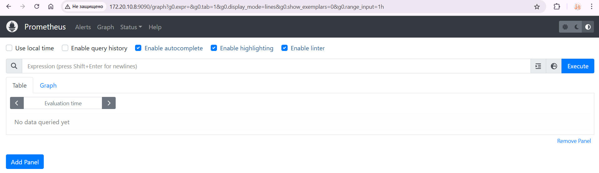

Все таргеты кроме самого прометея недоступны:
 
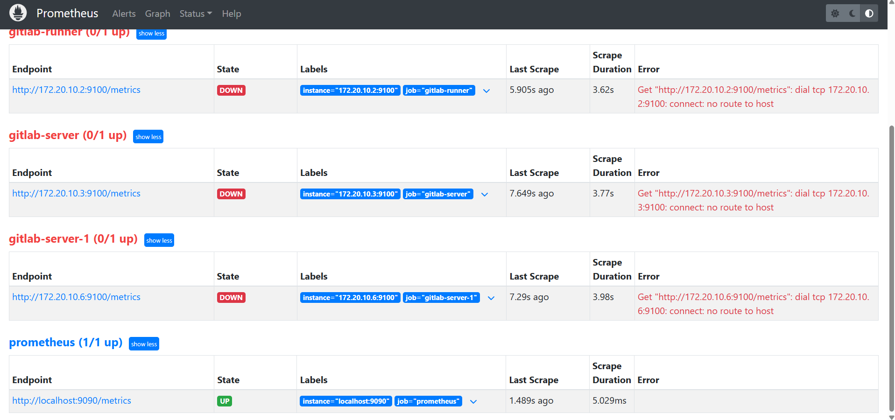
 
Надо в самих приложениях включить сбор метрик и сделать так, чтобы Прометей до них достучался.
 
#### Включаю сбор метрик в приложениях
> p.s. здесь я начала с ВМ с ubuntu стучаться до своих ВМ, поэтому в /etc/hosts внесла весь список:
```bash
172.20.10.2    gitlab-runner.lan
172.20.10.3    gitlab-server.lan
172.20.10.4    docker-registry.lan
172.20.10.6    gitlab-server2.lan
172.20.10.8    local-gitlab.lan
172.20.10.8    local-zabbix.lan
```

**1. Гитлаб сервер**
  <details>
  <summary><b>Способ 1 (неправильный). Под спойлером рассказ о том, как я сделала в первый раз и ошиблась (получила ошибку 404 в прометее)</b></summary>
Как я поняла, в гитлаб-сервере Prometheus endpoint встроен в само веб-приложение GitLab. И этот endpoint доступен по тому же порту, что и веб-интерфейс гитлаба. У меня он на порту 80. Сам путь к метрикам - `/-/metrics`.
 
То есть сперва будет достаточно подключиться внутрь контейнера и проверить, есть ли метрики:
```bash
docker exec -it gitlab /bin/bash

curl http://localhost/-/metrics
```
 
Метрики есть, все ок:
 
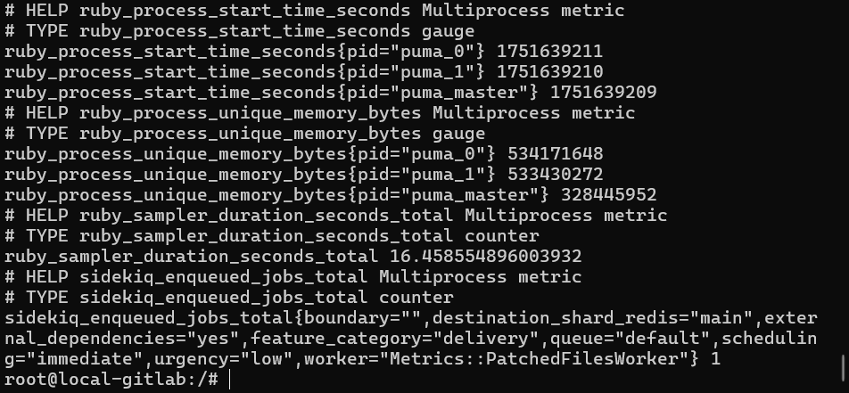
 
Могу добавить сервер в конфиг прометея:
```yaml
  - job_name: gitlab-server
    metrics_path: '/-/metrics'
    static_configs:
      - targets: ['local-gitlab.lan:80']
```
 
Порт наружу не открываю, 80 уже итак открыт. </details>

 
**Способ 2 (правильный)**
 
Привет! Тут я переобуваюсь.
Узнала:
То, что я пыталась открыть на http://local-gitlab.lan:80/-/metrics, — это путь встроенного Prometheus-эндпоинта GitLab Workhorse. Он доступен только изнутри контейнера по localhost и не предназначен для внешнего мониторинга.
Внутри он работал, а снаружи (в том же интерфейсе Прометея) у меня было 404.
 
По итогу, выяснила, что у гитлаба 2 типа эндпоинта для метрик (по крайней мере, минимум):
* `http://ip_address:80/-/metrics` (эндпоинт веб-приложения GitLab (Puma/Workhorse)) 
  * собирает базовые метрики: HTTP/статистика (респонсы, ошибки)
  * доступен только изнутри контейнера (localhost).
  * не предназначен для Prometheus-мониторинга GitLab в целом.

* `http://ip_address:9168/metrics` (полноценный gitlab-exporter)
  * собирает все, что нужно Прометею (CI пайплайны, очереди Sidekiq, проекты, пользователи, API, Redis, Git итд)
  * можно пробросить наружу, используется в прод
  * включается в gitlab.rb
 
Поэтому исправляю
 
Останавливаю гитлаб-сервер:
```bash
cd /srv/gitlab
docker compose down
```
 
В конфиге гитлаба открываю сбор метрик (`vim /srv/gitlab/config/gitlab.rb`)/
 
Было:
 
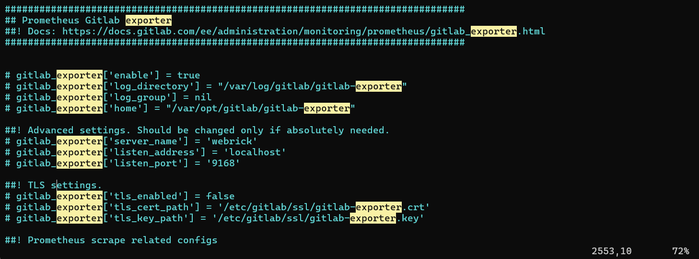
 
Стало:
 
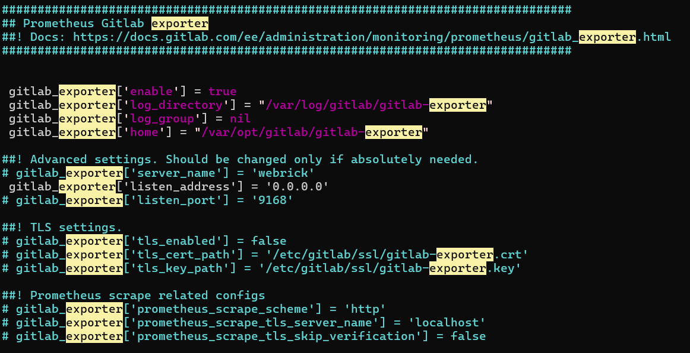
 
p.s. если не раскомментировать строку `gitlab_exporter['listen_address']` и не заменить значение на `'0.0.0.0'`, то снаружи не подключимся к эндпоинту

Меняю ямл:
```bash
nano docker-compose.yml
```
 
Прокидываю порт для метрик:
```yaml
- '9168:9168'
```
 
Поднимаю гитлаб-сервер заново:
```bash
cd /srv/gitlab
docker compose up -d
```
 
Делаю реконфиг для контейнера:
```bash
docker exec -it gitlab /bin/bash
gitlab-ctl reconfigure
```
p.s. как поняла, без `gitlab-ctl reconfigure`, не применятся настройки

##### Обновление прокси
 
Т.к. я настраивала прокси (суть которого была в том, чтобы у гитлаб-сервера был единый адрес вне зависимости от ip сервера), то мне надо прописать отдельный url для метрик. Ниже я обновляю конфиг nginx-прокси так, чтобы запросы по пути `/metrics` шли на порт `9168` гитлаб-сервера, при этом внешний адрес `local-gitlab.lan` остается прежним - так Прометей будет обращаться по знакомому URL, а реальный сервер можно менять "под капотом".
 
Подключаюсь к серверу с прокси:
```bash
ssh kaya@172.20.10.8
sudo su -
```

Открываю для редактирования конфиг nginx:
```bash
sudo nano /etc/nginx/sites-available/gitlab-proxy.conf
```
 
Добавляю строки для `gitlab-exporter`, привожу к такому вижу:
```
upstream gitlab-backend {
    # server 172.20.10.3:80;
     server 172.20.10.6:80;
}

upstream gitlab-exporter {
    # server 172.20.10.3:9168;
    server 172.20.10.6:9168;
}

server {
    listen 80;
    server_name local-gitlab.lan;

    location / {
        proxy_pass http://gitlab-backend;
        proxy_set_header Host $host;
        proxy_set_header X-Real-IP $remote_addr;
        proxy_set_header X-Forwarded-For $proxy_add_x_forwarded_for;
        proxy_set_header X-Forwarded-Proto $scheme;
    }

    location /metrics {
        proxy_pass http://gitlab-exporter;
        proxy_set_header Host $host;
        proxy_set_header X-Real-IP $remote_addr;
        proxy_set_header X-Forwarded-For $proxy_add_x_forwarded_for;
        proxy_set_header X-Forwarded-Proto $scheme;
    }
}
```
p.s. у меня здесь основной адрес для метрик выходит `http://local-gitlab.lan/metrics`. Не забыть потом
 
Проверяю конфиги на ошибки:
```bash
sudo nginx -t
```
 
Перезапускаю nginx:
```bash
sudo systemctl restart nginx
```
 
Проверяю, что работает:
```bash
sudo systemctl status nginx 
```
 
В браузере есть метрики:
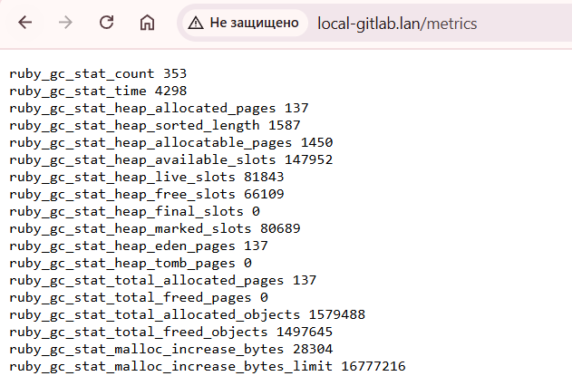
 
Добавляю записи в конфиг прометея:
```yaml
  - job_name: gitlab-server
    metrics_path: '/metrics'
    static_configs:
      - targets: ['local-gitlab.lan:80']
```
 
В моем случае не добавляю, а меняю старые, т.к. в первый раз внесла неправильные, поэтому порядок такой - подключиться, обновить строчки, рестартануть контейнеры:
```bash
ssh kaya@172.20.208
sudo su - 
cd ~/prometheus-docker/
nano prometheus.yml
// меняю строчки и сохраняю
docker compose down
docker compose up -d
```
 
Ура, работает:
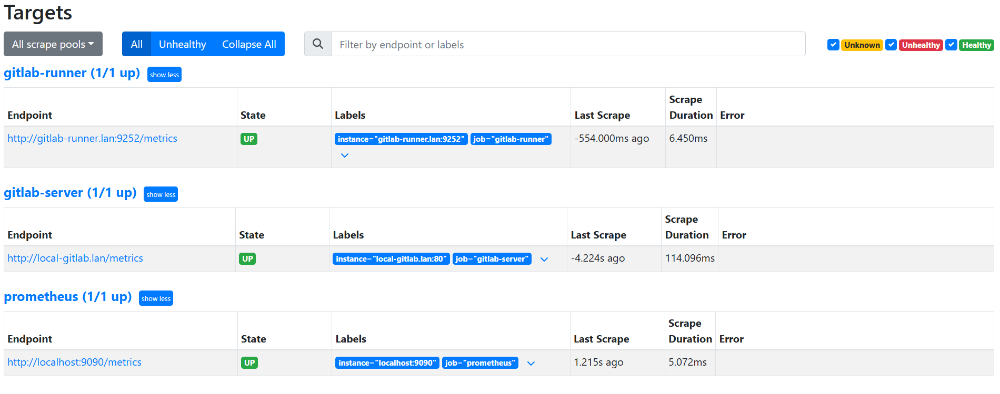
 

**2. Гитлаб Раннер**
 
Как я поняла, у оф. образа гитлаб раннера тоже есть Prometheus endpoint. Но по умолчанию гитлаб-раннер не запускает Prometheus metrics endpoint. Поэтому нет смысла сейчас проверять, наличие метрик в контейнере. Чтобы включить endpoint, нужно явно указать это в конфиге раннера с помощью параметра `listen_address`. В документации приводят порт `9252`.

Открываю конфиг раннера с хоста:
```bash
sudo nano /srv/gitlab-runner/config/config.toml
```

Добавляю listen_address:
 
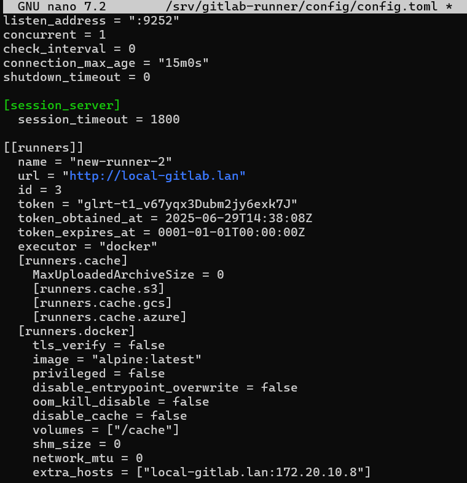
 
Сейчас перезапускаю контейнер для применения изменений + для последующего проброса порта 9252 наружу:
```bash
docker stop gitlab-runner
docker rm gitlab-runner
```
 
Запускаю:
```bash
docker run -d \
  --name gitlab-runner \
  -v /srv/gitlab-runner/config:/etc/gitlab-runner \
  -v /var/run/docker.sock:/var/run/docker.sock \
  -p 9252:9252 \
  --add-host local-gitlab.lan:172.20.10.3 \
  --restart always \
  gitlab/gitlab-runner:latest
```
* Вот тут ошибка. Я указала адрес `172.20.10.3', а это адрес моей ВМ, где я впервые устанавливала гитлаб-сервер. Далее я ввела реверс-прокси, и надо было указывать его адрес - 172.20.10.8 (позже исправлю)
 
Теперь можно проверить метрики с хоста:
```bash
curl  http://localhost:9252/metrics
```

Метрики есть:
 
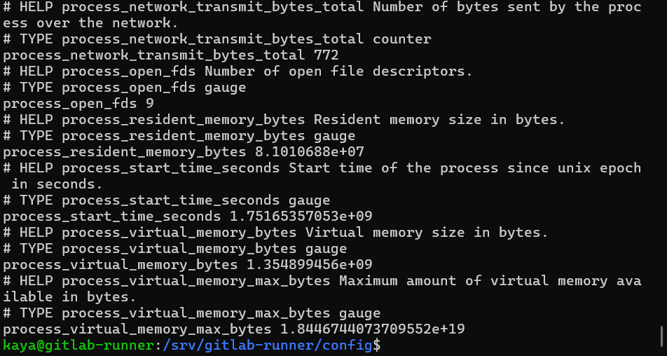

И теперь можно пробросить порт с хоста наружу. Создаю новое правило:
```bash
sudo iptables -A INPUT -p tcp --dport 9252 -j ACCEPT
``` 
 
Сохраняю правило:
```bash
sudo netfilter-persistent save
``` 

Проверяю доступность хоста извне: `curl http://gitlab-runner.lan:9252/metrics`
 
Работает:
 
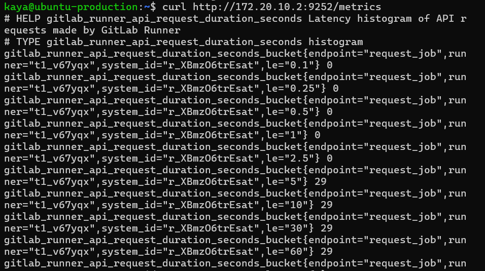
 
Добавляю запись в конфиг Прометея:
```yaml
  - job_name: gitlab-runner
    static_configs:
      - targets: ['gitlab-runner.lan:9252']
```

**3. Докер регистри**
 
~~Как я поняла, классический оф. образ докер регистри не имеет полноценного Prometheus endpoint без сборки с build-tag prometheus. Вроде как либо собирать кастомный, либо пробовать Harbor. Как будто кажется, что это не тот сервис, который нужно прямо мониторить, и тут важнее мониторин самого сервера. Но не знаю, как на практике. Юююрааа, я что-то не досмотрела? 🙄🙄🙄~~
 
Переобуваюсь. Все нашла. Итак, настройка.
 
Копирую конфиг из контейнера на хост:
```bash
sudo mkdir -p /etc/docker/registry 
 
docker cp registry:/etc/docker/registry/config.yml /etc/docker/registry/config.yml
```
 
Редактирую конфиг докер-регистри:
```bash
nano /etc/docker/registry/config.yml
```
 
Добавляю блок метрик в блок http, чтобы получилось так:
```
version: 0.1
log:
  fields:
    service: registry
storage:
  cache:
    blobdescriptor: inmemory
  filesystem:
    rootdirectory: /var/lib/registry
http:
  addr: :5000
  headers:
    X-Content-Type-Options: [nosniff]
  debug:
    addr: 0.0.0.0:5001
    prometheus:
      enabled: true
      path: /metrics

health:
  storagedriver:
    enabled: true
    interval: 10s
    threshold: 3
```
 
Останавливаю и удаляю контейнер (данные пока в старом томе):
```bash
docker stop registry
docker rm registry
```
 
Создаю новый каталог на хосте:
```bash
sudo mkdir -p /srv/registry
```
 
Запускаю контейнер:
```bash
docker run -d --name registry --restart always \
  -p 5000:5000 \
  -p 5001:5001 \
  -v /srv/registry:/var/lib/registry \
  -v /etc/docker/registry/config.yml:/etc/docker/registry/config.yml:ro \
  registry:2
```
 
Открываю порт в firewalld:
```bash
sudo firewall-cmd --permanent --add-port=5001/tcp
sudo firewall-cmd --reload
```
 
Проверяю, в браузере, есть ли метрики по адресу http://docker-registry.lan:5001/metrics
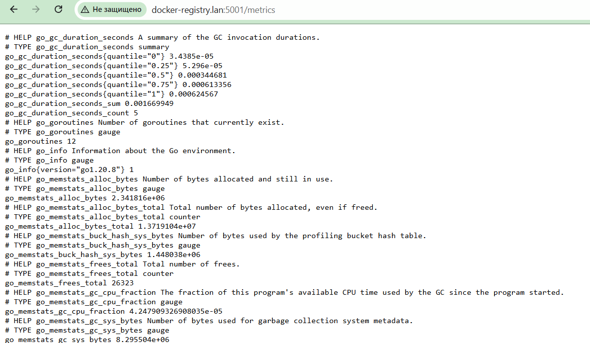

Далее настраиваю Прометеус. Открываю конфиг прометеуса на машине с убунту
```bash
nano ~/prometheus-docker/prometheus.yml
```

И вставляю:
```bash
scrape_configs:
  - job_name: "docker-registry"
    metrics_path: /metrics
    static_configs:
      - targets: ["docker-registry.lan:5001"]
```

Перечитываю конфиг Prometheus
```bash
cd ~/prometheus-docker
``` 
 
```bash
docker compose restart prometheus
```
 
Проверяю в UI: открываю http://172.20.10.8:9090 → Status → Targets → вижу docker-registry со статусом UP
 
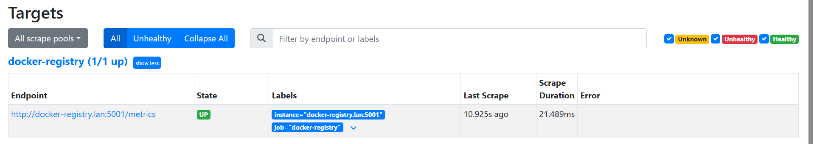
 
> P.S. Для всех приложений нужно потом обновить плейбук ансибл, если надо все это автоматизировать (установка агента на новые хосты, создание конфигов, открытие портов итд)

#### Пока изучаю метрики, тыкаюсь в интерфейс и в ВМ
... (возможно, сюда что-то внесу)

### Этап 5. Стресс тестирование стенда
> Описание. Стресс тестирование стенда. Создаём проект, который забивает реестр. Вариант решения - добавлять в образ изменяемый файл, после него большой файл. 
Следим по мониторингу как изменяются показатели сервисов/серверов.
 
> P.S. Так как мониторить буду занятое место, посмотрела, как эта метрика вообще выглядит в Заббиксе. Нужная метрика в интерфейсе Заббикса: monitoring -> hosts -> docker-registry -> triggers:
> 
 
#### 5.1. Создать пайплайн для загрузки образа в локальный регистри
Подключаюсь к гитлабу, создаю пустой проект под этап:
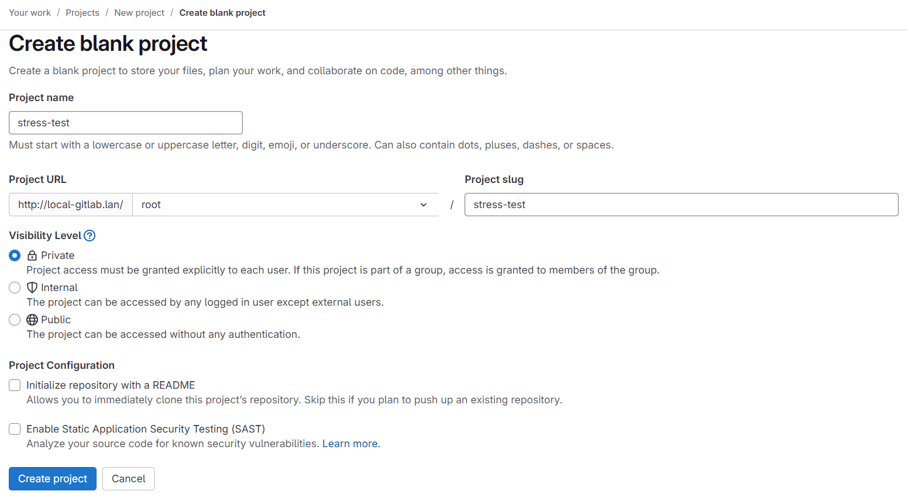
 
Клонирую к себе на WSL:
```bash
cd ~/local-repositories/from_local_gitlab
```
 
```bash
git clone ssh://git@local-gitlab.lan:2222/root/stress-test.git
```
 
Я снова создала пустой репозиторий (даже без ридми), поэтому помню, что ветки у меня в нем нет (о чем скажет команда `git branch --show-current`), поэтому сразу создаю ветку:

```bash
git checkout -b main
```
 
Дальше пробовала разные подходы. Юра писал, что можно добавлять в образ изменяемый файл, после него большой файл.
Итоговое решение такое:

1. Создаю докерфайл, в котором будет минимальный образ + создание файла с рандомным бинарным содержимым, который будет способствовать росту количества образов в реестре.
2. Создаю .gitlab-ci.yml, в котором два этапа - сборка образа; пуш образа.
 
Создаю докерфайл:
```
FROM alpine:3.20

# Размер файла в МБ
ARG SIZE_MB=2048

RUN mkdir -p /app \
 && dd if=/dev/urandom of=/app/bigfile.dat bs=1M count=${SIZE_MB}
```
 
Создаю файл `.gitlab-ci.yml`, который будет вносить изменения:
```bash
nano .gitlab-ci.yml
```
 
Наполняю:
```yaml
image: docker:latest

stages:
  - build_and_push

services:
  - name: docker:dind
    alias: docker
    command:
      - "--tls=false"
      - "--insecure-registry=docker-registry.lan:5000"
      - "--registry-mirror=https://mirror.gcr.io"
      - "--dns=8.8.8.8"
      - "--dns=1.1.1.1"

variables:
  IMAGE_TAG: "docker-registry.lan:5000/stress/image-$CI_PIPELINE_ID"
  DOCKER_TLS_CERTDIR: ""
  DOCKER_HOST: "tcp://docker:2375"

build-and-push-job:
  stage: build_and_push
  script:
    - docker build -t $IMAGE_TAG .
    - docker push $IMAGE_TAG
```
 
Здесь
* Для возможности запускать докер-команды в пайплайне делаю две штуки:
  * использую контейнер с образом `docker:latest`, в котором есть только docker CLI, но нет самого демона докера
  * использую сервис dind - `docker:dind`, чтобы внутри пайплайна можно было запускать команды докера
* Использую переменные:
  * Для разного именования образов задаю `IMAGE_TAG`, в которой использую внутреннюю переменную гитлаба - `$CI_PIPELINE_ID`, чтобы каждый пуш имел последовательный тег
  * Задаю `DOCKER_TLS_CERTDIR: ""`, чтобы `docker:dind` мог подключаться без TLS-сертификатов
  * Задаю `DOCKER_HOST`, чтобы docker CLI в контейнере джобы знал, по какому адресу подключаться к докер демону (своего-то нет) 
* Пишу одну джобу на сборку и пуш (можно две, тогда надо между ними передавать артефакт)
  * Сборка: Собрать докер-образ с тегом `$IMAGE_TAG`
  * Пуш: Отправка собранного образа в приватный докер регистри
* Про данные авторизации в регистри.
  * У меня докер-регистри без авторизации. Чтобы наверняка проверить, можно выполнить в командной строке `curl http://docker-registry.lan:5000/v2/`, если ответ `{}` (а у меня он), значит авторизации нет. Если бы была, то в пайплайне нужно было бы заполнить данные для логина + задать сами переменные (скорее всего, в настройках проекта).
* В первые прогоны работало без, потом добавила
      ```
      - "--registry-mirror=https://mirror.gcr.io"
      - "--dns=8.8.8.8"
      - "--dns=1.1.1.1"
      ```
 
Сохраняю изменения и делаю пуш
```bash
git add .
git commit -m "добавила Dockerfile + .gitlab-ci.yml"
git push -u origin main
```
 
Смотрю статус пайлпайна в гитлаб интерфейсе:
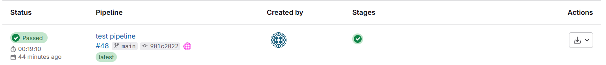
 
Также проверяю через API, какие репозитории есть в Docker Registry и пополняется ли список: `http://docker-registry.lan:5000/v2/_catalog`
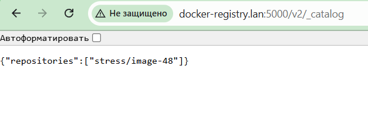
 
**Все ок. Немного о том, какие я тут встретила ошибки, и как решила**
<details>
<summary>Посмотреть</summary>
 
1. **Проблема:** При первом запуске раннера встретилась с ошибкой:
 
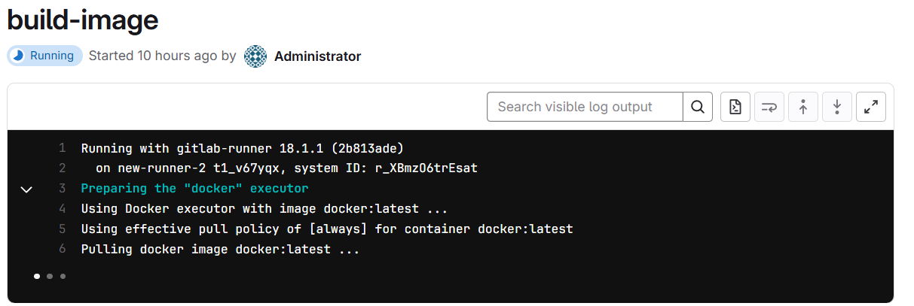
 
Контейнер долго так висел.
 
**Решение ->**  Логи докера показали, что соединение с CDN есть, но чтение данных обрывается по таймауту. Нашла, что проблема может быть в маршруте CDN. Добавила в `/etc/docker/daemon.json` DNS строчки:
```
  "dns": ["8.8.8.8", "1.1.1.1"],
  "registry-mirrors": ["https://mirror.gcr.io"]
```
и перезпустила докер `sudo systemctl restart docker` - помогло

2. **Проблема:** Я указала докер-сокет, а в пайплайне использовала dind, из-за чего получала ошибку. 
 
**Решение ->** Убрала из конфига раннера строчку про сокет (вместо `volumes = ["/var/run/docker.sock:/var/run/docker.sock", "/cache"]` прописала `volumes = ["/cache"]`) и перезапустила его
 
3. **Проблема:** Получила ошибку dns, т.к. в конфиге раннера ранее не прописывала адрес до регистри (ошибка `Get "http://docker-registry.lan:5000/v2/": dial tcp: lookup docker-registry.lan on 8.8.8.8:53: no such host`), 
 
**Решение ->**  Прописала в конфиг раннера вместо `extra_hosts = ["local-gitlab.lan:172.20.10.8"]` так `extra_hosts = ["local-gitlab.lan:172.20.10.8", "docker-registry.lan:172.20.10.4"]` и перезапустила его
</details>
 
#### 5.2. Преобразовать пайплайн, чтобы прям "забить" регистри
У меня есть рабочее решение, которое надо зациклить.
 
В локальном репо проекта открываю файл `.gitlab-ci.yml`:
```bash
nano .gitlab-ci.yml
```
 
Делаю цикл:
```yaml
image: docker:latest

stages:
  - build_and_push

services:
  - name: docker:dind
    alias: docker
    command:
      - "--tls=false"
      - "--insecure-registry=docker-registry.lan:5000"
      - "--registry-mirror=https://mirror.gcr.io"
      - "--dns=8.8.8.8"
      - "--dns=1.1.1.1"

variables:
  IMAGE_TAG: "docker-registry.lan:5000/stress/image-$CI_PIPELINE_ID"
  DOCKER_TLS_CERTDIR: ""
  DOCKER_HOST: "tcp://docker:2375"

build-and-push-job:
  stage: build_and_push
  script: |
    i=1
    while :; do
      TAG="${IMAGE_TAG}"
      docker build --no-cache \
        --build-arg SIZE_MB=2048 \
        -t "$TAG" .
      docker push "$TAG"
      echo "Образ запушен в $i раз: $TAG"
      i=$((i+1))
    done
```
 
Пуш:
```bash
git add .
git commit -m "добавила цикл в .gitlab-ci.yml"
git push -u origin main
```
  
Новый раннер с циклом работает, в реестре уже было два образа, успешно загрузился еще один. В Заббикс пришел алерт:
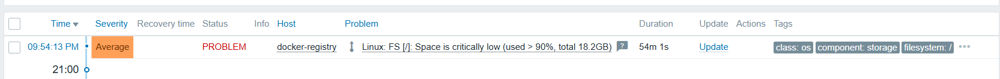
 
После этого пуши стали тормозить и срываться, раннер падает с ошибкой `HTTP 500 Internal Server Error` при пуше. Я подключилась к серверу с докер-регистри и проверила место командой:
```bash
df -h
```
 
Вывод:
 
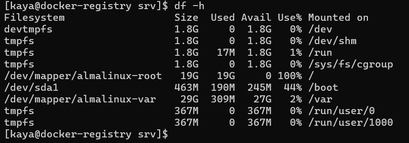
 
Уточнила, что именно заняло место:
```bash
du -xh -d1 /srv
du -xh -d1 /srv/registry/docker/registry/v2
```
Вывод:
 
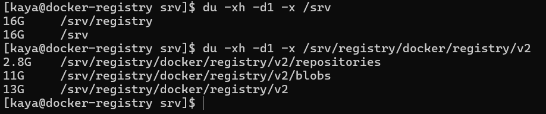
 
Итого, 11 ГБ заняли слои образов. 
 
**Ошибки/Решения.**
 
По идее задание на случай, если диск не размечен. У меня хоть и размечен, но забился корень, что плохо. То есть при планировании инфры надо либо при разметке отдельно монтировать раздел `/srv`; либо же хранить данные для контейнера регистри в вольюме, который будет находиться в отдельно-смонтированном `/var`, а не в самом корне.
 
Как быстроее решение проблемы:
 
1. Останавливаю реестр
```bash
docker stop registry
```
 
2. Создаю новый каталог на хосте с регистри:
```bash
sudo mkdir -p /var/lib/registry
```
 
3. Переношу данные со старого каталога в новый
```bash
sudo cp -a /srv/registry/. /var/lib/registry/
```
 
* Хотела использовать rsync, но его в системе не было, и т.к. корень забит, то и поставить не смогла
* Заняло где-то 10 минут на моей ВМ
 
4. На всякий случай еще раз права:
```bash
sudo chown -R 1000:1000 /var/lib/registry
```

5. Удаляю старый контейнер:
```bash
docker rm registry
```
 
6. Пересоздаю контейнер с новым томом:
```bash
docker run -d --name registry --restart always \
  -p 5000:5000 \
  -p 5001:5001 \
  -v /var/lib/registry:/var/lib/registry:Z \
  -v /etc/docker/registry/config.yml:/etc/docker/registry/config.yml:ro \
  registry:2
```
 
После удаляю исходные данные, забившие место:
```bash
sudo rm -rf /srv/registry/.
```
 
#### 5.3. Повторное прохождение
**Возникшая проблема**
 
Перенесла вольюм. Полностью стерла данные, хотела возобновить сценарий. Только вместо стресса для докер-регистри стресс был для всех:
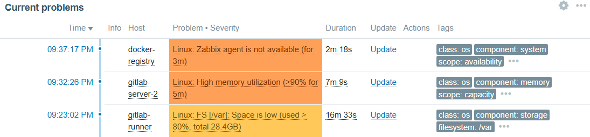
 
Что я выяснила. Что бесконечный цикл в пайплайне делает плохо всем. В `.gitlab-ci.yml` джоба запускается с отдельным контейнером `docker:dind` для сборки образов. в текущем пайплане одна джоба и бесконечный цикл сборки и пуша образа, размером 2 ГБ. Так как все происходит в рамках одного запущенного dind, он без остановки создает новые уникальные слои, которые не очищаются автоматически.
 
Все данные dind лежат в `/var/lib/docker/overlay2` на диске сервера с раннером. В результате такого цикла `/var` на раннере сильно заполняется.
 
Параллельно машина с гитлаб-сервером будет загружена по памяти: ей надо вести логи, обновлять статус пайплайна и так далее - это все нагружает ее оперативную память. 
 
По идее для грамотного стресс-теста лучше будет задать четкое количество итераций цикла, а потом при необходимости запустить пайплайн несколько раз.
 
**Решение**
 
**Вариант 1** - Самое простое решение - опустить все ВМ, запустить заново. Изменить файл пайплайна на более оптимизированный и прогнать его снова.
 
Я так и сделала. Пайплайн обновила вот так:
 
```yaml
image: docker:latest

stages:
  - build_and_push

services:
  - name: docker:dind
    alias: docker
    command:
      - "--tls=false"
      - "--insecure-registry=docker-registry.lan:5000"
      - "--registry-mirror=https://mirror.gcr.io"
      - "--dns=8.8.8.8"
      - "--dns=1.1.1.1"

variables:
  IMAGE_TAG: "docker-registry.lan:5000/stress/image-$CI_PIPELINE_ID"
  DOCKER_TLS_CERTDIR: ""
  DOCKER_HOST: "tcp://docker:2375"

build-and-push-job:
  stage: build_and_push
  script: |
    for i in $(seq 1 5); do
      TAG="${IMAGE_TAG}"
      docker build --no-cache \
        --build-arg SIZE_MB=2048 \
        -t "$TAG" .
      docker push "$TAG"
      echo "Образ запушен: $TAG"
    done
  after_script:
    - docker system prune -af --volumes
  timeout: 30m
```
 
Пуш:
```bash
git add .
git commit -m "оптимизация .gitlab-ci.yml"
git push -u origin main
```
 
Проблема с докер-регистри воспроизвелась, только к нехватке места `Linux: FS [/var]: Space is low (used > 80%, total 28.4GB) /var` добавилась еще и задержка чтения/записи на диске `Disk read/write request responses are too high (read > 20 ms for 15m or write > 20 ms for 15m)`
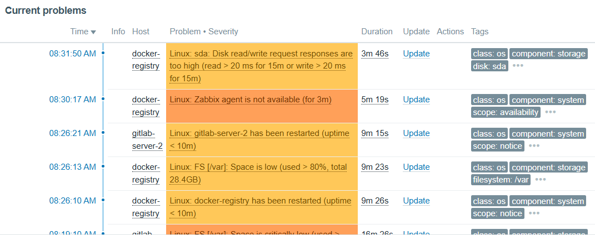
 
**Вариант 2** - Если перезапускать нельзя, тогда так.
> Тут еще раз прогнала пайплайн с бесконечным циклом, словила нехватку ресурсов на всех трех ВМ и протестировала.
 
**Общее**
 
Остановить джобу

**Гитлаб-сервер (расход памяти)**
 
Проверяю на сервере, как дела с местом - `free -h`:
 
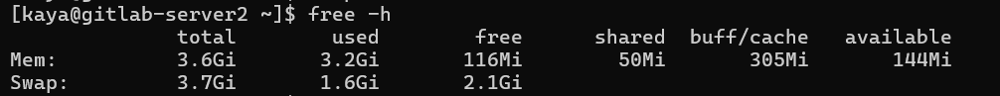
* РАМ почти кончилась
* Своп активно используется
 
Перезапускаю службы гитлаба внутри контейнера:
```bash
docker exec -it gitlab gitlab-ctl restart
```
 
Проверяю `free -h`, стало лучше
 
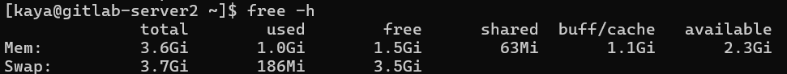
 
**Гитлаб-раннер (заполнено место)**
 
Проверяю, что именно заняло место:
```bash
du -xh -d1 /var
du -xh -d1 /var/lib/docker/
```
Вывод:
 
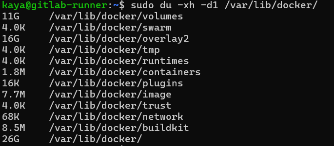
* overlay2 - слои образов и кэш сборки (то, что собирал dind во время пайплайнов)
* volumes - тома, в т.ч. анонимные (как я поняла, остаются после джоб)
 
Далее команды для очистки мусора, они не должны удалить ничего, что используется запущенными контейнерами.

Убираю мусор:
```bash
sudo docker system prune -af --volumes
sudo docker builder prune -af
```
 
Проверяю, что место вернулось:
```bash
df -h /var
sudo du -xh -d1 /var/lib/docker 
```
 
Вывод:
 
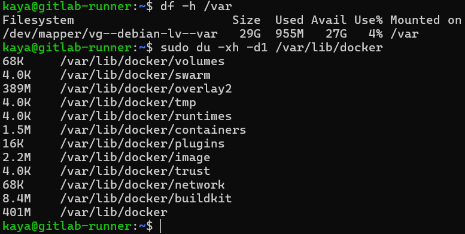
 

